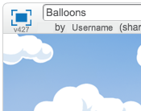
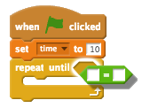

# Introduction { .intro }

You are going to make a balloon-popping game!

<div class="scratch-preview">
	<iframe allowtransparency="true" width="485" height="402" src="http://scratch.mit.edu/projects/embed/26745384/?autostart=false" frameborder="0"></iframe>
	
</div>

# Step 1: Animating a balloon { .activity }

## Activity Checklist { .check }

+ Start a new Scratch project, and delete the cat sprite so that your project is empty. You can find the online Scratch editor at <a href="http://jumpto.cc/scratch-new">jumpto.cc/scratch-new</a>.

+ Add in a new balloon sprite, and a suitable stage backdrop.

	

+ Add this code to your balloon, so that it bounces around the screen:

	```blocks
		when flag clicked
		go to x:(0) y:(0)
		point in direction (45 v)
		forever
			move (1) steps
			if on edge, bounce
		end
	```

+ Test out your balloon. Does it move too slowly? Change the numbers in your code if you want to speed it up a bit.

+ Did you also notice that your balloon flips as it moves around the screen?

	

	Balloons don't move like this! To fix this, click on the balloon sprite icon, and then click the blue `i` {.blockmotion} information icon.

	
	In the 'rotation style' section, click the dot to stop the balloon rotating.

	

+ Test your program again to see if the problem is fixed.

## Save your project { .save }

# Step 2: Random balloons { .activity }

## Activity Checklist { .check }

+ With the code you have now, your balloon will always start in the same place and move in the same path. Click the flag a few times to start your program, and you'll see it's the same every time.

+ Instead of using the same x and y position each time, you can let Scratch choose a random number instead. Change your balloon's code, so that it looks like this:

	```blocks
		when flag clicked
		go to x:(pick random (-150) to (150)) y:(pick random (-150) to (150))
		point in direction (45 v)
		forever
			move (1) steps
			if on edge, bounce
		end
	```

+ If you click the green flag a few times, you should notice that your balloon starts in a different place each time.

+ You could even use a random number to choose a random balloon colour each time:

	```blocks
		change [colour v] effect by (pick random (0) to (200))
	```

	

	What happens if this code is put at the start of your program? Does anything different happen if you put this code _inside_ the `forever` {.blockcontrol} loop? Which do you prefer?

## Save your project { .save }

## Challenge: More randomness {.challenge}
Can you make your balloon start by pointing in a random direction (between -90 and 180)?

## Save your project { .save }

# Step 3: Popping balloons { .activity }

Lets allow the player to pop the balloons!

## Activity Checklist { .check }

+ Click on your balloon sprite, and then click the 'Costumes' tab. You can delete all of the other costumes, just leaving 1 balloon costume. Add a new costume, by clicking 'Paint new costume' and create a new costume called 'burst'.

	

+ Make sure that your balloon switches to the right costume when the game starts. Your code should now look like this:

	```blocks
		when flag clicked
		switch costume to [balloon1-a v]
		point in direction (pick random (-90) to (180))
		go to x:(pick random (-150) to (150)) y:(pick random (-150) to (150))
		change [color v] effect by (pick random (0) to (200))
		forever
			move (1) steps
			if on edge, bounce
		end
	```

+ To allow the player to burst a balloon, add this code:

	```blocks
		when this sprite clicked
		switch costume to [burst v]
		play sound [pop v]
	```

+ Test out your project. Can you pop the balloon? Does it work as you expected? You'll need to improve this code, so that when the balloon is clicked, it shows the 'burst' costume for a short time, and is then hidden. You can make all of this happen by changing your balloon `when sprite clicked` {.blockevents} code to this:

	```blocks
		when this sprite clicked
		switch costume to [burst v]
		play sound [pop v]
		wait (0.3) secs
		hide
	```

+ Now that you're deleting the balloon when it's clicked, you'll also need to add a `show` {.blocklooks} block to the start of the `when flag clicked` {.blockevents} code.

+ Try popping a balloon again, to check that it works properly. If you find it difficult to pop the balloon without dragging it around, you can play the game in fullscreen mode by clicking this button:

	

## Save your project { .save }

# Step 4: Adding a score { .activity .new-page }

Let's make things more interesting by keeping score.

## Activity Checklist { .check }

+ To keep the player's score, you need a place to put it. A _variable_ is a place to store data that can change, like a score.

	To create a new variable, click on the 'Scripts' tab, select `Data` {.blockdata} and then click 'Make a Variable'.

	

	Type 'score' as the name of the variable, make sure that it is available for all sprites, and click 'OK' to create it. You'll then see lots of code blocks that can be used with your `score` {.blockdata} variable.

	

	You'll also see the score in the top-left of the stage.

	

+ When a new game is started (by clicking the flag), you want to set the player's score to 0. Add this code to the top of the balloon's `when flag clicked` {.blockevents} code:

	```blocks
	set [score v] to [0]
	```

+ Whenever a balloon is popped, you need to add 1 to the score:

	```blocks
		when this sprite clicked
		switch costume to [burst v]
		play sound [pop v]
		wait (0.3) secs
		change [score v] by (1)
		hide
	```

+ Run your program again and click the balloon. Does your score change?

## Save your project { .save }

# Step 5: Lots of balloons { .activity }

Popping 1 balloon isn't much of a game, so let's add lots more!

One simple way to get lots of balloons is just to right-click on the balloon sprite and click 'duplicate'. This is OK if you only want a few, but what if you need 20? or 100? Are you really going to click 'duplicate' that many times?

## Activity Checklist { .check }

+ A much better way of getting lots of balloons is to _clone_ the balloon sprite.

	Drag your balloon `when flag clicked` {.blockevents} code (except the `score` {.blockdata} block) off of the event (don't delete it), and instead add code to create 20 balloon clones.

	You can now attach the code you've just removed to the `when I start as a clone` {.blockevents} event. You should also replace the `hide` {.blocklooks} block in the balloon-clicking script with a `delete this clone` {.blockcontrol} block.

	Your balloon code should now look like this:

	

+ Test your project! Now when the flag is clicked, your main balloon sprite will hide and then clone itself 20 times. When each of these 20 clones is started, they will each bounce around the screen randomly, just as they did before. See if you can pop the 20 balloons!

## Save your project { .save }

# Step 6: Adding a timer { .activity }

You can make your game more interesting, by only giving your player 10 seconds to pop as many balloons as possible.

## Activity Checklist { .check }

+ You can use another variable to store the remaining time left. Click on the stage, and create a new variable called 'time':

	

+ This is how the timer should work:

	+ The timer should start at 10 seconds;
	+ The timer should count down every second;
	+ The game should stop when the timer gets to 0.

	Here's the code to do this, which you can add to your _stage_:

	```blocks
		when flag clicked
		set [time v] to [10]
		repeat until <(time) = [0]>
			wait (1) secs
			change [time v] by (-1)
		end
		stop [all v]
	```

	To add the `repeat until`{.blockcontrol}`time`{.blockdata}`= 0`{.blockoperators} code, first you'll need to drag a green `=` {.blockoperators} block, onto your `repeat until` {.blockcontrol} block:

	

	You can then drag your `time` {.blockdata} variable onto the `=` {.blockoperators} block:

	

+ Drag your 'time' variable display to the right side of the stage. You can also right-click on the variable display and choose 'large readout' to change how the time is displayed.

	

+ Test your game. How many points can you score? If your game is too easy, you can:

	+ Give the player less time;
	+ Have more balloons;
	+ Make the balloons move faster;
	+ Make the balloons smaller.

	Test your game a few times until you're happy that it's the right level of difficulty.

## Save your project { .save }

## Challenge: More objects {.challenge}
Can you add in other objects to your game? You can add good objects, like donuts, that give you lots of points, or bad objects, like bats, that take points away.


You'll need to think about the objects you're adding. Think about:

+ How many will there be?
+ How big is it? How does it move?
+ How many points will you score (or lose) for clicking it?
+ Will it move faster or slower than the balloons?
+ What will it look/sound like when it's been clicked?

If you need help adding another object, you can reuse the steps above!

## Save your project { .save }
