# Introduction { .intro }

In this project you'll learn how to create a football game in which you have to score as many goals as you can in 30 seconds.

<div class="scratch-preview">
  <iframe allowtransparency="true" width="485" height="402" src="https://scratch.mit.edu/projects/embed/57437924/?autostart=false" frameborder="0"></iframe>
  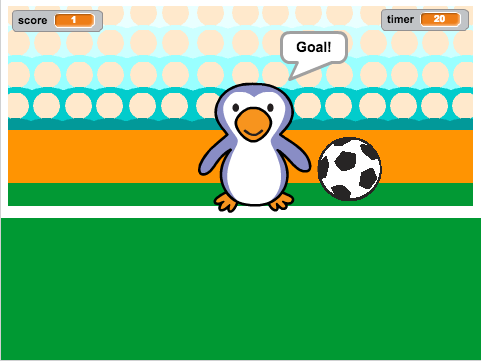
</div>

# Step 1: Moving the football { .activity }

Let's code the ball to move across the bottom of the stage.

## Activity Checklist { .check }

+ Open the 'Beat the Goalie' Scratch project. Your club leader will give you a copy of this project, or you can open it online at <a href="http://jumpto.cc/goalie-resources" target="_blank">jumpto.cc/goalie-resources</a>.

+ Click on your football sprite. Add this code, so that the football moves along the bottom of the screen until the space bar is pressed.

	

+ Click the green flag to test your project. Your football should bounce along the bottom of the screen until the space bar is pressed.

	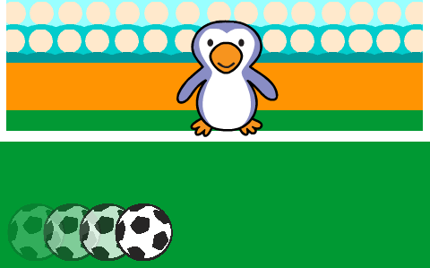

+ Add this code to your football sprite, so that the football moves towards the goal after the space bar has been pressed.

	

+ Click the green flag to test your code. This time, press the space bar and your football should move towards the goal.

	

+ Click the green flag to test your code. What happens if you click the flag a second time? Can you use this block to fix the problem?

	```blocks
		go to x:(-180) y:(-140)
	```

## Save your project { .save }

# Step 2: Was it a goal? { .activity }

Once the ball has reached the goal, there's a decision to make. __If__ the ball is touching the goalie then it has been saved, __else__ it's a goal.

## Activity Checklist { .check }

+ Add this code to the end of your football sprite code, so that you can check whether the ball is touching the goalie.

	

+ Play the 'rattle' sound __if the goalie has saved the ball__.

	

+ You can also broadcast a message to the goalie, so that they can tell you that the ball has been saved.

	Broadcast a 'save' message when the ball has been saved.

	

+ You can now code your goalie to say 'Save!' when they receive the message.

	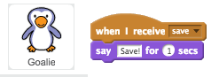

+ Test your code by trying to score a goal. If your goalie saves the goal they should say 'Save!'.

	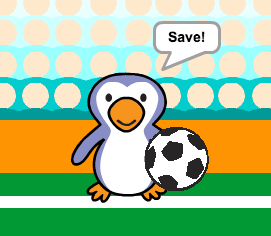

## Save your project { .save }

##Challenge: Goal! { .challenge }
Can you play a sound and code your goalie to say 'Goal!' when a goal has been scored?

Remember that a goal has been scored if the ball is not touching the goalie.

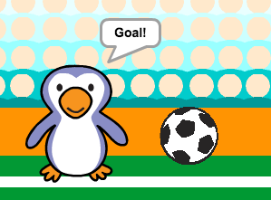

Here are some code blocks you'll need:


## Save your project { .save }

# Step 3: Adding a timer { .activity }

Let's add a timer, so that the player has to score as many goals as they can in 30 seconds.

## Activity Checklist { .check }

+ First, you'll need to click `Data` {.blockdata}, then click 'Make a Variable' and create a new variable called `timer` {.blockdata}.

	

+ You should now see your new variable on the stage. You should also see some new variable blocks that you'll use to make your timer.

	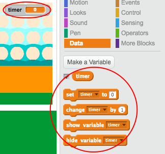

+ Click on your __stage__, and add this code to set the `timer` {.blockdata} to 30 at the start of the game.

	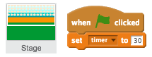

+ Next, you'll need to add a `repeat until` {.blockcontrol} block, so that the timer can run until it gets to 0.

	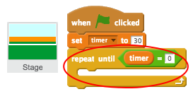

+ Reduce your timer by 1 every second until it reaches 0.

	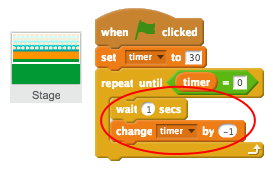

+ Once the timer has reached 0, you should play the 'cheer' sound and then stop the game.

	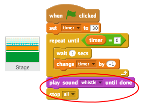

+ Click the green flag to test your code. Your timer should start at 30, and end at 0.

	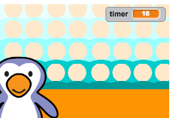

	You can change your timer to start at 10 if you don't want to wait for 30 seconds!

+ You only have the chance to score 1 goal! To have more than 1 attempt, add a `forever` {.blockcontrol} block around your __football__ sprite. You can also add a `wait` {.blockcontrol} block between attempts.

	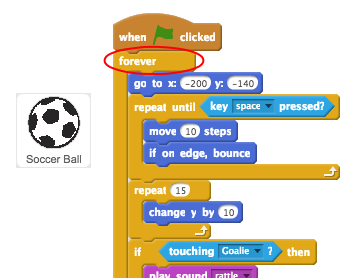

## Save your project { .save }

##Challenge: Adding a score { .challenge }
Can you add a `score` {.blocvariables} variable to your game?

+ You should set the score to 0 at the start of the game;
+ You should add 1 to your score every time a goal is scored.

Here's the code you'll need:


## Save your project { .save }

# Step 5: Control the goalie { .activity }

It's far too easy to score a goal! Let's allow a second player to try and save goals.

## Activity Checklist { .check }

+ Click on your __Goalie__ sprite and add this code to change the goalie's x position when the left arrow is pressed.


+ Press the left arrow to test your new code. Your goalie should move to the left.

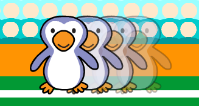

+ Have you noticed that your goalie doesn't move very smoothly? If you want smoother movement, you can use this code instead.


+ Test your code again, this time by clicking the green flag and then holding the left arrow key. Does your goalie more more smoothly than before?

## Save your project { .save }

##Challenge: More controls { .challenge }
Can you code your goalie to move to the right when the right arrow key is pressed? You can use either of the 2 ways above.

You could even use this code to make your goalie jump when the up arrow key is pressed:

```blocks
repeat (10)
	change y by (10)
end
repeat (10)
	change y by (-10)
end
```

## Save your project { .save }

##Challenge: Manual control { .challenge }
Instead of the ball moving left and right automatically, can you allow your player to control the ball with the `a` and `d` keys?

To do this you'll need to remove the code for moving the ball left and right.


You can then add code to move the ball when the keys are pressed. Here are some code blocks to help you:


## Save your project { .save }
