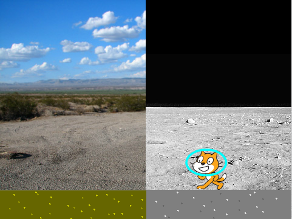
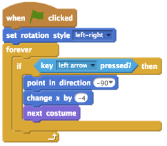
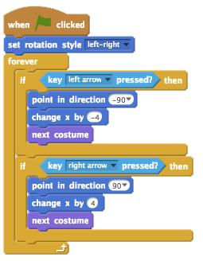
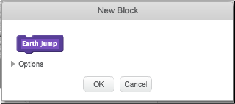
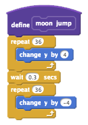
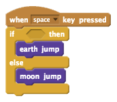

# Introduction { .intro }

The Moon is about 27% the size of Earth. This size difference means that gravity on The Moon is much weaker than it is here on Earth. In order for astronauts to prepare for space travel, they need to understand what effect gravity has on the way they move around. Create a simulator that demonstrates how someone on The Moon can jump six times as high as you can on Earth! Not only that, you would be in the air four times as long when you jump. This is because the gravity on The Moon is much less strong than it is on Earth.  

In this activity we are going to simulate the difference between jumping on The Moon compared to jumping on Earth.

Is this your first time using Scratch? [This guide](https://codeclubprojects.org/en-GB/resources/scratch-intro/) introduces the Scratch programming language.

  <iframe allowtransparency="true" width="485" height="402" src="https://scratch.mit.edu/projects/embed/160241020/?autostart=false" frameborder="0"></iframe>
  

# Step 1: Make Scratchy walk { .activity }
Let’s start by creating code that will make Scratchy the Cat walk

## Activity Checklist { .check }

+ Open the Moonhack 2017 Scratch project online at <a href="https://bit.ly/mh-scratch">bit.ly/mh-scratch</a>.

+ Let’s use the arrow keys to allow Scratchy to move from left to right on the screen. When the player presses the left arrow, you want Scratchy to move left, by changing its x coordinate. Add this code to the `Scratchy` sprite:

+ Test out your code by clicking the flag and then holding down the left arrow. Does Scratchy move to the left?

+ To move Scratchy to the right, you need to add another `if` {.blockcontrol} block using the right arrow:

# Step 2: Create Jumping Blocks { .activity }

Let’s create our own blocks that will make Scratchy jump up and down

## Activity Checklist { .check }

+ From the  `More Blocks` {.blockmoreblocks} category select “Make a Block”

+ Make two new blocks, name them “Earth Jump” and “Moon Jump”

  

+ First, we are going to create code that will allow Scratchy to jump on earth. To do this, add this code to the `Scratchy` sprite:  

+ Next, we are going to create code for Scratchy to jump on The Moon. To do this, add this code to the `Scratchy` sprite:

+ Great job! You now have new blocks that you created yourself. In step 3 we are going to create code to use these new blocks.

# Step 3: Scratchy Jumps { .activity }

Let’s create code that will make Scratchy jump depending on which planetary object he is on.

## Activity Checklist { .check }

+ We are going to use the Spacebar key to make Scratchy jump. To start this process, add this code to the `Scratchy` sprite:

+ Test out your code. If it is not functioning the way we would like it to currently. That is because we need to add a `condition` {.blockoperators} between the words “if” and “then” like the code below:

+ Test your code out by clicking the green flag and then jumping on both sides of the stage.

+ What is happening and how does the program know what side of the stage Scratchy the Cat is on?

**Congratulations!** You have completed the Moonhack Scratch project of 2017! Celebrate by jumping up and down yourself. Make sure they are Earth jumps though :)

Now that this project is done there are so many other things you can do. You can...

* Improve this project by completing the challenges below
* Have a go at the Moonhack Python project
* Create your own “Moon” themed project in Scratch, Python or HTML/CSS!

## Challenge: Adding a sound { .challenge }
Can you make a sound every time Scratchy jumps off the ground?

## Challenge: Mars Jump { .challenge }
How high can Scratchy jump if he was on Mars? Research the strength of gravity on Mars and write code to simulate Scratchy jumping on the red planet!

## Challenge: Custom stage { .challenge }
Can you create your own background by using a photo of your home or school and using Scratch to add drawings.

## Save your project { .save }
