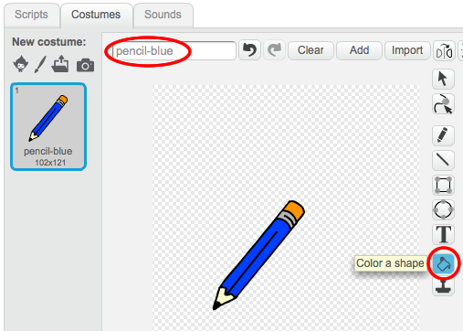
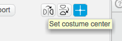
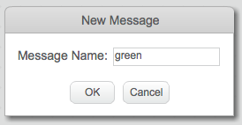
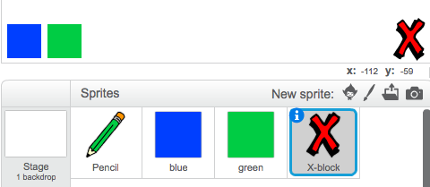
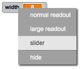

# Introduction { .intro }

In this project, you will be making your own paint program!

<div class="scratch-preview">
	<iframe allowtransparency="true" width="485" height="402" src="http://scratch.mit.edu/projects/embed/63473366/?autostart=false" frameborder="0"></iframe>
	
</div>

# Step 1: Making a pencil { .activity }

Let's start by making a pencil, that can be used to draw on the stage.

## Activity Checklist { .check }

+ Start a new Scratch project, and delete the cat sprite so that your project is empty. You can find the online Scratch editor at <a href="http://jumpto.cc/scratch-new">jumpto.cc/scratch-new</a>.

+ Add the pencil sprite to your project.

	 

+ Click 'Costumes', and delete the 'pencil-b' costume.

	 

+ Rename your costume 'pencil-blue', and use the 'Color a shape' tool to make the pencil blue. 

	 

+ As you'll be using the mouse to draw, you'll want the pencil to follow the mouse `forever` {.blockcontrol}. Add this code to your pencil sprite:

	```blocks
		when flag clicked
		forever
		  go to [mouse pointer v]
		end
	```

+ Test out this code by clicking the flag and then moving the mouse around the stage. Does this work as you expected?

+ Have you noticed that it's the centre of the pencil, and not the tip, that follows the mouse pointer?

	

	To fix this, click on the 'pencil-blue' costume of your pencil sprite, and click 'Set costume center'.

	

+ You should notice that a crosshair appears on the costume. You can now click just below the tip of the pencil, to set this point as the costume centre.

	

+ Click the 'Scripts' tab, and then test out your pencil again - does it work better than it did before?

+ Next, let's make your pencil draw `if` {.blockcontrol} the mouse has been clicked. Add this code to your pencil sprite:

		

+ Test your code again. This time, move the pencil around the stage and hold down the mouse button. Can you draw with your pencil?

	

## Save your project { .save }

# Step 2: Coloured pens { .activity }

Let's add different colour pens to your project, and allow the user to choose between them!

## Activity Checklist { .check }

+ Click on your pencil sprite, click 'Costumes' and duplicate your 'pencil-blue' costume.

	

+ Rename your new costume 'pencil-green', and colour the pencil green.

	

+ Create two new sprites, which you will use to select the blue or green pencil.

	

+ When the green selector icon is clicked, you need to `broadcast` {.blockevents} a message to the pencil sprite, telling it to change its costume and pencil colour.

	To do this, first add this code to the green selector icon:

	```blocks
		when this sprite clicked
		broadcast [green v]
	```

	To create the `broadcast` {.blockevents} block, click the down arrow and select 'new message...'.

	

	You can then type 'green' to create your new message.

	

+ You now need to tell your pencil sprite what to do when it receives the message. Add this code to your pencil sprite:

	```blocks
		when I receive [green v]
		switch costume to [pencil-green v]
		set pen color to [#00ff00]
	```

	To set the pencil to colour to green, click the coloured box in the `set color` {.blockpen} block, and click on the green selector icon to choose green as your pencil colour.

+ You can now do the same for the blue pencil icon, adding this code to the blue selector sprite:

	```blocks
		when this sprite clicked
		broadcast [blue v]
	```

	...and adding this code to the pencil sprite:

	```blocks
		when I receive [blue v]
		switch costume to [pencil-blue v]
		set pen color to [#0000ff]
	```

+ Finally, you need to tell your pencil sprite what costume and pencil colour to choose, as well as clearing the screen, when your project is started. Add this code to the beginning of the pencil's `when flag clicked` {.blockevents} code (before the `forever` {.blockcontrol} loop):

	```blocks
		clear
		switch costume to [blue-pencil v]
		set pen color to [#0000ff]
	```

	If you prefer, you can start with a different colour pencil!

+ Test out your project. Can you switch between blue and green pens?

	

## Save your project { .save }

# Step 3: Making mistakes { .activity .new-page }

Sometimes mistakes happen, so let's add a 'clear' button and an eraser to our project!

## Activity Checklist { .check }

+ Let's add a button to clear the stage. To do this, add the 'X-block' letter sprite to the stage, and colour it in red.

	

+ Add code to your new cancel button to clear the stage when it's clicked.

	```blocks
		when this sprite clicked
		clear
	```

	Notice that you don't need to send a message to clear the stage, as any sprite can do it!

+ You can also create an eraser. If your club leader has given you a 'Resources' folder, click 'Upload costume from file' and add the 'eraser.png' image.

	
	
	If you don't have the eraser.png image, just create a new white pen instead!

+ You should also add the eraser image as a new selector sprite. This is how your stage shoud look:

	

+ You can then add code to the eraser selector sprite, to tell the pencil to switch to an eraser.

	```blocks
		when this sprite clicked
		broadcast [eraser v]
	```

+ When the pencil receives this message, you can create an eraser by switching the pencil costume to the eraser, and switching the pencil colour to the same colour as the stage!

	```blocks
		when I receive [eraser v]
		switch costume to [eraser v]
		set pen color to [#FFFFFF]
	```

+ Test your project, to see if you can clear and erase on the stage.

	

+ There's one more problem with the pencil - you can draw anywhere on the stage, including near the selector icons!

	

	To fix this, you have to tell the pencil only to draw if the mouse is clicked _and_ if the y-position of the mouse is greater than -110 (`mouse y`{.blocksensing}`> -120` {.blockoperators}). Change your pencil's `if` {.blockcontrol} statement to look like this:

	

+ Test your project; you now shouldn't be able to draw near the selector blocks.

	

## Save your project { .save }

# Step 4: Changing the pencil width { .activity .new-page }

Let's allow the user to draw using a range of different pencil sizes.

## Activity Checklist { .check }

+ First, add a new variable called 'width'. If you're not sure how to do this, the 'Balloons' project will help you.

+ Add this line _inside_ the `forever` {.blockcontrol} loop of your pencil's code:

	```blocks
		set pen size to (width)
	```

	Your pencil width will now repeatedly be set to the value of your 'width' variable.

+ You can change the number stored in this variable by right-clicking on your variable (on the stage) and clicking 'slider'.

	

	You can now drag the slider below the variable to change its value.

	

+ Test your project, and see if you can modify the pencil width.

	

	If you prefer, you can set the minimum and maximum value of 'width' that's allowed. To do this, right-click on your variable again and click 'set slider min and max'. Set the minimum and maximum values of your variable to something more sensible, like 1 and 20.

	

	Keep testing your 'width' variable until you're happy.

## Save your project { .save }

## Challenge: Shortcuts { .challenge }
Can you create keyboard shortcuts for your commands? For example:

+ b = Switch to blue pen
+ g = switch to green pen
+ e = switch to eraser
+ c = clear screen

You could even allow the user to change the pen width with the arrow keys!

## Save your project { .save }

## Challenge: More pens { .challenge }
Can you add red, yellow and black pens to your paint program? You'll find all of the images you need in your 'Resources' folder. Remember to add keyboard shortcuts for these new pens!

Can you use your pens to draw a picture?


