# Introduction { .intro }

You are going to learn how to program your own poetry generator!

<div class="scratch-preview">
  <iframe allowtransparency="true" width="485" height="402" src="https://scratch.mit.edu/projects/embed/77844926/?autostart=false" frameborder="0"></iframe>
  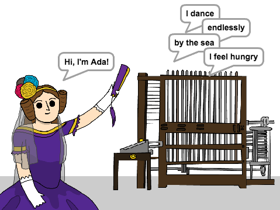
</div>

# Step 1: Ada Lovelace { .activity }

In 1842, Ada Lovelace wrote about using a machine called the 'Analytical Engine' to make calculations, and is seen as the world's first computer programmer!

## Activity Checklist { .check }

+ Open the 'Poetry Generator' Scratch project. Your club leader will give you a copy of this project, or you can open it online at <a href="http://jumpto.cc/poetry-resources" target="_blank">jumpto.cc/poetry-resources</a>.

+ Click on your 'Ada' sprite, and click the `Events` {.blockevents} tab in the 'Scripts' coding section. Drag the `when this sprite clicked` {.blockevents} block onto the coding area on the right.

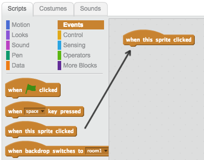

Any code added underneath this block will run when Ada is clicked!

+ Click the `Looks` {.blocklooks} tab, and drag the `say` {.blocklooks} Hello! `for 2 secs` {.blocklooks} block underneath the code you've already added.

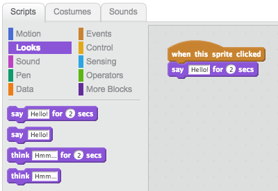

+ Click on Ada, and you should see her talk to you.


## Challenge: Code Ada to introduce herself {.challenge}
Can you change your code, so that Ada says 'Hi, I'm Ada!' when you click on her?
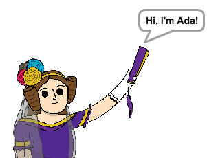

## Save your project { .save }

# Step 2: Telling Ada your name { .activity }

Ada has introduced herself, but she doesn't know your name!

## Activity Checklist { .check }

+ Drag an `ask` {.blocksensing} block (from the `sensing` {.blocksensing} section) onto your code. Here's how your code should look:

```scratch
when this sprite clicked
say [Hi, I'm Ada!] for (2) secs
ask [What's your name?] and wait
```

+ Click on Ada to test your code. Ada should ask you your name, which you can type in!

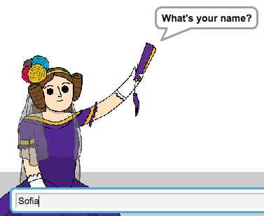

+ We can use a __variable__ to store your name. Click `Data` {.blockdata}, and then 'Make a Variable'. As this variable will be used to store your name, let's call the variable... `name` {.blockdata}!

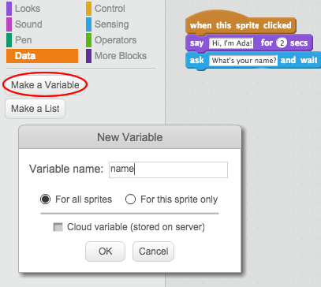

+ To store your name, click the `Data` {.blockdata} tab, and then drag the `set name` {.blockdata} block onto the end of your code.

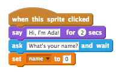

+ Use the `answer` {.blocksensing} block to store the answer you type in.

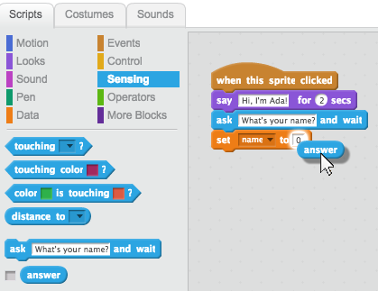

+ Click on Ada to test your code, and enter your name when asked. You should see that your name has been stored in the `name` {.blockdata} variable.


+ You can now make use of your name in your code. Add this code:

```scratch
say (join [Hi ] (name))
```

To create this code, first drag a `join` {.blockoperators} block onto the `say` {.blocklooks} block, and then add your `name` {.blockdata} block onto the `join` {.blockoperators} block.

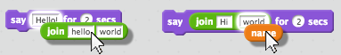

+ To hide your `name` {.blockdata} variable on the stage, click the tick next to the variable.

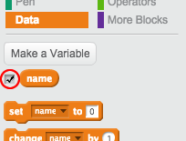

+ Test your new code. Ada should say hello to you, using your name!

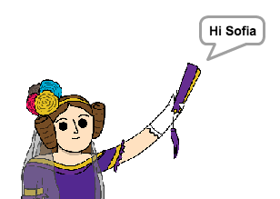

If there's no space between the word 'Hi' and your name, you'll need to add a space into the code yourself!

+ Finally, add this code to explain what to do next:

```scratch
say [Click the computer to generate a poem!] for (2) secs
```

+ Test Ada's code one last time, to make sure that everything works. Here's How your code should look:

```scratch
when this sprite clicked
say [Hi, I'm Ada!] for (2) secs
ask [What's your name?] and wait
set [name v] to (answer)
say (join [Hi ] (name)) for (2) secs 
say [Click the computer to generate a poem.] for (2) secs 
```

## Save your project { .save }

# Step 3: The Analytical Engine { .activity }

Let's program Ada's computer (called the 'Analytical Engine') to generate poetry.

## Activity Checklist { .check }

+ Add this code to your 'Computer' sprite, so that it speaks then clicked:

```scratch
when this sprite clicked
say [Here is your poem...] for (2) secs
```

+ To create a random poem, first you'll need a __list__ of words to use. To create a new list, click the `Data` {.blockdata} tab.

Let's use __verbs__ (action words) in the first line of your poem. Create a new list called 'verbs'.

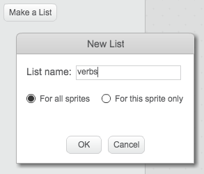

+ Your new list will be empty. Click the `+` at the bottom of your empty list and add these verbs:

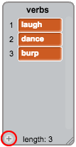

+ The first line in your poem will be the word "I", followed by a random verb. This is the code that you'll need to add:

```scratch
when this sprite clicked
say [Here is your poem...] for (2) secs
say (join [I ] (item (random v) of [verbs v])) for (2) secs
```

+ Test your code a few times. Your computer should say a random word from your verb list each time.

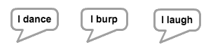

## Save your project { .save }

# Step 4: More poetry { .activity }

Your poem is quite short! Let's add a second line.

## Activity Checklist { .check }

+ Let's use adverbs in the next line of your poem. An adverb is a word that describes a verb. Create another list called __adverbs__, and add these 3 words:

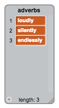

+ Add this line to your computer's code, to say a random adverb at the end of your poem:

```scratch
say (item (random v) of [adverbs v]) for (2) secs
```

+ You can click the boxes next to your 2 lists to hide them.

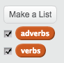

+ Test your code a few times. You should see a random poem each time.

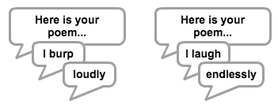

## Save your project { .save }

# Step 5: Animating the Analytical Engine { .activity }

Let's animate your computer, so that it looks like it's generating poetry.

## Activity Checklist { .check }

+ Click on your computer sprite, and add this code after the first `say` {.blocklooks} block:

```scratch
repeat (10)
	turn left (5) degrees
	wait (0.1) secs
	turn right (5) degrees
	wait (0.1) secs	
end
```

Here's how your code should look:

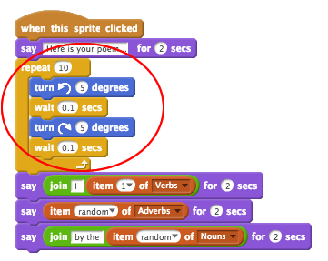

You'll find the `repeat` {.blockcontrol} and `wait` {.blockcontrol} blocks are in the `control` {.blockcontrol} section.

+ Click the 'Sounds' tab, and click 'Choose sound from library'.

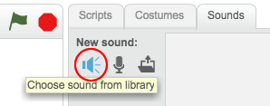

+ Choose a 'computer beeps' sound and click OK.

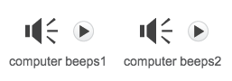

+ Add a `play sound` {.blocksound} block, to play your sound during the animation.

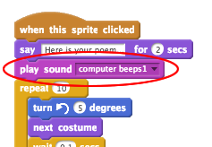

## Save your project { .save }

## Challenge: Personalise your poem {.challenge}
Can you use your `name` {.blockdata} variable to personalise your poem? 

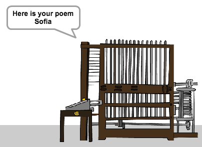

## Challenge: More words {.challenge}
Can you add more verbs and adverbs to your lists, so that you can generate more poems?

Remember:
+ Verbs are action words (like 'cry' and 'dance')
+ Adverbs are words that describs verbs (like 'silently' or 'loudly').

## Challenge: More poetry {.challenge}
Can you add more lists to your project, and use them to create more poetry?

You can use __nouns__ (names of places or things, like 'sea' or 'moon'), or __adjectives__ (words that describe a noun, like 'beautiful' or 'small').

## Save your project { .save }
