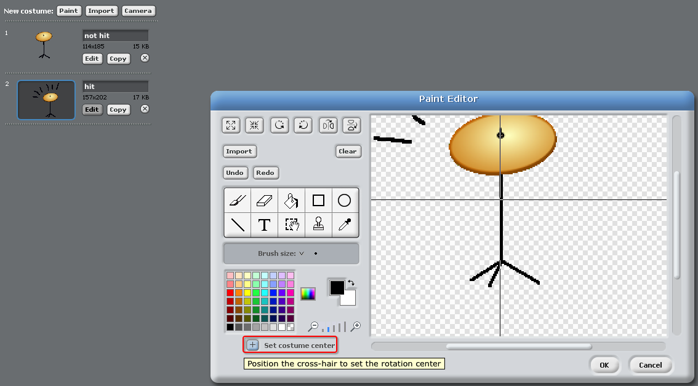

#Introduction:
In this project, children will learn how to add sound and music to their projects, as well as changing and programming sprite costumes.

#Resources
For this project, Scratch 1.4 should be used.

You can find a completed version of this project by clicking the 'Project Materials' link for this project, which contains:

+ RockBand-1.4.sb

#Learning Objectives
+ Sprites;
+ Costumes;
+ Sequential code blocks;
+ Events;
+ Sound and music.

This project covers elements from the following strands of the [Raspberry Pi Digital Making Curriculum](http://rpf.io/curriculum):

+ [Use basic programming constructs to create simple programs.](https://www.raspberrypi.org/curriculum/programming/creator)

#Challenges
+ "Improving your drum" - Changing sprite sounds and adding events;
+ "Changing your singer's costume" - adding and controlling sprite costumes;
+ "Make your own band" - using the skills learnt to create new instruments.

#Frequently Asked Questions
+ When creating their own sprites, children may find that their sprite 'jumps' when it's clicked, as it changes costume. This is because the two costumes aren't centered in the same place.

	To fix this, click 'Set costume center' on _both_ sprites, and make sure they are centered at the same point in both costumes.

	

+ On Linux, right-clicking to delete a sprite may not work. If this is the case, holding shift and left-clicking will bring up the menu to delete a sprite.