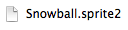
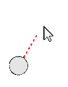
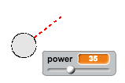
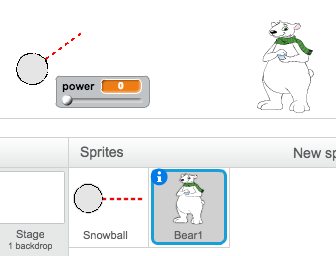

# Introduction { .intro }

In this project you're going to make a game in which you have to throw snowballs at a target. You'll use the mouse pointer to angle the snowball and the spacebar to choose the snowball's power.

<div class="scratch-preview">
  <iframe allowtransparency="true" width="485" height="402" src="https://scratch.mit.edu/projects/embed/35172420/?autostart=true" frameborder="0"></iframe>
  
</div>

# Step 1: Making a snowball { .activity }

Let's make a snowball, that you can throw around your stage.

## Activity Checklist { .check }

+ Start a new project, and delete the cat sprite, so that your project is empty.

+ For this project, you should have a 'Resources' folder, containing the snowball sprite that you'll need. Make sure that you can find this folder, and ask your club leader if you can't find it.

	

+ Click 'Upload sprite from file', and select the file 'Snowball.sprite2' in your resources folder.

	

	The sprite contains 2 costumes, a normal costume, and one that shows which direction the snowball is facing.

	

+ First, let's allow the player to change the angle of the snowball. Add this code to your snowball sprite:

	```blocks
		when flag clicked
		wait (0.5) secs
		go to x:(-200) y:(-130)
		point in direction (90 v)
		switch costume to [snowball-aim v]
		repeat until <key [space v] pressed?>
			point towards [mouse-pointer v]
		end
	```

+ Test out your project by clicking the green flag. You should see that your snowball follows the mouse, until you press the space bar.

	

+ Let's also allow the player to deicde on how powerful the snowball should be thrown. Create a new variable called `power` {.blockdata}.

	

+ Drag your new variable display to the bottom of the stage, near the snowball. Right-click on the variable display and click 'slider'.

	

+ Add code to set your new `power` {.blockdata} variable to 0 when the flag is clicked.

	```blocks
		set [power v] to (0)
	```

+ Now that you have a `power` {.blockdata} variable, you can increase the power of the snowball _after_ the direction has been chosen with this code:

	```blocks
		repeat until < not <key [space v] pressed?> >
			change [power v] by (1)
			wait (0.1) secs
		end
	```

	This code means that you have to _keep the space bar held down_ after choosing the direction, to choose the snowball's power.

+ Test your snowball, to see if you can choose its angle and power.

	

# Step 2: Throwing a snowball { .activity }

## Activity Checklist { .check }

+ Add this code to the _end_ of your snowball script, to broadcast that you're throwing a snowball:

	```blocks
		broadcast [throw v] and wait
	```

	Here's how your snowball code should look:

	```blocks
		when flag clicked
		wait (0.5) secs
		go to x:(-200) y:(-130)
		point in direction (90 v)
		switch costume to [snowball-aim v]
		repeat until <key [space v] pressed?>
			point towards [mouse-pointer v]
		end
		repeat until < not <key [space v] pressed?> >
			change [power v] by (1)
			wait (0.1) secs
		end
		broadcast [throw v] and wait
	```

+ Add this script to your snowball, to move until it reaches the edge of the stage:

	```blocks
		when I receive [throw v]
		switch costume to [snowball v]
		repeat until < touching [edge v]? >
			move (power) steps
		end
		hide
	```

	The script uses the `power` {.blockdata} variable to decide how fast to move.

+ Now that you're hiding the snowball when it touches the edge, add code to `show` {.blocklooks} the snowball when the flag is clicked, _just_ after the snowball switches to the `snowball-aim` {.blocklooks} costume.

	

+ Test out your snowball a few times. Does it move at different angles and different speeds?

+ If you want to be able to throw your snowball lots of times, just add a `forever` {.blockcontrol} loop around your snowball `when flag clicked` {.blockevents} code.

	

# Step 3: Realistic movement { .activity }

You now have a snowball, but let's make it move a bit more realistically.

## Activity Checklist { .check }

+ First, let's set a maximum power level, so that the snowball can't be thrown too hard.

	In your snowball's `when flag clicked` {.blockevents} code, we need to increase the power only if it's less than 20. Change your code to:

	```blocks
		repeat until< not <key [space v] pressed?> >
			if < (power) < [20] > then
				change [power v] by (1)
				wait (0.1) secs
			end
		end
	```

+ Test out your snowball again, and you'll see that the power never gets above 20.

+ Now that your snowball's maximum power is 20, you can set this as the maximum value for the variable's slider too. Right-click on your power variable, and click 'set slider min and max'.

	

+ You can also slow down the snowball, by reducing the power slightly as it flies through the air. Add this code block to your snowball's `when I receive [throw]` {.blockevents} code:

	```blocks
		change [power v] by (-0.25)
	```

+ Test this new code - does it work as you expected? You may notice that the power keeps reducing, and eventually the snowball moves backwards!

	To fix this, you can add an `if` {.blockcontrol} block to your code, so that the power is only lowered if it is above 0:

	```blocks
		if < (power) > (0) > then
			change [power v] by (-0.25)
		end
	```

+ You're nearly there, but you also need to add some gravity to your snowball, so that it falls to the ground. You can add gravity by just moving the snowball down continuously with this script:

	```blocks
		when I receive [throw v]
		repeat until <touching [edge v]?>
			change y by (-5)
		end
	```

+ Test out your snowball again, and you should see that your snowball moves much more realistically.

# Step 4: The target { .activity }

Let's add in a target for your snowballs!

## Activity Checklist { .check }

+ Add in another sprite to your project.

	

+ Add this code to your new sprite, so that it says "You got me!" when it gets hit:

	```blocks
		when flag clicked
		forever
			if < touching [snowball v]? > then
				say [You got me!] for (1) secs
			end
		end
	```

+ Test out your new code.

	

+ Let's do a couple of things to make the game harder. First, let's move the bear each time the player throws the snowball.

	To do this, first add a `broadcast` {.blockcontrol} to your snowball, near the top of your `forever` {.blockcontrol} loop. This will let your bear know that a new shot is about to be taken.

	```blocks
		broadcast [new shot v]
	```

+ When your bear receives this message, move it to a new random position with this code:

	```blocks
		when I receive [new shot v]
		set x to (pick random (0) to (200))
	```

+ Test your project by throwing a few snowballs. Does your bear move position each time?

+ You can also make your game harder by adding a rock in front of your snowball.

	

+ You can now change your snowball code, to stop when it touches the edge of the screen _or_ when it touches the rock. Here's how your snowball code should look:

	

+ Finally, you can make your game harder by making your snowball and your bear smaller.

	

##Challenge: Improve this game! {.challenge}
Now that you've made the basic game, see what you can do to improve it. Here are some ideas, but feel free to use your own ideas too.

+ Change the numbers in your code, to make the snowball move faster, higher or further;
+ Change the graphics;
+ Add music and sound effects;
+ Change sprite costumes when the target is hit;
+ Add a score and a high score;

+ The bear could move around so that it's harder to hit;
+ You could add snowflakes or birds that stop the snowball;

+ You could add a second player, so that you could both throw snowballs at the bear... or eachother!
