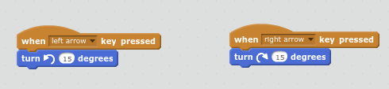
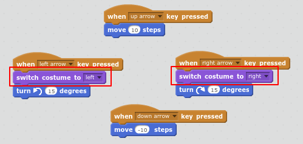
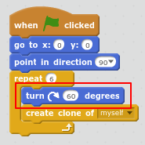

# Introduction { .intro }

In celebration of the 2016 Summer Olympics in Rio, you are going to learn how to program a synchronised swimming routine for Scratch the cat by using loops and creating clones. 

  <iframe allowtransparency="true" width="485" height="402" src="https://scratch.mit.edu/projects/embed/113149575/?autostart=false" frameborder="0"></iframe>
  

Tip: You can click on the red stop button to stop the music playing!

# Step 1: Swimming Left and Right { .activity }

In synchronised swimming a team of swimmers perform a coordinated routine of moves to music. 

Let's start by getting one cat swimming. 

## Activity Checklist { .check }

+ Create a new Scratch project. You can find the online Scratch editor at <a href="http://jumpto.cc/scratch-new" target="_blank">jumpto.cc/scratch-new</a>.

+ First let's turn the stage blue so it looks like a swimming pool. 

	Click on the Stage and then the `Backdrops` Tab. 
	
	Choose a blue colour from the palette, click the 'Fill with color' tool and then click on the backdrop. 

	

+ You're going to use a different cat sprite so right-click on the walking cat to delete it. 

	

+ Now click 'Choose sprite from library'. 

	

+ Select 'Animals' and choose 'Cat1 Flying' and click 'OK'. 

	

	The flying cat looks like it could be swimming. 
	
+ Now let's get the cat swimming. 

	Click on the 'Cat1 flying' sprite and then 'Scripts' and add code to make the cat rotate left and right when you press the left and right arrow keys. 
	
	
	
	
+ Test your code by pressing the left and right arrow keys on the keyboard.

	

+ And add forward and backward movement:

	

+ Test your code by swimming around the stage using the arrow keys. 

# Step 2: Changing costume { .activity }

Hmm, this would look better if the cat sprite changed direction when it turns left. 

## Activity Checklist { .check }

+ Click on 'Costumes' and delete the 'cat1 flying-a' costume.

	 
	
+ Rename the remaining costume from 'cat1 flying-b' to 'right'. 

	

+ Right-click on the costume and choose duplicate to create a copy. 

	

+ Click 'Flip left-right' to reverse the copy and then name it 'left'. 

	Your costumes should look like this:

	

+ Click 'Scripts' to return to your code and add blocks to change the costume when the direction is changed. 

	

+ Test your code by swimming around the stage using the arrow keys. 

	

## Save your project { .save }

# Step 3: Create the team { .activity .new-page }

Synchronised swimming needs more than one cat! We can use `create clone of` {.blockcontrol} to create copies that behave in the same way. 

## Activity Checklist { .check }

+ First let's add code to make sure the cat always starts in the same position when you click the green flag. 

	
	
+ Test your code by pressing some arrow keys and then clicking the green flag to return to the start position. 

+ Now we can use a `repeat` {.blockcontrol} loop to create 6 clones (copies) of the cat. 

	Loops are used to do the same thing multiple times. 
	
	

+ You don't want all the cats to be in the same position! 

	Add code to rotate 60 degrees before creating each clone. 
	
	
	
+  Test your code by using the arrow keys. You should be able to create some amazing synchronised swimming patterns!

	

# Step 4: Music! { .activity .new-page }

A synchronised swimming routine needs music. (But, if you can't play sound then you can skip this step.)

## Activity Checklist { .check }

+ Click on the `Sounds` tab and then click 'Choose new sound from library'. 

	

+ Choose 'Music Loops' and choose some music and then click 'OK'. 

	

+ Now go back to 'Scripts' and add the blocks to play your music: 

	
	
	Putting the `play sound` {.blocksound} inside a `forever` {.blockcontrol} loop means the music will keep repeating. 

+ Test your project. 

	You can click on the red stop button to stop the music playing!

# Step 5: Programmed Routines { .activity .new-page }

## Activity Checklist { .check }

Would you like to be able to perfect a routine and easily repeat it?

+ Let's add some moves to be performed when the space key is pressed. 

	

+ Run your project and press the space key to test the new routine. 

	

+ Try using the arrow keys to move to a different position before pressing space.  

## Save your project { .save }

## Challenge: Code your own routine {.challenge}

Can you write your own synchronised swimming routine to be performed when you press the space key or another key?

Try working out a routine using the arrow keys first. 

Use `repeat` {.blockcontrol} loops to perform the same actions multiple times. 

Here's an example:

## Challenge: Change the team {.challenge}

Can you change the number of swimmers in the team? Synchronised swimming teams usually have eight members but can have as few as four. 

Hint: As well as changing the number of swimmers you'll need to change their starting position. 

Hint: 360 divided by 8 is 45; 360 divided by 4 is 90.

You could also change the sprite that you use. 

## Save your project { .save }
