# Introduction { .intro }

In this project you'll learn how to code your own tech toys!

+ Click the bowtie to see it spin;
+ Click the sunglasses to see them change colour;
+ Click the laptop to power up the helicopter;
+ Press the arrow keys to fly the helicopter;
+ Press the space bar to make the helicopter loop-the-loop.

  <iframe allowtransparency="true" width="485" height="402" src="https://scratch.mit.edu/projects/embed/109510044/?autostart=false" frameborder="0"></iframe>
  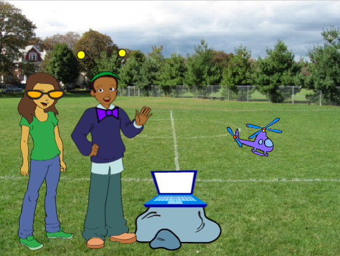

# Step 1: Spinning Bowtie { .activity }

Let's code a bowtie that spins when clicked.

## Activity Checklist { .check }

+ Open the 'Tech Toys' Scratch project. Your club leader will give you a copy of this project, or you can open it online at <a href="http://jumpto.cc/toys-resources" target="_blank">jumpto.cc/toys-resources</a>.

+ Click on the 'Bowtie' sprite and add this code:

	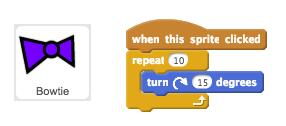

+ Click the bowtie to run your code. You should see that your bowtie turns 15 degrees clockwise 10 times, turning 150 degrees in total.

	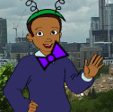

+ Click the `point in direction` {.blockmotion} block to point the bowtie back to it's starting position.

	

+ To make the bowtie do 1 complete spin, the numbers in your code need to add up to 360 degrees. Change your code so that the bowtie turns 36 degrees 10 times (36 x 10 = 360).

	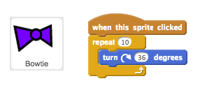

+ Test your code again. This time, your bowtie should do 1 complete 360 degree spin and end up where it started.

+ If you want your bowtie to do 4 complete spins, you can change the number in the `repeat` {.blockcontrol} block from 10 to 40.

	

## Save your project { .save }

##Challenge: Colour-changing sunglasses { .challenge }
Can you use the following code to make your sunglasses change colour when clicked?

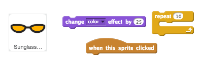

Remember that you can change the numbers in the code blocks if you want to!

## Save your project { .save }

# Step 2: Powering up your helicopter { .activity }

Let's code your helicopter to start up when your laptop is clicked.

## Activity Checklist { .check }

+ Let's start by broadcasting a `start` {.blockevents} message when the laptop is clicked.

	

+ This code broadcasts a message to all other sprites. If you test this code, you'll see that nothing happens yet! This is because you've not coded the helicopter to respond to the message.

+ Click on your Helicopter sprite and add a `When I receive` {.blockevents} block. Any code attached to this block will be run when it receives the 'start' message from the laptop.

	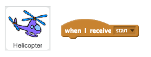

+ If you click your helicopter's 'Costumes' tab, you'll notice that it has 2 costumes with slighly different propellers.

	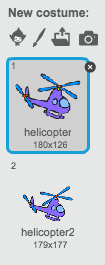

+ You can use the 2 costumes to animate the helicopter. Add this code, so that the helicopter changes costumes forever once it receives the 'start' message.

	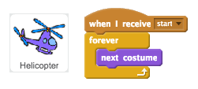

+ Test your code by clicking your laptop sprite. Does your helicopter's propeller animate?

	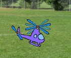

## Save your project { .save }

# Step 3: Flying your helicopter { .activity }

Let's use the arrow keys to fly your helicopter.

## Activity Checklist { .check }

+ Let's start by coding your helicopter to move up when the up arrow is pressed.

	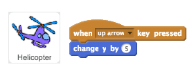

+ If you test your code, you'll see that your helicopter's __y__ position (up/down) changes whenever the up arrow is pressed.

+ If you want your helicopter to move more smoothly, you can instead add code to move upwards to your helicopter's `forever` {.blockcontrol} loop.

	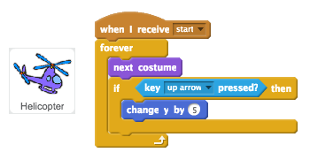

+ If you test this new code, you'll see that the movement is smoother than before.

+ You can also code your helicopter to move to the left when the left arrow is pressed. This time you'll need to change the helicopter's __x__ postition by __-5__.

	

+ For smoother motion, you can instead add more code to your helicopter's `forever` {.blockcontrol} loop.

	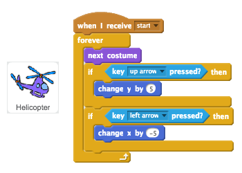

## Save your project { .save }

##Challenge: More controls { .challenge }
Can you code your helicopter to respond to to the down and right arrow keys?

## Save your project { .save }

# Step 4: Loop-the-loop { .activity }

Let's code your helicopter to do a 360 degree spin.

## Activity Checklist { .check }

+ We want the helicopter to do a 360 degree spin whenever the space key is pressed. Remember that the numbers in your code need to add up to 360.

	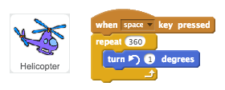

+ Test your code by pressing space, and you'll see that your helicopter spins very slowly. That's because it only turns 1 degree 360 times.

+ To speed up your helicopter's spin, change the numbers in your code so that it turns more degrees fewer times. It doesn't matter what numbers you choose as long as they add up to 360!

	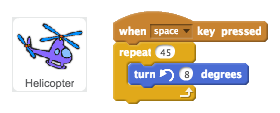

+ If you want your helicopter to move as well as spin, just add a `move` {.blockmotion} block to your code.

	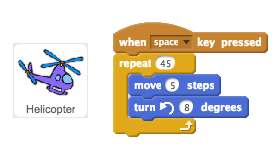

+ Press space again to test your code. You should see your helicopter move in a circle. What happens if you change the number in your `move` {.blockmotion} block?

 	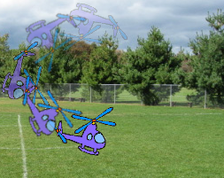

## Save your project { .save }

##Challenge: Create your own toy tech! { .challenge }
Can you create your own tech toy?

You could make the antennae move whenever they're clicked? Here's the code blocks you will need to use:

You could make any tech toy you like. Here are some other sprites you could use:

## Save your project { .save }