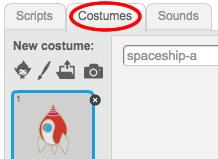
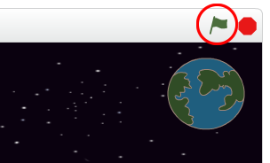

---
title: Perdidos en el espacio
level: Scratch 1
language: es-AR
stylesheet: scratch
embeds: "*.png"
materials: ["Club Leader Resources/*.*"]
...

# Introducción { .intro }

¡Vas a aprender a programar tu propia animación!

<div class="scratch-preview">
  <iframe allowtransparency="true" width="485" height="402" src="http://scratch.mit.edu/projects/embed/26818098/?autostart=false" frameborder="0"></iframe>
  
</div>

# Primer paso: Animación de una nave espacial { .activity .new-page}

¡Hagamos una nave espacial que vuele hacia la Tierra!

## Lista de verificación de actividades { .check }

+ Comienza un nuevo proyecto Scratch, y elimina el objeto gato para que tu proyecto esté vacío. Puedes encontrar el editor de Scratch en línea en <a href="http://jumpto.cc/scratch-new">jumpto.cc/scratch-new</a>.

+ Agrega los objetos “Nave especial” y “Tierra” al escenario. También deberías agregar las “Estrellas” en el fondo de tu escenario. Tu escenario debería verse así:

	

+ Haz clic en tu nuevo objeto nave especial, y haz clic en la lengüeta “Disfraces”.

	

+ Usa la herramienta de flechas para seleccionar la imagen. Luego haz clic en la manija rotatoria circular, y haz rotar la imagen hasta que esté de costado.

	

+ Agrega este código a tu objeto nave espacial:

	

	Cambia los números en los bloques de código, para que el código sea exactamente igual que en la imagen anterior.

+ Si haces clic en los bloques de código para ejecutar el código, deberías ver que la nave especial habla, dobla y se mueve hacia el centro del escenario.

	

	La posición de la pantalla `x:(0) y:(0)` {.blockmotion} es el centro del escenario. Una posición como `x:(-150) y:(-150)` {.blockmotion} está hacia la parte inferior izquierda del esenario, y una posición como `x:(150) y:(150)` {.blockmotion} está cerca de la parte superior derecha.

	

	Si necesitas saber las coordinadas de una posición en el scenario, mueve el ratón a la posición para la cual deseas saber las coordinadas, que se despliegan abajo del escenario.

	

+ Prueba tu animación haciendo clic en la bandera verde justo arriba del escenario.

	

## Desafío: Mejora tu animación {.challenge}
Puedes cambiar los números en el código de tu animación, para que:
+ ¿La nave especial se mueva hasta tocar la Tierra?
+ ¿La nave espacial se mueva más lentamente hacia la Tierra?

Necesitarás cambiar los números en este bloque:

```blocks
	deslizar en (1) segs a x:(0) y:(0)
```

## Guarda tu proyecto { .save }

# Segundo paso: Animación mediante el uso de loops { .activity .new-page }

Otra manera de animar la nave espacial es decirle que se mueva distancias pequeñas, muchas veces.

## Lista de verificación de actividades { .check }

+ Elimina el bloque `deslizar` {.blockmotion} de tu código haciendo clic con el botón derecho y haciendo clic en “eliminar”. También puedes eliminar código arrastrándolo del área de secuencia de comandos, de nuevo al área de los bloques de código.

	

+ Una vez que hayas eliminado tu código, agrega este código en su lugar:

	

	El bloque `repetir` {.blockcontrol} se usa para repetir algo muchas veces, y también se conoce como un __loop__.

+ Si haces clic en la bandera para probar este nuevo código, verás que hace casi lo mismo que antes.

+ Puedes agregar más código a tu loop, para hacer cosas interesantes. Agrega el bloque `cambiar efecto de color por 25` {.blocklooks} en el loop (de la sección “Vistas”), para cambiar el color de la nave espacial repetidamente a medida que se mueve:

	

+ Haz clic en la bandera para ver tu nueva animación.

	

+ También puedes hacer que tu nave especial se haga más pequeña a medida que se mueve hacia la Tierra.

	

+ Prueba tu animación. ¿Qué sucede si haces clic en la bandera una segunda vez? ¿Tu nave espacial empieza con el tamaño correcto? Puedes usar este bloque para fijar tu animación:

	```scratch
	fijar tamaño a (100) %
	```

## Guarda tu proyecto { .save }

# Tercer paso: Mono que flota { .activity .new-page }

Agreguemos un mono a tu animación, que está ¡perdido en el espacio!!

## Lista de verificación de actividades { .check }

+ Comienza agregando un objeto mono de la biblioteca.

	

+ Si haces clic en tu nuevo objeto mono y luego en “Disfraces”, puedes editar cómo se ve el mono. Haz clic en la herramienta “Elipse” y dibuja un casco espacial blanco alrededor de la cabeza del mono.

	

+ Ahora haz clic en “Secuancia de comandos”, y agrega este código a tu mono, para que gire lentamente en un círculo por siempre:

	```blocks
	al presionar bandera verde
	por siempre
   		girar ↻ (1) grados
	fin
	```

	El bloque `por siempre` {.blockcontrol} es otro loop, pero esta vez uno que nunca termina.

+ Haz clic en la bandera para probar tu mono. Tendrás que hacer clic en el botón parar (al lado de la bandera) para terminar esta animación.

	

# Cuarto paso: Asteroides que rebotan { .activity .new-page }

Agreguemos a tu animación algunas rocas espaciales que flotan.

## Lista de verificación de actividades { .check }

+ Agrega un objeto “roca” a tu animación.

	

+ Agrega este código a tu roca, para hacer que rebote por todo el escenario:

	```scratch
	al presionar bandera verde
	apuntar hacia [Earth v]
	por siempre
		mover (2) pasos
		rebotar si toca un borde
		if on edge, bounce
	```

+ Haz clic en la bandera para probar tu roca. ¿Rebota por todo el escenario?

# Quinto paso: Estrellas que brillan { .activity .new-page }

Combinemos loops para hacer una estrella que brilla.

## Lista de verificación de actividades { .check }

+ Agrega un objeto “Estrella” a tu animación

	

+ Agrega este código a tu estrella:

	

+ Haz clic en la bandera para probar esta animación de la estrella. ¿Qué hace este código? Bien, la estrella se hace un poquito más grande 20 veces, y luego se hace un poquito más pequeña 20 veces, hasta llegar a su tamaño original. Estos 2 loops están dentro de un loop `por siempre` {.blockcontrol}, para que la animación se continúe repitiendo.

## Guarda tu proyecto { .save }

## Desafío: Crea tu propia animación {.challenge}
Detén tu animación especial, haz clic en “Archivo” y luego en “Nuevo”, para comenzar un nuevo proyecto.

Usa lo que aprendiste en este proyecto para crear tu propia animación. Puede ser cualquier cosa que quieras, pero trata de que la animación concuerde con el escenario. Aquí te damos algunos ejemplos:


## Guarda tu proyecto { .save }

## Community Contributed Translation { .challenge .pdf-hidden }

This project was translated by María Alejandra Aguada from Translators Without Borders. Our amazing translation volunteers help us give children around the world the chance to learn to code.  You can help us reach more children by translating a Code Club project via [Github](https://github.com/CodeClub/curriculum_documentation/blob/master/contributing.md) or by getting in touch with us at hello@codeclubworld.
