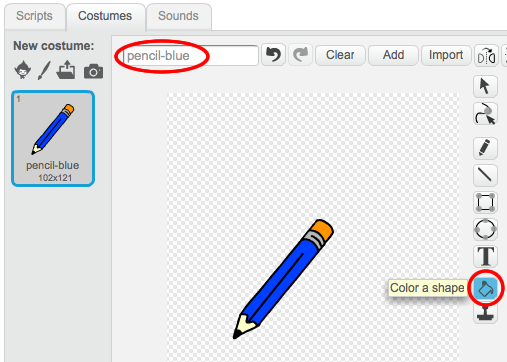
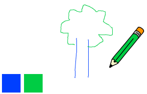

---
title: Caja de lápices
level: Scratch 1
language: es-AR
stylesheet: scratch
embeds: "*.png"
materials: ["Club Leader Resources/*.*","Project Resources/*.*"]
...

# Introducción { .intro }

¡En este Proyecto, vas a crear tu propio programa para pintar!

<div class="scratch-preview">
  <iframe allowtransparency="true" width="485" height="402" src="http://scratch.mit.edu/projects/embed/63473366/?autostart=false" frameborder="0"></iframe>
  
</div>

# Primer paso: Crear un lápiz { .activity }

Comencemos por crear un lápiz, que puedes usar para dibujar en el escenario.

## Lista de verificación de actividades { .check }

+ Comienza un nuevo proyecto Scratch, y elimina el objeto gato para que tu proyecto esté vacío. Puedes encontrar el editor de Scratch en línea en <a href="http://jumpto.cc/scratch-new">jumpto.cc/scratch-new</a>.

+ Agrega el objeto lápiz a tu proyecto.

	

+ Haz clic en “Disfraces”, y elimina el disfraz “pencil-b”.

	

+ Renombra tu disfraz “lápiz-azul”, y usa la herramienta “Colorear una forma” para hacer que el lápiz sea azul.

	

+ Como vas a estar usando tu ratón para dibujar, querrás que tu lápiz siga al ratón “por siempre” {.blockcontrol}. Agrega este código a tu objeto lápiz:

	```blocks
		al presionar bandera verde
		por siempre
		  ir a [mouse pointer v]
		fin
	```

+ Prueba el código haciendo clic en la bandera y luego moviendo el ratón en el escenario. ¿Hace lo que esperabas que hiciera?

+ ¿Te has dado cuenta de que es el centro del lápiz y no la punta, lo que sigue al apuntador del ratón?

	

	Para solucionarlo, haz clic en el disfraz “lápiz-azul” de tu objeto lápiz, y haz clic en “Establecer centro del disfraz”.

	

+ Deberías ver que aparece una cruz en el disfraz. Ahora puedes hacer clic justo debajo de la punta del lápiz, y establecerla esta punta como el centro del disfraz.

	

+ Haz clic en la lengüeta “Secuencias de comandos”, y luego prueba tu lápiz una vez más. ¿Funciona mejor que antes?

+ Ahora hagamos que tu lápiz dibuje `si` {.blockcontrol} se ha hecho clic en el ratón. Agrega este código a tu objeto lápiz:

	

+ Prueba tu código una vez más. Esta vez, mueve el lápiz por el escenario y mantén apretado el botón del ratón. ¿Puedes dibujar con el lápiz?

	

## Guarda tu proyecto { .save }

# Segundo paso: Lápices de colores { .activity }

¡Agreguemos distintos lápices de colores a tu proyecto, y permitámosle al usuario que pueda elegir entre ellos!

## Lista de verificación de actividades { .check }

+ Haz clic en tu objeto lápiz, haz clic en “disfraces” y duplica tu disfraz “lápiz-azul”.

	

+ Renombra tu nuevo disfraz “lápiz-verde”, y pinta el lápiz de color verde.

	

+ Crea dos objetos nuevos, que usarás para seleccionar el lápiz azul o verde.

	

+ Cuando se hace clic en el selector verde, necesitas `enviar` {.blockevents} un mensaje al objeto lápiz, diciéndole que tiene que cambiar su disfraz y color de lápiz.

	Para hacerlo, primero agrega este código a tu ícono selector verde:

	```blocks
		al hacer clic en este objeto
		enviar [green v]
	```

	Para crear el bloque `enviar` {.blockevents}, haz clic en la flecha hacia abajo y selecciona “nuevo mensaje…”.

	

	Luego puedes escribir “verde” para crear to nuevo mensaje.

	

+ Ahora necesitas decirle a tu objeto lápiz qué tiene que hacer cuando recibe el mensaje. Agrega este código a tu objeto lápiz:

	```blocks
		al recibir [green v]
		cambiar disfraz a [pencil-green v]
		fijar color de lápiz a [#00ff00]
	```

	Para fijar el color de lápiz a verde, haz clic en la caja con colores en el bloque `fijar color` {.blockpen}, y haz clic en el ícono selector verde para elegir verde como el color para tu lápiz.

+ Ahora puedes hacer lo mismo para el lápiz azul, agregando este código al objeto selector azul:

	```blocks
		al hacer clic en este objeto
		enviar [blue v]
	```

	...y agrega este código al objeto lápiz:

	```blocks
		al recibir [blue v]
		cambiar disfraz a [pencil-blue v]
		fijar color de lápiz a [#0000ff]
	```

+ Por último, necesitas decirle a tu objeto lápiz qué disfraz y color de lápiz elegir, y limpiar la pantalla cuando comienza tu proyecto. Agrega este código al comienzo del código de tu lápiz {.blockevents} `cuando se hace clic en la bandera `  (antes de `por siempre` {.blockcontrol} loop):

	```blocks
		borrar
		cambiar disfraz a [blue-pencil v]
		fijar color de lápiz a [#0000ff]
	```

	¡Si lo prefieres, puedes comenzar con un color de lápiz diferente!

+ Prueba tu proyecto. ¿Puedes cambiar entre los lápices azul y verde?

	

## Guarda tu proyecto { .save }

# Tercer paso: Cuando se cometen errores { .activity .new-page }

¡A veces se comenten errores, entonces agreguemos un botón “limpiar” y una goma a nuestro proyecto!

## Lista de verificación de actividades { .check }

+ Agreguemos un botón para limpiar el escenario. Para hacerlo, agrega el objeto letra 'X-block' al escenario, y píntalo de rojo.

	

+ Agrega código a tu nuevo botón cancelar para limpiar el escenario cuando se le hace clic.

	```blocks
		al hacer clic en este objeto
		borrar
	```

	¡Fíjate que no necesitas enviar un mensaje para limpiar el escenario, ya que cualquier objeto puede hacerlo!

+ También puedes crear una goma. Si tu líder del club te dio una carpeta de “Recursos”, haz clic en “Cargar disfraz desde archivo” y agrega la imagen “eraser.svg”.

	

	¡Si no tienes la imagen eraser.svg, crea en su lugar un nuevo lápiz blanco!

+ También deberías agregar la imagen goma como un nuevo objeto selector. Así es como debería verse:

	

+ Luego puedes agregar código al objeto selector goma, para decirle al lápiz que cambie a goma.

	```blocks
		al hacer clic en este objeto
		enviar [eraser v]
	```

+ ¡Cuando el lápiz recibe este mensaje, puedes crear una goma cambiando el disfraz del lápiz al de goma, y cambiando el color del lápiz al mismo color del escenario!

	```blocks
		al recibir [eraser v]
		cambiar disfraz a [eraser v]
		fijar color de lápiz a [#FFFFFF]
	```

+ Prueba tu proyecto para ver si puedes limpiar y borrar en el escenario.

	

+ Hay otro problema más con el lápiz – puedes dibujar en cualquier parte del escenario, ¡incluso cerca de los íconos selectores!

	

	Para arreglar esto, tienes que decirle al lápiz que solo dibuje si se hace clic en el ratón _y_ si la posición y del ratón es mayor a -110 (`mouse y`{.blocksensing}`> -120` {.blockoperators}). Cambia la declaración `si` {.blockcontrol} de tu lápiz para que se vea así:

	

+ Prueba tu proyecto. Ahora no deberías poder dibujar cerca de los bloques selectores.

	

## Guarda tu proyecto { .save }

# Cuarto paso: Cambiar el ancho del lápiz { .activity .new-page }

Permitámosle al usuario que pueda dibujar eligiendo distintos tamaños de lápices.

## Lista de verificación de actividades { .check }

+ Primero, agrega una nueva variable que se llame “ancho”. Si no estás seguro sobre como hacerlo, el Proyecto “Globos” puede ayudarte.

+ Agrega esta línea_dentro_del loop del código `por siempre` {.blockcontrol} de tu lápiz:

	```blocks
		fijar tamaño de lápiz a (width)
	```

	El ancho de tu lápiz ahora se fijará repetidamente al valor de tu variable “ancho”.

+ Puedes cambiar el número almacenado en esta variable haciendo clic en el botón derecho sobre tu variable (en el escenario) y haciendo clic en la “barra deslizable”.

	

	Ahora puedes arrastrar la barra deslizadora por debajo de la variable para cambiar su valor.

	

+ Prueba tu proyecto, y fíjate si puedes modificar el ancho de tu lápiz.

	

	Si lo deseas, puedes fijar el valor mínimo y máximo del “ancho” permitido. Para hacerlo, haz clic con el botón derecho sobre tu variable y luego haz clic de nuevo en “fijar min y max para la barra deslizable”. Fija los valores mínimos y máximos para tu variable a algo un poco más coherente, como 1 y 20.

	

	Continúa probando tu variable “ancho” hasta que estés conforme.

## Guarda tu proyecto { .save }

## Desafío: Accesos directos { .challenge }
¿Puedes crear accesos directos en el teclado para tus comandos? Por ejemplo:

+ a = Cambiar al lápiz azul
+ v = cambiar al lápiz verde
+ g = cambiar a la goma
+ l = limpiar pantalla

¡Incluso podrías permitirle al usuario cambiar el ancho del lápiz con las teclas de flechas!

## Guarda tu proyecto { .save }

## Desafío: Más lápices { .challenge }
¡Puedes agregar lápices de color rojo, amarillo y negro a tu programa para pintar? Encontrarás todas las imágenes que necesitas en la carpeta “Recursos”. ¡Recuerda agregar los accesos rápidos en el teclado para estos nuevos lápices!

¿Puedes usar tus lápices para hacer un dibujo?


## Community Contributed Translation { .challenge .pdf-hidden }

This project was translated by María Alejandra Aguada from Translators Without Borders. Our amazing translation volunteers help us give children around the world the chance to learn to code.  You can help us reach more children by translating a Code Club project via [Github](https://github.com/CodeClub/curriculum_documentation/blob/master/contributing.md) or by getting in touch with us at hello@codeclubworld.
