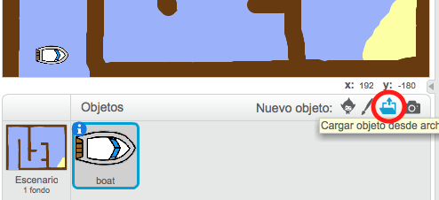
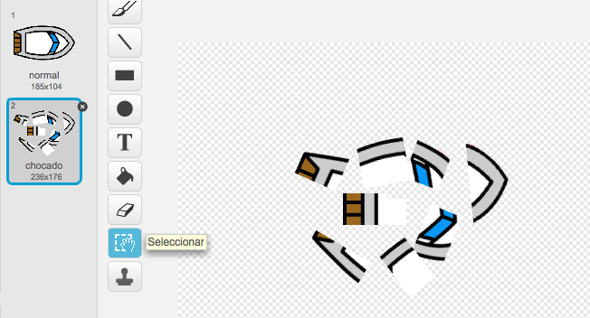
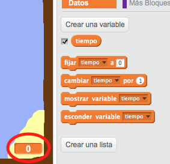
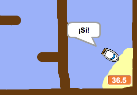
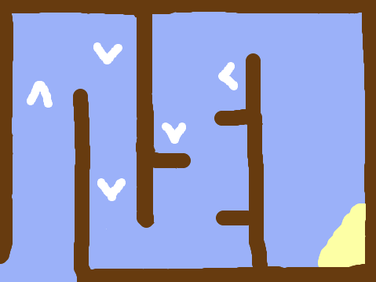
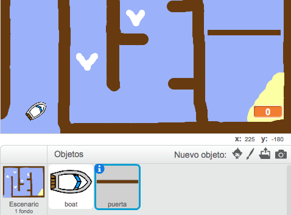
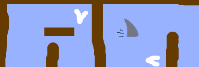

---
title: Carrera de botes
level: Scratch 1
language: es-ES
stylesheet: scratch
embeds: "*.png"
materials: ["Recursos para el líder del Club /*.*","Recursos del Proyecto /*.*"]
...

# Introducción { .intro }

Vas a aprender cómo crear un juego en el cual usarás el ratón para navegar tu bote a una isla desierta.

<div class="scratch-preview">
  <iframe allowtransparency="true" width="485" height="402" src="http://scratch.mit.edu/projects/embed/63957956/?autostart=false" frameborder="0"></iframe>
  
</div>

# Primer paso: Cómo planificar el juego { .activity }

## Lista de verificación de actividades { .check }

+ Comienza un nuevo proyecto Scratch, y borra el objeto gato para que tu proyecto esté vacío. Puedes encontrar el editor en línea de Scratch en <a href="http://jumpto.cc/scratch-new">jumpto.cc/scratch-new</a>.

+ Haz clic en el fondo de tu escenario y planifica tu nivel. Deberías agregar:
	+ Madera que tu bote tiene que evitar;
	+ Una isla desierta a la que tu bote tiene que llegar.

	Tu juego podría verse algo así:

	 

# Segundo paso: Cómo controlar el bote { .activity }

## Lista de verificación de actividades { .check }

+ Si el líder de tu club te dio una carpeta de 'Recursos', haz clic en 'Cargar objeto del expediente' y agrega la imagen 'boat.png'. Deberías achicar el objeto y ubicarlo en la posición de comienzo.

	

	Si no tienes la imagen boat.png, ¡puedes dibujar tu propio bote!

+ Vas a controlar el bote con tu ratón. Agrega este código a tu bote:

	```blocks
		al presionar la bandera verde
		apuntar en dirección (0 v)
		ir a x: (-190) y: (-150)
		por siempre
			apuntar hacia [puntero del mouse v]
			mover (1) pasos
		fin
	```

+ Prueba tu bote haciendo clic en la bandera y moviendo el ratón. ¿Navega el bote hacia el ratón?

	

+ ¿Qué sucede si el bote llega al apuntador del ratón?

	Para que esto no suceda, necesitarás agregar un bloque 'si'{.blockcontrol} a tu código, para que el bote solo se mueva si está a más de 5 píxeles del ratón.

		

+ Prueba tu bote una vez más para ver si el problema ha sido resuelto.

## Guarda tu proyecto { .save }

# Tercer paso: ¡Choques! { .activity .new-page }

¡Tu bote puede navegar a través de barreras de madera! Arreglemos eso.

## Lista de verificación de actividades { .check }

+ Necesitarás 2 disfraces para tu bote, uno normal y otro para cuando el bote choca. Duplica el disfraz de tu bote y nómbralos 'normal' y 'chocado'.

+ Haz clic en tu disfraz 'chocado', y elige la herramienta 'Seleccionar' para tomar partecitas del bote y moverlas y rotarlas por todos lados. Haz que parezca que tu bote ha chocado.

	

+ Agrega este código a tu bote, dentro del loop `por siempre` {.blockcontrol}, para que choque cuando toca cualquier trocito de madera marrón:

	```blocks
		si <tocando el color [#603C15]?> entonces
			cambiar disfraz a [hit v]
			decir [Noooooo!] por (1) segundos
			cambiar disfraz a [normal v]
			apuntar en dirección (0 v)
			ir a x: (-215) y: (-160)
		fin
	```

	Este código está dentro del loop `por siempre` {.blockcontrol}, para que tu código constantemente verifique si tu bote ha chocado.

+ También deberías asegurarte de que al comienzo tu bote siempre se vea 'normal'.

+ Ahora si tratas de navegar a través de una barrera de madera, deberías ver que tu bote choca y vuelve al inicio.

	

## Guarda tu proyecto { .save }

## Desafío: ¡Ganar! {.challenge}
¿Puedes agregar otra declaración `si` {.blockcontrol} al código de tu bote, para que el jugador gane cuando llegue a la isla desierta?

Cuando el bote llega a la isla desierta amarilla, debería decir 'YEAH!' y el juego debería terminar. Tendrás que usar este código:

```bloques
	decir [YEAH!] por (1) segundos
	terminar [all v]
```


## Guarda tu proyecto { .save }

## Desafío: Efectos de sonido {.challenge}
Puedes agregar efectos de sonido a tu juego para cuando el bote choca y para cuando llega a la isla al final del juego. Incluso puedes agregar música de fondo (si necesitas ayuda con esto mira el proyecto 'Banda de Rock' anterior).

## Guarda tu proyecto { .save }

# Cuarto paso: Prueba del cronómetro { .activity }

Agreguemos a tu juego un crnómetro, para que el jugador tenga que llegar a la isla lo más rápido posible.

## Lista de verificación de actividades { .check }

+ Agrega a tu escenario una nueva variable que se llame `tiempo` {.blockdata}. También puedes cambiar cómo se ve tu nueva variable. Si necesitas ayuda, mira el proyecto "Globos".

	

+ Agrega este código a tu __escenario__, para que el cronómetro cuente hasta que el bote llega a la isla desierta:

	```blocks
		al presionar la bandera verde
		fijar [time v] a [0]
		por siempre
			esperar (0.1) segundos
			cambiar [time v] por (0.1)
		fin
	```

+ ¡Ya está! ¡Prueba tu juego para ver qué tan rápido puedes llegar a la isla desierta!

	

## Guarda tu proyecto { .save }

# Quinto paso: Obstáculos y fuentes de energía { .activity }

Este juego es _demasiado_ fácil – agreguemos cosas para hacerlo más interesante.

## Lista de verificación de actividades { .check }

+ Primero agreguemos algunos "estímulos" a tu juego, que harán que el bote navegue más rápido. Edita el fondo de tu scenario y agrega algunas flechas blancas de energía.

	

+ Ahora puedes agregar código al loop `por siempre` {.blockcontrol} de tu bote, para que se mueva 2 _pasos extra_ cada vez que toca una fuente de energía blanca.

	```blocks
		si <tocando el color [#FFFFFF]?> entonces
			mover (3) pasos
		fin
	```

+ También puedes agregar una puerta giratoria, que tu bote tiene que evitar. Agrega un nuevo objeto que se llame 'puerta', y que se vea así:

	

	Asegúrate de que el color de la puerta sea igual al color de las otras barreras de madera.

+ Fija el centro del objeto puerta.

	

+ Agrega código a tu puerta para hacerla que lentamente gire `por siempre` {.blockcontrol}.

+ Prueba tu juego. Ahora deberías tener una puerta giratoria que tienes que evitar.

	

## Guarda tu proyecto { .save }

## Desafío: ¡Más obstáculos! {.challenge .new-page}
¿Puedes agregar más obstáculos a tu juego? Aquí te damos algunas ideas:

+ Podrías agregar cieno verde a tu scenario, lo que frena al jugador cuando lo toca. Para hacerlo puedes usar un bloque `espera` {.blockcontrol}:

```blocks
	esperar (0.01) segundos
````


+ ¡Podrías agregar un objeto en movimiento, como un tronco o un tiburón!



Estos bloques pueden ayudarte:

```blocks
	mover (1) pasos
	rebotar si toca un borde
````

Si tu nuevo objeto no es marrón, tendrás que agregar esto al código de tu bote:

```blocks
	si <  <tocando el color [#603C15]?> o <tocando [shark v]?> > entonces
	fin
```

## Guarda tu proyecto { .save }

## Desafío: ¡Más botes! {.challenge .new-page}
¿Puedes convertir tu juego en una carrera entre 2 jugadores?

+ Duplica el bote, renómbralo 'Jugador 2' y cámbiale el color.


+ Cambia este código para cambiar la posición de comienzo del Jugador 2:

```blocks
	ir a x: (-190) y: (-150)
```

+ Borra el código que usa el ratón para controlar el bote:

```blocks
	si < (distancia a [puntero del mouse v]) > [5] > entonces
		apuntar hacia [apuntador del ratón v]
		mover (1) pasos
	fin
```

...y reemplázalo con código para controlar el bote usando las teclas de flechas.

Este es el código que necesitas para mover el bote hacia adelante:

```blocks
	si < tecla [flecha arriba v] presionada? > entonces
		mover (1) pasos
	fin
```

También necesitarás un código para `doblar` {.blockmotion} el bote cuando se presionan las teclas de flechas izquierda y derecha.

## Guarda tu proyecto { .save }

## Desafío: ¡Más niveles! {.challenge .new-page}
¿Puedes crear escenarios adicionales y permitirle al jugador que elija entre niveles?

```blocks
	al presionar la tecla [espacio v]
	siguiente fondo
```

## Guarda tu proyecto { .save }