---
title: Robot parlanchín
level: Scratch 1
language: es-ES
stylesheet: scratch
embeds: "*.png"
materials: ["Club Leader Resources/*.*","Project Resources/*.*"]
...

# Introducción { .intro }

¡Vas a aprender cómo programar tu propio robot que habla!

<div class="scratch-preview">
  <iframe allowtransparency="true" width="485" height="402" src="http://scratch.mit.edu/projects/embed/26762091/?autostart=false" frameborder="0"></iframe>
  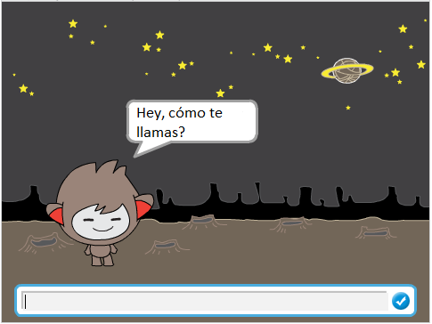
</div>

# Primer paso: Tu robot parlanchín { .activity }

## Lista de verifiación de actividades { .check }

+ Antes de comenzar a hacer tu robot parlanchín, necesitas decidir sobre su personalidad.
	+ ¿Cómo se llama?
	+ ¿Dónde vive?
	+ ¿Es feliz? ¿serio? ¿gracioso? ¿tímido? ¿amigable?

+ Comienza un nuevo proyecto Scratch, y borra el objeto gato para que tu proyecto esté vacío. Puedes encontrar el editor en línea de Scratch en <a href="http://jumpto.cc/scratch-new">jumpto.cc/scratch-new</a>.

+ Elige uno de estos caracteres objetos, y agrégalos a tu proyecto:

	

+ Crea un escenario que haga juego con la personalidad de tu robot parlanchín. Aquí te  damos un ejemplo, aunque no necesariamente tiene que  verse así:

	

## Guarda tu proyecto { .save }

# Segundo paso: Un robot parlanchín que puede hablar { .activity }

Ahora que tienes un robot parlanchín con personalidad, creemos un programa para que te hable.

## Lista de verificación de actividades { .check }

+ Haz clic en el caracter de tu robot parlanchín, y agrega este código:

	```blocks
		al hacer clic en este objeto
		preguntar [Hey! Cómo te llamas?] y esperar
		decir [Qué lindo nombre!] por (2) segundos
	```

+ Haz clic en tu robot parlanchín para probarlo. Luego de que te pregunta tu nombre, escríbelo en la caja abajo del escenario.

	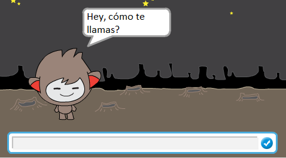

+ Tu robot parlanchín simplemente responde `Qué lindo nombre!` cada vez. Puedes personalizar la respuesta de tu robot parlanchín, haciendo uso de la respuesta del usuario. Cambia el código del robot parlanchín, para que se vea así:

	```blocks
		al hacer clic en este objeto
		preguntar [Hey! Cómo te llamas?] y esperar
		decir <unir [Hola] (respuesta)> por (2) segundos
	```

	Para crear este último bloque, primero tendrás que arrastrar un bloque verde `unir` {.blockoperators} , y arrastrarlo sobre el bloque `decir` {.blocklooks} .

	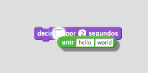

	Puedes cambiar el texto `hola` para decir `Hey`, y arrastrar el bloque azul `respuesta` {.blocksensing}  (de la sección 'Percepción' ) sobre el texto `mundo`.

	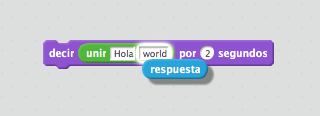

+ Prueba este nuevo programa. ¿Funciona como esperabas? ¿Puedes solucionar los problemas que ves? (Pista: ¡puedes intentar agregar un espacio en cualquier parte!)

+ Puede que quieras almacenar el nombre del usuario en una variable, para poder usarlo de nuevo en el futuro. Crea una nueva variable que se llame `nombre` {.blockdata}. Si olvidaste como hacerlo, el proyecto "Globos" puede ayudarte.

+ La información que ingresaste ya está almacenada en una variable especial llamada `respuesta` {.blocksensing}. Ve al grupo de bloques de Percepción y haz clic en el bloque de respuesta para que aparezca una palomita. El valor actual en `respuesta` {.blocksensing} debería mostrarse en la parte superior izquierda del escenario.

+ Una vez que creaste tu nueva variable, asegúrate de que el código de tu robot parlanchín se vea así:

	```blocks
		al hacer clic en este objeto
		preguntar [Hey! Cómo te llamas?] y esperar
		fijar [name v] a (answer)
		decir <unir [Hola ] (name)> por (2) segundos
	```

+ Si pruebas el programa una vez más, verás que la respuesta se almacena en la variable `nombre` {.blockdata} , y se muestra en la parte superior izquierda del escenario. La variable `nombre` {.blockdata} debería ahora contener el mismo valor que la variable `respuesta` {.blocksensing} .

	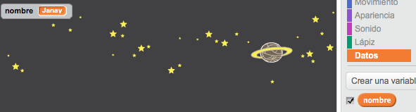

	Si prefieres no ver las variables en tu escenario, puedes hacer clic en la palomita junto al nombre de la variable en la leng üeta "Secuencia de comandos" para esconderlas.

## Guarda tu proyecto { .save }

## Desafío: Más preguntas { .challenge }

Programa tu robot parlanchín para que haga otra pregunta. ¿Puedes almacenar su respuesta en una variable?

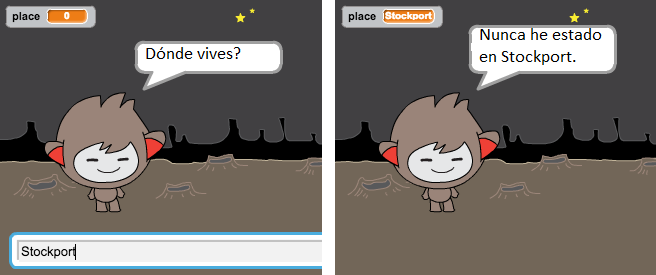

## Guarda tu proyecto { .save }

# Tercer paso: La toma de decisiones { .activity }

Puedes programar tu robot parlanchín para que decida qué hacer, basándose en las respuestas del usuario.

## Lista de verificación de actividades { .check }

+ Hagamos que tu robot parlanchín pregunte al usuario una pregunta con una respuesta `sí` o `no` . Aquí te damos un ejemplo, pero puedes cambiar la pregunta si así lo deseas:

	```blocks
		al hacer clic en este objeto
		preguntar [Hey! Cómo te llamas?] y esperar
		fijar [name v] a (answer)
		decir <unir [Hola ] (name)> por (2) segundos
		preguntar <unir [Estás bien ] (name)> y esperar
		si ((respuesta)=[sí]) entonces
			decir [Me da gusto saber que estás bien!] por (2) segundos
		fin
	```

	Fíjate que ahora que has guardado el nombre del usuario en una variable, puedes usarlo cuantas veces quieras.

+ Para probar el programa adecuadamente, tendrás que probarlo dos veces, una escribiendo `no` como tu respuesta, y otra escribiendo `sí`. Solo deberías obtener una respuesta de tu robot parlanchín `si` {.blockcontrol} tu respuesta es `sí`.

+ El problema con tu robot parlanchín es que no te da una respuesta si el usuario contesta `no`. Puedes solucionar esto cambiando el bloque `si` {.blockcontrol} por un bloque `si/si no` {.blockcontrol} , para que tu nuevo código se vea así:

	```blocks
		al hacer clic en este objeto
		preguntar [Hey! Cómo te llamas?] y esperar
		fijar [name v] a (answer)
		decir <unir [Hola ] (name)> por (2) segundos
		preguntar <unir [Estás bien ] (name)> y esperar
		si ((respuesta)=[sí]) entonces
			decir [Me da gusto saber que estás bien!] por (2) segundos
		si no
			decir [Oh no!] por (2) segundos
		fin
	```

+ Si pruebas tu código, verás ahora que obtienes una respuesta si contestas `sí` o `no`. Tu robot parlanchín debería responder con `Me da gusto saber que estás bien!` cuando contestas `sí`, pero responderá `Oh no!` si escribes otra cosa que no sea `sí` (`si no` {.blockcontrol} significa "de lo contrario").

	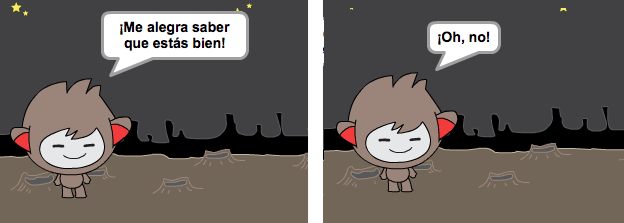

+ Puedes poner cualquier código dentro de un bloque `si` {.blockcontrol} o `si no` {.blockcontrol} , no solo el código para hacer que tu robot parlanchín hable. Por ejemplo, puedes cambiar el disfraz de tu robot parlanchín para que coincida con la respuesta.

	Si miras los disfraces de tu robot parlanchín, verás que hay más de uno. (Si no los hay, ¡siempre puedes agregar más tu mismo!)

	

	Puedes usar estos disfraces como parte de la respuesta de tu robot parlanchín, agregando este código:

	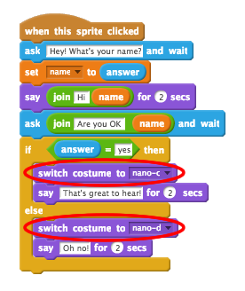

+ Prueba tu programa, y deberías ver cómo la cara de tu robot parlanchín cambia dependiendo de la respuesta que le das.

	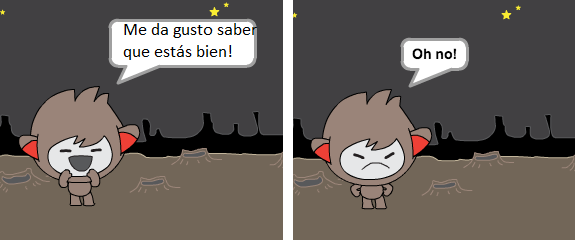

## Guarda tu proyecto { .save }

## Desafío: Más decisiones { .challenge }

Programa tu robot parlanchín para hacer otra pregunta, algo que tenga una respuesta `sí` o `no` . Puedes hacer que tu robot parlanchín responda a la respuesta?

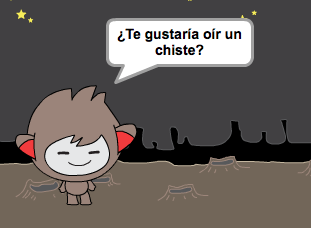

## Guarda tu proyecto { .save }

# Cuarto paso: Cómo cambiar la ubicación { .activity }

También puedes programar a tu robot parlanchín para que cambie su ubicación.

## Lista de verificación de actividades { .check }

+ Agrega otro fondo a tu escenario, por ejemplo el fondo "luna".

	

+ Ahora puedes programar a tu robot parlanchín para que cambie de ubicación agregando este código a tu robot parlanchín:

	```blocks
		preguntar [Me voy a la luna. ¿Quieres venir conmigo?] y esperar
		si ((respuesta) = [sí]) entonces
			cambiar fondo a [moon v]
		fin
	```

+ También debes asegurarte de que tu robot parlanchín esté afuera cuando comienzas a hablarle. Agrega este bloque al principio del código de tu robot parlanchín:

	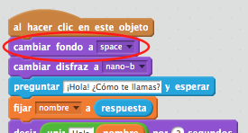

+ Prueba tu programa, y contesta `sí` cuando te pregunta si quieres ir a la luna. Deberías ver que la ubicación del robot parlanchín cambió.

	

+ ¿Cambia de ubicación tu robot parlanchín si escribes `no`? ¿Y qué pasa si escribes `No estoy seguro`?

+ También puedes agregar este código dentro de tu bloque `si` {.blockcontrol} , para hacer que tu robot parlanchín salte 4 veces si la respuesta es `sí`:

	```scratch
	repetir (4)
		cambiar y por (10)
		esperar (0.1) segundos
		cambiar y por (-10)
		esperar (0.1) segundos
	fin
	```

	

+ Prueba tu código una vez más. ¿Salta tu robot parlanchín si contestas que `sí`?

## Guarda tu proyecto { .save }

## Desafío: Crea tu propio robot parlanchín {.challenge}
Utiliza lo que has aprendido para terminar de crear tu robot parlanchín interactivo. Aquí te damos algunas ideas:

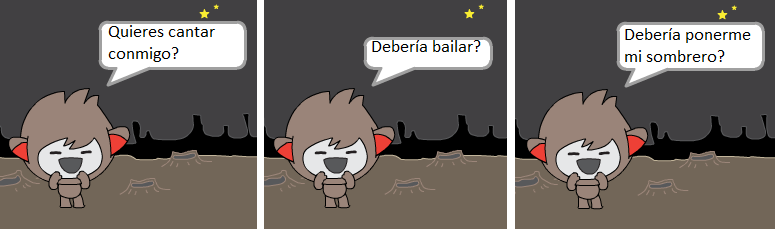

Una vez que termines de crear tu robot parlanchín, ¡haz que tus amigos hablen con él! ¿Les gusta tu personaje? ¿Encontraron algún problema?

## Guarda tu proyecto { .save }

## Community Contributed Translation { .challenge .pdf-hidden }

This project was translated by María Alejandra Aguada from Translators Without Borders. Our amazing translation volunteers help us give children around the world the chance to learn to code.  You can help us reach more children by translating a Code Club project via [Github](https://github.com/CodeClub/curriculum_documentation/blob/master/contributing.md) or by getting in touch with us at hello@codeclubworld.
