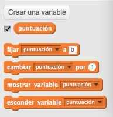
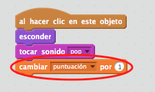
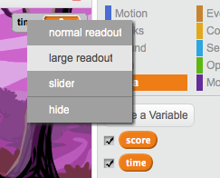

---
title: Caza fantasmas
level: Scratch 1
language: es-ES
stylesheet: scratch
embeds: "*.png"
materials: ["Recursos para el líder del club/*.*"]
...

## Nota: { .challenge .pdf-hidden }
El Proyecto “Globos” se ha movido a la sección [Proyectos Scratch Adicionales](http://projects.codeclub.org.uk/en-GB/03_scratch_bonus/index.html.

# Introducción { .intro }

¡Vas a crear un juego para cazar fantasmas!

<div class="scratch-preview">
  <iframe allowtransparency="true" width="485" height="402" src="http://scratch.mit.edu/projects/embed/60787262/?autostart=false" frameborder="0"></iframe>
  
</div>

# Primer paso: Cómo animar un fantasma { .activity }

## Lista de verificación de actividades { .check }

+ Comienza un nuevo proyecto Scratch, y borra el objeto gato para que tu proyecto esté vacío. Puedes encontrar el editor en línea de Scratch en <a href="http://jumpto.cc/scratch-new">jumpto.cc/scratch-new</a>.

+ Agrega un nuevo objeto fantasma, y un escenario acorde.

	

+ Agrega este código a tu fantasma, para que continuamente aparezca y desaparezca:

	```blocks
		al presionar la bandera verde
		por siempre
			esconder
			esperar (1) segundos
			mostrar
			esperar (1) segundos
		fin
	```

+ Prueba el código de tu fantasma haciendo clic en la bandera verde.

## Guarda tu proyecto { .save }

# Segundo paso: Fantasmas aleatorios { .activity }

¡Tu fantasma es muy fácil de atrapar porque no se mueve!

## Lista de verificación de actividades { .check }

+ En lugar de estar en la misma posición, puedes hacer que Scratch elija coordinadas x e y al azar. Agregar un bloque `ir a` {.blockmotion} al código de tu fantasma, para que se vea así:

	```blocks
		al presionar bandera verde
		por siempre
			esconder
			esperar (1) segundos
			ir a x:(número al azar entre (-150) y (150)) y:(número al azar entre (-150) y (150))
			mostrar
			esperar (1) segundos
		fin
	```

+ Prueba tu fantasma una vez más. Deberías notar que cada vez aparece en un lugar distinto.

## Guarda tu proyecto { .save }

## Desafío: Más aleatoriedad {.challenge}
¿Puedes hacer que tu fantasma `espere` {.blockcontrol} una cantidad de tiempo al azar antes de aparecer? ¿Puedes usar el bloque `fijar tamaño ` {.blocklooks} para hacer que tu fantasma tenga un tamaño al azar cada vez que aparece?

## Guarda tu proyecto { .save }

# Tercer paso: Cómo atrapar fantasmas { .activity }

¡Dejemos que el jugador pueda atrapar fantasmas!

## Lista de verificación de actividades { .check }

+ Para permitirle al jugador que atrape un fantasma, agrega este código:

	```blocks
		al hacer clic en este objeto
		esconder
	```

+ Prueba tu proyecto. ¿Puedes atrapar fantasmas cuando aparecen? Si te parece difícil atrapar fantasmas, puedes jugar el juego en el modo pantalla completa haciendo clic en este botón:

	

## Desafío: Agregar un sonido { .challenge }
¿Puedes hacer un sonido cada vez que se atrapa un fantasma?

## Guarda tu proyecto { .save }

# Cuarto paso: Agregar un puntaje { .activity .new-page }

Hagamos que las cosas sean más interesantes con un contador de puntos.

## Lista de verificación de actividades { .check }

+ Para llevar un conteo de los puntos del jugador, necesitas un lugar para ubicarlo. Una __variable__ es un lugar para almacenar información que cambia, como un puntaje.

	Para crear una nueva variable, haz clic en la lengüeta de “Secuencia de comandos”, selecciona `Información` {.blockdata} y luego haz clic en “Crear una Variable”.

	

	Ingresa “puntaje” como el nombre de la variable. Asegúrate de que esté disponible para todos los objetos, y haz clic en “OK” para crearla. Verás muchísimos bloques de código que pueden usarse con tu variable `puntaje` {.blockdata}.

	

	También verás el puntaje en la esquina superior izquierda del escenario.

	

+ Cuando se inicia un nuevo juego (haciendo clic en la bandera), deberías hacer que el puntaje del jugador sea 0:

	```blocks
	al presionar bandera verde
	fijar [score v] a [0]
	```

+ Siempre que se atrapa un fantasma, necesitas agregar 1 al puntaje del jugador:

	

+ Ejecuta tu programa une vez más y atrapa algunos fantasmas. ¿Cambia tu puntaje?

## Guarda tu proyecto { .save }

# Quinto paso: Cómo agregar un cronómetro { .activity }

Puedes hacer tu juego más interesante, dándole al jugador solo 10 segundos para atrapar tantos fantasmas como le sea posible.

## Lista de verificación de actividades { .check }

+ Puedes usar otra variable para almacenar el tiempo que queda. Haz clic en el escenario y crea una nueva variable denominada “tiempo”:

	

+ Así es como debería funcionar el cronómetro:

	+ El cronómetro debería comenzar a 10 segundos;
	+ El cronómetro debería contar cada segundo descendiente;
	+ El juego debería detenerse cuando el cronómetro llega a 0.

	Este es el código para hacerlo, que puedes agregar a tu __escenario__:

	```blocks
		al presionar bandera verde
		fijar [time v] a [10]
		repetir hasta que <(time) = [0]>
			esperar (1) segundos
			cambiar [time v] por (-1)
		fin
		detener [todos v]
	```

	Así es como agregas el código `repetir hasta`{.blockcontrol}`tiempo`{.blockdata}`= 0`{.blockoperators}:

	

+ Arrastra el visor de la variable “tiempo” al lado derecho del scenario. También puedes hacer clic con el botón derecho en el visor de la variable y elegir “lector grande” para cambiar cómo se muestra el tiempo.

	

+ Pídele a un amigo que pruebe tu juego. ¿Cuántos puntos pueden sumar? Si tu juego es demasiado fácil, puedes:

	+ Darle menos tiempo al jugador;
	+ Hacer que los fantasmas no aparezcan tan seguido;
	+ Hacer que los fantasmas sean más pequeños.

	Prueba tu juego algunas veces hasta que estés conforme con que tiene el nivel adecuado de dificultad.

## Guarda tu proyecto { .save }

## Desafío: Más objetos {.challenge}
¿Puedes agregar otros objetos a tu juego?


Necesitas pensar sobre los objetos que agregas. Piensa acerca de:

+ ¿Qué tan grande es?
+ ¿Aparecerá más o menos seguido que los fantasmas?
+ ¿Cómo se verá/sonará cuando sea atrapado?
+ ¿Cuántos puntos te dará (o quitará) si lo atrapas?

¡Si necesitas ayuda para agregar otro objeto, puedes volver a usar los pasos anteriores!

## Guarda tu proyecto { .save }
