---
title: Caja de lápices
level: Scratch 1
language: es-ES
stylesheet: scratch
embeds: "*.png"
materials: ["Recursos para el líder del Club/*.*","Recursos del proyecto/*.*"]
...

# Introducción { .intro }

¡En este proyecto, vas a crear tu propio programa para pintar!

<div class="scratch-preview">
  <iframe allowtransparency="true" width="485" height="402" src="http://scratch.mit.edu/projects/embed/63473366/?autostart=false" frameborder="0"></iframe>
  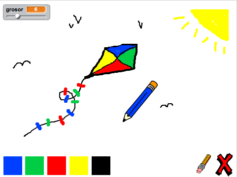
</div>

# Paso 1: Crear un lápiz { .activity }

Empezaremos por crear un lápiz, que puedes usar para dibujar en el escenario.

## Lista de tareas de la actividad { .check }

+ Empieza un nuevo proyecto de Scratch, y borra el objeto gato para que tu proyecto esté vacío. Puedes encontrar el editor de Scratch en línea en <a href="http://jumpto.cc/scratch-new">jumpto.cc/scratch-new</a>.

+ Añade el objeto lápiz a tu proyecto.

	

+ Haz clic en “Disfraces”, y elimina el disfraz “pencil-b”.

	

+ Cámbiale el nombre al disfraz por “lápiz-azul”, y usa la herramienta “Colorear una forma” para hacer que el lápiz sea azul.

	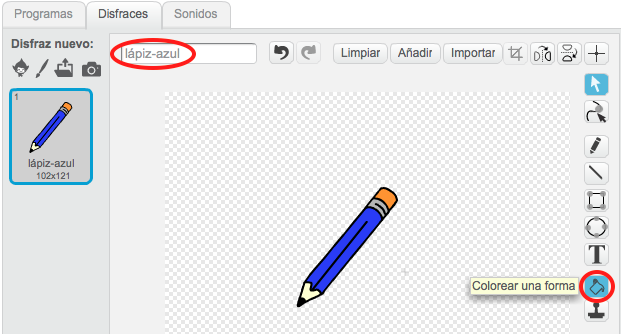

+ Como vas a usar el ratón para dibujar, querrás que tu lápiz siga al ratón “por siempre” {.blockcontrol}. Añade este código a tu objeto lápiz:

	```blocks
		al presionar bandera verde
		por siempre
		  ir a [puntero del ratón v]
		fin
	```

+ Prueba el código haciendo clic en la bandera y luego moviendo el ratón por el escenario. ¿Funciona como esperabas?

+ ¿Te has dado cuenta de que es el centro del lápiz y no la punta, lo que sigue al puntero del ratón?

	

	Para arreglar esto, haz clic en el disfraz “lápiz-azul” del objeto lápiz, y haz clic en Fijar el centro del disfraz”.

	

+ Deberías de ver una cruz que aparece en el disfraz. Ahora haz clic justo debajo de la punta del lápiz, para fijar este punto como el centro del disfraz.

	

+ Haz clic en la pestaña “Programas”, y luego prueba tu lápiz una vez más. ¿Funciona mejor que antes?

+ Ahora haremos que el lápiz dibuje `si` {.blockcontrol} hacemos clic en el ratón. Añade este código al objeto lápiz:

	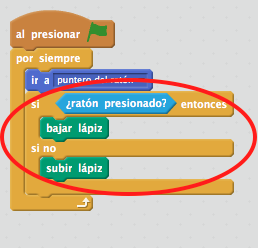

+ Prueba tu código una vez más. Esta vez, mueve el lápiz por el escenario y mantén apretado el botón del ratón. ¿Puedes dibujar con el lápiz?

	

## Guarda tu proyecto { .save }

# Paso 2: Lápices de colores { .activity }

¡Vamos a añadir lápices de colores diferentes a tu proyecto, y vamos a hacer que el usuario pueda elegir entre ellos!

## Lista de tareas de la actividad { .check }

+ Haz clic en el objeto lápiz, haz clic en “Disfraces” y duplica el disfraz “lápiz-azul”.

	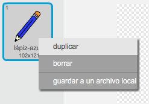

+ Renombra el nuevo disfraz “lápiz-verde”, y pinta el lápiz de color verde.

	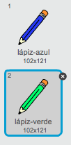

+ Crea dos objetos nuevos, que usarás para seleccionar el lápiz azul o el verde.

	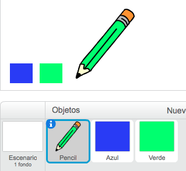

+ Al hacer clic en el selector verde, necesitas `enviar` {.blockevents} un mensaje al objeto lápiz, diciéndole que tiene que cambiar su disfraz y color de lápiz.

	Para hacer esto, primero añade este código al objeto selector verde:

	```blocks
		al hacer clic en este objeto
		enviar [Verde v]
	```

	Para crear el bloque `enviar` {.blockevents}, haz clic en la flecha hacia abajo y selecciona “nuevo mensaje…”.

	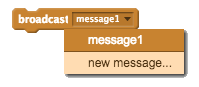

	Luego puedes escribir “Verde” para crear tu nuevo mensaje.

	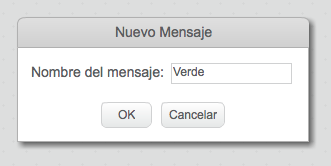

+ Ahora necesitas decirle a tu objeto lápiz qué tiene que hacer cuando recibe el mensaje. Añade este código al objeto lápiz:

	```blocks
		al recibir [Verde v]
		cambiar disfraz a [lápiz-verde v]
		fijar color de lápiz a [#00ff00]
	```

	Para hacer que el lápiz pinte de color verde, haz clic en el recuadro de color del bloque `fijar color` {.blockpen}, y haz clic en el icono selector verde para escoger el verde como el color para tu lápiz.

+ Ahora puedes hacer lo mismo para el lápiz azul, añadiendo este código al objeto selector azul:

	```blocks
		al hacer clic en este objeto
		enviar [Azul v]
	```

	...y añade este código al objeto lápiz:

	```blocks
		al recibir [Azul v]
		cambiar disfraz a [lápiz-azul v]
		fijar color de lápiz a [#0000ff]
	```

+ Por último, necesitas decirle al objeto lápiz qué disfraz y color de lápiz elegir, y limpiar la pantalla cuando empieza tu proyecto. Añade este código al objeto lápiz, al principio del código {.blockevents} `al presionar bandera verde`  (antes del bucle `por siempre` {.blockcontrol}):

	```blocks
		borrar
		cambiar disfraz a [lápiz-azul v]
		fijar color de lápiz a [#0000ff]
	```

	Si lo prefieres, ¡puedes empezar con un color de lápiz diferente!

+ Prueba tu proyecto. ¿Puedes cambiar entre los lápices azul y verde?

	

## Guarda tu proyecto { .save }

# Paso 3: Cometer errores { .activity .new-page }

¡A veces se comenten errores, asi que vamos a añadir un botón de “limpiar” y una goma a nuestro proyecto!

## Lista de tareas de la actividad { .check }

+ Vamos a añadir un botón para limpiar el escenario. Para hacer esto, añade el objeto de la letra 'X-block' al escenario, y píntalo de rojo.

	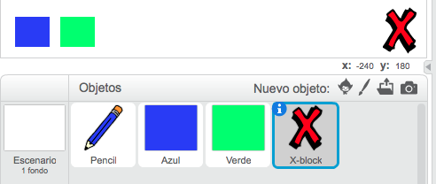

+ Añade este código a tu nuevo botón de cancelar para limpiar el escenario al presionarlo.

	```blocks
		al hacer clic en este objeto
		borrar
	```

	¡Fíjate que no necesitas enviar un mensaje para limpiar el escenario, ya que cualquier objeto puede hacerlo!

+ También puedes crear un borrador. Si el líder del club te ha dado una carpeta de “Recursos”, haz clic en “Cargar disfraz desde archivo” y añade la imagen “eraser.svg”.

	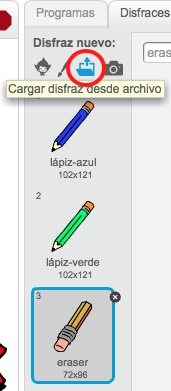

	¡Si no tienes la imagen eraser.svg, crea en su lugar un nuevo lápiz blanco!

+ También deberías añadir la imagen del borrador como un nuevo objeto selector. Tu escenario debería de parecerse a éste:

	

+ A continuación puedes añadir este código al objeto selector borrador, para decirle al lápiz que se convierta en borrador.

	```blocks
		al hacer clic en este objeto
		enviar [borrador v]
	```

+ ¡Cuando el lápiz recibe este mensaje, puedes crear un borrador haciendo que se cambie el disfraz del lápiz al de borrador, y cambiando el color del lápiz al mismo color del escenario!

	```blocks
		al recibir [borrador v]
		cambiar disfraz a [borrador v]
		fijar color de lápiz a [#FFFFFF]
	```

+ Prueba tu proyecto para ver si puedes limpiar y borrar en el escenario.

	

+ Hay otro problema con el lápiz – puedes dibujar en cualquier parte del escenario, ¡incluso cerca de los íconos selectores!

	

	Para arreglar esto, tienes que decir al lápiz que sólo dibuje si se hace clic en el ratón _y_ si la posición y del ratón es mayor a -110 (`mouse y`{.blocksensing}`> -120` {.blockoperators}). Cambia la instrucción `si` {.blockcontrol} de tu lápiz para que sea como ésta:

	

+ Prueba tu proyecto. Ahora no deberías poder dibujar cerca de los bloques selectores.

	

## Guarda tu proyecto { .save }

# Paso 4: Cambiar el grosor del lápiz { .activity .new-page }

Vamos a hacer que el usuario pueda dibujar utilizando diferentes tamaños de lápices.

## Lista de tareas de la actividad { .check }

+ Primero, añade una nueva variable que se llame "grosor". Si no recuerdas cómo hacerlo, el Proyecto “Globos” te puede ayudar.

+ Añade esta línea _dentro_ del bucle de código `por siempre` {.blockcontrol} de tu lápiz:

	```blocks
		fijar tamaño de lápiz a (grosor)
	```

	Ahora el grosor de tu lápiz se fijará repetidamente al valor de la variable “grosor”.

+ Puedes cambiar el valor guardado en esta variable haciendo clic con el botón derecho sobre la variable (en el escenario) y seleccionando “deslizador”.

	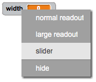

	Ahora puedes arrastrar el deslizador que hay debajo de la variable para cambiar su valor.

	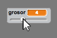

+ Prueba tu proyecto, y comprueba si puedes modificar el grosor de tu lápiz.

	

	Si lo prefieres, puedes fijar el valor mínimo y máximo del “grosor” permitido. Para hacerlo, haz clic de nuevo con el botón derecho sobre la variable y selecciona “fijar rango del deslizador”. Fija los valores mínimos y máximos de tu variable a algo un poco más coherente, como 1 y 20.

	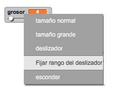

	Sigue probando tu variable “grosor” hasta que estés conforme.

## Guarda tu proyecto { .save }

## Desafío: Accesos directos { .challenge }
¿Puedes crear accesos directos en el teclado para tus comandos? Por ejemplo:

+ a = Cambiar al lápiz azul
+ v = cambiar al lápiz verde
+ b = cambiar al borrador
+ l = limpiar pantalla

¡Incluso podrías hacer que el usuario pudiese cambiar el ancho del lápiz con las teclas de flechas!

## Guarda tu proyecto { .save }

## Desafío: Más lápices { .challenge }
¿Puedes añadir lápices de color rojo, amarillo y negro a tu programa para pintar? Encontrarás todas las imágenes que necesitas en la carpeta “Recursos”. ¡Recuerda añadir los accesos directos en el teclado para estos nuevos lápices!

¿Puedes usar tus lápices para hacer un dibujo?


## Community Contributed Translation { .challenge .pdf-hidden }

This project was translated by María Alejandra Aguada from Translators Without Borders. Screenshots in Spanish were provided by Montse Verdaguer. Our amazing translation volunteers help us give children around the world the chance to learn to code.  You can help us reach more children by translating a Code Club project via [Github](https://github.com/CodeClub/curriculum_documentation/blob/master/contributing.md) or by getting in touch with us at hello@codeclubworld.
