---
title: Banda de Rock
level: Scratch 1
language: es-ES
stylesheet: scratch
embeds: "*.png"
materials: ["Recursos para el líder del Club/*.*"]
...

# Introducción { .intro }

¡En este Proyecto aprenderás cómo codificar tus propios instrumentos musicales!

<div class="scratch-preview">
  <iframe allowtransparency="true" width="485" height="402" src="http://scratch.mit.edu/projects/embed/26741186/?autostart=false" frameborder="0"></iframe>
  
</div>

# Primer paso: Objetos { .activity }

Antes de poder comenzar a animar, necesitas agregar “algo” que animar. En Scratch, estas “cosas” se llaman__objetos__. 

## Lista de verificación de actividades { .check }

+ Primero, abre el editor de Scratch. Puedes encontrar el editor en línea de Scratch editor en <a href="http://jumpto.cc/scratch-new">jumpto.cc/scratch-new</a>. Se ve así:

	

+ El objeto gato que puedes ver es la mascota de Scratch. Deshagámosnos de él haciendo clic en el botón derecho y luego haciendo clic en “eliminar”.

	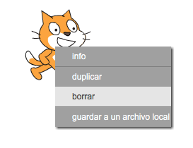

+ Luego, haz clic en “Elegir objeto de la biblioteca” para abrir una lista de todos los objetos de Scratch.

	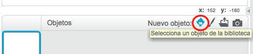

+ Baja hasta encontrar un objeto de un tambor. Haz clic en un tambor, y haz clic en “OK” para agregarlo a tu proyecto.

	

+ Haz clic en el ícono “encoger”, y luego haz clic en el tambor unas cuantas veces para hacerlo más pequeño.

	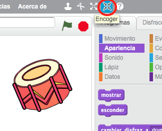

## Guarda tu proyecto { .save }

Asigna un nombre a tu proyecto ingresándolo en la casilla de texto arriba del escenario.

Después puedes hacer clic en “Archivo” y luego “Guardar ahora” para guardar tu proyecto.

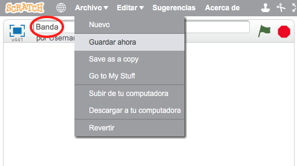

# Segundo paso: El Escenario { .activity }

El __escenario__ es el área a la izquierda, y es donde tu proyecto cobra vida. Imagínate que es el área donde se hace la presentación, ¡como en un escenario real!

## Lista de verificación de actividades { .check }

+ ¡En estos momentos, el escenario es de color blanco y se ve bastante aburrido! Agreguemos un fondo al escenario haciendo clic en “Elegir fondo de la biblioteca”.

	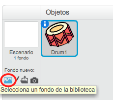

+ Haz clic en “Interiores” en la izquierda y luego haz clic en un fondo de escenario y luego clic en “OK”.

	

+ Ahora tu escenario debería verse así:

	

# Tercer paso: Cómo crear un tambor { .activity }

Codifiquemos tu tambor para que pueda sonar cuando se lo toca.

## Lista de verificación de actividades { .check }

+ Puedes encontrar los bloques de código en la lengüeta “Secuencias de comandos” ¡y todas tienen códigos de color! 

	Haz clic en el objeto tambor y luego arrastra estos 2 bloques al área de código a la derecha, asegurándote de que estén conectados juntos (como los bloques de lego):

	

+ ¡Haz clic en el tambor para probar tu nuevo instrumento!

+ También puedes cambiar cómo se ve tu tambor cuando le hacen clic, creando un nuevo disfraz. Haz clic en la lengüeta “Disfraces”, y verás la imagen del tambor.

	

+ Haz clic con el botón derecho en el disfraz y haz clic en “duplicar” para crear una copia del disfraz.

	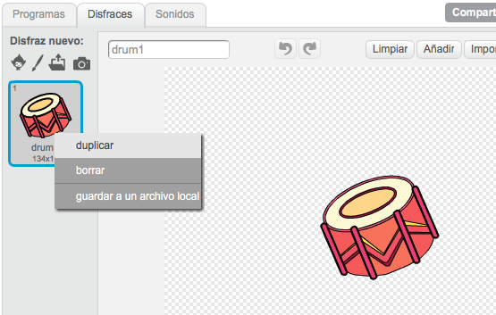

+ Haz clic en el nuevo disfraz (que se llama “tambor 2”) y luego selecciona la herramienta de línea y dibuja líneas para que se vea como que el tambor está produciendo sonidos.

	

+ En este momento los nombres de los disfraces no son muy útiles. Renombra los 2 disfraces a “sin tocar” y “tocado” ingresando el nuevo nombre para cada disfraz en la caja de texto.

	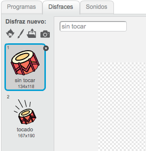

+ ¡Ahora que ya tienes 2 disfraces diferentes para tu tambor, puedes elegir qué disfraz desplegar! Agrega estos 2 bloques a tu tambor:

	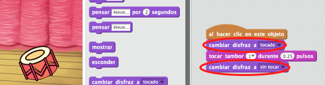

	El bloque de código para cambiar el disfraz está en la sección “Vistas” {.blocklooks}.

+ Prueba tu tambor. ¡Cuando haces clic en el tambor, debería verse como que está siendo tocado!

## Guarda tu proyecto { .save }

##Desafío: Mejora tu tambor { .challenge }

+ ¿Puedes cambiar el sonido que hace tu tambor cuando se le hace clic? 

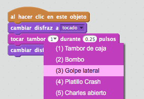

+ ¿Puedes también hacer que el tambor haga un sonido cuando se presiona la barra espaciadora? Necesitarás utilizar este bloque “evento” {.blockevents}:

```blocks
	al presionar tecla [espacio v] 
```

Puedes copiar tu código existente haciendo clic en el código con el botón derecho y haciendo clic en “duplicar”.

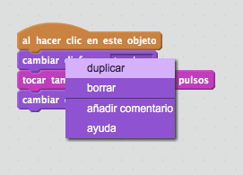

## Guarda tu proyecto { .save }

# Cuarto paso: Crear un cantante { .activity .new-page }

¡Agreguemos un cantante a tu banda!

## Lista de verificación de actividades { .check }

+ Agrega otros 2 objetos a tu escenario; un cantante y un micrófono.

	

+ Antes de que puedas hacer que tu cantante cante, necesitarás agregar un sonido a tu objeto. Asegúrate de haber seleccionado tu cantante, y luego haz clic en la lengüeta “Sonidos” y haz clic en “Elegir sonido de la biblioteca”:

	

+ Si haces clic en “Voces” en el lado izquierdo, podrás elegir sonidos apropiados para agregar a tu objeto.

	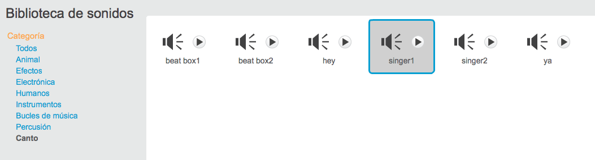

+ Ahora que has agregado el sonido, puedes agregar este código a tu cantante:

	```blocks
		al hacer clic en este objeto
		Tocar sonido [singer1 v] y esperar
	```

+ Haz clic en tu cantante, para asegurarte de que cante cuando le haces clic.

## Guarda tu proyecto { .save }

##Desafío: Cómo cambiar el disfraz de tu cantante { .challenge }
¿Puedes hacer que tu cantante se vea como que está cantando cuando le haces clic? Si necesitas ayuda, puedes usar las instrucciones anteriores para crear un tambor.


¡No olvides probar que tu nuevo código funciona!

## Guarda tu proyecto { .save }

##Desafío: Crea tu propia banda { .challenge }
¡Usa lo que aprendiste en este proyecto para crear tu propia banda! Puedes crear cualquier instrumento que desees, pero fíjate en los sonidos disponibles y en los instrumentos para tener algunas ideas.

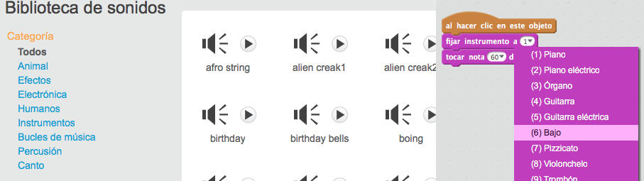

Sin embargo, tus instrumentos no tienen que ser sensibles. Puedes, por ejemplo, crear un piano hecho de muffins!


Puedes usar los objetos existentes y al mismo tiempo dibujar los tuyos propios.

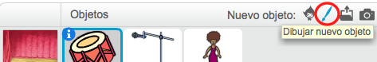

¡Si tienes un micrófono puedes grabar tus propios sonidos, o incluso usar una cámara web para tocar los instrumentos! 


## Guarda tu proyecto { .save }

## Community Contributed Translation { .challenge .pdf-hidden }

This project was translated by María Alejandra Aguada from Translators Without Borders. Our amazing translation volunteers help us give children around the world the chance to learn to code.  You can help us reach more children by translating a Code Club project via [Github](https://github.com/CodeClub/curriculum_documentation/blob/master/contributing.md) or by getting in touch with us at hello@codeclubworld.