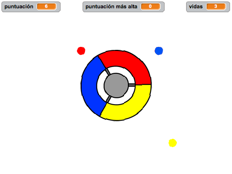
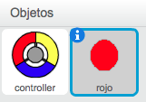
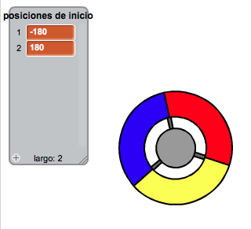

---
title: Atrapa los puntos
level: Scratch 2
language: es-ES
stylesheet: scratch
embeds: "*.png"
materials: ["Recursos para el líder del Club/*", "Recursos del Proyecto/*"]
beta: true
...

# Introducción { .intro }

En este proyecto vas a aprender a crear un juego en el que tendrás que hacer coincidir puntos de colores con la parte correcta del controlador.

<div class="scratch-preview">
  <iframe allowtransparency="true" width="485" height="402" src="http://scratch.mit.edu/projects/embed/44942820/?autostart=false" frameborder="0"></iframe>
  
</div>

# Paso 1: Crear un controlador { .activity }

Empezaremos por crear un controlador, que usaremos para recoger los puntos.

## Lista de tareas de la actividad { .check }

+ Empieza un nuevo proyecto de Scratch, y elimina el objeto gato para que el proyecto esté vacío. Puedes encontrar el editor en línea de Scratch en <a href="http://jumpto.cc/scratch-new">jumpto.cc/scratch-new</a>.

+ Si el líder de tu club te ha dado una carpeta de 'Recursos', haz clic en 'Cargar objeto desde archivo' y añade la imagen 'controller.svg'. Tendrás que mover el objeto al centro del escenario.

	
	
	Si no tienes esta imagen, ¡puedes dibujarla tú!
	
+ Haz que el controlador gire hacia la derecha cuando presiones la tecla de flecha derecha:

	```blocks
		al presionar bandera verde
		por siempre
   			si <¿tecla [flecha derecha v] presionada?> entonces
      			girar ↻ (3) grados
   			fin
		fin
	```
+ Prueba tu controlador. Debería girar hacia la derecha.

## Guarda tu proyecto { .save }

## Desafío: Girar hacia la izquierda {.challenge}
¿Puedes hacer que el controlador gire hacia la izquierda cuando se presione la tecla de flecha izquierda?

## Guarda tu proyecto { .save }

# Paso 2: Recoger puntos { .activity }

Vamos a añadir algunos puntos que el jugador tendrá que recoger con el controlador.

## Lista de tareas de la actividad { .check }

+ Crea un nuevo objeto llamado 'rojo'. Este objeto debería ser un pequeño punto rojo.

	

+ Añade estas instrucciones al objeto punto 'rojo', para que se cree un nuevo clon del punto cada determinados segundos:

	```blocks
		al presionar bandera verde
		esperar (2) segundos
		por siempre
   			crear clon de [mí mismo v]
   			esperar (número al azar entre (5) y (10)) segundos
		fin
	```

+ Cuando se crea un clon, queremos que aparezca en una de las 4 esquinas del escenario.

	

	Para hacer esto, primero tendrás que crear una nueva lista llamada `posiciones de inicio` {.blockdata} y hacer clic en `(+)` para añadir los valores `-180` y `180`.

	

+ Puedes usar estos dos elementos de la lista para escoger una esquina del escenario al azar. Añade este código al objeto 'punto', para que todos los nuevos clones vayan a una esquina al azar y a continuación se muevan lentamente hacia el controlador.

	```blocks
		al comenzar como clon
		ir a x:(elemento (al azar v) de [posiciones de inicio v]) y:(elemento (al azar v) de [posiciones de inicio v])
		apuntar hacia [controller v]
		mostrar
		repetir hasta que <¿tocando [controller v]?>
   			mover (1) pasos
		fin
	```

	Este código escoge `-180` o bien `180` para las posiciones x _e_ y, lo que significa que todos los clones empezarán en una de las esquinas del escenario.

+ Prueba tu proyecto. Deberías de ver cómo aparecen un montón de puntos rojos en cada una de las esquinas del escenario y se mueven lentamente hacia el controlador.

	

+ Crea 2 nuevas variables con los nombres `vidas` {.blockdata} y `puntuación` {.blockdata}.

+ Añade código al escenario para fijar las `vidas` {.blockdata} a 3 y la `puntuación` {.blockdata} a 0 cuando empieza el juego.

+ Tendrás que añadir instrucciones al final del código del punto rojo `al comenzar como clon` {.blockcontrol}, para que o se sume 1 a la `puntuación` {.blockdata} del jugador si los colores coinciden, o se reste 1 de las `vidas` {.blockdata} del jugador si los colores no coinciden.

	```blocks
		mover (5) pasos
		si <¿tocando el color [#FF0000]?> entonces
   			cambiar [puntuación v] por (1)
   			tocar sonido [pop v]
		si no
   			cambiar [vidas v] por (-1)
   			tocar sonido [laser1 v]
		fin
		borrar este clon
	```

+ Añade este código al final de las instrucciones del escenario, para que el juego termine cuando el jugador pierda todas las vidas:

	```blocks
		esperar hasta que <(vidas) < [1]>
		detener [todos v]
	```

+ Prueba tu juego para asegurarte de que el código funciona correctamente.

## Guarda tu proyecto { .save }

## Desafío: Más puntos {.challenge}
Duplica el punto 'rojo' dos veces, y llama a los dos nuevos objetos 'amarillo' y 'azul'.


Edita estos objetos (incluido el código), para que el color de cada uno de los puntos tenga que coincidir con el color correcto del controlador. Recuerda probar el proyecto, y comprueba si consigues puntos y pierdes vidas cuando corresponde, ¡y que el juego no sea demasiado fácil ni difícil!


## Guarda tu proyecto { .save }

# Paso 3: Aumentar la dificultad { .activity .new-page}

Vamos a hacer que el juego sea más difícil cuanto más tiempo consiga sobrevivir el jugador, reduciendo lentamente el intervalo entre los puntos que aparecen.

## Lista de tareas de la actividad { .check }

+ Crea una nueva variable con el nombre `intervalo` {.blockdata}.

+ En el escenario, crea nuevo código que fije el intervalo en un número alto, y que lentamente vaya reduciendo el valor del intervalo.

	```blocks
		al presionar bandera verde
		fijar [intervalo v] a (8)
		repetir hasta que <(intervalo) = (2)>
   			esperar (10) segundos
   			cambiar [intervalo v] por (-0.5)
		fin
	```

	¡Fíjate que esto es muy parecido a cómo funciona un cronómetro en el juego!

+ Para acabar, puedes utilizar la variable `intervalo` {.blockdata} en el código de tus puntos rojo, amarillo y azul. Elimina el código que espera un número al azar de segundos para crear clones, y sustitúyelo con tu nueva variable `intervalo` {.blockdata}:

	```blocks
		esperar (intervalo) segundos
	```

+ Prueba tu nueva variable `intervalo` {.blockdata}, y comprueba si el intervalo entre los puntos se reduce lentamente. ¿Funciona para los 3 puntos de colores? ¿Puedes ver cómo se reduce el valor de la variable `intervalo` {.blockdata}?

## Guarda tu proyecto { .save }

## Desafío: Puntos que se mueven más rápido {.challenge}
¿Puedes mejorar el juego añadiendo una variable de `velocidad` {.blockdata}, para que los puntos empiecen moviéndose 1 paso cada vez y progresivamente se muevan cada vez más rápido? Esto funcionará de una forma muy parecida a la variable de `intervalo` {.blockdata} que hemos usado arriba, y puedes utilizar ese código como ayuda.

## Guarda tu proyecto { .save }

# Paso 4: Puntuación más alta { .activity }

Vamos a guardar la puntuación más alta, para que los jugadores vean qué tal lo están haciendo.

## Lista de tareas de la actividad { .check }

+ Crea una nueva variable con el nombre `puntuación más alta` {.blockdata}.

+ Haz clic en el escenario, y crea un nuevo bloque personalizado que se llame `comprobar puntuación más alta` {.blockmoreblocks}.

	

+ Justo antes de que acabe el juego, añade tu nuevo bloque personalizado.

	

+ Añade código a tu bloque personalizado para guardar la `puntuación` {.blockdata} actual como la `puntuación más alta` {.blockdata} `si` {.blockcontrol} es la máxima puntuación hasta el momento:

	```blocks
		definir [comprobar puntuación más alta]
		si <(puntuación) > (puntuación más alta)> entonces
   			fijar [puntuación más alta v] a (puntuación)
		fin
	```

+ Prueba el código que has añadido. Juega para comprobar si la `puntuación más alta` {.blockdata} se actualiza correctamente.

## Guarda tu proyecto { .save }

## Desafío: ¡Mejora tu juego! {.challenge}
¿Se te ocurren maneras de mejorar tu juego? Por ejemplo, podrías crear puntos especiales que:

+ dupliquen tu puntuación;
+ reduzcan la velocidad de los puntos;
+ ¡hagan desaparecer al resto de puntos en la pantalla!

## Guarda tu proyecto { .save }

## Desafío: Menú del juego {.challenge}
¿Puedes añadir un menú (con botones) a tu juego? Podrías añadir una pantalla de instrucciones, o una pantalla aparte para mostrar la puntuación más alta. Si necesitas ayuda con esto, el proyecto 'Juego de cálculo mental' puede ser útil.
