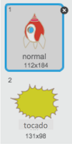
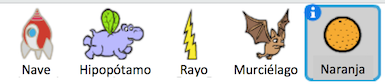

---
title: Guerras de Clones
level: Scratch 2
language: es-ES
stylesheet: scratch
embeds: "*.png"
materials: ["Club Leader Resources/*"]
beta: true
...

## Proyecto Contribución de la Comunidad { .challenge .pdf-hidden }
Este proyecto se creó con Erik. Si desea contribuir con un proyecto propio, entonces [póngase en contacto con nosotros en Github](https://github.com/CodeClub).

# Introducción { .intro }

En este proyecto aprenderás cómo crear un juego en el que tienes que salvar a la Tierra de los monstruos espaciales.

<div class="scratch-preview">
  <iframe allowtransparency="true" width="485" height="402" src="http://scratch.mit.edu/projects/embed/46018140/?autostart=false" frameborder="0"></iframe>
  
</div>

# Paso 1: Construir la nave espacial { .activity }

¡Vamos a hacer una nave espacial que va a defender la Tierra!

## Lista de actividades { .check }

+ Iniciar un nuevo proyecto Scratch y eliminar el objeto del gato para que el proyecto esté vacío. Puedes encontrar el editor de Scratch en línea en  <a href="http://jumpto.cc/scratch-new">jumpto.cc/scratch-new</a>.

+ Añadir el fondo de 'estrellas' y el gráfico de la 'nave espacial' al proyecto. Reducir la nave espacial y moverla cerca de la parte inferior de la pantalla.

	

+ Añadir código para mover la nave espacial a la izquierda cuando se pulse la tecla de flecha izquierda. Tendrás que utilizar estos bloques:

	```blocks

        al presionar bandera verde
        por siempre
           si <¿tecla [flecha izquierda v] presionada?> entonces
                cambiar x por (-4)
           fin
        fin
```

+ Añadir código para mover la nave espacial a la derecha cuando se pulsa la tecla de flecha derecha.

+ Probar el proyecto para ver si se puede controlar la nave con las teclas de flecha.

## Guardar el proyecto { .save }

# Paso 2: Rayos { .activity }

¡Vamos a darle la nave espacial de la capacidad de disparar rayos!

## Lista de actividades { .check }

+ Añadir el objeto del 'rayo' de la biblioteca Scratch. Haga clic en el disfraz del objeto y girar el rayo hasta ponerlo del revés.

	

+ Cuando se inicia el juego, los rayos deben estar ocultos hasta que la nave espacial dispare sus cañones láser.

	```blocks
		al presionar bandera verde
		esconder
	```

+ Añadir el siguiente código ** a la nave espacial ** para crear un nuevo rayo cada vez que se pulsa la tecla de espacio.


	```blocks
		al presionar bandera verde
		por siempre
			si <¿tecla [espacio v] presionada?> entonces
				crear clon de [Rayo v]
			fin
		fin
	```

+ Siempre que se crea un nuevo clon, debe comenzar en el mismo lugar que la nave espacial, y luego subir por el escenario hasta que toque el borde. Agregar el siguiente código ** al objeto Relámpago **:

	```blocks
		al comenzar como clon
		ir a [Nave v]
		mostrar
		repetir hasta que <¿tocando [borde v] ?>
			cambiar y por (10)
		fin
		borrar este clon
	```

Nota: Movemos el nuevo clon de la nave espacial, mientras que todavía está oculto, antes de mostrarlo. Así se ve mejor.

+ Pon a prueba tu rayo, pulsando la tecla de espacio.

## Guardar el proyecto { .save }

## Reto: Fijar el rayo {.challenge}
¿Qué sucede si se mantiene la tecla de espacio pulsada? ¿Se puede utilizar un bloque `esperar` {.blockcontrol} para fijarlo?

## Guardar el proyecto { .save }

# Paso 3: Hipopótamos espaciales voladores { .activity }

Vamos a añadir un montón de hipopótamos voladores que están tratando de destruir la nave espacial.

## Lista de actividades { .check }

+ Crear un objeto nuevo desde la imagen 'hippo1' en la biblioteca Scratch

	

+ Establecer su estilo de rotación para girar a la derecha solamente, y agregar el siguiente código para ocultar el objeto cuando se inicia el juego:

	```blocks
		al presionar bandera verde
		esconder
	```

+ Crear una nueva variable llamada `velocidad` {.blockdata} para el objeto hipopótamo solamente.

	

	Se sabrá si se ha hecho esto correctamente porque la variable tendrá el nombre del objeto al lado de él, como este:

	

+ El siguiente código creará un nuevo hipopótamo cada pocos segundos. ** La Etapa ** es un buen lugar para este código para vivir:

	```blocks
		al presionar bandera verde
		por siempre
			esperar (número al azar entre (2) y (4)) segundos
			crear clon de [Hippo1 v]
		fin
	```

+ Cuando se inicia cada clon hipopótamo, moverlo por el escenario (a una velocidad aleatoria) hasta que sea golpeado por el rayo. Añadir este código ** para el objeto hipopótamo ** :

	```blocks
		al comenzar como clon
		fijar [velocidad v] to (numero al azar entre (2) y (4))
		ir a x: (numero al azar entre (-220) y (220)) y: (150)
		mostrar
		repetir hasta que <¿tocando [lightning v] ?>
			mover (velocidad) pasos
			girar ↻ (número al azar entre (-10) y (10)) grados
			rebotar si toca un borde
		fin
		borrar este clon
	```

+ Probar el código hipopótamo. Se debe ver un nuevo clon hipopótamo que aparece cada pocos segundos. Cada uno se mueve a su propio ritmo.

	

+ Pon a prueba tu cañón láser. Si te aciertas sobre un hipopótamo, ¿se desvanece?

+ Cuando un hipopótamo toca tu nave espacial, ¡tenemos que hacer que la nave espacial explote! Para ello, primero hay que asegurarse de que la nave espacial tiene 2 disfraces llamados 'normal' y 'tocado'.

	

	El disfraz 'tocado' de la nave espacial se puede hacer mediante la importación de la imagen 'Sol' de la biblioteca Scratch, y el uso de la herramienta 'Colorear una forma', para cambiar su color.

	

+ Añadir este código a la nave espacial para que se cambie de disfraz cada vez que choca con un hipopótamo volador:

	```blocks
		al presionar bandera
		por siempre
			cambiar disfraz a [normal v]
			esperar hasta que <¿tocando [Hippo1 v]?>
			cambiar disfraz a [tocado v]
			enviar [hit v]
			esperar (1) segundos
		fin
	```

+ ¿Te diste cuenta de que ha transmitido un mensaje de 'tocado' en el código anterior? Se puede utilizar este mensaje para hacer que todos los hipopótamos desaparecen cuando se alcance la nave espacial.

	Añadir este código al hipopótamo:

	```blocks
		al recibir [hit v]
		borrar este clon
	```

+ Probar este código al iniciar un nuevo juego y chocar con un hipopótamo. 

	

## Guardar el proyecto { .save }

## Reto: Vidas y Puntuación {.challenge}
¿Se pueden añadir `vidas` {.blockdata}, `puntuación` {.blockdata} o incluso un `record` {.blockdata} a tu juego? Utilizar como ayuda el proyecto "Catch the Dots".

## Guardar el proyecto { .save }

# Step 4: ¡Murciélagos de la fruta! { .activity }

Vamos a hacer un murciélago de la fruta que lanza naranjas a su nave espacial.

## Lista de actividades { .check }

+ En primer lugar, hacer un nuevo objeto murciélago que se `moverá` {.blockmotion} en la parte superior del escenario `por siempre` {.blockcontrol}. Recuerda probar el código.

	

+ Si nos fijamos en los disfraces del murciélago, verás que ya cuenta con 2:

	

	Utilizar el bloque `siguiente disfraz` {.blocklooks} para hacer que el murciélago mueva las alas mientras se mueve.

+ Crear un nuevo objeto 'Naranja' de la biblioteca de Scratch

	


+ Añadir código al murciélago, de manera que se crea un nuevo clon de naranja cada pocos segundos.

	```blocks
		al presionar bandera
		por siempre
			esperar (numero al azar entre (5) y (10)) segundos
			crear clon de [Naranja v]
		fin
	```

+ Haga clic en el objeto naranja. Añadir este código para que cada clon de naranja caiga por el escenario desde el murciélago hacia la nave espacial:

	```blocks
		al presionar bandera
		esconder

		al comenzar como clon
		ir a [Bat1 v]
		mostrar
		repetir hasta que <¿tocando [borde v]?>
			cambiar y por (-4)
		fin
		borrar este clon

		al recibir [tocado v]
		borrar este clon
	```

+ En el objeto nave espacial, modificar el código para que se destruya si se toca un hipopótamo o un naranja:

	```blocks
		esperar hasta que < ¿<tocando [Hippo1 v]?> o ¿<tocando [Naranja v]?>>
	``` 

+ Probar el juego. ¿Qué sucede si es golpeado por una caída de naranja?

## Guardar el proyecto { .save }

# Paso 5: Fin del Juego{ .activity }

Vamos a añadir un mensaje "Fin del Juego" al final del juego.

## Lista de actividades { .check }

+ Si no lo has hecho, crea una nueva variable llamada `vidas` {.blockdata}. La nave espacial debe comenzar con 3 vidas y perder una vida cada vez que choca con un enemigo. El juego debe parar también cuando te quedas sin vidas. Si necesitas ayuda, puedes utilizar el proyecto "Catch the Dots".

+ Dibuja un nuevo objeto llamado 'Fin del Juego', utilizando la herramienta de texto.

	

+ En el escenario, mostrar un mensaje `Fin del juego` {.blockevents} justo antes de que el juego termine.

	```blocks
		enviar [Fin del juego v] y esperar
	```

+ Añadir este código al objeto 'Fin del juego', para que el mensaje se muestre al final del juego:

	```blocks
		al presionar bandera
		esconder

		al recibir [Fin del juego v]
		mostrar
	```

	Como has usado un bloque `enviar [fin del juego] y esperar` {.blockevents}, se esperará a que el objeto de 'Fin del juego' se muestre antes de terminar el juego.

+ Probar el juego. ¿Cuántos puntos se pueden anotar? ¿Puedes pensar en maneras de mejorar su juego si es demasiado fácil o demasiado difícil?

## Guardar el proyecto { .save }

## Reto: Mejorar el juego {.challenge}
¿Qué mejoras se pueden hacer al juego? Aquí algunas ideas:
+ Añadir paquetes de salud que se pueden recoger para ganar vidas extra;


+ Añadir asteroides que tu nave espacial debe evitar;
	


+ Hacer más enemigos aparecen cuando su puntación llega a 100.

```blocks
	esperar hasta que <(puntuación) = [100]>
```

## Guardar el proyecto { .save }