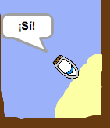
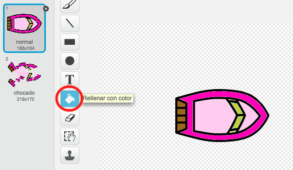

# Introducción { .intro }

Vas a aprender cómo crear un juego en el que usarás el ratón para navegar con tu barco hasta una isla desierta.

<div class="scratch-preview">
  <iframe allowtransparency="true" width="485" height="402" src="https://scratch.mit.edu/projects/embed/63957956/?autostart=false" frameborder="0"></iframe>
  
</div>

# Paso 1: Cómo planificar el juego { .activity }

## Lista de tareas de la actividad { .check }

+ Crea un nuevo proyecto de Scratch, y elimina el objeto gato para que tu proyecto esté vacío. Puedes encontrar el editor en línea de Scratch en <a href="http://jumpto.cc/scratch-new">jumpto.cc/scratch-new</a>.

+ Haz clic en el fondo de tu escenario y planifica tu nivel. Deberías añadir:
	+ Madera que tu barco tiene que evitar;
	+ Una isla desierta a la que tu barco tiene que llegar.

	Tu juego podría parecerse a éste:

	

# Paso 2: Cómo controlar el barco { .activity }

## Lista de tareas de la actividad { .check }

+ Si el líder de tu club te ha dado una carpeta de 'Recursos', haz clic en 'Cargar objeto desde archivo' y añade la imagen 'boat.png'. Deberías encoger el objeto y colocarlo en la posición de inicio.

	

	Si no tienes la imagen boat.png, ¡puedes dibujar tu propio barco!

+ Para poder controlar el barco con el ratón, añade este código al barco:

	```blocks
		al presionar bandera verde
		apuntar en dirección (0 v)
		ir a x: (-190) y: (-150)
		por siempre
			apuntar hacia [puntero del ratón v]
			mover (1) pasos
		fin
	```

+ Prueba tu barco haciendo clic en la bandera y moviendo el ratón. ¿Navega el barco hacia el ratón?

	

+ ¿Qué ocurre si el barco llega al puntero del ratón?

	Para que esto no suceda, necesitarás añadir un bloque 'si'{.blockcontrol} a tu código, para que el barco sólo se mueva si está a más de 5 píxeles del ratón.

	

+ Prueba tu barco una vez más para ver si se ha solucionado el problema.

## Guarda tu proyecto { .save }

# Paso 3: ¡Choques! { .activity .new-page }

¡Tu barco puede navegar a través de las barreras de madera! Vamos a arreglar eso.

## Lista de tareas de la actividad { .check }

+ Necesitarás 2 disfraces para tu barco, uno normal y otro para cuando el barco choque. Duplica el disfraz de tu barco y llámalos 'normal' y 'chocado'.

+ Haz clic en el disfraz 'chocado', y elige la herramienta 'Seleccionar' para separar trocitos del barco y moverlos y rotarlos por todos lados. Haz que parezca que tu barco ha chocado.

	

+ Añade este código a tu barco, dentro del bucle `por siempre` {.blockcontrol}, para que choque cuando toque cualquier trozo de madera marrón:

	```blocks
	si <¿tocando el color [#603C15]?> entonces
   		cambiar disfraz a [chocado v]
   		decir [¡Noooooo!] por (1) segundos
   		cambiar disfraz a [normal v]
   		apuntar en dirección (0 v)
   		ir a x:(-215) y:(-160)
	fin
	```

	Este código está dentro del bucle `por siempre` {.blockcontrol}, para que tu código constantemente verifique si tu barco ha chocado.

+ También deberías asegurarte de que tu barco al principio siempre parezca 'normal'.

+ Ahora si intentas navegar a través de una barrera de madera, deberías ver cómo tu barco choca y vuelve al principio.

	

## Guarda tu proyecto { .save }

## Desafío: ¡Ganar! {.challenge}
¿Puedes añadir otra instrucción `si` {.blockcontrol} al código de tu barco, para que el jugador gane cuando llegue a la isla desierta?

Cuando el barco llegue a la isla desierta amarilla, debería decir '¡Sí!' y el juego debería terminar. Tendrás que usar este código:

```bloques
	decir [¡Sí!] por (1) segundos
	detener [todos v]
```



## Guarda tu proyecto { .save }

## Desafío: Efectos de sonido {.challenge}
¿Puedes añadir efectos de sonido a tu juego para cuando el barco choca y para cuando llega a la isla al final del juego? Incluso podrías añadir música de fondo (si necesitas ayuda con esto, consulta el proyecto anterior 'Banda de Rock').

## Guarda tu proyecto { .save }

# Paso 4: Prueba de tiempo { .activity }

Vamos a añadir un cronómetro a tu juego para que el jugador tenga que llegar a la isla lo más rápido posible.

## Lista de tareas de la actividad { .check }

+ Añade a tu escenario una nueva variable que se llame `tiempo` {.blockdata}. También puedes cambiar la visualización de tu nueva variable. Si necesitas ayuda, echa un vistazo al proyecto "Globos".

	

+ Añade este código a tu __escenario__, para que el cronómetro cuente hasta que el barco alcance la isla desierta:

	```blocks
		al presionar bandera verde
		fijar [tiempo v] a [0]
		por siempre
			esperar (0.1) segundos
			cambiar [tiempo v] por (0.1)
		fin
	```

+ ¡Ya lo tienes! ¡Prueba tu juego para ver cómo de rápido puedes llegar a la isla desierta!

	

## Guarda tu proyecto { .save }

# Paso 5: Obstáculos y fuentes de energía { .activity }

Este juego es _demasiado_ fácil – Vamos a añadir cosas para hacerlo más interesante.

## Lista de tareas de la actividad { .check }

+ Primero vamos a incluir algunos "propulsores" a tu juego, que harán que el barco navegue más rápido. Edita el fondo de tu escenario y añade algunas flechas blancas propulsoras.

	

+ A continuación puedes añadir código nuevo al bucle `por siempre` {.blockcontrol} de tu barco, para que avance 2 _pasos extra_ cada vez que toque un propulsor blanco.

	```blocks
	si <¿tocando el color [#FFFFFF]?> entonces
   		mover (3) pasos
	fin
	```

+ También puedes añadir una puerta giratoria, que tu barco tendrá que evitar. Añade un nuevo objeto con el nombre 'puerta', y que sea así:

	

	Asegúrate de que el color de la puerta sea el mismo que el color de las otras barreras de madera.

+ Fija el centro del objeto puerta.

	

+ Añade código a la puerta para hacer que gire lentamente `por siempre` {.blockcontrol}.

+ Prueba tu juego. Ahora deberías de tener una puerta giratoria que tienes que evitar.

	

## Guarda tu proyecto { .save }

## Desafío: ¡Más obstáculos! {.challenge .new-page}
¿Puedes añadir más obstáculos a tu juego? Aquí te damos algunas ideas:

+ Podrías añadir cieno verde a tu escenario, que haga que el jugador vaya más lento cuando lo toque. Para hacer esto, puedes usar un bloque `espera` {.blockcontrol}:

	```blocks
		esperar (0.01) segundos
	````


+ ¡Podrías añadir un objeto en movimiento, como un tronco o un tiburón!


Estos bloques pueden ayudarte:

	```blocks
		mover (1) pasos
		rebotar si toca un borde
	````

Si tu nuevo objeto no es marrón, tendrás que añadir lo siguiente al código de tu barco:

	```blocks
	si <<¿tocando el color [#603C15]?> o <¿tocando [tiburón v]?>> entonces
	fin
	```

## Guarda tu proyecto { .save }

## Desafío: ¡Más barcos! {.challenge .new-page}
¿Puedes convertir tu juego en una carrera entre 2 jugadores?

+ Duplica el barco, renómbralo 'Jugador 2' y cámbiale el color.



+ Cambia este código para modificar la posición de inicio del Jugador 2:

	```blocks
		ir a x: (-190) y: (-150)
	```

+ Elimina el código que usa el ratón para controlar el barco:

	```blocks
		si < (distancia a [puntero del ratón v]) > [5] > entonces
			apuntar hacia [puntero del ratón v]
			mover (1) pasos
		fin
	```

...y reemplázalo con código para controlar el barco usando las teclas de flechas.

Éste es el código que necesitarás para mover el barco hacia adelante:

	```blocks
		si <¿tecla [flecha arriba v] presionada?> entonces
   		mover (1) pasos
	fin
	```

También necesitarás un código para `girar` {.blockmotion} el barco cuando se presionen las teclas de flecha izquierda y derecha.

## Guarda tu proyecto { .save }

## Desafío: ¡Más niveles! {.challenge .new-page}
¿Puedes crear escenarios adicionales y permitir al jugador que elija entre niveles?

	```blocks
		al presionar tecla [espacio v]
		siguiente fondo
	```

## Guarda tu proyecto { .save }

## Community Contributed Translation { .challenge .pdf-hidden }

This project was translated by María Alejandra Aguada from Translators Without Borders. Screenshots in Spanish were provided by Montse Verdaguer. Our amazing translation volunteers help us give children around the world the chance to learn to code.  You can help us reach more children by translating a Code Club project via [Github](https://github.com/CodeClub/curriculum_documentation/blob/master/contributing.md) or by getting in touch with us at hello@codeclubworld.
