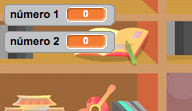
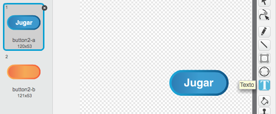
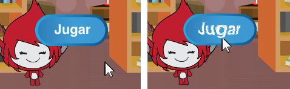
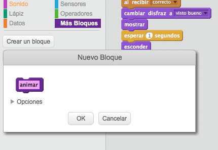
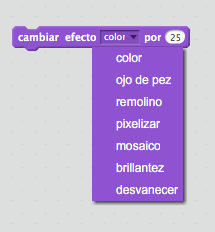

# Introducción { .intro }

En este proyecto vas a aprender a crear un juego de preguntas sobre las tablas de multiplicar, en el que tendrás que conseguir tantas respuestas correctas como puedas en 30 segundos.

<div class="scratch-preview">
  <iframe allowtransparency="true" width="485" height="402" src="https://scratch.mit.edu/projects/embed/42225768/?autostart=false" frameborder="0"></iframe>
  
</div>

# Paso 1: Crear las preguntas { .activity }

Empezaremos por crear preguntas aleatorias que el jugador tendrá que contestar.

## Lista de tareas de la actividad { .check }

+ Empieza un nuevo proyecto de Scratch y borra el objeto gato para que el proyecto esté vacío. Puedes encontrar el editor en línea de Scratch en <a href="http://jumpto.cc/scratch-new">jumpto.cc/scratch-new</a>.

+ Escoge un personaje y un fondo para tu juego. ¡Puedes escoger el que más te guste! Aquí tienes un ejemplo:

	

+ Crea 2 nuevas variables llamadas `número 1` {.blockdata} y `número 2` {.blockdata}. Estas variables almacenarán los 2 números que se van a multiplicar.

	

+ Añade código a tu personaje, para fijar estas dos variables a un número `aleatorio` {.blockoperators} entre 2 y 12.

	```blocks
		al presionar bandera verde
		fijar [número 1 v] a (número al azar entre (2) y (12))
		fijar [número 2 v] a (número al azar entre (2) y (12))
	```

+ A continuación puedes pedir al jugador que dé una respuesta, y decirle si es correcta o incorrecta.

	```blocks
		al presionar bandera verde
		fijar [número 1 v] a (número al azar entre (2) y (12))
		fijar [número 2 v] a (número al azar entre (2) y (12))
		preguntar (unir (número 1) (unir [x] (número 2))) y esperar
		si <(respuesta) = ((número 1) * (número 2))> entonces
   			decir [¡Sí! :)] por (2) segundos
		si no
   			decir [no :(] por (2) segundos
		fin
	```

+ Prueba tu proyecto del todo, dando una respuesta correcta y una incorrecta.

+ Añade un bucle `por siempre` {.blockcontrol} alrededor de este código, para que se hagan un montón de preguntas al jugador.

+ Crea un cronómetro de cuenta atrás en el escenario, usando una variable que se llame `tiempo` {.blockdata}. Si necesitas ayuda, ¡el proyecto 'Globos' tiene las instrucciones para hacer un cronómetro (en el paso 6)!.

+ Vuelve a probar tu proyecto. Deberías de poder continuar haciendo preguntas hasta que se agote el tiempo.

## Guarda tu proyecto { .save }

## Desafío: Cambiar los disfraces {.challenge}
¿Puedes cambiar los disfraces de tu personaje, para que se adapten a la respuesta del jugador?


## Desafío: Añadir puntuación {.challenge}
¿Puedes añadir puntuación a tu juego? Puedes sumar un punto por cada respuesta correcta. Y si quieres ser malo, ¡incluso podrías volver a dejar la puntuación del jugador a 0 si se equivoca en la respuesta!.

## Guarda tu proyecto { .save }

# Paso 2: Múltiples partidas { .activity .new-page}

Vamos a añadir un botón de 'jugar' a tu juego, para que puedas jugar muchas veces.

## Lista de tareas de la actividad { .check }

+ Crea un nuevo objeto con un botón de 'Jugar', en el que tu jugador hará clic para empezar un juego nuevo. Puedes dibujarlo tú o editar un objeto de la biblioteca de Scratch.

	

+ Añade este código a tu nuevo botón.

	```blocks
		al presionar bandera verde
		mostrar

		al hacer clic en este objeto
		esconder
		enviar [inicio v]
	```

	Este código muestra el botón de jugar cuando el proyecto empieza. Al presionar el botón, éste se esconde y envía un mensaje que dará inicio al juego.

+ Necesitarás editar el código de tu personaje para que el juego empiece cuando éste recibe el mensaje de `inicio` {.blockevents}, y no al presionar la bandera.

	Sustituye el código `al presionar bandera verde` {.blockevents} por `al recibir inicio` {.blockevents}.

	

+ Haz clic en la bandera verde y a continuación presiona tu nuevo botón de jugar para probarlo. No deberías de ver el juego empezar hasta que se haga clic en el botón.

+ ¿Te has dado cuenta de que el cronómetro arranca cuando haces clic en la bandera verde, y no cuando empieza el juego?

	

	¿Puedes arreglar este problema?

+ Haz clic en el escenario, y sustituye el bloque `detener todos` {.blockcontrol} por un mensaje de `fin` {.blockevents}.

	

+ Ahora puedes añadir código al botón para que vuelva a aparecer al final de cada partida.

	```blocks
		al recibir [fin v]
		mostrar
		```

+ También tendrás que hacer que tu personaje deje de hacer preguntas al final de cada partida:

	```blocks
		al recibir [fin v]
		detener [otros programas en el objeto v]
		```

+ Prueba el botón jugando un par de partidas. Deberías de ver aparecer el botón de jugar después de cada partida. Para que sea más fácil hacer las pruebas, puedes acortar las partidas y hacer que duren sólo unos segundos.

	```blocks
		fijar [tiempo v] a [10]
	```

+ Incluso puedes hacer que la apariencia del botón cambie cuando le acercas el ratón.

	```blocks
		al presionar bandera verde
		mostrar
		por siempre
   		si <¿tocando [puntero del ratón v]?> entonces
      		establecer efecto [ojo de pez v] a (30)
   		si no
      		establecer efecto [ojo de pez v] a (0)
   		fin
		fin
	```

	

## Guarda tu proyecto { .save }

## Desafío: Pantalla de inicio {.challenge}
¿Puedes añadir otro fondo a tu escenario, que se convertirá en la pantalla de inicio del juego? Puedes usar los bloques `al recibir inicio` {.blockevents} y `al recibir fin` {.blockevents} para cambiar de un escenario a otro.

También puedes mostrar y esconder a tu personaje, e incluso mostrar y esconder el cronómetro, si usas estos bloques:

```blocks
mostrar variable [tiempo v]
```
```blocks
esconder variable [tiempo v]
```


## Guarda tu proyecto { .save }

# Paso 3: Añadir gráficos { .activity .new-page}

En lugar de que tu personaje sólo diga `¡Sí! :)` o `No :(` al jugador, vamos a añadir algunos gráficos que ayuden al jugador a saber cómo lo está haciendo.

+ Crea un nuevo objeto con el nombre 'Resultado', que contenga un disfraz de 'visto bueno' y uno de 'cruz'.

	

+ Cambia el código de tu personaje para que, en lugar de decir al jugador cómo lo está haciendo, envíe mensajes de `correcto` {.blockevents} y `error` {.blockevents}.

	

+ Ahora ya puedes usar estos mensajes para que aparezcan los disfraces de 'visto bueno' o 'cruz'. Añade este código a tu nuevo objeto 'Resultado':

	

+ Prueba de nuevo tu juego. ¡Deberías de ver un visto bueno siempre que des una respuesta correcta, y una cruz cuando te equivoques!

	

+ ¿Te has dado cuenta de que el código para `al recibir correcto` {.blockevents} y `al recibir error` {.blockevents} es casi idéntico? Vamos a crear una función que te ayudará a hacer cambios en tu código más fácilmente.

	En el objeto 'Resultado', haz clic en `Más Bloques` {.blockmoreblocks}, y a continuación 'Crear un bloque'. Crea una nueva función llamada `animar` {.blockmoreblocks}.

	

+ Entonces podrás añadir el código de la animación a tu nueva función de animación, y usar la función dos veces:

	

+ Entonces, si quieres que el visto bueno y la cruz aparezcan durante más o menos tiempo, sólo necesitas hacer un cambio en tu código. ¡Pruébalo!

+ En lugar de simplemente mostrar y esconder el visto bueno y la cruz, podrías cambiar tu función de animación para que los gráficos se desvanezcan.

	```blocks
		definir [animar]
		establecer efecto [desvanecer v] a (100)
		mostrar
		repetir (25)
   			cambiar efecto [desvanecer v] por (-4)
		fin
		esconder
	```

## Guarda tu proyecto { .save }

## Desafío: Mejorar la animación {.challenge}
¿Puedes mejorar la animación de tus gráficos? Podrías programar el visto bueno y la cruz para que aparecieran y desaparecieran progresivamente. O podrías utilizar otros efectos chulos:



## Guarda tu proyecto { .save }

## Desafío: Sonido y música {.challenge}
¿Puedes añadir efectos de sonido y música a tu juego? Por ejemplo:

+ Reproducir un sonido cuando el jugador da una respuesta correcta o errónea;
+ Añadir un sonido de tic-tac al cronómetro de cuenta atrás;
+ Reproducir un sonido cuando se haya acabado el tiempo;

	```blocks
		tocar tambor (10 v) durante (0.1) pulsos
	```

+ También podrías reproducir música continuamente en un bucle (si no recuerdas cómo hacer esto, el paso 4 del proyecto 'Banda de Rock' te puede ayudar).

## Guarda tu proyecto { .save }

## Desafío: Corre por 10 puntos {.challenge}
¿Puedes cambiar tu juego para que el jugador, en lugar de contestar tantas preguntas como pueda en 30 segundos, vea cuánto tiempo necesita para conseguir 10 respuestas correctas?

Para hacer esto, sólo tendrás que cambiar el código del cronómetro. ¿Ves lo que necesitas cambiar?

```blocks
	al recibir [inicio v]
	fijar [tiempo v] a (30)
	repetir hasta que <(tiempo) = [0]>
   		esperar (1) segundos
   		cambiar [tiempo v] por (-1)
	fin
	enviar [fin v]
```

## Guarda tu proyecto { .save }

## Desafío: Pantalla de instrucciones {.challenge}
¿Puedes añadir una pantalla de instrucciones a tu juego, en la que expliques al jugador cómo se juega? Necesitarás un botón de 'Instrucciones', y otro fondo de escenario.


Puede que también necesites un botón de 'Volver' que te devuelva al menú principal.

```blocks
	enviar [menú principal v]
```

## Guarda tu proyecto { .save }

## Community Contributed Translation { .challenge .pdf-hidden }

This project was translated by Montse Verdaguer. Our amazing translation volunteers help us give children around the world the chance to learn to code.  You can help us reach more children by translating a Code Club project via [Github](https://github.com/CodeClub/curriculum_documentation/blob/master/contributing.md) or by getting in touch with us at hello@codeclubworld.
