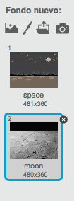

# Introducción { .intro }

¡Vas a aprender cómo programar tu propio robot que habla!

<div class="scratch-preview">
  <iframe allowtransparency="true" width="485" height="402" src="https://scratch.mit.edu/projects/embed/26762091/?autostart=false" frameborder="0"></iframe>
  
</div>

# Paso 1: Tu robot parlanchín { .activity }

## Lista de tareas de la actividad { .check }

+ Antes de empezar a crear tu robot parlanchín, necesitas decidir sobre su personalidad.
	+ ¿Cómo se llama?
	+ ¿Dónde vive?
	+ ¿Es feliz? ¿serio? ¿gracioso? ¿tímido? ¿amigable?

+ Crea un nuevo proyecto de Scratch, y borra el objeto gato para que tu proyecto esté vacío. Puedes encontrar el editor en línea de Scratch en <a href="http://jumpto.cc/scratch-new">jumpto.cc/scratch-new</a>.

+ Elige uno de los personajes de este objeto, y añádelo a tu proyecto:

	

+ Escoge un escenario que le vaya bien a la personalidad de tu robot parlanchín. Aquí tienes un ejemplo, aunque tu escenario puede ser diferente a éste:

	

## Guarda tu proyecto { .save }

# Paso 2: Un robot que habla { .activity }

Ahora que ya tienes un robot parlanchín con personalidad, vamos a programarlo para que te hable.

## Lista de tareas de la actividad { .check }

+ Haz clic en el personaje de tu robot parlanchín, y añade este código:

	```blocks
		al hacer clic en este objeto
		preguntar [¡Hola! ¿Cómo te llamas?] y esperar
		decir [¡Qué nombre más bonito!] por (2) segundos
	```

+ Haz clic en tu robot parlanchín para probarlo. Después de que te haya preguntado tu nombre, escríbelo en el recuadro que aparece en la parte inferior del escenario.

	

+ Tu robot parlanchín simplemente responderá `¡Qué nombre más bonito!` cada vez. Puedes personalizar la respuesta de tu robot parlanchín, usando la respuesta del usuario. Cambia el código del robot parlanchín a éste:

	```blocks
		al hacer clic en este objeto
		preguntar [¡Hola! ¿Cómo te llamas?] y esperar
		decir <unir [Hola] (respuesta)> por (2) segundos
	```

	Para crear este último bloque, primero tendrás que seleccionar un bloque verde `unir` {.blockoperators}, y arrastrarlo sobre el bloque `decir` {.blocklooks} .

	

	Puedes cambiar el texto `hello` por `Hola`, y arrastrar el bloque azul `respuesta` {.blocksensing} (de la sección 'Sensores') sobre el texto `world`.

	

+ Prueba este nuevo programa. ¿Funciona como esperabas? ¿Puedes solucionar los problemas que ves? (Pista: ¡puedes intentar añadir un espacio en alguna parte!)

+ Puede que quieras guardar el nombre del usuario en una variable, para poder usarlo de nuevo en el futuro. Crea una nueva variable que se llame `nombre` {.blockdata}. Si has olvidado cómo se hace, el proyecto "Globos" puede ayudarte.

+ La información que has escrito ya está almacenada en una variable especial llamada `respuesta` {.blocksensing}. Ve a la sección de bloques Sensores y haz clic en el bloque de respuesta para que aparezca una marca de verificación. El valor actual en `respuesta` {.blocksensing} debería aparecer en la parte superior izquierda del escenario.

+ Una vez hayas creado tu nueva variable, asegúrate de que el código de tu robot parlanchín sea como éste:

	```blocks
		al hacer clic en este objeto
		preguntar [¡Hola! ¿Cómo te llamas?] y esperar
		fijar [nombre v] a (respuesta)
		decir <unir [Hola ] (nombre)> por (2) segundos
	```

+ Si pruebas el programa una vez más, verás que la respuesta se guarda en la variable `nombre` {.blockdata}, y aparece en la parte superior izquierda del escenario. La variable `nombre` {.blockdata} debería ahora contener el mismo valor que la variable `respuesta` {.blocksensing} .

	

	Si prefieres no ver las variables en el escenario, puedes desactivar la marca de verificación junto al nombre de la variable en la pestaña "Programas" para esconderla.

## Guarda tu proyecto { .save }

## Desafío: Más preguntas { .challenge }

Programa a tu robot parlanchín para que haga otra pregunta. ¿Puedes guardar la respuesta en una variable?


## Guarda tu proyecto { .save }

# Paso 3: Tomar decisiones { .activity }

Puedes programar a tu robot parlanchín para que decida qué hacer, en función de las respuestas del usuario.

## Lista de tareas de la actividad { .check }

+ Vamos a hacer que tu robot parlanchín haga al usuario una pregunta con respuesta `sí` o `no`. Aquí te damos un ejemplo, pero puedes cambiar la pregunta si quieres:

	```blocks
		al hacer clic en este objeto
		preguntar [¡Hola! ¿Cómo te llamas?] y esperar
		fijar [nombre v] a (respuesta)
		decir <unir [Hola ] (nombre)> por (2) segundos
		preguntar <unir [¿Estás bien ] (nombre)> y esperar
		si ((respuesta)=[sí]) entonces
			decir [¡Me alegra saber que estás bien!] por (2) segundos
		fin
	```

	Fíjate que ahora que has guardado el nombre del usuario en una variable, puedes usarlo tantas veces como quieras.

+ Para probar el programa adecuadamente, tendrás que probarlo dos veces, una escribiendo `no` como tu respuesta, y otra escribiendo `sí`. Sólo deberías obtener una respuesta de tu robot parlanchín `si` {.blockcontrol} tu respuesta es `sí`.

+ El problema con tu robot parlanchín es que no te responde si el usuario contesta `no`. Puedes solucionar esto cambiando el bloque `si` {.blockcontrol} por un bloque `si/si no` {.blockcontrol}, para que tu nuevo código sea como éste:

	```blocks
		al hacer clic en este objeto
		preguntar [¡Hola! ¿Cómo te llamas?] y esperar
		fijar [nombre v] a (respuesta)
		decir <unir [Hola ] (nombre)> por (2) segundos
		preguntar <unir [Estás bien ] (nombre)> y esperar
		si ((respuesta)=[sí]) entonces
			decir [¡Me alegra saber que estás bien!] por (2) segundos
		si no
			decir [¡Oh, no!] por (2) segundos
		fin
	```

+ Si pruebas tu código, verás que ahora obtienes una respuesta si contestas `sí` o `no`. Tu robot parlanchín debería responder con `¡Me alegra saber que estás bien!` cuando contestas `sí`, pero responderá `¡Oh, no!` si escribes otra cosa que no sea `sí` (`si no` {.blockcontrol} aquí significa "de otra manera").

	

+ Puedes poner cualquier código dentro de un bloque `si` {.blockcontrol} o `si no` {.blockcontrol}, no sólo código para hacer que tu robot parlanchín hable. Por ejemplo, puedes cambiar el disfraz de tu robot parlanchín para que coincida con su respuesta.

	Si miras los disfraces de tu robot parlanchín, verás que hay más de uno. (Si no los hay, ¡siempre puedes añadir más tu mismo!)

	

	Puedes usar estos disfraces como parte de la respuesta de tu robot parlanchín, añadiendo este código:

	

+ Prueba tu programa, y deberías ver cómo la cara de tu robot parlanchín cambia dependiendo de la respuesta que le das.

	

## Guarda tu proyecto { .save }

## Desafío: Más decisiones { .challenge }

Programa a tu robot parlanchín para que haga otra pregunta, algo cuya respuesta sea `sí` o `no` . ¿Puedes hacer que tu robot parlanchín conteste a la respuesta?


## Guarda tu proyecto { .save }

# Paso 4: Cambiar la ubicación { .activity }

También puedes programar a tu robot parlanchín para que cambie su ubicación.

## Lista de tareas de la actividad { .check }

+ Añade otro fondo a tu escenario, por ejemplo el fondo "moon" (luna).

	

+ Ahora puedes programar a tu robot parlanchín para que cambie de ubicación si le añades este código:

	```blocks
		preguntar [Me voy a la luna. ¿Quieres venir conmigo?] y esperar
		si ((respuesta) = [sí]) entonces
			cambiar fondo a [moon v]
		fin
	```

+ También debes asegurarte de que tu robot parlanchín esté fuera cuando empiezas a hablarle. Añade este bloque al principio del código de tu robot parlanchín:

	

+ Prueba tu programa, y contesta `sí` cuando te pregunte si quieres ir a la luna. La ubicación del robot parlanchín debería cambiar.

	

+ ¿Cambia de ubicación tu robot parlanchín si escribes `no`? ¿Y qué pasa si escribes `No estoy seguro`?

+ También puedes agregar este código dentro de tu bloque `si` {.blockcontrol}, para hacer que tu robot parlanchín salte 4 veces si la respuesta es `sí`:

	```scratch
	repetir (4)
		cambiar y por (10)
		esperar (0.1) segundos
		cambiar y por (-10)
		esperar (0.1) segundos
	fin
	```

	

+ Prueba tu código una vez más. ¿Salta tu robot parlanchín si contestas que `sí`?

## Guarda tu proyecto { .save }

## Desafío: Crea tu propio robot parlanchín {.challenge}
Utiliza lo que has aprendido para terminar de crear tu robot parlanchín interactivo. Aquí te damos algunas ideas:


Cuando termines de crear tu robot parlanchín, ¡haz que tus amigos hablen con él! ¿Les gusta tu personaje? ¿Han encontrado algún problema?

## Guarda tu proyecto { .save }

## Community Contributed Translation { .challenge .pdf-hidden }

This project was translated by María Alejandra Aguada from Translators Without Borders. Screenshots in Spanish were provided by Montse Verdaguer. Our amazing translation volunteers help us give children around the world the chance to learn to code.  You can help us reach more children by translating a Code Club project via [Github](https://github.com/CodeClub/curriculum_documentation/blob/master/contributing.md) or by getting in touch with us at hello@codeclubworld.
