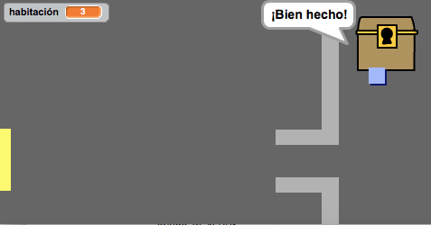
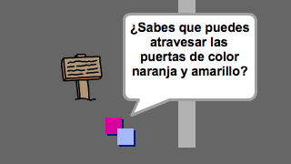

# Introducción { .intro }

En este proyecto aprenderás a crear tu propio juego de aventuras de mundo abierto.

<div class="scratch-preview">
  <iframe allowtransparency="true" width="485" height="402" src="https://scratch.mit.edu/projects/embed/34248822/?autostart=false" frameborder="0"></iframe>
  
</div>

# Paso 1: Programar a tu jugador { .activity }

Empezaremos creando un jugador que se pueda mover por tu mundo.

## Lista de tareas de la actividad { .check }

+ Crea un nuevo proyecto de Scratch, y borra el objeto gato para que el proyecto esté vacío. Puedes encontrar el editor online de Scratch aquí <a href="http://jumpto.cc/scratch-new">jumpto.cc/scratch-new</a>.

+ Para este proyecto, deberías de tener una carpeta llamada 'Recursos del Proyecto', que contiene todas las imágenes que necesitas. Asegúrate de tener esta carpeta, y pregunta al líder del Club si no la encuentras.

	

+ Carga la imagen 'habitación1.png' como fondo nuevo, y la imagen 'jugador.png' como nuevo objeto. Si no tienes estas imágenes, ¡puedes dibujarlas tú! Tu proyecto debería de parecerse a éste:

	

+ Usaremos las teclas de flecha para mover al jugador. Al presionar la flecha hacia arriba, queremos que el jugador se mueva hacia arriba, cambiando la coordenada y. Añade este código al objeto jugador:

	```blocks
		al presionar bandera verde
		por siempre
   			si <¿tecla [flecha arriba v] presionada?> entonces
      			cambiar y por (2)
   			fin
		fin
	```

+ Haz una prueba haciendo clic en la bandera verde, y a continuación presionando la flecha hacia arriba. ¿Se mueve tu jugador hacia arriba?

	

+ Para mover al jugador hacia la izquierda, necesitarás añadir otro bloque `si` {.blockcontrol}, que cambie la coordenada x:

	```blocks
		al presionar bandera verde
		por siempre
   			si <¿tecla [flecha arriba v] presionada?> entonces
      			cambiar y por (2)
   			fin
   			si <¿tecla [flecha izquierda v] presionada?> entonces
      			cambiar x por (-2)
   			fin
		fin
	```

## Reto: Moverse en las cuatro direcciones {.challenge}
¿Puedes añadir más código a tu jugador, para que se pueda mover hacia arriba, abajo, derecha e izquierda? ¡Usa el código que ya tienes como ayuda!

## Guarda tu proyecto { .save }

+ Haz otra prueba con tu jugador, y verás que puede atravesar las paredes de color gris claro.

	

+ Para arreglar esto, tienes que hacer que el jugador se mueva, pero que rebote si toca una pared de color gris claro. Necesitarás este código:

	```blocks
		al presionar bandera verde
		por siempre
   			si <¿tecla [flecha arriba v] presionada?> entonces
      			cambiar y por (2)
      			si <¿tocando el color [#BABABA]?> entonces
         			cambiar y por (-2)
      			fin
   			fin
		fin
	```

	Fíjate que el nuevo bloque `si`{.blockcontrol}`tocando el color`{.blocksensing} está _dentro_ del bloque `si`{.blockcontrol}`tecla [flecha arriba]`{.blocksensing}.

+ Prueba este nuevo código pasando por debajo de la pared - no deberías de poder atravesarla si te mueves hacia arriba.

	

+ Vamos a hacer lo mismo para la flecha izquierda, haremos que rebote si el jugador toca una pared. Con todo lo que hemos añadido, el código de tu jugador se debería de parecer a éste:

	

## Reto: Arreglar el movimiento de tu jugador {.challenge}
Añade código a tu jugador para que no pueda atravesar las paredes en ninguna dirección. ¡Usa el código que ya tienes como ayuda!

## Guarda tu proyecto { .save }

# Paso 2: Programar tu mundo { .activity }

¡Vamos a hacer que el jugador pueda pasar por puertas hacia otras habitaciones!

## Lista de tareas de la actividad { .check }

+ Añade otros dos fondos a tu escenario ('habitación2.png' y 'habitación3.png'), para que tengas 3 fondos en total. Asegúrate de que estén en el orden correcto - esto te ayudará más tarde.

	

+ Necesitarás una nueva variable con el nombre `habitación` {.blockdata}, que te indicará en qué habitación se encuentra el jugador.

	

+ Cuando el jugador toque la puerta naranja en la primera habitación, tendría que aparecer el siguiente fondo, y el jugador debería de aparecer en el lado izquierdo de la pantalla. Éste es el código que necesitas - debería de estar dentro del bucle `por siempre` {.blockcontrol} de tu jugador:

	```blocks
		si <¿tocando el color [#F2A24A]?> entonces
   			cambiar fondo a [siguiente fondo v]
   			ir a x:(-200) y:(0)
   			cambiar [habitación v] por (1)
		fin
	```

+ Añade las siguientes líneas al _principio_ del código del jugador (antes del bucle `por siempre` {.blockcontrol}) para que todo se reinicie cuando hagas clic en la bandera:

	```blocks
		fijar [habitación v] a (1)
		ir a x:(-200) y:(0)
		cambiar fondo a [habitación1 v]
	```

+ Haz clic en la bandera y mueve al jugador por encima de la puerta naranja. ¿Se mueve el jugador hasta la siguiente pantalla? ¿Cambia el número de la variable `habitación` {.blockdata} a 2?

	

## Reto: Volver a la habitación anterior {.challenge}
¿Puedes hacer que el jugador vuelva a la habitación anterior cuando toque una puerta amarilla? Recuerda que este código será _muy_ parecido al que ya has añadido para que avance a la siguiente habitación.

## Guarda tu proyecto { .save }

# Paso 3: Señales { .activity }

Ahora añadiremos señales a tu mundo, para guiar al jugador en su viaje.

## Lista de tareas de la actividad { .check }

+ Carga la imagen 'señal.svg' como un nuevo objeto, y cámbiale el nombre a 'señal de bienvenida'.

	

+ Esta señal sólo tiene que verse en la habitación 1, así que vamos a añadir código a la señal para asegurarnos de que sea así:

	```blocks
		al presionar bandera verde
		por siempre
   			si <(habitación) = [1]> entonces
      			mostrar
   			si no
      			esconder
   			fin
		fin
	```

+ Prueba la señal moviéndote entre habitaciones. La señal sólo debería de verse en la habitación 1.

	

+ ¡Una señal no nos sirve de mucho si no tiene nada escrito! Vamos a añadir más código (en un bloque aparte) para que la señal nos muestre un mensaje si el jugador la toca:

	```blocks
		al presionar bandera verde
		por siempre
   			si <¿tocando [jugador v]?> entonces
      			decir [¡Bienvenido! ¿Eres capaz de encontrar el tesoro?]
   			si no
      			decir []
   			fin
		fin
	```
+ Prueba la señal. Tendrías que ver un mensaje cuando el jugador la toca.

	

## Guarda tu proyecto { .save }

## Reto: ¡Tesoro! {.challenge}
¿Puedes añadir un nuevo objeto de un cofre del tesoro, con la imagen 'cofre.svg'?. El cofre del tesoro debería de aparecer en la habitación 3, y debería decir '¡Bien hecho!' cuando el jugador lo toque.



## Guarda tu proyecto { .save }

# Paso 4: Personas { .activity }

Vamos a añadir a otras personas a tu mundo con las que tu jugador pueda interactuar.

## Lista de tareas de la actividad { .check }

+ Añade un nuevo objeto de persona, utilizando la imagen 'persona.png'.

	

+ Añade este código para que la persona hable con tu jugador. Este código es muy parecido al que has añadido a la señal:

	```blocks
		al presionar bandera verde
		ir a x:(-200) y:(0)
		por siempre
   			si <¿tocando [jugador v]?> entonces
      			decir [¿Sabes que puedes atravesar las puertas de color naranja y amarillo?]
   			si no
      			decir []
   			fin
		fin
	```

+ También puedes hacer que la persona se mueva, si usas estos dos bloques:

	```blocks
		mover (1) pasos
		rebotar si toca un borde
	```

	La persona se comportará diferente dependiendo de si añades este código dentro del bucle `para siempre` {.blockcontrol} o en el bloque `si` {.blockcontrol}. Prueba los dos y decide cuál prefieres.

	

+ ¿Te has dado cuenta de que la persona se da la vuelta cuando rebota? Para que deje de hacer esto, presiona el icono de información del objeto (`i`{.blockmotion}), y haz clic en el punto para fijar el estilo de rotación.

	

## Reto: Mejorar el objeto persona {.challenge}
¿Puedes añadir código a tu nueva persona, para que sólo aparezca en la habitación 1? ¡Recuerda probar el nuevo código!

## Guarda tu proyecto { .save }

+ Vamos a añadir unos guardias enemigos, con los que se acaba el juego si el jugador los toca. Añade un nuevo objeto de enemigo, y cambia su estilo de rotación, igual que has hecho antes con el objeto 'persona'.

+ Añade código a tu enemigo para que sólo aparezca en la habitación 2.

+ También necesitarás añadir código para que el enemigo se mueva, y para que el juego termine si el enemigo toca al jugador. Será más fácil si lo haces en bloques de código separados. El código debería de parecerse a éste:

	

+ Prueba a tu enemigo, para asegurarte de que:
	+ Sólo es visible en la habitación 2;
	+ Patrulla la habitación;
	+ El juego termina si el jugador lo toca.

## Guarda tu proyecto { .save }

## Reto: Más enemigos {.challenge}
¿Puedes crear otro enemigo en la habitación 3, que patrulle en sentido vertical a través del agujero en la pared?


## Guarda tu proyecto { .save }

# Paso 5: Recoger monedas { .activity }

## Lista de tareas de la actividad { .check }

+ Añade una nueva variable llamada `monedas` {.blockdata} al proyecto.

+ Añade un nuevo objeto 'moneda' al proyecto.


+ Añade código a la moneda para que sólo aparezca en la habitación 1.

+ Añade código al objeto moneda, para que se sume 1 a tus `monedas` {.blockdata} cuando la recojas:

	```blocks
		al presionar bandera verde
		esperar hasta que <¿tocando [jugador v]?>
		cambiar [monedas v] por (1)
		detener [otros programas en el objeto v]
		esconder
	```

	Usamos el código `detener otros programas en el objeto` {.blockcontrol} para que la moneda desaparezca de la habitación 1 cuando el jugador la recoja.

+ Necesitarás añadir código para que la variable `monedas` {.blockdata} vuelva a 0 al principio del juego.

+ Prueba el proyecto - al recoger las monedas, tu puntuación debería de cambiar a 1.

## Reto: Más monedas {.challenge}
¿Puedes añadir más monedas al juego? Podrían estar en diferentes habitaciones, e incluso algunas de las monedas podrían estar vigiladas por guardias enemigos.

# Paso 6: Puertas y llaves { .activity }

## Lista de tareas de la actividad { .check }

+ Crea un nuevo objeto con la imagen 'llave.svg'. Ve al escenario 3, ¡y coloca la llave en algún sitio al que sea difícil llegar!

 	

+ Asegúrate de que sólo se ve la llave en la habitación 3.

+ Crea una lista nueva llamada `inventario` {.blockdata}. En el inventario se guardarán todos los objetos que el jugador recoja.

+ El código para recoger la llave es muy parecido al código usado para recoger monedas. La diferencia es que tienes que añadir la llave al inventario.

	```blocks
		al presionar bandera verde
		esperar hasta que <¿tocando [jugador v]?>
		añade [llave] a [inventario v]
		detener [otros programas en el objeto v]
		esconder
	```

+ Prueba el código de la llave, para ver si la puedes recoger y se añade al inventario. Recuerda añadir código al escenario para vaciar el inventario al empezar el juego.

	```blocks
		borrar (todos v) de [inventario v]
	```

+ Crea un nuevo objeto con la imagen 'puerta-azul.png', y coloca la puerta azul tapando el agujero entre las dos paredes.

	

+ Añade código a la puerta, para que sólo aparezca en la habitación 3.

+ Tendrás que esconder la puerta para que el jugador pueda pasar si tiene la llave en el inventario.

	```blocks
		al presionar bandera verde
		esperar hasta que <[inventario v] contiene [llave]>
		detener [otros programas en el objeto v]
		esconder
	```

+ ¡Haz una prueba, para ver si puedes recoger la llave y abrir la puerta!

## Guarda tu proyecto { .save }

## Reto: Crea tu propio mundo {.challenge}
Ahora puedes continuar creando tu propio mundo. Aquí tienes algunas ideas:

+ Cambia el decorado y los gráficos de tu juego;
+ Añade sonidos y música al juego;
+ Añade más personas, enemigos, señales y monedas;
+ Añade puertas rojas y amarillas, que necesiten sus propias llaves para abrirse;
+ Añade más habitaciones a tu mundo;
+ Añade al juego otros objetos útiles;

+ Utiliza las monedas para conseguir información de otras personas;

	

+ Incluso podrías añadir puertas en la parte superior o inferior de la pantalla, para que el jugador se pueda mover entre habitaciones en las 4 direcciones. Por ejemplo, si tuvieras 9 habitaciones, podrías organizarlas como si estuvieran en una cuadrícula de 3x3. En ese caso, tendrías que sumar 3 al número de la habitación para bajar un nivel.

	

## Guarda tu proyecto { .save }

## Community Contributed Translation { .challenge .pdf-hidden }

This project was translated by Montse Verdaguer. Our amazing translation volunteers help us give children around the world the chance to learn to code.  You can help us reach more children by translating a Code Club project via [Github](https://github.com/CodeClub/curriculum_documentation/blob/master/contributing.md) or by getting in touch with us at hello@codeclubworld.
