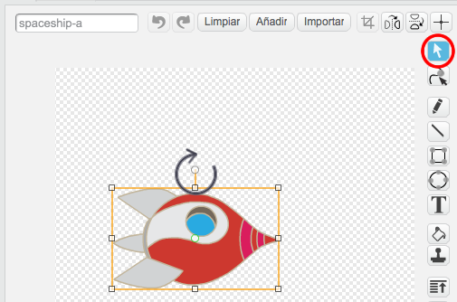
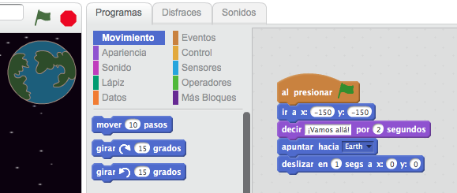
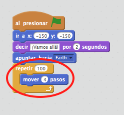

# Introducción { .intro }

¡Vas a aprender a programar tu propia animación!

<div class="scratch-preview">
  <iframe allowtransparency="true" width="485" height="402" src="https://scratch.mit.edu/projects/embed/26818098/?autostart=false" frameborder="0"></iframe>
  
</div>

# Paso 1: Animar una nave espacial { .activity .new-page}

¡Vamos a hacer una nave espacial que vuele hacia la Tierra!

## Lista de tareas de la actividad { .check }

+ Crea un nuevo proyecto Scratch, y borra el objeto gato para que tu proyecto esté vacío. Puedes encontrar el editor de Scratch en línea en <a href="http://jumpto.cc/scratch-new">jumpto.cc/scratch-new</a>.

+ Añade los objetos “Spaceship" (Nave especial) y “Earth" (Tierra) al escenario. También tendrás que añadir el fondo “Stars" (Estrellas) a tu escenario. Tu escenario debería de parecerse a éste:

	

+ Haz clic en el nuevo objeto de nave especial, y selecciona la pestaña “Disfraces”.

	

+ Usa la herramienta con la flecha para seleccionar la imagen. Luego haz clic en el mango giratorio circular, y haz girar la imagen hasta que esté de lado.

	

+ Añade este código al objeto nave espacial:

	

	Cambia los números en los bloques de código, para que el código sea exactamente igual al de la imagen anterior.

+ Si haces clic en los bloques de código para ejecutar el código, deberías de ver cómo la nave espacial habla, gira y se mueve hacia el centro del escenario.

	

	La posición de la pantalla `x:(0) y:(0)` {.blockmotion} es el centro del escenario. Una posición como `x:(-150) y:(-150)` {.blockmotion} está hacia la parte inferior izquierda del escenario, y una posición como `x:(150) y:(150)` {.blockmotion} está cerca de la parte superior derecha.

	

	Si necesitas saber las coordenadas de una posición en el escenario, mueve el ratón a la posición que deseas saber y apunta las coordenadas que aparecen por debajo del escenario.

	

+ Prueba tu animación haciendo clic en la bandera verde que encontrarás justo encima del escenario.

	

## Desafío: Mejora tu animación {.challenge}
¿Puedes cambiar los números en el código de tu animación, para que:
+ la nave espacial se mueva hasta tocar la Tierra?
+ la nave espacial se mueva más lentamente hacia la Tierra?

Necesitarás cambiar los números en este bloque:

```blocks
	deslizar en (1) segs a x:(0) y:(0)
```

## Guarda tu proyecto { .save }

# Paso 2: Animar usando bucles { .activity .new-page }

Otra manera de animar la nave espacial es decirle que se mueva distancias pequeñas, muchas veces.

## Lista de tareas de la actividad { .check }

+ Elimina el bloque `deslizar` {.blockmotion} de tu código haciendo clic con el botón derecho en el bloque y seleccionando "borrar". También puedes borrar código arrastrándolo del área de Programas al área de los bloques de código.

	

+ Una vez hayas eliminado el código, añade este código en su lugar:

	

	El bloque `repetir` {.blockcontrol} se usa para repetir algo muchas veces, y también se conoce como un __bucle__.

+ Si haces clic en la bandera para probar este nuevo código, verás que hace casi lo mismo que antes.

+ Puedes añadir más código a tu bucle, para hacer cosas interesantes. Añade al bucle el bloque `cambiar efecto color por 25` {.blocklooks} (de la sección "Apariencia"), para cambiar el color de la nave espacial repetidamente a medida que se mueve:

	

+ Haz clic en la bandera para ver tu nueva animación.

	

+ También puedes hacer que tu nave espacial se haga más pequeña a medida que se mueve hacia la Tierra.

	

+ Prueba tu animación. ¿Qué ocurre si haces clic en la bandera una segunda vez? ¿Tu nave espacial empieza con el tamaño correcto? Puedes usar este bloque para fijar tu animación:

	```scratch
	fijar tamaño a (100) %
	```

## Guarda tu proyecto { .save }

# Paso 3: Mono flotante { .activity .new-page }

Vamos a añadir un mono a tu animación, ¡que está perdido en el espacio!

## Lista de tareas de la actividad { .check }

+ Empieza añadiendo el objeto "Monkey" (mono) de la biblioteca.

	

+ Si haces clic en tu nuevo objeto mono y después en “Disfraces”, podrás editar la apariencia del mono. Haz clic en la herramienta “Elipse” y dibuja un casco espacial blanco alrededor de la cabeza del mono.

	

+ A continuación haz clic en “Programas”, y añade este código a tu mono, para que gire lentamente en círculos para siempre:

	```blocks
	al presionar bandera verde
	por siempre
   		girar ↻ (1) grados
	fin
	```

	El bloque `por siempre` {.blockcontrol} es otro bucle, pero en este caso, uno que nunca termina.

+ Haz clic en la bandera para probar tu mono. Tendrás que hacer clic en el botón parar (al lado de la bandera) para terminar esta animación.

	

# Paso 4: Asteroides que rebotan { .activity .new-page }

Vamos a añadir a tu animación algunas rocas espaciales que floten.

## Lista de tareas de la actividad { .check }

+ Añade el objeto “Rocks" (roca) a tu animación.

	

+ Añade este código a tu roca, para hacer que rebote por todo el escenario:

	```scratch
	al presionar bandera verde
	apuntar hacia [Earth v]
	por siempre
		mover (2) pasos
		rebotar si toca un borde
	```

+ Haz clic en la bandera para probar tu roca. ¿Rebota por todo el escenario?

# Paso 5: Estrellas que brillan { .activity .new-page }

Vamos a combinar bucles para hacer una estrella que brille.

## Lista de tareas de la actividad { .check }

+ Añade el objeto “Star" (Estrella) a tu animación

	

+ Añade este código a tu estrella:

	

+ Haz clic en la bandera para probar la animación de la estrella. ¿Qué hace este código? Pues la estrella se hace un poquito más grande 20 veces, y luego se hace un poquito más pequeña 20 veces, hasta llegar a su tamaño original. Estos 2 bucles están dentro de un bucle `por siempre` {.blockcontrol}, para que la animación se repita constantemente.

## Guarda tu proyecto { .save }

## Desafío: Crea tu propia animación {.challenge}
Detén tu animación espacial, haz clic en “Archivo” y luego en “Nuevo”, para empezar un nuevo proyecto.

Usa lo que has aprendido en este proyecto para crear tu propia animación. Puede ser cualquier cosa que quieras, pero intenta que la animación concuerde con el escenario. Aquí te damos algunos ejemplos:


## Guarda tu proyecto { .save }

## Community Contributed Translation { .challenge .pdf-hidden }

This project was translated by María Alejandra Aguada from Translators Without Borders. Screenshots in Spanish were provided by Montse Verdaguer. Our amazing translation volunteers help us give children around the world the chance to learn to code.  You can help us reach more children by translating a Code Club project via [Github](https://github.com/CodeClub/curriculum_documentation/blob/master/contributing.md) or by getting in touch with us at hello@codeclubworld.
