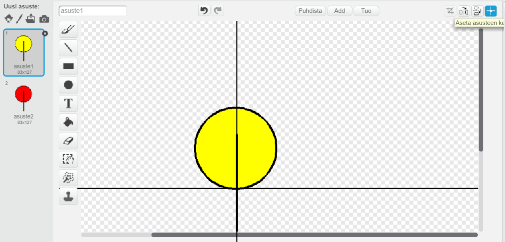

---
title: Bändi — huomiot opettajalle
language: fi-FI
embeds: "*.png"
...

#Esittely:
Tässä projektissa lapset oppivat lisäämään ääntä ja musiikkia projekteihinsa. Lisäksi opitaan myös muuttaaan ja ohjelmoimaan hahmojen asusteita.

#Materiaait
Tässä projektissa tulisi käyttää Scratch 2:ta. Scratch 2:ta voi käyttää online-tilassa osoitteessa [jumpto.cc/scratch-on](http://jumpto.cc/scratch-on) tai vaihtoehtoisesti sen voi ladata osoitteesta [jumpto.cc/scratch-off](http://jumpto.cc/scratch-off) ja käyttää offline-tilassa.

Löydät valmiin version tästä projektista <a href="http://scratch.mit.edu/projects/26741186/#editor">online-versiosta</a>. Valmiin projektin voit myös ladata tietokoneellesi 'Lataa projektimateriaalit' linkistä. Lataus sisältää seuraavat tiedostot:

+ Bandi.sb2

#Oppimistavoitteet
+ Hahmot;
+ Asusteet;
+ Peräkkäiset koodipalikat;
+ Tapahtumat;
+ Äänet ja musiikki.

#Haasteet
+ "Rummun parantelu" - Hahmon äänen vaihtaminen ja tapahtumien lisääminen;
+ "Rummun asusteen vaihtaminen" - Hahmon asusteiden lisääminen ja kontrollointi;
+ "Tee oma bändisi" - uusien instrumenttien luominen käyttäen opittuja taitoja.

#Usein kysytyt kysymykset
+ Omia hahmoja luotaessa voi käydä niin, että hahmo 'hyppää' painettaessa, kun hahmon asustetta vaihdetaan. Tämä johtuu siitä, että asusteet eivät ole keskitettynä samaan sijaintiin.

  Korjataksesi tämän, paina 'Aseta asusteen keskelle' -nappia _molemmissa_ hahmoissa ja varmistu, että hahmot ovat keskitettynä samaan sijaintin molemmmissa asusteissa.

  

+ Hahmon poistaminen käyttäen hiiren oikeaa näppäintä ei välttämättä toimi, jos Scratchia käytetään Linuxilla. Jos näin käy, niin klikkaa hahmoa hiiren vasemmalla näppäimellä pitäen samalla shift-näppäintä pohjassa - poistovalikon pitäisi ilmestyä näin näkyviin.
