---
title: Bändi
level: Scratch 1
language: fi-FI
stylesheet: scratch
embeds: "*.png"
materials: ["Opettajan materiaalit/*"]
...

# Esittely { .intro }

Tässä projektissa opit kuinka koodataan soittimia käyttäen Scratchia!

<div class="scratch-preview">
	<iframe allowtransparency="true" width="485" height="402" src="http://scratch.mit.edu/projects/embed/26741186/?autostart=false" frameborder="0"></iframe>
	
</div>

# Vaihe 1: Hahmot { .activity }

Ennen kun voit aloittaa koodaamisen sinun tulee lisätä 'jotain' mitä käskytät koodilla. Scratchissa näitä 'jotain' kutsutaan __hahmoiksi__.

## Toimenpiteet { .check }

+ Ensimmäiseksi avaa Scartch-editori. Editori löytyy osoitteesta <a href="http://jumpto.cc/scratch-new" target="_blank">jumpto.cc/scratch-new</a>. Avattu editori näyttää tältä:

	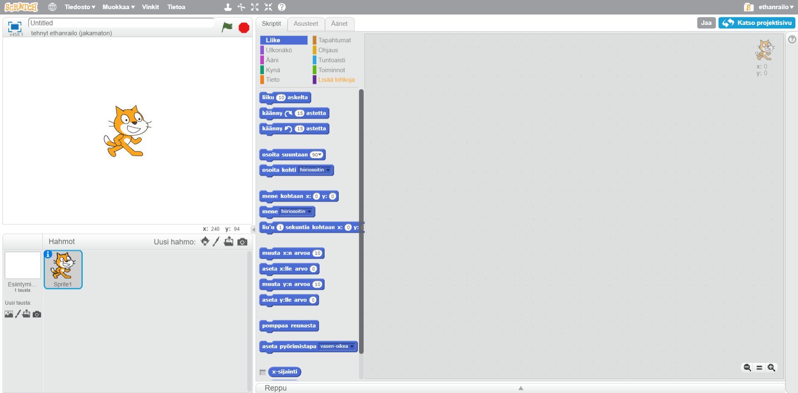

+ Editorissa näkyvä kissa-hahmo on Scratchin maskotti. Koska maskotilla ei ole projektissamme virkaa, hankkiudutaan eroon siitä painamalla kissa-hahmon päällä hiiren oikeaa näppäintä ja valitsemalla 'poista'.

	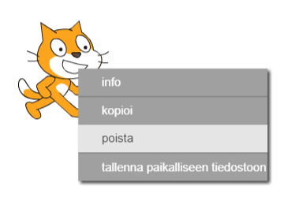

+ Seuravaaksi paina 'Valitse hahmo kirjastosta' avataksesi luettelon kaikista valmiista hahmoista joita Scratchissa on.

	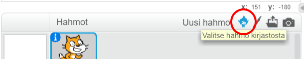

+ Selaa hahmo-ikkunaa alemmas, kunnes löydät rummun (englanniksi 'drum'). Valitse rumpu ja paina 'OK' lisätäksesi sen projektiisi.

	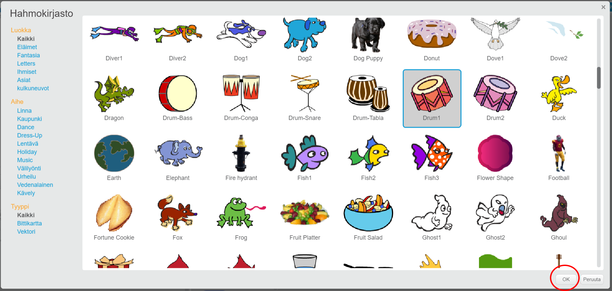

+ Valitse 'pienennä' työkalu ja paina tämän jälkeen rumpua muutaman kerrann tehdäksesi hahmosta pienemmän.

	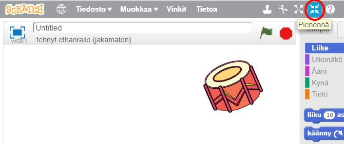

## Tallenna projektisi { .save }

Anna sovelluksellesi nimi kirjoittamalla se vasemman yläkulman tekstikenttään.

Tämän jälkeen valitse 'Tiedosto' ja aukeavasta valikosta 'Tallenna nyt' tallentaaksesi projektisi.

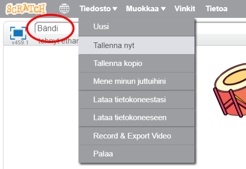

(Jos sinulla ei ole Scratch-tiliä, voit tallentaa kopion projektistasi omalle tietokoneellesi valitsemalla 'Lataa tietokoneeseen').

# Vaihe 2: Esiintymislava { .activity }

__Esiintymislava__ on alue vasemmalla puolella näyttöä. Esiintymislava on Scratchissa se paikka, jossa projektisi kootaan eloon - sitä voi verrata teatterin lavaan, jossa esitykset esitetään yleisölle.

## Toimenpiteet { .check }

+ Tällä hetkellä esiintymislava on valkoinen ja se näyttää todella tylsältä! Lisätään miellyttävämpi tausta esiintymislavalle valitsemalla 'Valitse tausta kirjastosta'.

	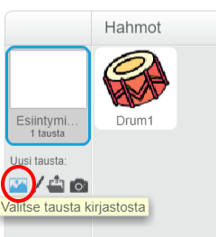

+ Valitse luokka 'Sisällä' ikkunan vasemmasta reunasta. Tämän jälkeen valitse taustaksi 'stage1' ja paina 'OK'.

	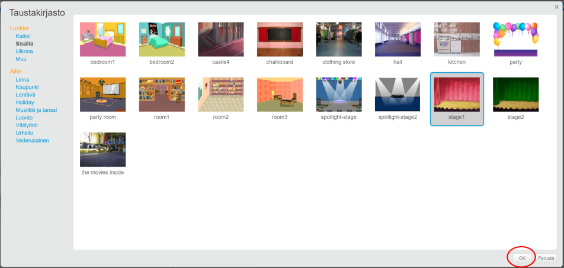

+ Esiintymislavasi pitäisi nyt näyttää tältä:

	

# Vaihe 3: Rummun tekeminen { .activity }

Seuraavaksi koodaamme rumpusi pitämään ääntä, kun sitä painetaan.

## Toimenpiteet { .check }

+ Löydät koodipalikat 'Skriptit'-välilehdeltä. Koodipalikat ovat värikoodattuja toimintoryhmien mukaan.

	Valitse rumpu-hahmo ja raahaa nämä kaksi koodipalikkaa näytön oikeassa reunassa olevalle koodialueelle. Varmistu, että kaksi koodipalikkaa ovat kytkettyinä toisiinsa (aivan kuten Lego-palikat):

	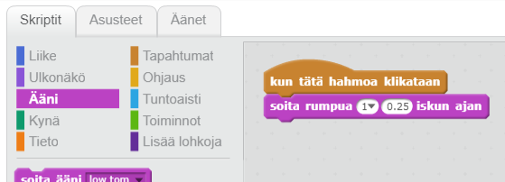

+ Nyt voit painaa esiintymislavalla olevaa rumpua kokeillaksesi sen toimivuutta - sen pitäisi pitää ääntä!

## Tallenna projektisi { .save }

##Haaste: Rummun parantelu { .challenge }

+ Osaatko vaihtaa ääntä, jonka rumpu pitää sitä painettaessa?

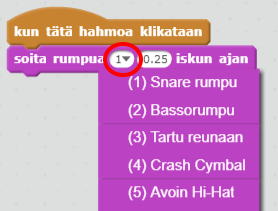

+ Saatko rummun soimaan myös silloin, kun näppäimistöstä painetaan välilyöntiä? Sinun tulee käyttää `tapahtumat` {.blockevents} -koodipalikkaa:

```blocks
	kun painetaan [välilyönti v]
```

Voit kopioida aiempaa koodiasi painamalla siitä hiiren oikealla ja valitsemalla 'kopioi'.

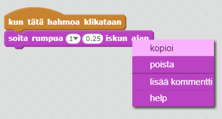

## Tallenna projektisi { .save }

# Vaihe 4: Laulajan tekeminen { .activity .new-page }

Lisätäänpä laulaja bändiisi!

## Toimenpiteet { .check }

+ Lisää kaksi uutta hahmoa esiintymislavallesi: laulaja sekä mikrofoni.

	

+ Ennen kuin saamme laulajasi laulamaan, sinun tulee lisätä ääni hahmollesi. Valitse laulaja-hahmo. Tämän jälkeen siirry 'Äänet'-välilehdelle ja paina 'Valitse ääni kirjastosta':

	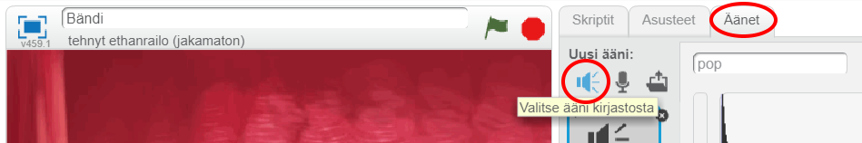

+ Jos valitset 'Äänet' vasemman reunan luokista, saat valittavaksesi joukon soveltuvia ääniä laulajallesi.

	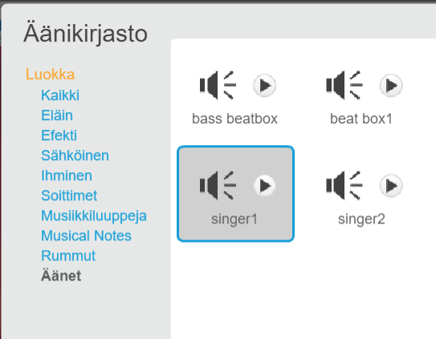

+ Kun ääni on lisätty, voit liittää tämän koodin laulajaasi:

	```blocks
		kun tätä hahmoa klikataan
		soita ääni [singer1 v] loppuun
	```

+ Paina laulaajasi - sinun pitäisi kuulla nyt laulua.

## Tallenna projektisi { .save }

# Vaihe 5: Asusteet { .activity .new-page }

Seuraavaksi muutetaan laulajaasi niin, että myös näet kun hän laulaa!

## Toimenpiteet { .check }

+ Voit muuttaa sitä, miltä laulaja-hahmosi näyttää, kun sitä painetaan. Muutos tehdään luomalla uusi asuste. Valitse laulaja-hahmo ja siirry 'Asusteet'-välilehdelle, jossa näet laulajan kuvan.

	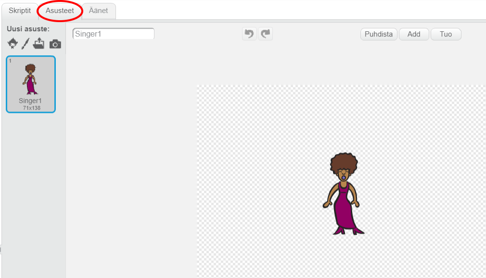

+ Paina hiiren oikealla asusteesta ja valitse 'kopioi' luodaksesi uuden kopion asusteesta.

	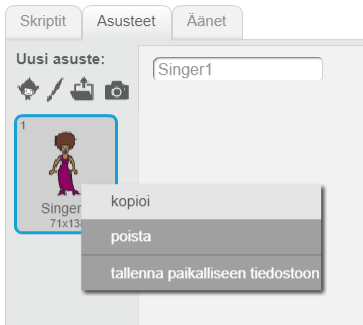

+ Valitse luomasi uusi asuste (nimellä 'Singer2'). Tämän jälkeen valitse oikeasta reunasta 'Viiva'-työkalu ja piirrä laulajan suun viereen muutama viiva niin, että näyttää siltä, että laulaja pitäisi ääntä.

	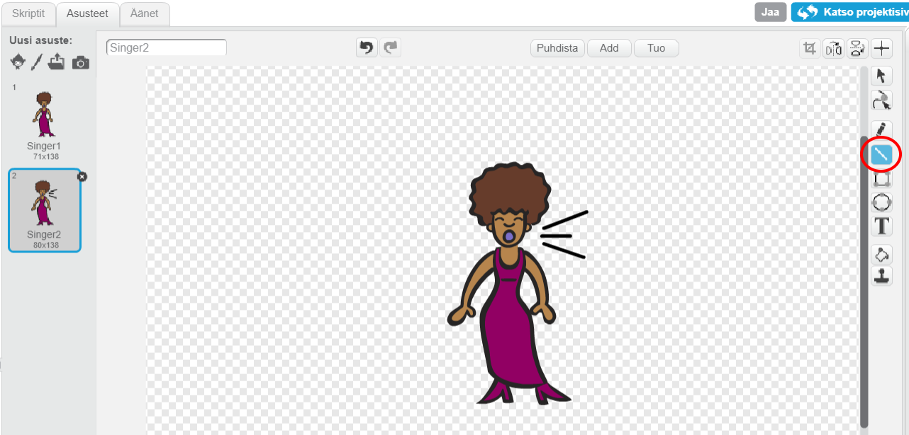

+ Tällä hetkellä asusteiden nimet eivät ole kovin kuvaavia. Nimeä molemmat asusteet uudelleen, ylempi nimellä 'ei laula' ja alempi nimellä 'laulaa'.

	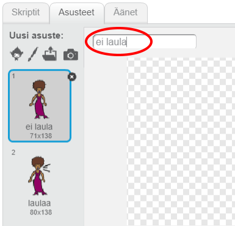

+ Nyt sinulla on kaksi asustetta laulajallasi ja voit valita, kumpaa asustetta käytetään milläkin hetkellä. Lisää nämä kaksi koodipalikkaa laulajaasi:

	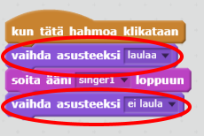

	Tarvittava koodipalikka löytyy `Ulkonäkö` {.blocklooks}-luokasta.

+ Kokeile laulajaasi. Kun painat laulajaa, pitäisi laulajan muuttua sen näköiseksi, että hän laulaa. Ja kun laulu loppuuu, niin hahmo muuttuu takaisin alkutilaan.

##Haaste: Rummun asusteen vaihtaminen { .challenge }
Saatko rummun näyttämään siltä, että sitä lyödään? Jos tarvitset apua, voit soveltaa aiempia laulajan asusteen vaihtamisen ohjeita.


Muista testata uuden koodisi toimivuus!

## Tallenna projektisi { .save }

##Haaste: Tee oma bändisi { .challenge }
Käytä tässä projektissa oppimiasi taitoja oman bändisi luomiseen! Voit luoda mitä tahansa soittimia itse halua, mutta katso saatavilla olevia ääniä ja soittimia saadaksesi ideoita.

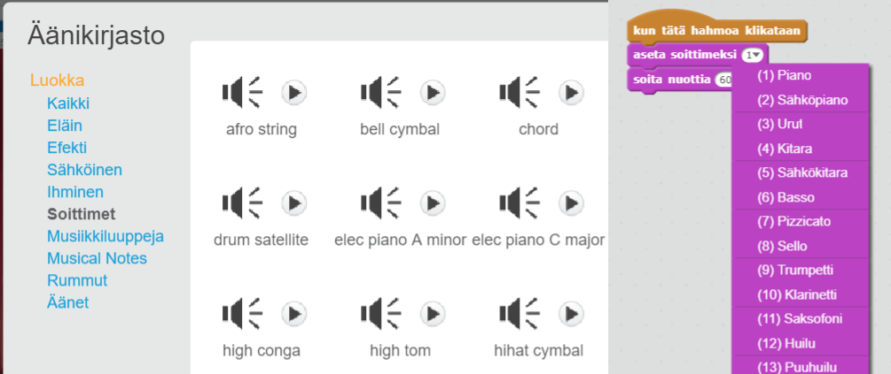

Soittimiesi ei tarvitse muistuttaa oikeita soittimia. Voit vaikkapa tehdä muffinsien näköisen pianon!


Valmiiden hahmojen käyttämisen lisäksi voit piirtää myös omia hahmojasi.

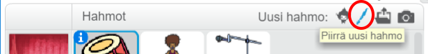

Jos sinulla on käytössäsi mikrofoni, voit nauhittaa myös omia ääniä - tai jopa käyttää webkameraasi soitinten soittamiseen!

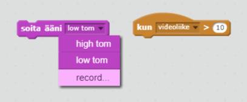

## Tallenna projektisi { .save }
