---
title: Balloons
level: Scratch 1
language: fr-FR
stylesheet: scratch
embeds: "*.png"
materials: ["Club Leader Resources/*.*"]
...

# Introduction { .intro }

Vous allez faire un jeu éclatant avec un ballon!

<div class="scratch-preview">
	<iframe allowtransparency="true" width="485" height="402" src="http://scratch.mit.edu/projects/embed/26745384/?autostart=false" frameborder="0"></iframe>
	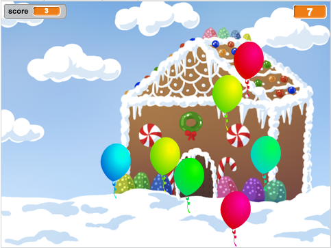
</div>

# Étape 1 : Animation d'un ballon { .activity }

## Liste de contrôle d'Activité { .check }

+ Commencez un nouveau projet de scratch et supprimez le lutin de chat pour que votre projet soit vide. Vous pouvez trouver l'éditeur de scratch en ligne à <a href="http://jumpto.cc/scratch-new">jumpto.cc/scratch-new</a>.

+ Ajoutez un nouvel lutin de ballon et un fond de scène approprié.

	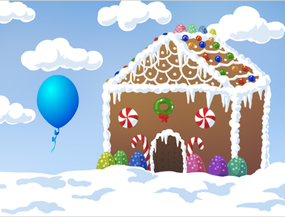

+ Ajoutez ce code à votre ballon, pour qu'il rebondisse autour de l'écran :

	```blocks
		quand le drapeau cliqué
		aller à x:(0) y:(0)
		s'orienter à (45 v)
		répéter indéfiniment
			avancer de (1) 
			rebondir si le bord atteint
		end
	```

+ Testez votre ballon. Se déplace-t-il trop lentement ? Changez les valeurs dans votre code si vous voulez l'accélérer un peu.

+ Avez-vous aussi remarqué que votre ballon tourne quand il se déplace à l'écran ?

	

	Les ballons ne se déplacent pas comme ceci! Pour réparer ceci, clique sur l'icône du lutin de ballon et clique ensuite sur l'icône d'information bleue `i` {.blockmotion} .

	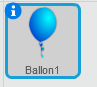
	
	Dans la section ' style de rotation ', cliquez sur le point pour arrêter la rotation de ballon.

	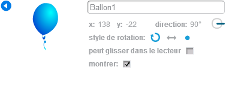

+ Testez votre programme de nouveau pour voir si le problème est résolut.

## Sauvegarder votre projet { .save }

# Étape 2 : ballons aléatoires{ .activity }

## Liste de contrôle d'activité { .check }

+ Avec le code que vous avez maintenant, votre ballon commencera toujours en même endroit et se déplacera dans le même chemin. Cliquez sur le drapeau à plusieurs reprises pour commencer votre programme et vous verrez qu'il est le même chaque fois.

+ Au lieu d'utiliser les même coordonées x et y à chaque fois, vous pouvez laisser Scratch choisir un nombre aléatoire. Changez le code de votre ballon, pour qu'il ressemble à ça :

	```blocks
		quand le drapeau cliqué
		aller à x:(nombre aléatoire entre (-150) et (150)) y:(nombre aléatoire (-150) et (150))
		s'orienter à (45 v)
		répéter indéfiniment
			avancer de (1) 
			rebondir si le bord est atteint
		end
	```

+ Si vous cliquez sur le drapeau vert à plusieurs reprises, vous devriez remarquer que votre ballon commence a un endroit différent chaque fois.

+ Vous pourriez même utiliser un nombre aléatoire pour choisir une couleur de ballon aléatoire chaque fois :

	```blocks
		mettre l'effet [colour v] à (nombre aléatoire (0) et (200))
	```

	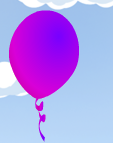

	Qu'arrive-t-il si ce code est mis au début de votre programme ? Qui a-t-il de différent, si vous mettez ce code à l'intérieur du `répéter indéfiniment` {.blockcontrol} en boucle ? Lequel préférez-vous ?

## Sauvegarder votre projet { .save }

## Défi : Plus d'incohérence {.challenge}
Pouvez-vous faire pointer votre ballon dès le début dans une direction aléatoire (entre -90 et 180) ?

## Sauvegarder votre projet { .save }

# Étape 3 : ballon éclatants{ .activity }

Laisse le joueur éclater les ballons !

## Liste de contrôle d'activité { .check }

+ Cliquez sur votre lutin de ballon et cliquez ensuite sur l'onglet 'Costumes'. Vous pouvez supprimer tous les autres costumes, en laissant juste 1 costume de ballon. Ajoutez un nouveau costume, en cliquant 'Dessiner un nouveau costume' et créez un nouveau costume appelé 'explosion'.

	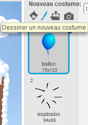

+ Assurez-vous que votre ballon change le bon costume quand le jeu commence. Votre code devrait maintenant ressembler à ça :

	```blocks
		quand le drapeau cliqué
		basculer sur costume [balloon1-a v]
		point in direction (nombre aléatoire (-90) et (180))
		aller à x:(nombre aléatoire (-150) et (150)) y:(nombre aléatoire (-150) et (150))
		mettre  l'effet [color v] à (nombre aléatoire (0) et (200))
		répéter indéfiniment
			avancer de (1)
			rebondir si le bord est atteint
		end
	```

+ Pour permettre au joueur d'exploser un ballon, ajoutez ce code :

	```blocks
		quand ce lutin est cliqué
		basculer sur costume [burst v]
		jouer le son [pop v]
	```
us devriez améliorer ce code, pour que quand le ballon soit cliqué, il montre le costume 'explosion' un certain temps puis ce cache. Vous pouvez faire tout cela en changeant le code de votre ballon ` quand ce lutin est cliqué ` {.blockevents} comme ceci :

+ Testez votre projet. Pouvez-vous éclater le ballon ? Marche-t-il comme vous voulez ?
	```blocks
		quand ce lutin est cliqué
		basculer sur costume [burst v]
		jouer le son [pop v]
		attendre (0.3) secondes
		cacher
	```

+ Maintenant que vous cacher le ballon quand il est cliqué, vous devrez aussi ajouter le block 'montrer' {.blocklooks} au début du code ` quand drapeau pressé  `{.blockevents}.

+ Essaie d'éclater le ballon de nouveau, pour vérifier qu'il marche correctement. Si vous trouvez difficile d'éclater le ballon , vous pouvez jouer le jeu dans le mode plein écran en cliquant sur ce bouton :

	

## Sauvegarder votre projet { .save }

# Étape 4 : Addition d'un score { .activity .new-page }

Faisons des choses plus intéressantes en marquant des points.

## Liste de contrôle d'activité { .check }

+ Pour garder le score du joueur, vous avez besoin d'un endroit pour le mettre. Une variable est un endroit pour stocker les données qui peuvent changer, comme un score.

	Pour créer une nouvelle variable, cliquez sur l'onglet 'Scripts', choisissez 'Données' {.blockdata} et cliquez ensuite 'Créer une Variable'.

	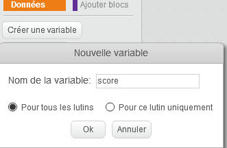

	Ecrire 'score' comme nom de la variable, assurez-vous que c'est disponible pour tous les lutins et cliquez 'ok' pour la créer. Vous verrez alors beaucoup de blocs de code qui peuvent être utilisés avec votre variable 'score' {.blockdata}.

	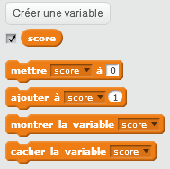

	Vous verrez aussi le score en haut à gauche votre écrant de visualisation.

	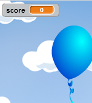

+ Quand un nouveau jeu est commencé (en cliquant sur le drapeau), vous voulez mettre le score du joueur à 0. Ajoutez ce code au sommet du ballon ` quand drapeau pressé ` {.blockevents} :

	```blocks
	mettre [score v] à [0]
	```

+ Quand un ballon est explosé, vous devez ajouter 1 au score :

	```blocks
		quand ce lutin est cliqué 
		basculer sur costume [burst v]
		jouer le son [pop v]
		attendre (0.3) secondes
		ajouter à [score v] à (1)
		cacher
	```

+ Exécutez votre programme de nouveau et cliquez sur le ballon. Votre score change-t-il ?

## Sauvegarder votre projet { .save }

# Étape 5 : Beaucoup de ballons { .activity }

1 ballon sautant n'est pas un super jeu, donc ajoutons beaucoup plus de ballon!

Une façon simple d'obtenir beaucoup de ballons est juste de faire un clic droit sur le lutin  ballon et de cliquez sur 'dupliquer' .Ceci est bien si vous en voulez seulement quelques-uns, mais si vous avez besoin 20 ? Ou 100 ? Allez-vous vraiment cliquer sur 'dupliquer' plusieurs fois ?

## Liste de contrôle d'Activité { .check }

+ Une bien meilleure façon d'obtenir beaucoup plus de ballons est de multiplier le lutin ballon

	Traînez votre code ballon ` quand drapeau pressé `{.blockevents} (Sauf le block ` score` {.blockdata}) de l'événement (ne le supprimer pas) et ajouter le code pour créer 20 clones de ballon.

    Vous pouvez maintenant attacher le code que vous venez d'enlever au block ` quand je commence comme un clone ` {.blockevents} Vous devriez aussi remplacer le block 'cacher' {.blocklooks} dans le block ballon cliqué avec un  `supprimer ce clone`` {.blockcontrol}.

	Votre code de ballon devrait maintenant y ressembler :

	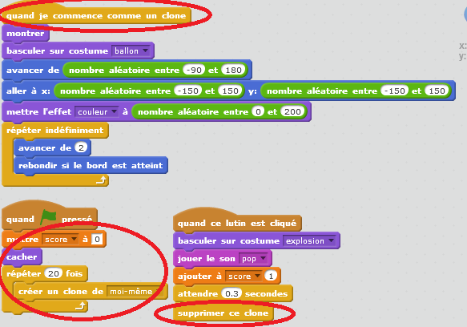

+ Testez votre projet! Maintenant quand le drapeau est cliqué, votre lutin de ballon principal se cachera et se multipliera ensuite 20 fois. Quand chacun de ces 20 clones est commencé, ils feront des rebond autour de l'écran aléatoirement, comme ils ont fait auparavant. Voir si vous pouvez faire sauter les 20 ballons!

## Sauvegarder votre projet { .save }

# Étape 6 : Ajout d'un minuteur { .activity }

Vous pouvez faire votre jeu devenir plus intéressant, en donnant seulement votre joueur 10 secondes pour éclater autant de ballon que possible.

## Liste de contrôle d'activité { .check }

+ Vous pouvez utiliser une autre variable pour stocker le temps restant laissé. Le cliquez sur l'onglet 'Données' et crée une nouvelle variable appelée 'temps' :

	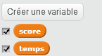

+C'est ainsi que le minuteur devrait marcher :

	 + le minuteur devrait commencer à 10 secondes;
	 + le minuteur devrait déclencher le compte à rebours chaque seconde;
	 + le jeu devrait s'arrêter quand le minuteur arrive à 0.

	Voici le code pour faire ceci, que vous pouvez ajouter à votre scène:

	```blocks
		quand le drapeau cliqué
		mettre [time v] à [10]
		répéter jusqu'a <(time) = [0]>
			attendre (1) secondes
			mettre [time v] à (-1)
		end
		stop [all v]
	```

	Ajouter le code ` répéter jusqu'à `{.blockcontrol}`temps`{.blockdata}`= 0`{.blockoperators}, d'abord vous devra traîner un bloc vert `=` {.blockoperators}, sur votre block ` répéter jusqu'à ` {.blockcontrol} :

	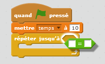

	Vous pouvez alors traîner votre variable 'temps' {.blockdata} sur le block `=` {.blockoperators}:

	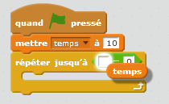

+Traînez l'affichage de la variable 'temps' sur le côté de la scène. Vous pouvez aussi faire un clic droit sur l'affichage variable et cliquer sur 'gande lecture' pour changer comment le temps est affiché.

	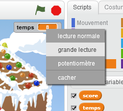

+ Testez votre jeu. Combien de points pouvez-vous marquer? Si votre jeu est trop facile, vous pouvez:

	+ Donner moins de temps au joueur;
	 + Avoir plus de ballons;
	 + Faire se déplacer plus rapidement les ballons;
	 + Faire des ballons plus petits.

	Testez votre jeu à plusieurs reprises jusqu'à ce que vous soyez heureux et que vous avez trouvez le bon niveau de difficultée.

## Sauvegarder votre projet { .save }

## Défi : Plus d'objets{.challenge}


Pouvez-vous ajouter d'autres objets à votre jeu ? Vous pouvez ajouter de bons objets, comme des beignets, qui vous donnent beaucoup de points, ou de mauvais objets, comme des chauves-souris, qui prennent des points.

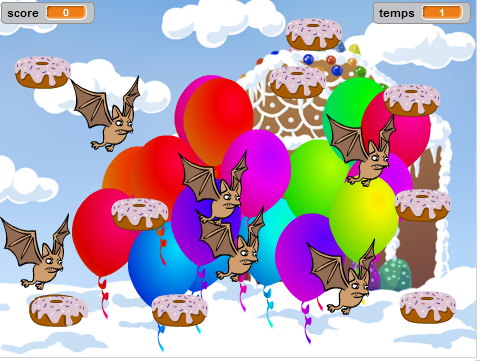

Vous devrez penser aux objets que vous aller ajoutez. Pensez y :

+ Combien seront-ils  ?
+ De quelle taille seront-ils ? Comment se déplace-t-il ?
+ Combien de points marquerez-vous en cliquant dessus ?
+ Se déplacera-t-il plus rapidement ou plus lentement que les ballons ?
+ De quoi aura-t-il l'air quand il sera cliquer ?

Si vous avez besoin d'aide pour ajouter un autre objet, vous pouvez réutiliser les étapes ci-dessus!

## Sauvegarder votre projet { .save }
