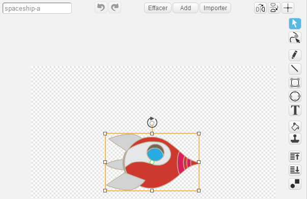

---
title: Lost in Space — Notes for Club Leaders
language: en-GB
embeds: "*.png"
materials: [""]
...

#Introduction:
In this project, children will learn how to combine code blocks to create a simple animation.

#Resources
For this project, Scratch 2 should be used. Scratch 2 can either be used <a href="http://scratch.mit.edu/projects/editor/">online</a> or <a href="http://scratch.mit.edu/scratch2download/">offline</a>.

You can find a completed version of this project <a href="http://scratch.mit.edu/projects/26818098/#editor">online</a>, or it can be downloaded by clicking the 'Download Project Materials' link for this project, which contains:

+ LostInSpace.sb2

#Learning Objectives
+ Sprites;
+ Sequential code blocks;
+ Events;
+ Loops:
	+ `Repeat` {.blockcontrol} loops;
	+ `Forever` {.blockcontrol} loops.

#Challenges
+ "Adding another sprite" - adding a sprite to a project;
+ "Improving your animation" - altering the numbers in a short program;
+ "Make your own animation" - applying the learning to make a new animation.

#Frequently Asked Questions
+ Children may need reminding to 'reset' a sprite's position, size and other effects at the start of their animation. This can be easily achieved by adding some of the following blocks to the start of their animations:

```blocks
	go to x:(0) y:(0)
```

```blocks
	set size to (100)%
```

```blocks
	clear graphic effects
```

+ The 'spaceship' sprite will move sideways unless it is rotated 90 degrees clockwise. Rotating the spaceship is part of the project instructions, but another sprite can be substituted for the spaceship if this is causing problems.

	