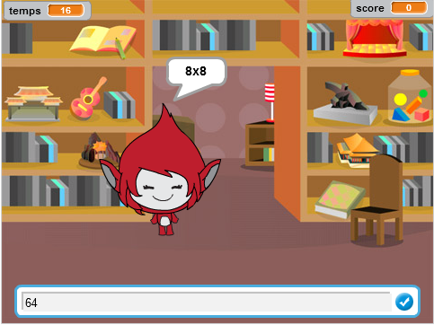
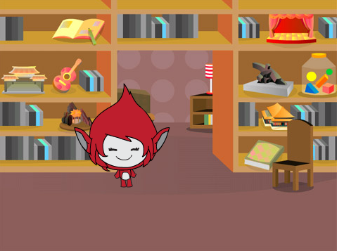
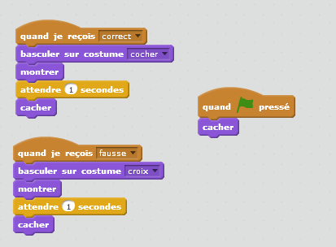

# Introduction { .intro }

Dans ce projet vous apprendrez à créer un questionnaire sur les tables de multiplication, dans lequel vous devez obtenir autant de réponses corrects que vous pouvez en 30 secondes.

<div class="scratch-preview">
 <iframe allowtransparency="true" width="485" height="402" src="https://scratch.mit.edu/projects/embed/42225768/?autostart=false" frameborder="0"></iframe>
 
</div>

# Étape 1 : Création de questions { .activity }

Commençons en créant des questions aléatoires pour le joueur.

## Liste de contrôle d'Activité { .check }

+ Commencez un nouveau projet Scratch et supprimez le lutin de chat pour que votre projet soit vide. Vous pouvez trouver l'éditeur Scratch en ligne à <a href="http://jumpto.cc/scratch-new">jumpto.cc/scratch-new</a>.

+ Choisissez un personnage et un fond pour votre jeu. Vous pouvez choisir ce que vous aimez! Voici un exemple :

	

+ Créez 2 nouvelles variables appelées ` numéro 1` {.blockdata} Et 'numéro 2'{.blockdata}. Ces variables stockeront les 2 nombres qui seront multipliés ensemble.

	

+ Ajoutez le code à votre personnage, mettre ces deux variables 'nombre aléatoire entre' {.blockoperators} 2 et 12.

	```blocks
		quand le drapeau pressé
		ajouter [numéro 1 v] au (nombre aléatoire (2) à (12))
		ajouter [numéro 2 v] au (nombre aléatoire (2) à (12))
	```

+ Vous pouvez alors demander au joueur la réponse et le laisser savoir si c'étaient vrais ou faux.

	```blocks
		quand le drapeau pressé
		ajouter [numéro 2 v] à (nombre aléatoire (2) à (12))
		demander (regroupe (numéro 1)(regroupe [ x ] (numéro 2))) et attendre
		si <(réponse) = ((numéro 1)*(numéro 2))> alors
			dire [oui! :)] pendant (2) secondes
		sinon
			dire [non :(] pendant (2) secondes
		end
	```

+ Testez votre projet entièrement, en répondant une fois correctement et une fois avec une mauvaise réponse.

+Ajoutez la boucle 'répéter indéfiniment' {.blockcontrol} autour de ce code, pour que le joueur ai une infinie de questions.

+ Créez un minuteur sur l'étape, utilisant une variable appelée 'temps' {.blockdata}. Le projet 'GhostBuster' possède des instructions pour faire un minuteur (dans l'étape 6) si vous avez besoin d'aide!

+ Testez votre projet de nouveau , vous devriez pouvoir continuer à poser des questions jusqu'à ce que le temps s'écouler.

## Sauvegarder votre projet { .save }

## Défi : Changement de costumes{.challenge}

Pouvez-vous changer les costumes de votre personnage, pour qu'ils ressemble à la réponse du joueur ?


## Défi : Ajout d'un score {.challenge}

Pouvez-vous ajouter un score à votre jeu? Vous pouvez ajouter un point pour chaque réponse correcte. Si vous vous sentez moyens, vous pourriez même remettre le score du joueur à 0 s'ils obtiennent une question fausse!

## Sauvegarder votre projet { .save }

# Étape 2 : jeux multiples{ .activity .new-page}

Ajoutons un bouton 'jeu' à votre jeu, pour que vous puissiez jouer longtemps.

## Liste de contrôle d'Activité { .check }

+ Créez un nouvel lutin de bouton 'Jouer', sur lequel votre joueur cliquera pour commencer un nouveau jeu. Vous pouvez le dessiner vous-même, ou éditer un lutin de la bibliothèque de scratch.

	

+ Ajoutez ce code à votre nouveau bouton.

	```blocks
		quand le drapeau pressé
		montrer

		quand le drapeau pressé
		cacher
		envoyer à tous [début v]
	```

	Ce code montre le bouton de jeu quand votre projet est commencé. Quand le bouton est cliqué, il est caché et émet ensuite un message qui commencera le jeu.

+ Vous devrez éditer le code de votre personnage, pour que le jeu commence quand ils reçoivent le message 'début' {.blockevents} et pas quand le drapeau est cliqué.

	Remplacez le code ` quand le drapeau cliqué ` {.blockevents} par ` quand je reçois le début `{.blockevents}.

	

+ Cliquez sur le drapeau vert et cliquez ensuite sur votre nouveau bouton de jeu pour le tester. Vous devriez voir que le jeu ne commence pas si le bouton n'est cliqué.

+ Avez-vous remarqué que le minuteur commence quand le drapeau vert est cliqué et pas quand le jeu commence ?

	

	Pouvez-vous réparer ce problème ?

+ Le clic sur l'étape et remplace le bloc 'arrêter tout'  {.blockcontrol} avec un message 'fin' {.blockevents}.

	

+ Vous pouvez maintenant ajouter ce code à votre bouton, pour le montrer de nouveau à la fin de chaque jeu.

	```blocks
		quand je reçois [end v]
		montrer
	```

+ Vous devrez aussi arrêter votre personnage qui pose des questions à la fin de chaque jeu :

	```blocks
		quand je reçois [end v]
		stop [D'autres scénarios dans lutin v]
	```

+ Testez votre bouton de jeu en jouant deux ou trois fois. Vous devriez remarquer que le bouton de jeu apparaît après chaque jeu. Pour tester plus facilement, vous pouvez raccourcir chaque jeu, pour qu'il dure seulement quelques secondes.

	```blocks
		mettre [time v] à [10]
	```

+ Vous pouvez même changer l'apparence du bouton quand la souris passe dessus.

	```blocks
		quand le drapeau pressé
		montrer
		répéter indéfiniment
		si <touché [pointeure de souris v]?> alors
			mettre l'effet [oeil de poisson v] à (30)
		else
			mettre l'effet [oeil de poisson v] à (0)
		end
		end
	```

	

## sauvegarder votre projet { .save }

## Défi : écran de début{.challenge}
Pouvez-vous ajouter un autre fond à votre étape, qui deviendra l'écran de début de votre jeu ? Vous pouvez utiliser les blocs ` quand je reçois début ` {.blockevents} et ` quand je reçois fin` {.blockevents} pour commuter entre des fonds.

Vous pouvez aussi montrer et cacher votre personnage votre minuteur en utilisant ces blocs :
```blocks
montrer la variable [time v]
```
```blocks
cacher la variable [time v]
```


## Sauvegarder votre projet { .save }

# Étape 3 : Ajout de graphisme { .activity .new-page}

Au lieu de votre personnage disant juste ` oui! :) ` ou ` non ` , ajoutons un graphisme qui permet au joueur de savoir si la réponse est correct ou non.

+ Créez un nouvel lutin appelé 'le Résultat', contenant les costumes 'coché' et ' croix '.

	

+ Changez le code de votre personnage, pour qu'au lieu de dire `oui` et `non`, cela émette les messages 'correct'{.blockevents} et 'mal' {.blockevents}.

	

+ Vous pouvez maintenant utiliser ces messages pour montrer 'coché' ou ' croix '. Ajoutez ce code à votre nouveau lutin 'résultat' :

	

+ Testez votre jeu de nouveau. Vous devriez voir un coché quand vous obtenez une question correcte et une croix quand vous avez une mauvaise réponse!

	

+ Avez-vous remarquer que le code ` quand je reçois correct ` {.blockevents} et ` quand je reçois mal ` {.blockevents} est presque identique ? Créons une fonction pour rendre la modifiation du code plus facile.

	Sur votre lutin 'Résultat', cliquez sur ` Ajouter blocs ` {.blockmoreblocks}, Et ensuite ' Créer un Bloc '. Créez une nouvelle fonction appelée 'animée' {.blockmoreblocks}.

	

+Vous pouvez alors ajouter le code d'animation dans votre nouvelle fonction d'animation et utiliser ensuite la fonction deux fois:

	

+ Maintenant, si vous voulez montrer l'animation plus longtemps, vous devez seulement faire un changement à votre fonction. Essayez!

+ Au lieu de juste montrer et cacher le coche et la croix, vous pourriez changer votre fonction d'animation, pour que le graphisme fasse apparaître en fondu..

	```blocks
		definir [animé]
		mettre l'effet [fantôme v] à (100)		
		montrer
		répéter (25)
			ajouter à l'effet [fantôme v] (-4)
		end
		cacher
	```

## Sauvegarder votre projet { .save }

## Défi : animation Améliorée {.challenge}

Pouvez-vous améliorer l'animation de votre graphisme? Vous pourriez coder le coche et la croix pour qu'ils fassent disparaître en fondu aussi bien que fassent apparaître en fondu. Ou, vous pourriez utiliser d'autres effets:


## Sauvegarder votre projet { .save }

## Défi : Son et musique {.challenge}

Pouvez-vous ajouter des effets sonores et de la musique à votre jeu ? Par exemple :

+ Jouer un son quand le joueur obtient une réponse vrai ou faux;
+ Ajouter un son coché a votre minuteur;
+ Jouer un son quand le temps est fini;

	```blocks
		jouer du tambour (10 v) pendant (0.1) temps
	```

+ Vous pourriez aussi passer de la musique en boucle (si vous n'êtes pas sûrs comment le faire, l'étape 4 du projet de 'Rock Band' vous aidera.

## Sauvegarder votre projet { .save }

## Défi : Course à 10 points {.challenge}

Pouvez-vous changer votre jeu, pour qu'au lieu de répondre à autant de questions qu'ils peuvent en 30 secondes, le joueur doit rapidement obtenir 10 questions correctes ?

Pour ceci faire, vous devrez seulement changer votre code de minuteur. Pouvez-vous voir ce qui doit être changé ?

```blocks
	quand je reçois [début v]
	mettre [temps v] à (30)
	répéter jusqu'à <(temps) = [0]>
		attendre (1) secondes
		ajouter à [temps v] (-1)
	end
	envoyer à tous [fin v]
```

## Sauvegarder votre projet { .save }

## Défi : écran d'instruction{.challenge}

Pouvez-vous ajouter un écran d'instructions à votre jeu, disant a votre joueur comment jouer au jeu ? Vous aurez besoin d'un bouton 'Instructions' et une autre image de fond.


Vous pouvez aussi avoir besoin d'un bouton 'retour' pour vous rendre au menu principal.

```blocks
	envoyer à tous [menu principal v]
```

## Sauvegarder votre projet { .save }
