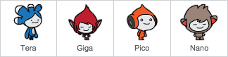
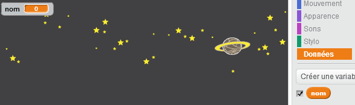
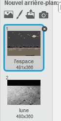

# Introduction { .intro }

Vous allez apprendre à programmer votre propre robot parlant!

<div class="scratch-preview">
 <iframe allowtransparency="true" width="485" height="402" src="https://scratch.mit.edu/projects/embed/26762091/?autostart=false" frameborder="0"></iframe>
 
</div>

#Étape 1 : Votre robot parlant { .activity }

## Liste de contrôle d'Activité { .check }

+ Avant que vous ne commenciez à faire votre chatbot, vous devez choisir leur personnalité.
	 + Quels sont leurs prénoms ?                                                                                                 
	 + Où habitent-ils ?
	 + Est-ce qu'ils sont heureux ? Sérieux ? Drôles ? Timides ? Amicaux ?

+ Commencez un nouveau projet de Scratch et supprimez le lutin de chat pour que votre projet soit vide. Vous pouvez trouver l'éditeur scratch en ligne à <a href="http://jumpto.cc/scratch-new">jumpto.cc/scratch-new</a>.

+ Choisissez un de ces lutins et ajoutez-le à votre projet :

	

+ Choisissez un fond qui correspond à la personnalité de votre chatbot. Voici un exemple, bien que le vôtre ne doit pas ressembler à celui-ci :

	

## Sauvegarder votre projet { .save }

# Étape 2: Un chatbot parlant { .activity }

Maintenant que vous avez un chatbot avec une personnalité, programmons-le pour qu'il puisse vous parler.

## Liste de contrôle d'activité { .check }

+ Cliquez sur votre personnage chatbot et ajoutez ce code :

	```blocks
		quand ce lutin est cliqué
		demander [Hé! Comment vous appelez-vous ?] et attendre
		dire [Quel charmant 
		!] pendant (2) secondes
	```

+ Cliquez sur votre chatbot pour le tester. Lorsque l'on vous demande votre nom, tapez-le dans la boîte de dialogue en bas de l'étape.

	

+  Votre chatbot répond simplement `Quel nom charmant !` à chaque fois. Vous pouvez personnaliser la réponse de votre chatbot, en vous servant de la réponse de l'utilisateur. Changez le code du chatbot, comme ceci :

	```blocks
		quand ce lutin est cliqué
		demander [Hey! Comment vous appelez-vous?] et attendre
		dire <regroupe [salut] (Réponse)> pendant (2) secondes
	```

	Pour créer le dernier bloc, vous devrez ajouter un bloc vert `regroupe` {.blockoperators} et déplacer celui-ci sur le bloc `dire` {.blocklooks}.

	

	Vous pouvez alors changer le texte `bonjour` et dire `salut`, et puis déplacer le bloc bleu clair `réponse` {.blocksensing} ( dans la section 'capteur') sur le texte `Monde`.

	

+ Testez ce nouveau programme. Est-ce qu'il marche comme vous le voulez ? Pouvez-vous réparer les problèmes que vous pouvez voir ? (PS: vous pouvez essayer d'ajouter un espace quelque part !)

+ Peut-être que vous voulez stocker le nom de l'utilisateur dans une variable pour que vous puissiez l'utiliser de nouveau plus tard. Créez une nouvelle variable appelée `nom` {.blockdata}. Si vous avez oublié comment faire ceci, le projet 'Ballons' vous aidera.

+ Les informations que vous avez entrées sont déjà stockées dans une variable spéciale appelée `réponse` {.blocksensing}. Allez dans le groupe de blocs 'capteur' et cliquez sur le bloc de réponse pour qu'une case cochante apparaisse. La valeur actuelle dans `réponse` {.blocksensing} devrait alors s'afficher en haut à gauche de l'étape.

+ Une fois que vous avez créé votre nouvelle variable, assurez-vous que le code de votre chatbot ressemble à ceci :

	```blocks
		quand ce lutin est cliqué
		demander [Hey! Comment t'appelles-tu?
		mettre [nom v] à (réponse)
		dire <regroupe [Sava] (nom)> pendant (2) secondes
	```

+ Si vous testez votre programme de nouveau, vous remarquerez que la réponse est stockée dans le `nom` {.blockdata} en montrant la variable en haut à gauche de l'étape. La variable `nom` {.blockdata} devrait maintenant contenir la même valeur que la variable `réponse` {.blocksensing}.

	

	Si vous ne désirez pas voir les variables sur cette étape, vous pouvez décocher à côté des noms de variables dans les onglets pour les cacher.

## Sauvegarder votre projet{ .save }

## Défi : Plus de questions { .challenge }

Programmez votre chatbot pour poser une autre question. Pouvez-vous stocker la réponse dans une variable ?


## Sauvegarder votre projet { .save }

# Étape 3 : Prendre des décisions { .activity }

Vous pouvez programmer votre chatbot pour décider que faire, en fonction des réponses de l'utilisateur.

## Liste de contrôle d'activité { .check }

+ Posons une question à votre chatbot et l'utilisateur qui répond `oui` ou `non`. Voici un exemple, mais vous pouvez changer la question si vous voulez:

	```blocks
		quaand ce lutin est cliqué
		demander [Hey! Comment t'appelles-tu?] et attendre
		mettre [nom v] à (réponse)
		dire <regroupe [Hi ] (nom)> pendant (2) secondes
		demander <regroupe [Tu vas bien?] (nom)> et attendre
		si ((réponse)=[oui]) alors
			dire [ C'est super ] pendant (2) secondes
		end
	```

+ Pour tester ce programme correctement, vous devrez le tester deux fois - une fois en tapant "non" et une fois en tapant 'oui'. Vous devriez seulement obtenir une réponse de votre chatbot `if` {.blockcontrol} vous répondez `oui`.

+ Les difficultés avec votre chatbot sont qu'il ne vous donnera pas de réponse si l'utilisateur répond `non`. Vous pouvez réparer cela en changeant le block `if` {.blockcontrol} par un block `if/else` {.blockcontrol}.
	```blocks
		quand ce lutin est cliqué
		demander [Hey! Comment vous appelez-vous ?] et attendre
		mettre [nom v] à (réponse)
		dire <regroupe [Hi ] (nom)> pendant (2) secondes
		demander <regroupe [Vous allez bien? ] (nom)> et attendre
		si ((réponse)=[oui]) alors
			dire [C'est super !] pendant (2) secondes
		sinon
			dire [Oh non!] pendant (2) secondes
		end
	```

+ Si vous testez votre code, vous verrez maintenant que vous obtenez une réponse quand vous répondez 'oui' ou 'non'. Votre chatbot devrait répondre 'c'est super !' ` quand vous répondez 'oui', mais répondrez avec 'Oh non!' quand vous tapez quoi que ce soit d'autre que 'oui' (`sinon` {.blockcontrol} signifie ' sinon ').
	

+ Vous pouvez mettre n'importe quel code à l'intérieur d'un block `si` {.blockcontrol} ou `sinon` {.blockcontrol}, et non seulement faire parler votre chatbot. Par exemple, vous pouvez changer le costume du chatbot pour correspondre à la réponse.

	Si vous regardez les costumes de votre chatbot, vous pouvez voir qu'il y en a plusieurs. (Sinon, vous pouvez toujours en ajouter vous-même!)

	

	Vous pouvez utiliser ces costumes dans le cadre de la réponse de votre chatbot, en utilisant ce code :

	```blocks
		quand ce lutin est cliqué
		basculer sur costume [nano-a v]
		demander [Hey! Comment vous appelez-vous ?] et attendre
		mettre [nom v] à (réponse)
		dire <regroupe [Sava ] (nom)> pendant (2) secondes
		demander <regroupe [Vous allez bien?] (nom)> et attendre
		si ((réponse)=[youi]) alors
			basculer sur costume [nano-c v]
			dire [C'est super pour entendre!] pendant (2) secondes
		sinon
			basculer sur costume [nano-d v]
			dire [Oh non!] pendant (2) secondes
		end
	```

	

## Sauvegader votre projet { .save }

## Défi : Plus de décisions { .challenge }

Programmez votre chatbot pour lui poser une autre question - quelque chose avec un 'oui' ou 'aucune' réponse. Votre chatbot peut-il répondre à la question?


## Sauvegader votre projet { .save }

# Étape 4 : Changement d'emplacement { .activity }

Vous pouvez aussi programmer votre chatbot pour changer son emplacement.

## Liste de contrôle d'Activité { .check }

+ Ajoutez un autre fond à votre étape, par exemple le fond 'lune'.

	

+ Vous pouvez maintenant programmer votre chatbot pour changer l'emplacement en ajoutant ce code à votre chatbot :

	```blocks
		 demander [je vais à la lune. Voulez-vous venir avec moi ?] et attendre
		si ((réponse) = [oui]) alors
			basculer sur l'arrière-plan [lune v]
		end
	```


	

+ Testez votre programme et répondez 'oui' si vous voulez aller sur la lune. Vous devriez voir que l'emplacement du chatbot a changé.

	

+ Votre chatbot change-t-il d'emplacement si vous ne tapez pas ? Qu'arrive-t-il lorsque vous tapez ` je ne suis pas sûr ` ?

## Sauvegarder votre projet { .save }

##Défi : Créer votre propre chatbot {.challenge}
Utilisez ce que vous avez appris pour finir de créer votre chatbot intéractif. Voici quelques idées :


Une fois que vous avez complété votre chatbot, demandez à vos amis d'avoir une conversation avec lui! Aiment-ils votre personnage ? Ont-ils découvert des problèmes ?

## Sauvegader votre projet { .save }
