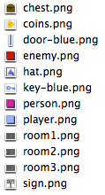
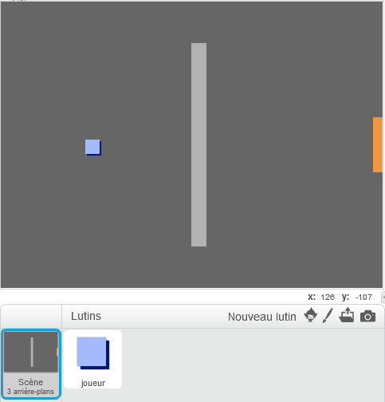
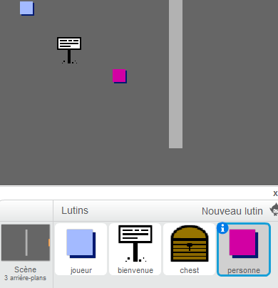
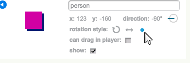
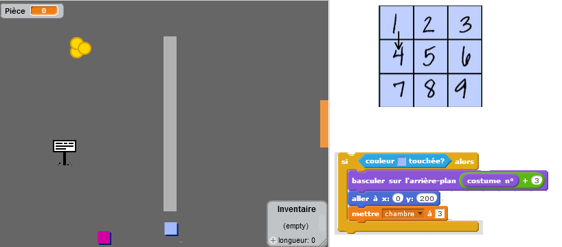

# Introduction { .intro }

Ce projet vous permettra d'apprendre comment créer votre propre monde pour un jeu d'aventure.

<div class="scratch-preview">
 <iframe allowtransparency="true" width="485" height="402" src="https://scratch.mit.edu/projects/embed/34248822/?autostart=false" frameborder="0"></iframe>
 
</div>

# Première étape : Coder votre joueur { .activity }

Commençons par créer un personnage qui pourra se déplacer dans votre monde. 

## Liste d'action pour l'activité { .check }

+ Commencez un nouveau project de Scratch et supprimez le lutin de chat pour que votre projet soit vide. Vous pouvez trouver l'éditeur scratch en ligne à  <a href="http://jumpto.cc/scratch-new">jumpto.cc/scratch-new</a>.

+ Pour ce projet, vous devriez trouver un dossier "ressources projet" contenant toutes les images dont vous aurez besoin. Assurez-vous de bien l'avoir et contactez le leader de votre club si vous ne le trouvez pas.

	

+ Ajoutez l'image "Salle1.png" comme arrière-plan et utilisez l'image "Joueur1.png" comme photo. Si vous ne trouvez pas ces images, dessinez-les vous même! Votre projet devrait maintenant ressembler à ceci:

	

+ Utilisons les touches directionnelles pour faire bouger le joueur. Lorsque le joueur appuie sur le flèche du haut, le personnage doit monter. Cela se fait en changeant les coordonnées Y. Ajoutez ce code au joueur:

	```blocks
	quand ⚑ pressé
	répéter indéfiniment
 	si <touche [flèche haut v] pressée?> alors
      	ajouter (2) à y
  	fin
	fin
	```

+ Testez votre joueur en cliquant le drapeau et en maintenant la flèche du haut. Votre joueur monte-t-il?

	

+ Pour que votre joueur puisse bouger vers la gauche, vous devez ajouter un nouveau code `if` {.blockcontrol}, ce qui modifiera la coordonnée X:

	```blocks
	quand ⚑ pressé
	répéter indéfiniment
 	  si <touche [flèche haut v] pressée?> alors
      	ajouter (2) à y
   	fin
   	si <touche [flèche gauche v] pressée?> alors
      	ajouter (-2) à x
   	fin
	fin
	```

## Défi : Bouger dans toutes les directions {.challenge}
Pouvez-vous ajouter du codage supplémentaire à votre joueur pour qu'il puisse se déplacer vers le haut, le bas, la gauche et la droite? Utilisez le code que l'on vous a donné pour faciliter la tâche!

## Sauvegarder votre projet { .save }


+ Testez votre joueur de nouveau et vous verrez qu'il aura la capacité de marcher à travers les murs gris clairs.
	

+ Pour remédier à ce problème, vous devez bouger le joueur et le faire revenir sur ses pas s'il touche un mur gris clair. Voici le code qui vous permettra d'y parvenir :

	```blocks
	quand ⚑ pressé
	répéter indéfiniment
 	si <touche [flèche haut v] pressée?> alors
      	ajouter (2) à y
      	si <couleur [#BABABA] touchée?> alors
         ajouter (-2) à y
     	fin
   	fin
	fin
	```

	Remarquez que le nouveau code `if`{.blockcontrol}`touching color`{.blocksensing} est situé dans le code `if`{.blockcontrol}`key [up arrow]`{.blocksensing}

+ Testez ce nouveau code en deplaçant votre joueur vers le mur - vous ne devriez plus pouvoir le traverser.

	

+ Faisons la même chose pour la commande de flèche gauche en reculant si le joueur touche un mur. Le code de votre joueur devrait ressembler à ceci :

	

## Défi : Régler les mouvements de votre joueur {.challenge}
Ajoutez du codage à votre joueur pour qu'il ne puisse plus marcher à travers les murs dans chaque direction. Utilisez le code que vous avez déjà pour faciliter la tâche!

## Sauvegarder votre projet { .save }

# Deuxième étape : Coder votre monde { .activity }

Faisons en sorte que votre joueur puisse passer à travers les portes et dans d'autres salles!

## Liste d'action pour cette activité { .check }

+ Ajoutez 2 arrière-plans à votre monde ('room2.png' et 'room3.png'), vous devriez avoir 3 arrière-plans au total. Assurez-vous qu'ils sont dans le bon ordre - sinon, cela compliquera les choses par la suite.

	

+ Il vous faut une nouvelle variable appellée `salle` {.blockdata} afin de savoir dans quelle pièce votre joueur se trouvera.

	

+ Lorsque le joueur touche la porte orange dans la première pièce, le prochain arrière-plan devrait apparaître et le personnage devrait se retrouver sur le côté gauche de l'écran. Voici le code dont vous aurez besoin - celui-ci devrait se retrouver au sein de la boucle `forever` {.blockcontrol} de ton joueur :

	```blocks
	si <couleur [#F2A24A] touchée?> alors
   	basculer sur l'arrière-plan [arrière-plan suivant v]
   	aller à x:(-200) y:(0)
   	ajouter à [room v] (1)
	fin
	```

+ Ajoutez ce code au début du code de votre joueur (avant la boucle `forever` {.blockcontrol}) pour vous assurer que tout soit remis a zéro lorsque le drapeau est cliqué.

	```blocks
	[room v] prend la valeur (1)
	aller à x:(-200) y:(0)
	basculer sur l'arrière-plan [room1 v]
	```

+ Cliquez sur le drapeau et positionnez votre joueur sur la porte orange. Votre personnage se déplace-t-il sur l'autre écran? La variable `room` {.blockdata} change-t-elle à 2?

	

## Défi : Vous déplacer dans la pièce précédente {.challenge}
Pouvez-vous déplacer votre joueur dans la pièce précédente lorsqu'il touche la porte jaune? Rappellez-vous que ce code sera _très_ similaire à celui que vous avez déjà ajouté pour le faire déplacer dans la pièce suivante.

## Sauvegarder votre projet { .save }

# Troisième étape : Signalisations { .activity }

Ajoutons des panneaux à votre monde pour guider votre joueur dans son voyage.

## Liste d'action pour cette activité { .check }

+ Téléchargez l'image 'sign.svg' en temps que nouveau "lutin" et renommez la 'Panneau de Bienvenue'

	
+ Ce panneau devrait uniquement être visible dans la première salle, alors ajoutons donc quelques lignes de code pour s'en assurer:

	```blocks
	quand ⚑ pressé
	répéter indéfiniment
   	si <(room) = [1]> alors
      	montrer
   	sinon
      	cacher
   	fin
	fin
	```

+ Testez votre panneau en vous déplaçant entre les salles. Le panneau ne devrait être visible que dans la première salle.

	

+ Un panneau n'est pas très utile s'il n'y a rien d'écrit dessus! Ajoutons quelques lignes de code (dans un block différent) pour afficher un message lorsque la panneau touche au joueur.

	```blocks
	quand ⚑ pressé
	répéter indéfiniment
   	si <[player v] touché?> alors
      	dire [Bienvenue ! Peux tu trouver le trésor ?]
   	sinon
      	dire []
   	fin
	fin
	```

+ Testez votre panneau, vous devriez voir le message lorsque votre joueur le touche.

	

## Sauvegarder votre projet { .save }

## Défi : Trésor ! {.challenge}
Faites un clic droit sur le lutin de coffre à trésor et choissez 'show'. Pouvez-vous faire apparaître un coffre à trésor uniquement dans la salle 3 et avoir un message qui affiche 'Bravo !' lorsque le joueur le touche?


## Sauvegarder votre projet { .save }

# Quatrième étape : Les gens { .activity }

Ajoutons d'autres lutins à votre monde pour que votre joueur puisse interagir avec eux.

## Liste d'action pour cette activité  { .check }

+ Ajoutez un nouveau lutin en utilisant l'image 'person.png'.

	

+ Ajoutez ce code pour que le lutin puisse parler à votre joueur. Ce code est très similaire à celui que vous avez écrit pour votre panneau :

	```blocks
	quand ⚑ pressé
	aller à x:(-200) y:(0)
	répéter indéfiniment
   	si <[player v] touché?> alors
      	dire [Savais-tu que tu peux traverser les portes jaunes et organges ?]
   	sinon
     	dire []
   	fin
	fin
	```

+ Vous pouvez également permettre à ce lutin de bouger en utilisant ces deux blocs :

	```blocks
	avancer de (1)
	rebondir si le bord est atteint
	```

	Le lutin se déplacera d'une façon différente selon l'endroit où vous placerez votre code : au sein de la boucle`forever` {.blockcontrol} ou dans le bloc `if` {.blockcontrol} . Essayez les deux et choisissez celui que vous préférez.

	

+ Avez-vous remarqué que le lutin marche sur la tête ? Pour empêcher cela, cliquez sur l'icône d'information du lutin (`i`{.blockmotion}) et cliquez sur le point pour régler les paramètres de rotation.

	

## Défi : Améliorer votre lutin {.challenge}
Pouvez-vous ajouter du codage à votre nouveau personnage pour qu'il n'apparaisse que dans la première salle ? Attention : n'oubliez pas de tester votre nouveau code !

## Sauvegarder votre projet { .save }

+ Vous pouvez également ajouter des ennemis qui feront la patrouille dans votre monde. Lorsque votre joueur les touchera, la partie se terminera. Ajoutez un ennemi et changez les paramètres de rotation, comme vous l'avez déjà fait pour le lutin.

+ Ajoutez les lignes de code à votre ennemi pour qu'il n'apparaisse que dans la deuxième salle.

+ Il ne reste qu'à ajouter le code pour terminer la partie si le joueur touche a l'ennemi. Cela sera plus facile à faire dans des blocs de code séparés. Le code de votre ennemi doit ressembler à cela :

	

+ Testez votre ennemi et assurez-vous:
	+ Qu'il ne soit visible que dans la deuxième salle
	+ Qu'il effectue la patrouille dans la salle
	+ Que la partie se termine si le joueur le touche

## Sauvegarder votre projet { .save }

## Défi : Plus d'ennemis {.challenge}
Pouvez-vous créer un ennemi dans la salle 3 qui fait la patrouille du haut en bas en passant par l'ouverture dans le mur ?


## Sauvegarder votre projet { .save }

# Cinquième étape : Collecter des pièces { .activity }

## Liste d'action pour cette activité { .check }

+ Ajoutez une nouvelle variable appelée `pièce` à votre projet {.blockdata}.

+ Faites un clic droit sur le lutin de piece et sélectionnez 'show'


+ Ajoutez du codage à votre pièce pour qu'elle n'apparaisse que dans la première salle.

+ Ajoutez du codage à votre 'lutin' de pièce pour ajouter '1' a votre nombre de pièces {.blockdata} dès que la pièce a été collectée :

	```blocks
	quand ⚑ pressé
	attendre jusqu’à <[player v] touché?>
	ajouter à [coins v] (1)
	stop [autres scripts du lutin v]
	cacher
	```

	Le code `stop other scripts in sprite` {.blockcontrol} est nécessaire pour que la pièce n'apparaisse plus dans la première salle lorsqu'elle a été collectée.

+ Il vous faut maintenant quelques lignes de code pour que le nombre de 'pièces' {.blockdata} soit à 0 au début du jeu.

+ Testez votre projet - Ammasser des pièces devrait changer votre score à 1.

## Défi : Plus de pièces {.challenge}
Pouvez-vous ajouter plus de pièces dans votre jeu ? Elles peuvent se trouver dans des salles différentes et certaines pièces peuvent même être gardées par des des ennemis qui font la patrouille !

# Sixième étape : Portes et clés { .activity }

## Liste d'action pour cette activité { .check }

+ Créez un nouveau lutin à partir de l'image 'Clé Bleue.svg'. Positionnez-vous dans votre arrière plan 3 et placez la clé quelque part difficile d'accès !

 	

+ Assurez-vous que la clé ne soit visible que dans la troisième salle.

+ Créez une nouvelle liste variable appelée 'inventaire' {.blockdata}. C'est ici que vous pouvez stocker tous les objets que votre joueur collectera durant la partie.

+ Le code pour collecter la clé est très similaire à celui pour collecter les pièces. La différence est que vous devez ajouter la clé à votre inventaire.

	```blocks
	quand ⚑ pressé
	attendre jusqu’à <[player v] touché?>
	ajouter [clef bleue] à [inventaire v]
	stop [autres scripts du lutin v]
	cacher
	```

+ Testez votre clé, essayez de la collecter et de l'ajouter dans votre inventaire. N'oubliez pas d'ajouter le code pour vider votre inventaire au début de la partie.  

	```blocks
	supprimer l'élément (tout v) de la liste [inventaire v]
	```

+ Créez un nouveau lutin avec l'image 'porte bleue.png' et placez la porte bleue dans un des trous sur les murs.

	

+ Ajoutez du codage à votre porte pour qu'elle ne soit visible que dans la troisième salle.

+ Il faut que la porte bleue disparaisse pour que votre joueur puisse passer lorsque vous avez la clé bleue dans votre inventaire.

	```blocks
	quand ⚑ pressé
	attendre jusqu’à <[Inventaire v] contient [clef bleue]>
	stop [autres scripts du lutin v]
	cacher
	```

+ Testez votre projet et regardez si vous pouvez collecter la clé bleue afin d'ouvrir la porte!

## Sauvegarder votre projet { .save }

## Défi : Créer votre propre monde {.challenge}
Vous pouvez maintenant continuer de créer votre propre monde. Quelques idées :

+ Changez les paramètres de votre jeu et de vos images ;
+ Ajoutez des sons et de la musique à votre jeu ;
+ Ajoutez des gens, ennemis, panneaux et pièces ;
+ Ajoutez des portes jaunes et rouges, accompagnées de leurs propres clés ;
+ Ajoutez des pièces à votre monde ;
+ Ajoutez d'autres objects utiles ;
+ Utilisez des pièces afin obtenir des informations des autres joueurs ;

	

+ Vous pourriez même ajouter des portes vers le nord et le sud pour que votre joueur puisse se déplacer dans toutes les directions. Par exemple, si vous aviez 3 salles, vous pourriez les positionner comme une grille 3x3. Vous pourriez ensuite ajouter 3 au numéro de la salle pour descendre d'un niveau.

	

## Sauvegarder votre projet { .save }

## Community Contributed Translation { .challenge .pdf-hidden }

This project was translated by Virginie Faivre. Our amazing translation volunteers help us give children around the world the chance to learn to code.  You can help us reach more children by translating a Code Club project via [Github](https://github.com/CodeClub/curriculum_documentation/blob/master/contributing.md) or by getting in touch with us at hello@codeclubworld.
