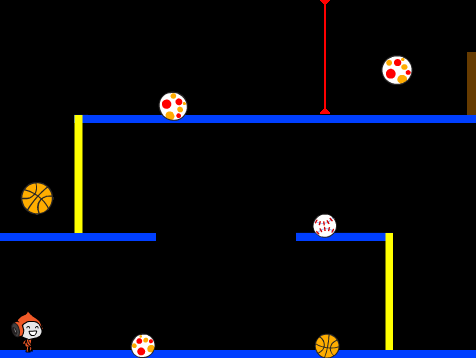
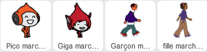
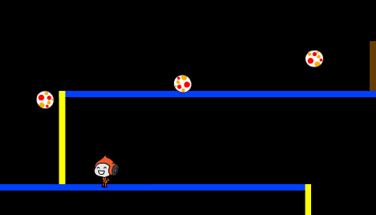

# Introduction { .intro }

Dans ce projet vous apprendrez à créer un jeu de plate-forme, dans lequel vous devez esquiver les balles qui se déplace et atteindre la fin du niveau.


<div class="scratch-preview">
 <iframe allowtransparency="true" width="485" height="402" src="https://scratch.mit.edu/projects/embed/39740618/?autostart=false" frameborder="0"></iframe>
 
</div>

# Etape 1 : mouvement de personnage  { .activity }

Commençons en créant un personnage qui peut se déplacer gauche et droit, aussi bien que monter aux poteaux.

## Liste de contrôle d'activité { .check }

+ Commencez un nouveau projet de Scratch et supprimez le lutin de chat pour que votre projet soit vide. Vous pouvez trouver l'éditeur de Scratch en ligne à <a href="http://jumpto.cc/scratch-new">jumpto.cc/scratch-new</a>.

+ Pour ce projet, vous devriez avoir un dossier de 'Ressources du Projet', contenant toutes les images dont vous aurez besoin. Assurez-vous que vous pouvez trouver ce dossier et demander à votre leader de club si vous ne trouvez pas cela.

	

+ Ajoutez l'image 'background.png' comme un nouveau fond de scène, ou dessinez le votre! Si vous dessinez votre propre niveau, assurez-vous juste que les poteaux et les planchers sont des couleurs différentes et qu'il y a une porte (ou quelque chose de semblable) que votre joueur doit atteindre. Voici à quoi doit ressembler votre projet :

	

+ Ajoutez un nouvel lutin, qui sera votre personnage. Il est meilleur si vous choisissez un lutin avec des costumes multiples, pour que vous puissiez le faire marcher.

	

+ Utilisons les touches de direction pour déplacer votre personnage. Quand le joueur appuie sur la flèche droite, vous voulez que votre personnage pointe à droit, se déplacent de quelques pas et changent de costume:

	```blocks
		quand le drapeau cliqué
		répéter indéfiniment
			si <touche [right arrow v] pressée? > alors
				avancer de (3)
				costume suivant
			end
		end
	```

+ Testez votre personnage en cliquant sur le drapeau et ensuite maintenez la touche de direction droite. Votre joueur se déplace-t-il à droite ? Votre personnage marche ?

	

+ Pour déplacer votre personnage à gauche, vous devrez ajouter un autre `si` {.blockcontrol} à l'intérieur de votre `répéter indéfiniment` {.blockcontrol}, pour déplace votre personnage à gauche. Rappelez-vous tester votre nouveau code, pour vous assurer ça marche !

+ Pour monter à un poteau, votre personnage devrait avancer légèrement en haut quand la flèche est appuyée et qu'il touche la couleur correcte. Ajoutez ce code à l'intérieur de votre personnage `répéter indéfiniment` {.blockcontrol} :

	```blocks
		Si < <touche [up arrow v] pressé?> et <couleur touche [#FFFF00]?> > alors
			ajouter (4) à y
		end
	```

+ Testez votre personnage  pouvez-vous monter aux poteaux jaunes et arriver à la fin de votre niveau ?

	

## Sauvegarder votre projet { .save }

## Défi : Achèvement du niveau {.challenge}
Pouvez vous ajouter plus de code à votre personnage, pour qu'ils disent quelque chose `si` {.blockcontrol} il arrive à la porte ?


## Sauvegarder votre projet { .save }

# Etape 2 : Gravité et bond { .activity }

Faites déplacer votre personnage avec plus avec réalisme, en ajoutant la gravité et en lui permettant de sauter.

## Liste de contrôle d'activité { .check }

+ Vous pouvez remarqué que votre personnage peut s'éloigner d'une plate-forme dans les airs. essayez de partir d'une plate-forme et voyez ce qui arrive.

	

+ Pour fixer ceci, ajoutons la gravité à votre jeu. Créez une nouvelle variable appelée `Gravité ` {.blockdata}. Vous pouvez cacher cette variable de votre scène si vous voulez.

	

+ Ajoutez ce nouveau bloc de code, qui met la gravité à un nombre négatif.Ceci va ensuite êtres utilisé à plusieurs reprises pour changer la coordonnée Y de votre personnage.

	```blocks
		quand le drapeau pressé
		mettre [gravity v] à [-4]
		répeter indéfiniment
			ajouter y par (gravity)
		end
	```

+ Cliquez sur le drapeau et traînez ensuite votre personnage au sommet de la scène. Qu'est-ce qui arrive ? La gravité marche-t-elle ?

	

+ La gravité ne devrait pas déplacer votre personnage par une plate-forme ou un poteau! Ajoutez un `si ` {.blockcontrol} à votre code, pour que la gravité marche seulement quand votre personnage est dans des airs. Le code de gravité devrait maintenant ressembler à ceci :

	```blocks
		quand le drapeau est pressé
		mettre [gravity v] à [-4]
		répéter indéfiniment
			Si < non < <couleur [#0000FF] touchée?> ou <couleur [#FFFF00] touchée?> > > alors
				ajouter y par (gravity)
			end
		end
	```

+ Testez la gravité de nouveau. Votre personnage s'arrête-t-il quand il est sur une plate-forme ou un poteau ? Pouvez-vous vous éloignez du bord des plates-formes ?

	

+  Faisons aussi un saut quand le joueur appuie sur la barre d'espace. Une façon très facile de faire ceci est de déplacer votre personnage en haut à plusieurs reprises, en utilisant ce code :

	```blocks
		quand [space v] est pressé
		répéter (10) fois
			ajouter (4) à y
		end
	```

	Comme la gravité pousse constamment votre caractère en bas par 4 pixels, vous devez choisir un nombre plus grand que 4 dans votre ` Changer y par (4) ` {.blockmotion}. Changez ce nombre jusqu'à ce que vous soyez heureux avec la hauteur de vos sauts.


+ Si vous testez ce code, vous remarquerez que ça marche, mais le mouvement n'est pas très lisse. Pour faire l'apparence d'un saut plus lisse, vous devrez déplacer votre personnage par des quantités de plus en plus petites, jusqu'à ce qu'ils ne sautent pas désormais.

+ Pour ceci faire, créez une autre variable appelée `hauteur saut` {.blockdata}. De nouveau, vous pouvez cacher cette variable si vous préférez.

+ Supprimer le premier code pour sauter que vous avez ajouté à votre personnage et remplaceé le pas ce code :

	```blocks
		quand [space v] est pressé
		mettre [hauteur saut v] à [8]
		répéter jusqu'à < (hauteur saut) = [0] >
			ajouter (hauteur saut) à y
			ajouter [hauteur saut v] à (-0.5)
		end
	```

	Ce code déplace votre personnage en haut par 8 pixels, alors 7.5 pixels, alors 7 pixels, ect... jusqu'à ce que votre personnage ait fini de sauter.

+ Changez la valeur de départ de votre `hauteur saut` {.blockdata} et tester jusqu'à ce que vous heureux avec la hauteur vos sauts.

## Sauvegarder votre projet { .save }

## Défi : bond Amélioré {.challenge}
Votre personnage peut sauter quand la barre d'espace est appuyée, même s'il est  déjà dans des airs. Vous pouvez tester ceci par le maintien de la barre d'espace. Pouvez-vous réparer ceci, pour que votre personnage puisse seulement sauter 'si' {.blockcontrol} il touche une plate-forme

## Sauvegarder votre projet { .save }

# Etape 3 : balles { .activity .new-page}

Maintenant que vous avez votre déplacement de personnage, ajoutons quelques balles que votre personnage pour éviter.

## Liste de contrôle d'activité { .check }

+ Créez un nouveau lutin de balle. Vous pouvez choisir n'importe quel type de balle que vous aimez.

	

+ Redimensionnez votre balle, pour que votre personnage puisse y sauter. Essayez de sauter sur la balle pour le tester.

	

+ Ajoutez ce code à votre balle :

	

	Ce code crée une nouvelle balle toutes les 3 secondes. Chaque nouveau clone avance le long de la plate-forme supérieure.

+ Cliquez sur le drapeau pour tester ceci .

	

+ Ajoutez plus de code à votre lutin de balle, pour qu'ils traversent toutes les 3 plates-formes.

	

+ Finalement, vous aurez besoin du code pour quand votre personnage est frappé par une balle! Ajoutez ce code à votre lutin de balle :

	```blocks
		quand je commence comme un clone
		répéter indéfiniment
			Si < touché [Pico walking v]? > alors
				envoyer à tous [hit v]
			end
		end
	```

+ Vous devrez aussi ajouter ce code à votre caractère, reculer au début quand il est frappé:

	```blocks
		quand je recois [hit v]
		s'orienter à  (90 v)
		aller à x: (-210) y: (-120)
	```

+ Testez votre personnage et voyez s'il retourne au début quand il est frappé par une balle.

## Sauvegarder votre projet { .save }

## Défi : balles aléatoires {.challenge}
Les balles que votre personnage doit esquiver le regard et apparaissent toujours toutes les 3 secondes. Pouvez vous les améliorer, pour qu'il :

+ Ne regardent pas la même ?
+ Apparaître après un temps aléatoire ?
+ Soit d'une taille aléatoire ?


## Sauvegarder votre projet { .save }

# Etape 4 : Lasers!{ .activity .new-page}

Faites votre jeu un peu plus compliqué, en ajoutant des lasers!

## Liste de contrôle d'activtié { .check }

+ Ajoutez un nouvel lutin à votre jeu, appelé 'Laser'. Il devrait avoir 2 costumes, appelés 'on' et 'off'.

	

+ Placez votre nouveau laser n'importe où vous aimez, entre 2 plates-formes.

	

+ Ajoutez le code à votre laser, le faire changer entre les 2 costumes.

	```blocks
		quand le drapeau pressé
		répéter indéfiniment
			basculer sur costume [on v]
			attendre (2) secondes
			basculer sur costume [off v]
			attendre (2) secondes
		end
	```

	Si vous préférez, vous pouvez 'Attendre' {.blockcontrol} 'aléatoire' {.blockoperators} entre les changements de costume.

+ Finalement, ajoutez le code à votre laser, pour que le message 'hit' soit diffusé quand le laser touche votre personnage. Ce code sera le même comme le code que vous avez ajouté à votre lutin de balle.

	Vous ne devez pas ajouter plus de code à votre personnage, il sait déjà quoi faire quand il est frappé!

+ Testez votre jeu pour voir si vous pouvez arriver devant le laser. Changer le temps 'attendre' {.blockcontrol} dans votre code si les lasers sont trop faciles ou trop dur.

## Défi : Plus d'obstacles {.challenge}
Si vous pensez que votre jeu est toujours trop facile, vous pouvez ajouter plus d'obstacles pour votre niveau. Vous pouvez ajouter tout ce que vous souhaitez, mais voici quelques idées :

+ Un papillon tueur volant;
+ Les plates-formes qui apparaissent et disparaissent;
+ La chute des balles de tennis qui doivent être évitées.


Vous pourriez même créer plus qu'un fond et vous déplacer vers le niveau suivant quand votre personnage atteint la porte brune :

```blocks
	Si <couleur [#714300] touchée?> alors
		basculer sur l'arrière-plan [next backdrop v]
		aller à x: (-210) y: (-120)
		attendre (1) secondes
	end
```

## Sauvegarder votre projet { .save }

## Défi : gravité Améliorée{.challenge}
Il y a un autre petit bogue dans votre jeu : la gravité ne tire pas votre personnage vers le bas si n'importe quelle partie de cela touche une plate-forme bleue ! Vous pouvez tester ceci en vous élevant sur un poteau  et en se déplaçant ensuite à gauche.


Pouvez-vous corriger ce bogue ? Pour faire ceci, vous devez changer la couleur du pantalon de votre personnage (Sur tous les costumes)...


... Et remplacez ensuite le code:

```blocks
	< couleur [#0000FF] touchée? >
```

avec:

```blocks
	< couleur [#00FF00] touchée [#0000FF]? >
```

Rappelez-vous tester vos améliorations pour vous assurer que vous avez corrigé le bogue!

## Sauvegarder votre projet { .save }

## Défi : Plus de vies {.challenge}
Pouvez-vous donner 3 'vies' à votre joueur {.blockdata}, au lieu de juste les renvoyer au commencement chaque fois ? Voici comment votre jeu pourrait marcher :

+ Votre joueur commence par 3 vies;
+ Quand votre joueur devient frappé, une vie est perdue et ils retournent au début;
+ S'il n'y a aucune vie , fin du jeu.

## Sauvegarder votre projet { .save }
