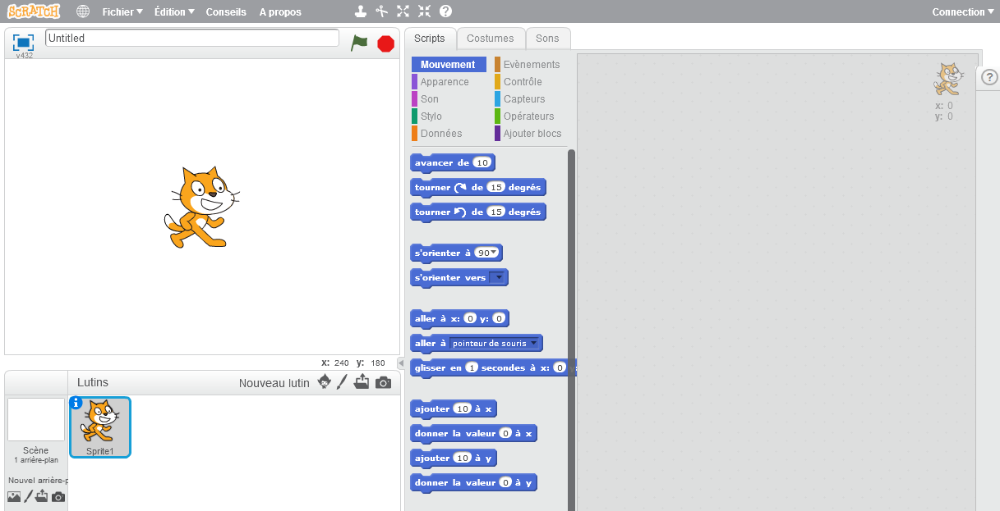
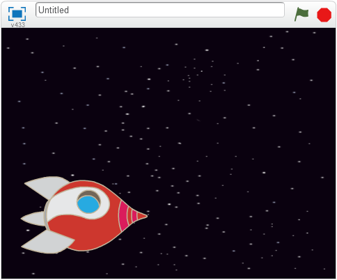
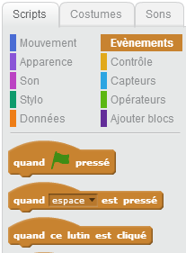
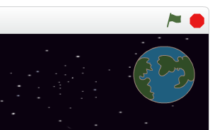

# Introduction { .intro }

Tu vas apprendre à programmer ta propre animation !

<div class="scratch-preview">
 <iframe allowtransparency="true" width="485" height="402" src="https://scratch.mit.edu/projects/embed/26818098/?autostart=true" frameborder="0"></iframe>
 
</div>

# Étape 1 : Les lutins { .activity }

## Liste d'activités { .check }

+ Tout d'abord, assure-toi d'avoir ouvert l'éditeur Scratch. Tu peux le trouver en ligne à l'adresse <a href="http://jumpto.cc/scratch-new">jumpto.cc/scratch-new</a>. Il devrait ressembler à ceci :

	

+ Avant de pouvoir coder ton animation, il te faut un 'objet' à animer. Dans Scratch, ces 'objets' sont appelés 'lutins'. Le chat que tu peux voir est un lutin nommé Félix. C'est la mascotte de Scratch, mais débarrassons-nous de lui pour l'instant. Clique sur Felix avec le bouton droit de la souris, puis choisis 'supprimer'.

	

+ Clique ensuite sur l'icône 'Choisir un lutin dans la bibliothèque' pour voir tous les lutins qui sont fournis avec Scratch.

	

+ Fais défiler les images jusqu'à ce que tu trouves un vaisseau spatial. Clique dessus pour le sélectionner, puis clique sur 'OK' pour l'ajouter à ton animation.

	

+ Clique sur ton nouveau vaisseau spatial dans la zone 'Lutins' en bas à gauche, puis va dans l'onglet 'Costumes' à droite.

	

+ Utilise l'outil flèche pour sélectionner toute l'image. Puis clique et tire sur la poignée de rotation pour faire tourner la fusée sur ​​le côté.

	

+ Tu devrais maintenant avoir un grand vaisseau spatial sur ta 'scène'. La 'scène' est la zone en haut à gauche. C'est là que ton animation va se dérouler, c'est comme une vraie scène de théatre ! Tu peux faire glisser le vaisseau spatial autour de la scène pour le déplacer.

	Pour l'instant, ta scène est blanche et bien ennuyeuse ! Ajoutes-y une toile de fond : Va dans l'onglet​ 'Arrière-plans' de la scène, puis clique sur l'icône 'Choisir un arrière-plan dans la bibliothèque'.

	

+ Clique sur la catégorie 'Espace' à gauche, puis choisis l'arrière-plan étoilé qui s'appelle 'stars'. Clique sur 'OK' pour l'ajouter à ta scène.

	

	Ta scène devrait maintenant ressembler à cela :

	

## Défi : Ajoute un autre lutin { .challenge }
Peux-tu ajouter un nouveau lutin (la Terre) à ta scène, pour que ça ressemble à ceci ?


## Enregistre ton projet { .save }

Pour ne pas perdre ton travail, tu dois l'enregistrer régulièrement. Tout d'abord, donne un nom à ton animation : tape-le dans le champ texte au dessus de la scène. Tu peux ensuite cliquer sur 'Fichier' puis 'Sauvegarder maintenant' pour enregistrer ton projet.


Si tu utilises Scratch en ligne, tout ce que tu sauvegardes est ajouté à tes 'projets'. C'est un dossier en ligne auquel tu peux accéder de n'importe où, même de chez toi. Tu peux accéder à ce dossier en cliquant sur 'Fichier', puis 'Aller à mes projets'.


Ceci te donne la liste de tous tes projets. Clique sur 'Voir à l'intérieur' pour continuer de programmer ton animation.

Si tu utilises Scratch en ligne mais que tu n'as pas de nom d'utilisateur, tu peux cliquer sur 'Télécharger dans votre ordinateur' pour sauvegarder ton projet sur ton ordinateur.

# Étape 2 : Animer tes lutins { .activity }

Maintenant que tu as quelques lutins, nous allons ajouter du code pour les animer !

## Liste d'activités { .check }

+ Créons un script pour le vaisseau spatial, en utilisant des blocs de code. Tu peux trouver ces blocs dans l'onglet 'Scripts'. Ils ont tous un code couleur ! Fais glisser les 2 blocs suivants dans la zone de code à droite, en t'assurant qu'ils sont bien attachés ensemble (comme des blocs Lego).

	

	Modifie les chiffres dans les blocs de code, de façon à ce que le code soit exactement le même que dans l'image ci-dessus. Voici le code que tu dois ajouter :


	```blocks
		s'orienter vers [Earth v]
		glisser en (1) secondes à x:(0) y:(0)
	```

	Pour coder `s'orienter vers Earth` {.blockmotion}, tu dois d'abord glisser et déposer le bloc de code, puis cliquer sur la petite flèche vers le bas pour choisir le lutin 'Earth'.

	

+ Si tu cliques sur ces blocs, le code sera exécuté : Tu devrais voir le vaisseau spatial tourner et se déplacer vers le centre de la scène.

	

	La position sur l'écran `x:(0) y:(0)` {.blockmotion} est le centre de la scène. Une position comme `x:(-150) y:(-150)` {.blockmotion} est située presque tout en bas et à gauche de la scène. Et une position comme `x:(150) y:(150)` {.blockmotion} est près du haut droit de la scène.

	

	Si tu veux connaître les coordonnées d'un endroit sur la scène, alors mets la souris à la position souhaitée, puis note les coordonnées qui sont affichées sous la scène.

	

+ Si tu essaies de cliquer à nouveau sur le code pour l'exécuter une seconde fois, rien ne se passe ! C'est parce que le vaisseau est déjà arrivé là où on lui a dit d'aller. Améliorons ton animation : Demandons au vaisseau de toujours commencer en bas à gauche de la scène, et faisons-le pointer vers le haut.

+ Ajoute quelques blocs à ton animation, devant les blocs que tu as déjà. Ton code devrait maintenant ressembler à ceci :

	```blocks
		s'orienter à (0 v)
		aller à x:(-150) y:(-150)
		attendre (1) secondes
		s'orienter vers [Earth v]
		glisser en (1) secondes à x:(0) y:(0)
	```

	Tu trouveras le bloc `attendre (1) secondes` {.blockcontrol} en cliquant sur la section orange `Contrôle` {.blockcontrol}.

+ Ton vaisseau spatial se déplace maintenant _chaque fois_ que tu exécutes ton code. Essaie-le !

+ Tu peux également attacher tes blocs de code à un 'événement'. Cela signifie que le code s'exécutera lorsque quelque chose se passe : par exemple quand tu cliques sur le drapeau vert, quand on appuie sur une touche ou quand on clique sur un lutin.

	

	Fais glisser un événement tout au début de ton code, pour que l'animation démarre lorsque tu cliques sur le drapeau vert. Ton code devrait ressembler à ceci:


	```blocks
		quand le drapeau vert pressé
		s'orienter à (0 v)
		aller à x:(-150) y:(-150)
		attendre (1) secondes
		s'orienter vers [Earth v]
		glisser en (1) secondes à x:(0) y:(0)
	```

+ Essaie ton animation à plusieurs reprises, en cliquant sur le drapeau vert juste au-dessus de la scène.

	

## Défi : Améliore ton animation {.challenge}
Peux-tu modifier les chiffres dans le code de ton animation, pour que :
+ Le vaisseau spatial se déplace jusqu'à ce qu'il touche la Terre ?
+ Le vaisseau spatial se déplace plus lentement vers la Terre ?

Tu vas devoir changer les chiffres de ce bloc :

```blocks
	glisser en (1) secondes à x:(0) y:(0)
```

## Enregistre ton projet { .save }

# Étape 3 : Animer à l'aide de boucles { .activity }

## Liste d'activités { .check }

+ Une autre façon d'animer le vaisseau spatial est de le déplacer un tout petit peu (disons 4 pas) mais de nombreuses fois. Supprime le bloc `glisser` {.blockmotion} de ton code, par un clic droit sur ​​le bloc puis 'supprimer'. Tu peux aussi supprimer du code en le faisant glisser hors de la zone de code à droite, et en le remettant dans la zone des blocs au milieu.

+ Une fois que tu as retiré ce bloc, ajoute le code suivant à sa place :

	```blocks
		quand le drapeau vert pressé
		s'orienter à (0 v)
		aller à x:(-150) y:(-150)
		attendre (1) secondes
		s'orienter vers [Earth v]
		répéter (100) fois
		   avancer de (4)
	```

+ Le bloc `répéter (100) fois` {.blockcontrol} est utilisé pour répéter quelque chose plusieurs fois. On appelle ça une 'boucle'. Si tu cliques sur le drapeau pour essayer ce nouveau code, tu verras qu'il fait à peu près la même chose qu'avant.

+ Utiliser une boucle pour déplacer le vaisseau spatial te permet d'ajouter plus de code à l'intérieur du bloc `répéter` {.blockcontrol} pour faire des choses intéressantes. Si tu ajoutes le bloc `ajouter à l'effet couleur (25)` {.blocklooks} (qui est dans la section 'Apparence') dans la boucle, tu verras la couleur du vaisseau spatial changer pendant qu'il se déplace :

	```blocks
		quand le drapeau vert pressé
		s'orienter à (0 v)
		aller à x:(-150) y:(-150)
		attendre (1) secondes
		s'orienter vers [Earth v]
		répéter (100) fois
		   avancer de (4)
		   ajouter à l'effet [couleur v] (25)
	```

+ Clique sur le drapeau pour voir ta nouvelle animation.

+ Tu peux aussi améliorer ton animation en disant au vaisseau spatial de devenir plus petit lorsqu'il se déplace vers la Terre. N'oublie pas d'ajouter également du code au début de l'animation, pour que ton vaisseau spatial démarre avec sa taille originale.

	```blocks
		quand le drapeau vert pressé
		mettre à (100) _de la taille initiale
		s'orienter à (0 v)
		aller à x:(-150) y:(-150)
		attendre (1) secondes
		s'orienter vers [Earth v]
		répéter (100) fois
		   avancer de (4)
		   ajouter à l'effet [couleur v] (25)
		   ajouter (-1) à la taille
	```

+ Si tu essaies ton animation maintenant, tu verras que c'est bien mieux qu'avant !

## Enregistre ton projet { .save }

# Étape 4 : Plus de boucles { .activity }

## Liste d'activités { .check }

+ Ajoutons maintenant un singe, perdu dans l'espace, à l'animation ! Commence par choisir un lutin singe dans la bibliothèque.

	

+ Si tu cliques sur ton nouveau lutin singe, puis sur l'onglet 'Costumes', tu peux modifier le look de ton singe. Clique sur l'outil cercle (nommé ici 'Ellipse') et dessine un casque blanc autour de la tête du singe.

	

+ Maintenant clique sur l'onglet 'Scripts' et ajoute du code pour que le singe tourne lentement et indéfiniment en rond :

	```blocks
		quand le drapeau vert pressé
		répéter indéfiniment
		   tourner ↻ de (1) degrés
	```

	

	Le bloc `répèter indéfiniment` {.blockcontrol} est une boucle qui se répète sans fin. Tu vas devoir l'arrêter en cliquant sur le bouton stop rouge à côté du drapeau vert.

+ Tu peux également combiner des boucles. Ajoute un lutin 'étoile' à ton animation, et programme-le comme ceci :

	```blocks
		quand le drapeau vert pressé
		répéter indéfiniment
			répéter (20) fois
				ajouter (2) à la taille
			end
			répéter (20) fois
				ajouter (-2) à la taille
			end
	```

	

+ Clique sur le drapeau pour tester l'animation de ton étoile. Que fait ce code ? Il fait légèrement grossir l'étoile 20 fois, puis rétrécir 20 fois pour revenir à la taille du début. Et pour que cette animation recommence tout le temps, on met ces deux boucles dans une troisième boucle `répèter indéfiniment`{.blockcontrol}.

## Enregistre ton projet { .save }

## Défi : Crée ta propre animation {.challenge}
Arrête ton animation de l'espace, et clique sur 'Fichier' puis 'Nouveau', pour démarrer un nouveau projet. Utilise ce que tu as appris dans ce projet pour faire ta propre animation. Tu peux faire ce que tu veux, mais essaie de rester dans le cadre défini. Voici quelques exemples :


## Enregistre ton projet { .save }

Bravo ! Tu as maintenant terminé ton premier projet Scratch. Si tu utilises l'éditeur en ligne, tu peux laisser les autres voir ton animation en cliquant sur 'Partager' en haut à droite de l'éditeur Scratch !


