Défi ---
title: Mémoire
description: Crées un jeu de mémoire où tu devras mémoriser et répéter une séquence aléatoire de couleurs !
layout: project
notes: "Memory - notes.md"
---

# Introduction { .intro }

Dans ce projet, vous allez créer un jeu de mémoire où vous devez mémoriser et répéter une séquence aléatoire de couleurs !

<div class="scratch-preview">
  <iframe allowtransparency="true" width="485" height="402" src="https://scratch.mit.edu/projects/embed/34874510/?autostart=false" frameborder="0"></iframe>
  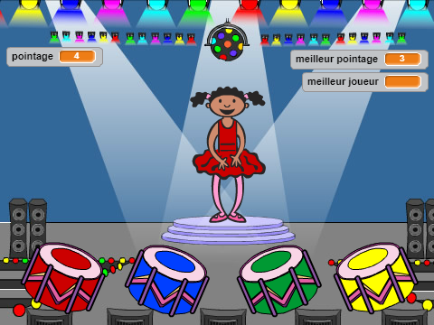
</div>

# Étape 1: Des couleurs aléatoires { .activity }

Créons un personnage qui peut se transformer dans une séquence aléatoire de couleurs à mémoriser par le joueur.

## Liste de contrôle { .check }

+ Démarrez avec un nouveau projet Scratch et supprimez le lutin de chat pour commencer un projet vide. L'éditeur scratch se trouve en ligne à <a href="http://jumpto.cc/scratch-new" target="_blank">jumpto.cc/scratch-new</a>.

+ Choisissez un lutin et un arrière-plan. Votre personnage n'a pas besoin d'être un humain, mais doit pouvoir changer de couleur.

	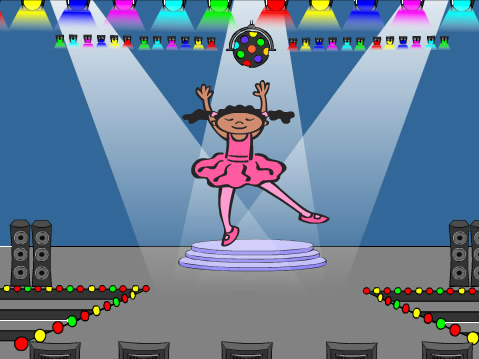

+ Dans votre jeu, vous allez utiliser un chiffre différent pour réprésenter chaque couleur :

	+ 1 = rouge;
	+ 2 = bleu;
	+ 3 = vert;
	+ 4 = jaune.

	Donnez à votre personnage 4 costumes de couleurs différentes, un pour chacune des 4 couleurs ci-dessus. Vérifiez le bon ordre de vos costumes.

	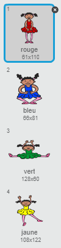

+ Pour créer une séquence aléatoire, vous avez besoin de créer une __liste__. Une liste est simplement une variable qui stocke des données _dans un certain ordre_. Créez une nouvelle liste nommée `séquence` {.blockdata}. Seul votre personnage a besoin de voir la liste, donc nous pouvons choisir 'Pour ce lutin uniquement'.

	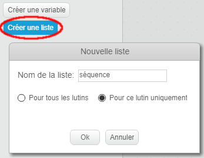

	Votre liste vide devrait apparaître en haut à gauche de votre scène, ainsi que plusieurs nouveaux blocs à utiliser avec des listes.

	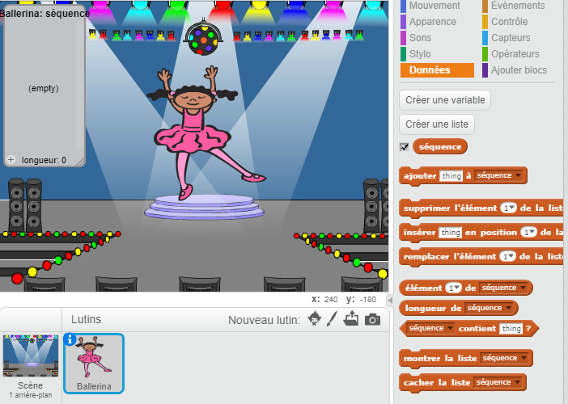

+ Ajoutez ce code à votre personnage afin d'ajouter un chiffre aléatoire à votre liste (et montrer le bon costume) 5 fois :

	```blocks
		when flag clicked
		delete (all v) of [sequence v]
		repeat (5)
			add (pick random (1) to (4)) to [sequence v]
			switch costume to (item (last v) of [sequence v]
			wait (1) secs
		end
	```

	Vous pouvez remarquer que vous avez aussi vidé la liste avant de commencer.

## Défi : Ajouter du son {.challenge}
Testez votre projet plusieurs fois. Vous pouvez parfois remarquer que le même chiffre est choisi deux fois (ou plus) de suite, rendant la séquence plus difficile à mémoriser. Pouvez-vous faire jouer le son d'un tambour chaque fois que le personnage change de costume ?

Pouvez-vous changer le son du tambour selon le chiffre aléatoire choisi ? Ceci sera _très_ similaire par rapport à votre code pour changer le costume du personnage.

## Sauvegarder votre projet { .save }

# Étape 2: Répéter la séquence { .activity }

Ajoutons 4 boutons pour que le joueur puisse répéter la séquence mémorisée.

## Liste de contrôle { .check }

+ Ajoutez 4 lutins qui vont devenir des boutons. Modifiez vos 4 lutins pour pour qu'il en ait un de chaque couleur.

	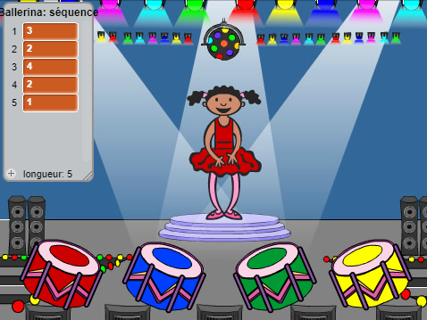

+ Quand on clique sur le tambour rouge, il faut envoyer le message à votre personnage pour faire savoir que le bouton rouge a été cliqué. Ajoutez ce code à votre tambour rouge :

	```blocks
		when this sprite clicked
		broadcast [red v]
	```

+ Quand votre personnage reçoit ce message, il doit vérifier si le chiffre 1 est au début de la liste (ce qui veut dire que rouge est la prochaine couleur dans la séquence). Si tout correspond, c'est que la réponse est bonne. Sinon, c'est "Game over !"

	```blocks
		when I receive [red v]
		if <(item (1 v) of [sequence v])=[1]> then
			delete (1 v) of [sequence v]
		else
			say [Game over!] for (1) secs
			stop [all v]
		end
	```

+ Vous pouvez aussi faire clignoter des lumières lorsque la liste sera vide, ce qui signifie que vous avez bien deviné la séquence entière. Ajoutez ce code à la fin du texte `when flag clicked` {.blockevents} de votre personnage :

	```blocks
		wait until < (length of [sequence v]) = [0]>
		broadcast [won v] and wait
	```

+ Cliquez sur votre scène et ajoutez ce code pour jouer __n'importe quel__ son et faire changer la couleur du fond lorsque le joueur a gagné la partie.

	```blocks
		when I receive [won v]
		play sound [drum machine v]
		repeat (50)
			change [color v] effect by (25)
			wait (0.1) secs
		end
		clear graphic effects
	```

## Défi : Créer 4 boutons {.challenge}
Répétez les étapes ci-dessus pour vos boutons bleus, verts et jaunes. Quel code restera pareil et quel code faudrait-il modifier pour chaque bouton ?

Vous pouvez aussi ajouter des sons lorsque vous appuyez sur les boutons.

N'oubliez pas de tester le code que vous venez d'ajouter ! Pouvez-vous mémoriser une séquence de 5 couleurs ? Est-ce que la séquence change à chaque fois ?

## Sauvegarder votre projet { .save }

# Étape 3: De multiples niveaux { .activity .new-page }

Jusqu'à maintenant, le joueur n'a qu'à se souvenir de 5 couleurs. Nous allons donc améliorer notre jeu en rendant la séquence plus longue.

## Liste de contrôle { .check }

+ Créez une nouvelle variable nommée `score` {.blockdata}.

	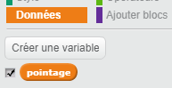

+ Ce `score` {.blockdata} sera utilisé pour déterminer la longueur de la séquence que le joueur doit mémoriser. Pour commencer, le score (et la taille de la séquence) sera 3. Ajoutez ce bloc de code au début du code `when flag clicked` {.blockevents} de votre personnage :

	```blocks
		set [score v] to [3]
	```

+ Au lieu de toujours créer une séquence de 5 couleurs, vous voulez avoir un `score` qui {.blockdata} détermine la longueur de la séquence. Changez la boucle `repeat` {.blockcontrol} de votre personnage (pour créer la séquence) en :

	```blocks
		repeat (score)
		end
	```

+ Si la séquence a été identifiée correctement, vous devez ajouter 1 au score afin d'augmenter la longueur de la séquence.

	```blocks
		change [score v] by (1)
	```

+ Enfin, vous aurez besoin d'ajouter une boucle `forever` {.blockcontrol} autour du code qui génère la séquence afin de créer une nouvelle séquence pour chaque niveau. Le code de votre lutin devrait apparaître comme suit :

	```blocks
		when flag clicked
		set [score v] to [3]
		forever
			delete (all v) of [sequence v]
			repeat (score)
				add (pick random (1) to (4)) to [sequence v]
				switch costume to (item (last v) of [sequence v]
				wait (1) secs
			end
			wait until < (length of [sequence v]) = [0]>
			broadcast [won v] and wait
			change [score v] by (1)
		end
	```

+ Demandez à vos amis de tester votre jeu. Pensez à cacher la liste `sequence` {.blockdata} avant de lancer le jeu !

## Sauvegarder votre projet { .save }

# Étape 4: Meilleur score { .activity }

Ajoutons la possibilité d'enregistrer le meilleur score afin de pouvoir jouer contre vos amis.

## Liste de contrôle { .check }

+ Ajoutez 2 nouvelles variables à votre projet nommées `meilleur score` {.blockdata} et `nom` {.blockdata}.

+ Si jamais le jeu s'arrête (en appuyant sur le mauvais bouton), vous aurez besoin de vérifier si le score du joueur est plus grand que le meilleur score actuel. Si c'est le cas, vous devez enregistrer le score comme le nouveau meilleur score et enregistrer le nom du joueur. Voici à quoi devrait correspondre votre bouton rouge :

	```blocks
		when I receive [red v]
		if <(item (1 v) of [sequence v])=[1]> then
			delete (1 v) of [sequence v]
		else
			say [Game over!] for (1) secs
			if < (score) > (high score) > then
				set [high score v] to (score)
				ask [High score! What is your name?] and wait
				set [name v] to (answer)
			end
			stop [all v]
		end
	```

+ Vous aurez besoin d'ajouter ce nouveau code aux 3 autres boutons aussi ! Avez-vous remarqué que le code 'Game over' est identique pour chacun des 4 boutons ?

	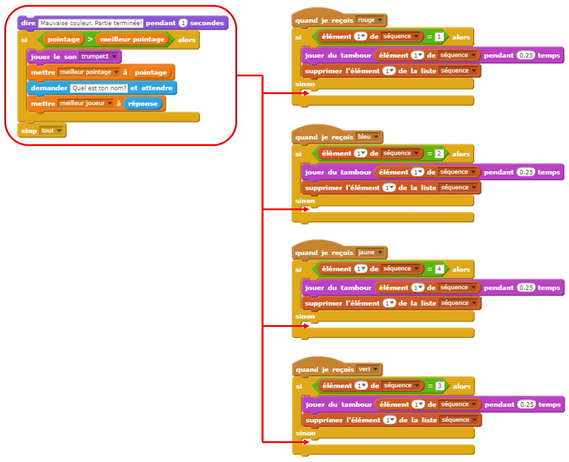

+ Si jamais vous changez une partie du code, comme pour ajouter un son ou changer le message 'Game over!', vous allez devoir le changer 4 fois ! Ça devient embêtant et vous perdez beaucoup de temps.

	À la place, vous pouvez définir vos propres blocs afin de les réutiliser dans votre projet ! Pour faire cela, cliquez `more blocks` {.blockmoreblocks} et puis sur 'Créer un bloc'. Nommez ce nouveau bloc 'Game over'.

	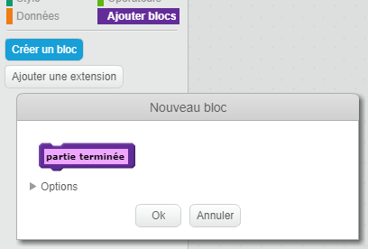

+ Ajoutez le code du bloc `else` {.blockcontrol} du bouton rouge au nouveau bloc que vous voyez :

	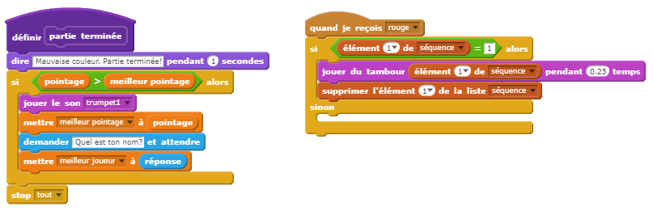

+ Vous avez maintenant créé une nouvelle _fonction_ appelée `Game over` {.blockmoreblocks} que vous pouvez utiliser où vous voulez. Tirez votre nouveau bloc `Game over` {.blockmoreblocks} vers les 4 textes pour les boutons.

	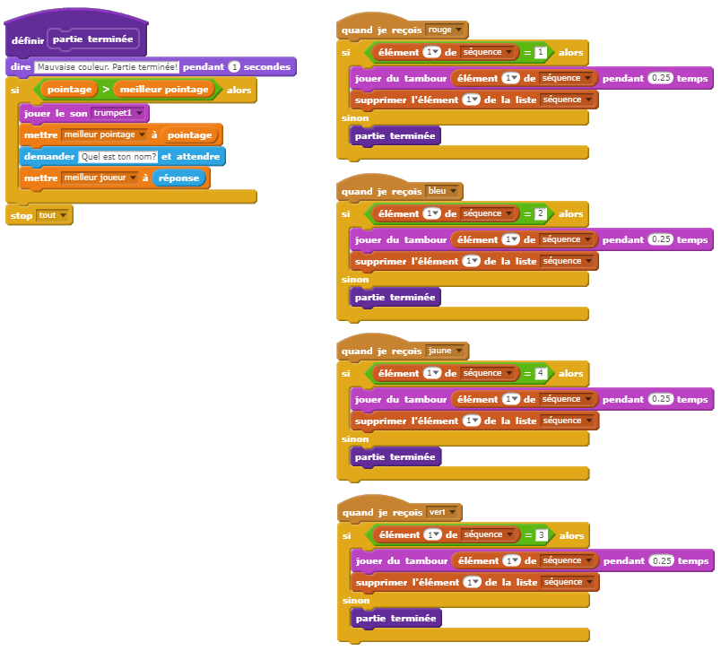

+ Ensuite, ajoutez un son lorsque vous cliquez sur le mauvais bouton. Vous avez juste à ajouter ce code _une fois_ dans le bloc `Game over` {.blockmoreblocks} que vous venez de créer, et non à 4 occasions différentes !

	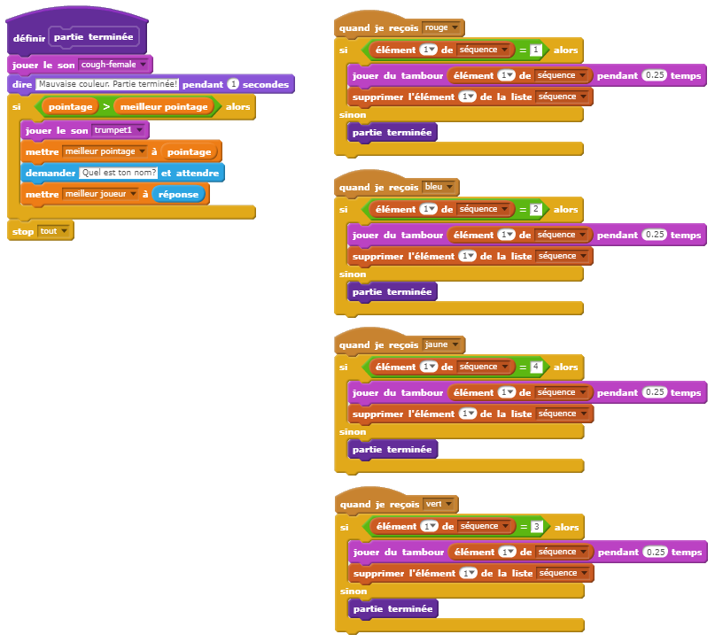

## Défi : Créer d'autres blocs {.challenge}
Est-ce que vous voyez d'autres séquences de code qui se répètent pour les 4 boutons ?

## Sauvegarder votre projet { .save }

## Défi : Un autre costume 

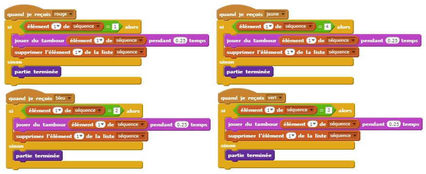

Pouvez-vous créer un autre bloc 'personalisé', à utiliser pour chaque bme {.challenge}
Avez-vous remarqué que votre jeu démarre avec votre personnage montrant une des 4 couleurs et qu'il affiche toujours la dernière couleur de la séquence pendant que le joueur répète la séquence ?

Pouvez-vous ajouter un costume blanc qui sera affiché sur votre lutin au début de la partie, ainsi lorsque le joueur tente de copier la séquence ?

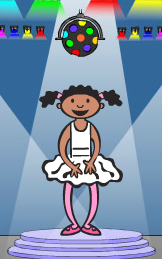

## Sauvegarder votre projet { .save }

## Défi : Niveau de difficulté {.challenge}
Pouvez-vous laisser votre joueur choisir entre des niveaux 'mode Facile' (utilisant juste les tambours rouges et bleus) et 'mode Normal' (qui utilise les 4 tambours) ?

Vour pourriez même imaginer un mode 'Difficile" qui utilise un 5ième tambour !

## Sauvegarder votre projet { .save }
