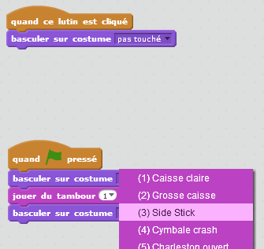
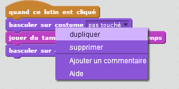

# Introduction { .intro }

Dans ce projet vous apprendrez à coder vos propres instruments de musique!

<div class="scratch-preview">
	<iframe allowtransparency="true" width="485" height="402" src="http://scratch.mit.edu/projects/embed/26741186/?autostart=false" frameborder="0"></iframe>
	
</div>

# Étape 1 : Fabrication d'un Tambour { .activity }

D'abord, créons un tambour qui fait un son quand il est frappé.

## Liste de contrôle d'Activité { .check }

+ Commencer un nouveau projet de scratch et supprimer le lutin du chat pour que votre projet soit vide. Vous pouvez trouver l'éditeur de scratch en ligne à <a href="http://jumpto.cc/scratch-new">jumpto.cc/scratch-new</a>.

+ Ajoutez un lutin de tambour à votre projet vierge, vous pouvez aussi ajoutez une image de fond appropriée à l'étape.

	

	Si vous n'êtes pas sûr de comment faire ceci, le projet ' Lost in space ' vous aidera!

+ Programmons le tambour pour jouer un son quand il est cliqué. Assurez-vous que le lutin de tambour est choisi et ajouter ce code :

	```blocks
		quand ce lutin est cliqué
		jouer tambour (1 v) pendant (0.25) temps
	```

+ Cliquez sur le tambour pour essayer votre nouvel instrument!

+ Vous pouvez aussi changez l'aspect du tambour quand il est cliqué, en créant un nouveau costume. Cliquez sur l'onglet Costumes et vous verrez l'image du tambour.

	

+ Faites un clic droit sur le costume et un clic sur 'dupliquer' pour créer une copie du costume.

	

+ Un clic sur le nouveau costume (appelé 'drum2') et choisit ensuite l'outil de ligne et trace des lignes pour donnez l'impression que le tambour joue un son.

	

+ Les noms des costumes ne sont pas très utiles à l'heure actuelle. Rebaptisez les 2 costumes à 'not hit' et 'hit' en tapant le nouveau nom de chaque costume dans la boîte de texte.

	

+ Maintenant que vous avez 2 costumes différents pour votre tambour, vous pouvez choisir quel costume est affiché! Ajoutez ce code à votre tambour :

	```blocks
		quand le drapeau pressé
		basculer sur costume [not hit v]

		quand ce lutin est cliqué
		basculer sur costume [hit v]
		jouer tambour (1 v) pendant (0.25) temps
		basculer sur costume [not hit v]
	```

	Le bloc de code pour changer le costume est dans la section `Apparences` {.blocklooks}.

+ Testez votre tambour. Quand le tambour est cliqué, il devrait maintenant changer de costume, pour montrer qu'il a été frappé.

## Sauvegarder votre projet { .save }

## Défi : Amélioration de votre tambour { .challenge }

+ Pouvez-vous changer le son que le tambour fait quand il est cliqué ?



+ Pouvez-vous aussi faire un son quand la barre d'espace est appuyée ? Vous devrez utiliser les blocs `Événement` {.blockevents}:

```blocks
	quand [space v] est pressé
```

 Vous pouvez copier votre code existant en y faisant un clic droit et en cliquant sur 'dupliquer'.



## Sauvegarder votre projet { .save }

# Étape 2 : Création d'un Chanteur { .activity .new-page }

Ajoutons un chanteur à votre orchestre!

## Liste de contrôle d'Activité { .check }

+ Ajoutez 2 autres lutins à votre étape, un chanteur et un micro.

	

+ Avant que vous ne puissiez faire chanter votre chanteur, vous devez ajouter un son à votre lutin. Assurez-vous que vous avez choisi votre chanteur, cliquez ensuite sur l'onglet 'Sons' et cliquer sur ' Choisir un son dans la bibliothèque ' :

	

+ Si vous cliquez sur 'chants' du côté gauche, vous pourrez alors choisir un son approprié à ajoutez à votre lutin.

	

+ Maintenant que le son a bien été ajouté, vous pouvez ajouter ce code à votre chanteur :

	```blocks
		quand ce lutin est cliqué
		jouer le son [singer1 v] jusqu'au bout
	```

+ Cliqué sur votre chanteur, pour s'assurer qu'il chante quand vous cliqué.

## Sauvegarder votre projet { .save }

## Défi : Changement du costume de votre chanteur { .challenge }
Pouvez-vous faire  semblant  que votre chanteur chante quand vous cliqué ? Si vous avez besoin de l'aide, vous pouvez utiliser les instructions pour créer un tambour ci-dessus.


Rappelez-vous de tester votre nouveau code !

## Sauvegardez votre projet { .save }

## Défi : Faites votre propre orchestre { .challenge }
L'utilisation que vous avez appris dans ce projet de faire votre propre orchestre! Vous pouvez créer n'importe quels instruments que vous aimez, mais regardez les sons disponibles et les instruments pour obtenir quelques idées.


Vos instruments ne doivent pas être raisonnables quoique. Par exemple, vous pourriez faire un piano fait de muffins!


Si vous avez un microphone vous pouvez enregistrer vos propres sons, ou utiliser même une web cam pour frapper vos instruments!


## Sauvegarder votre projet { .save }