---
title: סירת מרוץ
level: סקראצ' 1
language: he-IL
stylesheet: scratch
embeds: "*.png"
materials: ["Club Leader Resources/*","Project Resources/*"]
...

# מבוא { .intro }

אתה הולך ללמוד איך ליצור משחק, שבו אתה תשתמש בעכבר כדי לנווט סירה לאי בודד.

  <iframe allowtransparency="true" width="485" height="402" src="http://scratch.mit.edu/projects/embed/63957956/?autostart=false" frameborder="0"></iframe>
  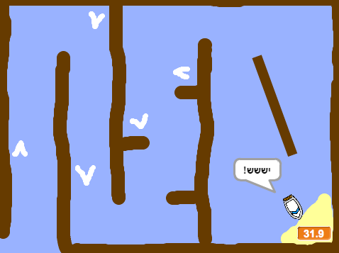

# שלב 1: תכנון המשחק שלך { .activity }

## רשימת פעולות { .check }

+ התחל פרויקט סקראצ' חדש, ומחק את דמות החתול כך שהפרויקט שלך יהיה ריק. אתה יכול למצוא את עורך הסקראצ' און ליין בכתובת <a href="http://jumpto.cc/scratch-new">jumpto.cc/scratch-new</a>.

+ הקש על רקע הבמה שלך ותכנן את השלב שלך. אתה צריך להוסיף:
	+ בולי עץ שהסירה שלך צריכה להימנע מהם;
	+ אי בודד שהסירה שלך צריכה להגיע אליו.

	הנה דוגמה איך המשחק שלך יכול להיראות:

	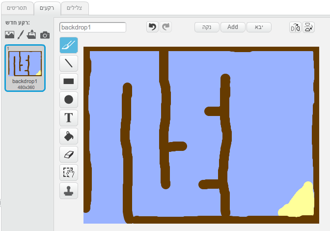 

# שלב 2: לשלוט בסירה { .activity }

## רשימת פעולות { .check }

+ אם מדריך המועדון שלך נתן לך תיקיית 'משאבים', לחץ 'העלה דמות מקובץ' והוסף את התמונה 'boat.png'. אתה צריך להקטין את הדמות ולשים אותה בנקודת ההתחלה שלה.

	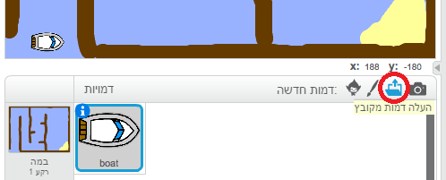

	אם אין לך את התמונה boat.png, אתה יכול לצייר לך סירה משלך במקום!

+ אתה הולך לשלוט בסירה עם העכבר שלך. הוסף את הקוד הזה לסירה שלך:

	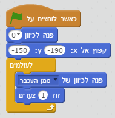

+ בדוק את הסירה שלך, על ידי לחיצה על הדגל והוזזת העכבר. האם הסירה שטה לכיוון העכבר?

	

+ מה קורה אם הסירה מגיעה לסמן של העכבר?

	כדי לגרום לזה להפסיק לקרות, אתה תצטרך להוסיף בלוק `אם` {.blockcontrol} לקוד שלך, כך שהסירה תזוז רק אם היא רחוקה ביותר מ- 5 פיקסלים מהעכבר.

	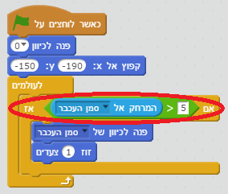	

+ בדוק את הסירה שלך שוב, כדי לבדוק אם הבעיה נפתרה.

## שמור את הפרויקט שלך { .save }

# שלב 3: התרסקות! { .activity .new-page }

הסירה שלך יכולה לשוט דרך מחסומי העץ! בוא נתקן את זה.

## רשימת פעולות { .check }

+ אתה תצטרך שתי תלבושות לסירה שלך, תלבושת אחת רגילה, ואחת לרגע שבו הסירה מתרסקת. שכפל את התלבושת של הסירה שלך, ותן להן שמות 'רגילה' ו-  'מרוסקת'.

+ לחץ על התלבושת 'מרוסקת', ובחר את הכלי 'בחר' כדי לתפוס חתיכות מהסירה והוזז וסובב אותם מסביב. עשה שהסירה שלך תראה כאילו שהיא התרסקה.

	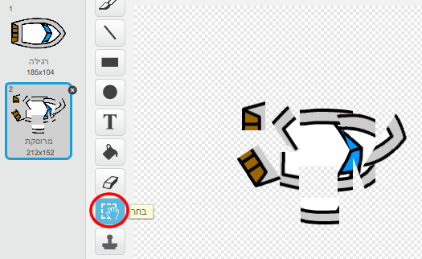

+ הוסף את הקוד הזה לסירה שלך, בתוך הלולאה `לעולמים` {.blockcontrol}, כך שהיא תתרסק כאשר היא נוגעת בחלק כלשהוא של עץ חום:

	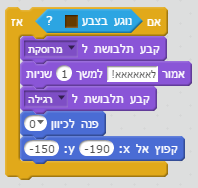

	הקוד הזה הוא בתוך הלולאה `לעולמים` {.blockcontrol}, כך שהקוד שלך ממשיך לבדוק אם הסירה התרסקה.

+ אתה גם צריך לוודא שהסירה שלך תמיד מתחילה כאשר היא נראית 'רגילה'.

+ עכשיו אם אתה מנסה לשוט דרך מחסומי העץ, אתה צריך לראות שהסירה שלך מתרסקת וזזה בחזרה להתחלה.

	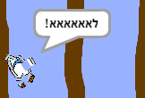

## שמור את הפרויקט שלך { .save }

## אתגר: ניצחון! {.challenge}
האם אתה יכול להוסיף משפט `אם` {.blockcontrol} אחר לקוד של הסירה שלך, כך שהשחקן ינצח כאשר הוא יגיע לאי הבודד?

כאשר הסירה מגיעה לאי הבודד הצהוב, היא צריכה לומר 'יששש!' ואז המשחק צריך להיעצר. אתה תצטרך להשתמש בקוד הזה:

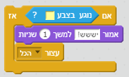

## שמור את הפרויקט שלך { .save }

## אתגר: אפקטים קוליים {.challenge}
אתה יכול להוסיף אפקטים קוליים למשחק שלך, למקרים בהם הסירה שלך מתרסקת, או מגיעה לאי בסוף. אתה יכול גם להוסיף מוזיקת רקע (אם אתה צריך עזרה ראה פרויקט קודם בשם 'להקת רוק').

## שמור את הפרויקט שלך { .save }

# שלב 4: מרוץ נגד השעון { .activity }

בוא נוסיף שעון עצר למשחק שלך, כך שהשחקן צריך להגיע לאי הבודד מהר ככל האפשר.

## רשימת פעולות { .check }

+ הוסף משתנה חדש בשם `זמן` {.blockdata} לבמה שלך. אתה יכול גם לשנות את התצוגה של המשתנה החדש שלך. אם אתה צריך עזרה, אתה יכול להסתכל על הפרויקט 'בלונים'.

	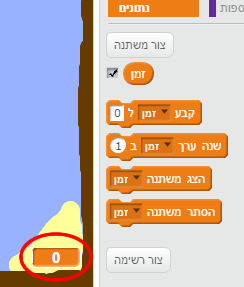

+ הוסף את הקוד הזה ל__במה__ שלך, כך ששעון העצר ימשיך לספור עד שהסירה תגיע לאי הבודד:

	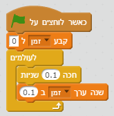

+ זהו זה! בדוק את המשחק שלך ותראה כמה מהר אתה יכול להגיע לאי הבודד!

	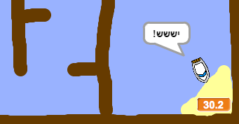

## שמור את הפרויקט שלך { .save }

# שלב 5: מכשולים ושידרוגים { .activity }

המשחק הזה קל בצורה __משמעותית__ - בוא נוסיף דברים כדי לעשות אותו מעניין יותר.

## רשימת פעולות { .check }

+ תחילה בוא נוסיף מספר 'מאיצים' למשחק שלך, אשר יאיצו את הסירה. ערוך את רקע הבמה שלך והוסף לו מספר חיצים מאיצים לבנים.

	

+ עכשיו אתה יכול להוסיף קצת קוד ללולאת ה- `לעולמים` {.blockcontrol} שלך, כך שהיא תזוז 2 צעדים _נוספים_ כאשר היא נוגעת במאיץ לבן.

	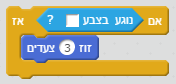

+ אתה יכול גם להוסיף שער מסתובב, שהסירה שלך צריכה להתחמק ממנו. הוסף דמות חדשה בשם 'שער', שנראית כמו זה:

	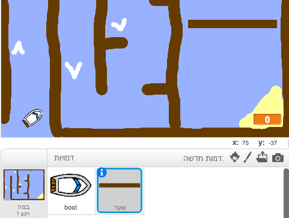

	וודא שהצבע של השער הוא בדיוק כמו הצבע של מחסומי העץ האחרים.

+ קבע את המרכז של דמות השער.

	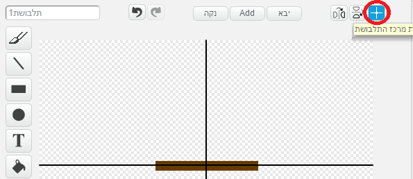

+ הוסף קוד לשער שלך, כדי לעשות שהוא יסתובב לאט `לעולמים` {.blockcontrol}.

+ בדוק את המשחק שלך. צריך להיות לך עכשיו שער מסתובב שאתה חייב להתחמק ממנו.

	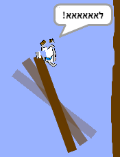

## שמור את הפרויקט שלך { .save }

## אתגר: מכשולים נוספים! {.challenge .new-page}
האם אתה יכול להוסיף עוד מכשולים למשחק שלך? הנה כמה רעיונות:

+ אתה יכול להוסיף רפש ירוק לרקע שלך, שיאט את השחקן כאשר הוא נוגע בו. אתה יכול להשתמש בבלוק `חכה` {.blockcontrol} כדי לעשות את זה:

	

	

+ אתה יכול להוסיף אוביקט שזז, כמו בול עץ או כריש!

	

הבלוקים האלו יכולים לעזור לך:

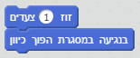

אם האוביקט החדש שלך לא חום, אתה תצטרך להוסיף לסירה שלך קוד:

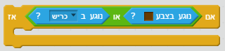

## שמור את הפרויקט שלך { .save }

## אתגר: סירות נוספות! {.challenge .new-page}
האם אתה יכול להפוך את המשחק שלך למרוץ בין שני שחקנים?

+ שכפל את הסירה, שנה לה את השם ל- 'שחקן 2' ושנה את הצבע שלה.

	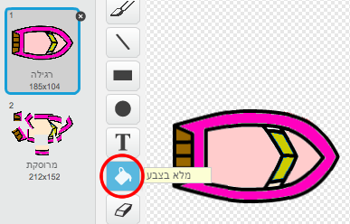

+ שנה את מקום ההתחלה של שחקן 2, על ידי שינוי הקוד הזה:

	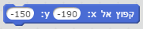

+ מחק את הקוד שמשתמש בעכבר כדי לשלוט בסירה:

	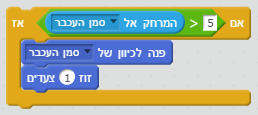

...והחלף אותו עם קוד שמשתמש במקשי החצים כדי לשלוט בסירה.

זה הקוד שאתה תצטרך כדי להזיז את הסירה קדימה:

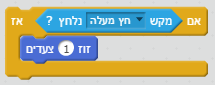

אתה תצטרך גם קוד `הסתובב` {.blockmotion} בשביל לסובב את הסירה כאשר לוחצים על החץ השמאלי והימני.

## שמור את הפרויקט שלך { .save }

## אתגר: שלבים נוספים! {.challenge .new-page}
האם אתה יכול ליצור רקעים נוספים, ולאפשר לשחקן לבחור בין שלבים?

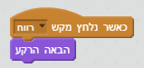

## שמור את הפרויקט שלך { .save }
