---
title: צ'אט בוט (רובוט שיחה)
level: סקראצ' 1
language: he-IL
stylesheet: scratch
embeds: "*.png"
materials: ["Club Leader Resources/*"]
...

# מבוא { .intro }

אתה הולך ללמוד איך לתכנת צ'אט בוט (רובוט שיחה) לגמרי שלך!

  <iframe allowtransparency="true" width="485" height="402" src="http://scratch.mit.edu/projects/embed/26762091/?autostart=false" frameborder="0"></iframe>
  

# שלב 1: הצ'אט בוט (רובוט שיחה) שלך { .activity }

## רשימת פעולות { .check }

+ לפני שאתם מתחילים ליצור את הצ'אט בוטים שלכם, אתם צריכים להחליט על האישיות שלהם.
	+ מה השמות שלהם?
	+ איפה הם חיים?
	+ האם הם שמחים? רציניים? מצחיקים? ביישנים? חברותיים?

+ צור פרויקט סקראטצ' חדש, ומחק את דמות החתול כך שהפרויקט שלך יהיה ריק.אתה יכול למצוא את עורך הסקראטצ' און ליין בכתובת <a href="http://jumpto.cc/scratch-new">jumpto.cc/scratch-new</a>.

+ בחר אחת מהדמויות הבאות, והוסף אותם לפרויקט שלך:

	

+ בחר רקע שמתאים לאופי של הצ'אט בוט שלך. הנה דוגמה, למרות ששלך לא חייב להיראות כך:

	

## שמור את הפרויקט שלך { .save }

# שלב 2: צ'אט בוט מדבר { .activity }

כעת שיש לך צ'אט בוט עם אישיות, בו נתכנת אותו לדבר איתך.

## רשימת פעולות { .check }

+ לחץ על הדמות של הצ'אט בוט שלך, והוסף את הקוד הבא:

	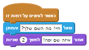

+ לחץ על הצ'אט בוט שלך כדי לבדוק אותו. אחרי שהוא שואל אותך לשמך, הקלד אותו לתוך התיבה שלאורך החלק התחתון של הבמה.

	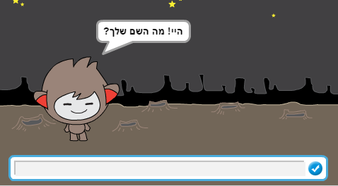

+ הצ'אט בוט שלך פשוט ישיב `איזה שם יפה!` בכל פעם. אתה יכול להתאים אישית את התשובה של הצ'אט בוט שלך, על ידי שימוש בתשובה של המשתמש. שנה את הקוד של הצ'אט בוט, כך שהוא יראה כך:

	

	כדי ליצור את הבלוק האחרון, אתה תצטרך תחילה לגרור בלוק `חבר` {.blockoperators} ירוק, ולהניח אותו בתוך הבלוק `אמור` {.blocklooks}.

	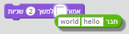

	עכשיו אתה יכול לשנות את הטקסט `hello` ולכתוב `היי`, ואז לגרור את הבלוק בצבע כחול בהיר `תשובה` {.blocksensing} (מתוך התפריט 'חיישנים') לתוך הטקסט `world`.

	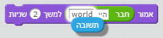

+ בדוק את התוכנית החדשה. האם היא עובדת כפי שציפית? האם אתה יכול לתקן בעיות שאתה רואה? (רמז: אתה יכול לנסות להוסיף רווח במקום כלשהו!)

+ יכול להיות שתרצה לאחסן את שם המשתמש במשתנה, כדי שתוכל להשתמש בו שוב מאוחר יותר. צור משתנה חדש בשם `שם` {.blockdata}. אם שכחת איך עושים את זה, הפרויקט 'מכסחי השדים' יעזור לך.

+ המידע שהכנסת כבר מאוחסן במשתנה מיוחד שנקרא `תשובה` {.blocksensing}. עבור אל קבוצת הבלוקים חיישנים ולחץ על בלוק התשובה כך שיופיע סימון. הערך הנוכחי בתוך `תשובה` {.blocksensing} יוצג בפינה השמאלית עליונה של הבמה.

+ לאחר שיצרת את המשתנה החדש שלך, וודא שהקוד של הצ'אט בוט שלך נראה כך:

	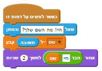

+ אם תבדוק את התוכנית שלך שוב, אתה תבחין שהתשובה מאוחסנת במשתנה `שם` {.blockdata}, והוא מוצג בפינה השמאלית עליונה של הבמה. המשתנה `שם` {.blockdata} מכיל עכשיו את אותו הערך שיש במשתנה `תשובה` {.blocksensing}.

	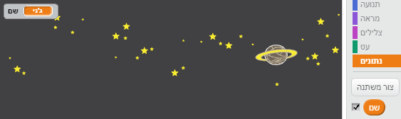

	אם אתה מעדיף לא לראות את המשתנים על הבמה שלך, אתה יכול ללחוץ על תיבת הסימון שליד שמות המשתנים במחיצה 'תסריטים' כדי להסתיר אותם.

## שמור את הפרויקט שלך { .save }

## אתגר: עוד שאלות { .challenge }

תכנת את הצ'אט בוט שלך לשאול עוד שאלה. אתה יכול לשמור את התשובה שלהם במשתנה?

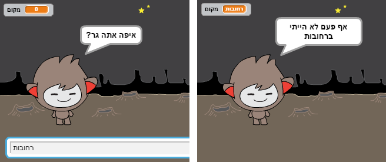

## שמור את הפרויקט שלך { .save }

# שלב 3: קבלת החלטות { .activity }

אתה יכול לתכנת את הצ'אט בוט שלך להחליט מה לעשות, בהתאם לתשובה של המשתמש.

## סדר פעולות { .check }

+ בו נעשה שהצ'אט בוט שלך ישאל את המשתמש שאלה שיש לה תשובה של `כן` או `לא`. הנה דוגמה, אבל אתה יכול לשנות את השאלה אם אתה רוצה:

	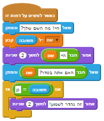

	שים לב שעכשיו אחרי שאחסנת את שם המשתמש בתוך משתנה, אתה יכול להתשמש בו כמה שרק תרצה.

+ כדי לבדוק את התוכנית הזאת כראוי, אתה תצטרך לבדוק אותה פעמיים - פעם אחת להקליד בתשובה שלך `לא`, ופעם אחת להקליד `כן`. אתה צריך לקבל תשובה מהצ'אט בוט שלך רק `אם` {.blockcontrol} התשובה שלך `כן`.

+ הבעיה עם הצ'אט בוט שלך היא שהוא לא עונה אם התשובה של המשתמש היא `לא`. אתה יכול לתקן את זה, על ידי החלפת הבלוק `אם` {.blockcontrol} לבלוק `אם/ואם לא` {.blockcontrol}, כך שהקוד שלך יראה עכשיו כך:

	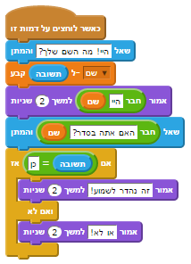

+ אם תבדוק את הקוד שלך, אתה תראה עכשיו שאתה מקבל תשובה כאשר התשובה שלך `כן` או `לא`. הצ'אט בוט שלך צריך לענות `זה נהדר לשמוע!` כאשר התשובה שלך `כן`, אבל הוא יענה `או לא!` אם הקלדת כל דבר אחר שונה מ- `כן` (`ואם לא` {.blockcontrol} משמעותו 'אחרת').

	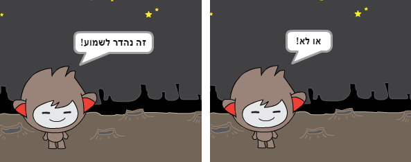

+ אתה יכול לשים כל קוד בתוך בלוק `אם` {.blockcontrol} או בלוק `ואם לא` {.blockcontrol}, לא רק קוד שגורם לצ'אט בוט שלך לדבר. לדוגמה, אתה יכול לשנות את התלבושת של הצ'אט בוט שלך כדי שתתאים לתגובה.

	אם אתה תסתכל על התלבושות של הצ'אט בוט שלך, אתה תראה שיש יותר מתלבושת אחת. (אם אין, אתה תמיד יכול להוסיף עוד בעצמך!)

	

	אתה יכול להשתמש בתלבושות האלו כחלק מהתגובה של הצ'אט בוט שלך, על ידי הוספת הקוד הזה:

	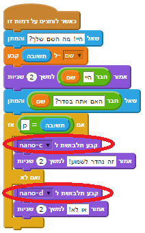

+ בדוק את התוכנית שלך, ואתה צריך לראות את הפנים של הצ'אט בוט שלך משתנות בהתאם לתשובה שנתת.

	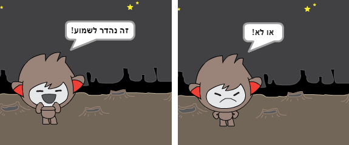

## שמור את הפרויקט שלך { .save }

## אתגר: עוד החלטות { .challenge }

תכנת את הצ'אט בוט שלך לשאול עוד שאלה - שאלה עם תשובה של `כן` או `לא`. אתה יכול לגרום לצ'אט בוט שלך להגיב לתשובה?

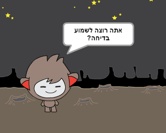

## שמור את הפרויקט שלך { .save }

# שלב 4: שינוי מיקום { .activity }

אתה יכול גם לתכנת את הצ'אט בוט שלך לשנות מיקום.

## סדר פעולות { .check }

+ הוסף עוד רקע לבמה שלך, לדוגמה רקע של ה'ירח' (moon).

	

+ אתה יכול עכשיו לתכנת את הצ'אט בוט שלך לשנות מיקום, על ידי הוספת הקוד הזה לצ'אט בוט שלך:

	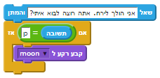

+ אתה גם צריך לוודא שהצ'אט בוט שלך נמצא בחוץ כאשר אתה מתחיל לדבר איתו. הוסף את הבלוק הזה לתחילת הקוד של הצ'אט בוט שלך:

	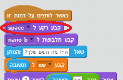

+ בדוק את התוכנית שלך, וענה `כן` כאשר הוא שואל אותך אם אתה רוצה לבוא לירח. אתה צריך לראות שמיקום של הצ'אט בוט שלך השתנה.

	

+ האם הצ'אט בוט שלך ישנה מקום אם תקליד `לא`? מה אם תקליד `אני לא בטוח`?

+ אתה יכול גם להוסיף את הקוד הזה בתוך בלוק ה- `אם` {.blockcontrol} שלך, כדי לגרום לצ'אט בוט שלך לקפוץ למעלה ולמטה 4 פעמים אם התשובה היא `כן`:

	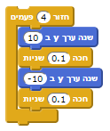

	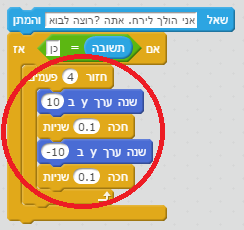

+ בדוק את הקוד שלך שוב. האם הצ'אט בוט שלך קפץ למעלה ולמטה אם ענית `כן`?

## שמור את הפרויקט שלך { .save }

## אתגר: צור צ'אט בוט משלך {.challenge}
תשתמש במה שלמדת כדי לסיים ליצור את הצ'אט בוט האינטראקטיבי שלך. הנה כמה רעיונות:

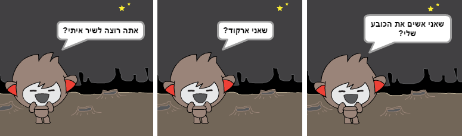

לאחר שסיימת ליצור את הצ'אט בוט שלך, תן לחברים שלך לשוחח איתו! האם הם אהבו את הדמות שלך? האם הם מצאו בעיות כלשהן?

## שמור את הפרויקט שלך { .save }
