---
title: מכסחי השדים
level: סקראצ' 1
language: he-IL
stylesheet: scratch
embeds: "*.png"
materials: ["Club Leader Resources/*"]
...

## הערה: { .challenge .pdf-hidden }
פרויקט "הבלונים"הועבר לקטגוריה [פרויקטים נוספים בסקרטצ'](http://projects.codeclubworld.org/he-IL/03_scratch_bonus/index.html).

# הקדמה { .intro }

אתה הולך ליצור משחק לתפוס את הרוח!

	<iframe allowtransparency="true" width="485" height="402" src="http://scratch.mit.edu/projects/embed/60787262/?autostart=false" frameborder="0"></iframe>
	

# שלב 1: אנימציה של רוח { .activity }

## רשימת פעולות { .check }

+ התחל פרויקט סקראטצ' חדש, ומחק את דמות החתול כך שהפרויקט יהיה ריק. אתה יכול למצוא את עורך הסקראטצ' און ליין בכתובת <a href="http://jumpto.cc/scratch-new">jumpto.cc/scratch-new</a>.

+ הוסף דמות של רוח חדשה, ותפאורת רקע מתאימה.

	

+ הוסף את הקוד הבא לרוח שלך, כך שהיא תופיע ותיעלם שוב ושוב:

	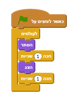

+ בדוק את הקוד של הרוח שלך, על ידי לחיצה על הדגל הירוק.

## שמור את הפרויקט שלך { .save }

# שלב 2: רוחות אקראיות { .activity }

קל מאוד לתפוס את הרוח שלך, בגלל שהיא לא זזה!

## רשימת פעולות { .check }

+ במקום להישאר באותו המקום, אתה יכול לתת לסראטצ' לבחור נקודות X ו- Y אקראיים. הוסף בלוק `קפוץ אל` {.blockmotion} לקוד של הרוח שלך, כך שזה יראה כך:

	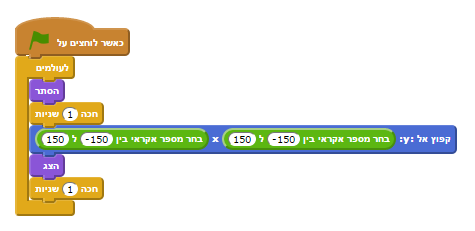

+ בדוק את הרוח שלך שוב, ואתה צריך לשים לב שהיא מופיעה במקום שונה בכל פעם.

## שמור את הפרויקט שלך { .save }

## אתגר: עוד אקראיות {.challenge}
האם אתה יכול לגרום לרוח שלך לחכות עם בלוק `חכה` {.blockcontrol} כמות של זמן אקראית לפני שהיא מופיעה? האם אתה יכול הלשתמש בבלוק `קבע גודל` {.blocklooks} כדי לעשות שהרוח שלך תהיה בגודל אקראי בכל פעם שהיא מופיעה?

## שמור את הפרויקט שלך { .save }

# שלב 3: לתפוס רוחות { .activity }

בוא נאפשר לשחקן לתפוס רוחות!

## רשימת פעולות { .check }

+ כדי לאפשר לשחקן לתפוס רוח, הוסף את הקוד הבא:

	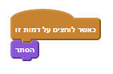

+ בדוק את הפרויקט שלך. האם אתה יכול לתפוס רוחות כאשר הן מופיעות? אם גילית שזה קשה לתפוס את הרוחות, אתה יכול לשחק את המשחק במצב של מסך מלא על ידי לחיצה על הכפתור הזה:

	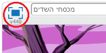

## אתגר: הוספת צלילים { .challenge }
האם אתה יכול להשמיע צליל בכל פעם שתופסים רוח?

## שמור את הפרויקט שלך { .save }

# שלב 4: הוספת ניקוד { .activity .new-page }

בוא נעשה את הדברים קצת יותר מעניינים על ידי שמירת ניקוד.

## רשימת פעולות { .check }

+ כדי לשמור את הניקוד של השחקן, אתה צריך מקום לשמור אותו. __משתנה__ הוא מקום בו מאחסנים מידע שאפשר לשנות, כמו ניקוד.

	כדי ליצור משתנה חדש, לחץ על הטאב של "תסריטים", בחר `נתונים` {.blockdata} ולחץ על "צור משתנה".
	
	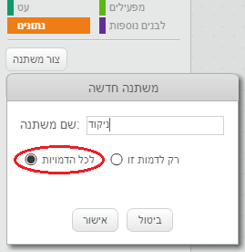
	
	הקלד "ניקוד" בשם המשתנה, וודא כי הוא זמין לכל הדמויות, ולחץ "אישור" כדי ליצור אותו. עכשיו אתה תראה המון בלוקים של קוד שאתה יכול להשתמש בהם עם המשתנה `ניקוד` {.blockdata} שיצרת.
	
	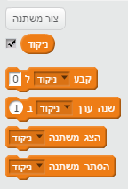
	
	אתה גם תראה את הניקוד בפינה השמאלית עליונה של תפאורת הרקע.
	
	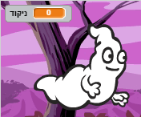

+ כאשר משחק חדש מתחיל (על ידי לחיצה על הדגל),אתה צריך לקבוע את הניקוד של השחקן ל- 0:

	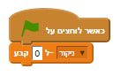

+ כאשר רוח רפאים נתפסת, אתה צריך להוסיף 1 לניקוד של השחקן:

	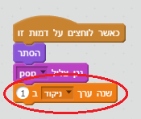

+ הרץ את התוכנית שלך שוב ותפוס כמה רוחות. האם הניקוד שלך משתנה?

## שמור את הפרויקט שלך { .save }

# שלב 5: הוסף שעון עצר { .activity }

אתה יכול לעשות את המשחק שלך מעניין יותר, על ידי כך שתיתן לשחקן שלך רק 10 שניות לתפוס כמה רוחות רפאים שרק אפשר.

## רשימת פעולות { .check }

+ אתה יכול להשתמש במשתנה נוסף לשמור את הזמן שנותר. לחץ על תפאורת הרקע, וצור משתנה חדש בשם "זמן":

	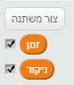

+ זהו האופן בו שעון העצר צריך לעבוד:

	+ שעון העצר צריך להתחיל ב- 10 שניות;
	+ שעון העצר צריך לספור למטה כל שניה;
	+ המשחק צריך לעצור כאשר שעון העצר מגיע ל- 0.

	הנה הקוד שצריך לבצע זאת, שאותו אתה יכול להוסיף לתפאורת __הרקע שלך__:

	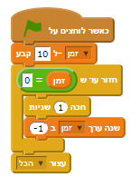

	כך אתה מוסיף את הקוד `חזור עד ש`{.blockcontrol}`זמן`{.blockdata}` = 0`{.blockoperators}:

	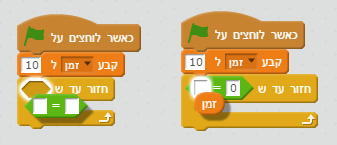

+ גרור את תצוגת משתנה ה"זמן" לצד ימין של תפאורת הרקע. אתה גם יכול ללחוץ על תצוגת המשתנה עם המקש הימני ולבחור "large readout" כדי לשנות את תצוגת הזמן.

	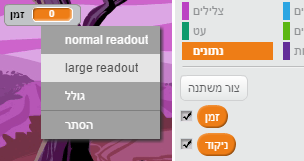

+ בקש מחבר לבחון את המשחק שלך. לכמה נקודות הם יכולים להגיע? אם המשחק שלך קל מידי, אתה יכול:

	+ לתת לשחקן פחות זמן;
	+ לגרום לרוחות הרפאים להופיע בתדירות נמוכה יותר;
	+ לעשות את הרוחות קטנות יותר.
	
	בדוק את המשחק שלך מספר פעמים עד שתהיה מרוצה ותחליט שזו רמת הקושי הנכונה.

## שמור את הפרויקט שלך { .save }

## אתגר: אוביקטים נוספים {.challenge}
האם אתה יכול להוסיף אוביקטים אחרים למשחק שלך?

אתה תצטרך לחשוב על האוביקטים שאתה מוסיף. תחשוב על:

+ כמה גדול הוא יהיה?
+ האם הוא יופיע בתדירות גבוה או נמוכה מרוחות הרפאים?
+ איך הוא יראה/ישמע כאשר יתפסו אותו?
+ כמה נקודות תקבל (או תפסיד) על כך שתפסת אותו?

אם אתה צריך עזרה להוסיף אוביקט נוסף, אתה יכול להשתמש בצעדים למעלה!

## שמור את הפרויקט שלך { .save }
