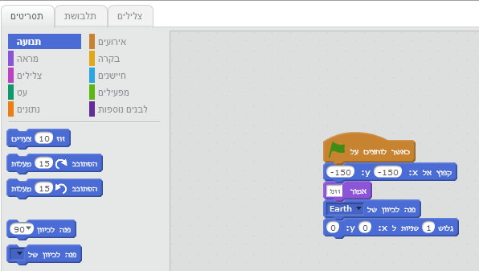
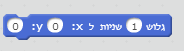
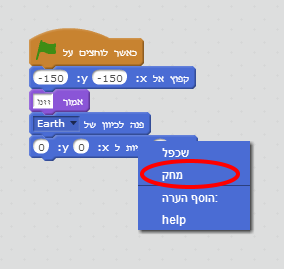
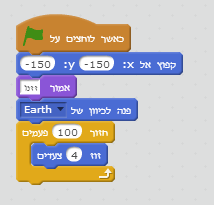
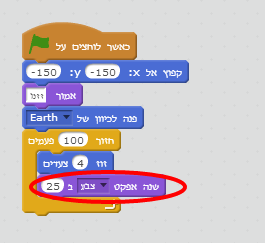
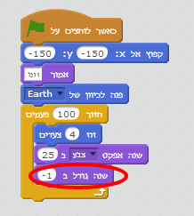
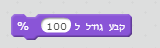
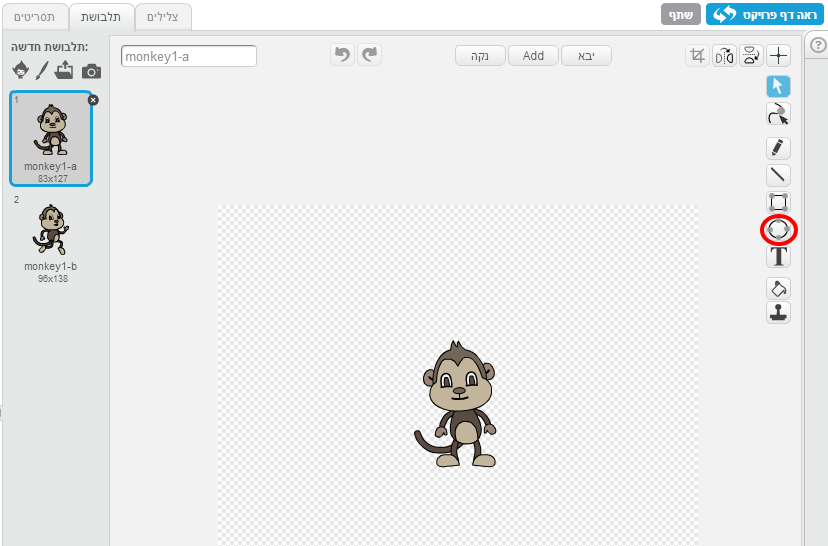
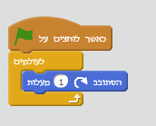
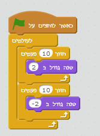

---
title: נאבד בחלל
level: Scratch 1
language: he-IL
stylesheet: scratch
embeds: "*.png"
materials: ["Club Leader Resources/*"]
...

# מבוא { .intro }

בפרויקט זה נלמד איך לבנות את האנימציה משלנו

  <iframe allowtransparency="true" width="485" height="402" src="http://scratch.mit.edu/projects/embed/26818098/?autostart=false" frameborder="0"></iframe>
  

# שלב 1: אנימציה של חללית { .activity .new-page}

בואו נגרום לחללית לטוס לכיוון של כדור הארץ

## סדר פעולות { .check }

+ נתחיל פרויקט חדש ונמחק את החתןל
<a href="http://jumpto.cc/scratch-new">jumpto.cc/scratch-new</a>

+ נוסיף 2 דמויות: חללית וכדור הארץ ורקע עם כוכבים. הפרויקט אמור להראות ככה

	

+ נלחץ על חללית ואז על תלבושות

	

+ נשתמש בחץ כדי לבחור את התמונה ואז נלחץ על עיגול מעל התמונה כדי לסובב אותה הצידה
	
	

+ נוסיף קוד לדמות

	

	נשנה את המספרים בתוך הבלוק כדי שהם יהיו זהים לאלו שבתמונה

+ נלחץ ונבקוד אם החללית זזה לכיוון המרכז

	
	
	חשוב להכיר את מיקום הדמויות על הבמה. אם איקס ו-וואי שלישיים הדמות תהיה בפינה שמאלית תחתונה ואם הערכים חיוביים הדמות תהיה בפינה ימנית עליונה

	

	אם אנחנו לא בטוחים לגבי המיקום תמיד אפשר לבדוק אותו במעבר העכבר על הבמה - בפינה ימנית תחתונה נראה את הקואורדינטות של העכבר

	

+ נלחץ על הדגל הירוק לבדוק את האנימציה

	

## אתגר: שדרוג אנימציה {.challenge}
אפשר לשנות מספרים באנימציה 
+ אם החללית נוגעת בכדור הארץ
+ אם חללית זזה מהר מידי

אפשר לשחק עם המספרים בבלוק זה

  

## נשמור את הפרויקט { .save }

# שלב 2: אנימציה דרך לולאות { .activity .new-page }

דרך נוספת להוסיף אנימציה היא בהוספת תנועה קטנה הרבה פעמים

## סדר פעולות { .check }

+ נמחק בלוק גלישה בלחיצה על כפתור ימני ובחירה במחק. אם למחוק את בלוקים בעזרת לגרירה לאיזור של תסריטים

	

+ נוסיף קוד חדש של לולאה

	

	בלוק חזור...פעמים משמש לחזרה על פעולה מסויימת הרבה פעמים - ידוע גם כלולאה

+ נלחץ על הדגל ונבדוק את הקוד

+ אפשר לשדרג את הלולאה בהוספה של שינוי צבע מתוך מראה

	

+ נלחץ על הדגל ונבדוק את הקוד

	

+ ועכשיו נוסיף שינוי גודל של חללית בדרך שלה לכדור הארץ

	

+ נלחץ כמה פעמים על הדגל. החללית הפכה לקטנה מידי? זה הזמן להחזיר לה את הגודל המקורי

	

## נשמור את הפרויקט { .save }

# שלב 3: סיבוב של הקוף { .activity .new-page }

בואו נוסיף אנימציה לקוף שנאבד בחלל

## סדר פעולות { .check }

+ נוסיף דמות של הקוף

	

+ ניכנס לתלבושות ונערוך איך הקוף נראה. נלחץ על אליפסה ונוסיף עיגול סביב ראש הקוף

	

+ נחזור לתסריטים ונגרום לקוף להסתובב סביב עצמו לעולמים

	

	לעולמים זו לולאה שפועלת ללא הפסקה עד סיום ההרצה

+ נחלץ על הדגל כדי לבדוק את האנימציה. עצירה של אנימציה זו אפשרית בלחיצה על עצור

	

# שלב 4: התנגשות אסטרואידים { .activity .new-page }

ועכשיו נתקדם לאנימציה של התנגשות

## סדר פעולות { .check }

+ נוסיף אסטרואיד לבמה

	

+ ועכשיו הקוד של אסטרואיד

	

+ נלחץ על הדגל כדי לבדוק את הקוד. האם החללית מתנגשת בקצוות של הבמה

# שלב 5: כוכבים { .activity .new-page }

ועכשיו נחבר כמה לולאות ביחד וניצור אנימציה לכוכבים

## סדר פעולות { .check }

+ נוסיף כוכב לבמה

	

+ נוסיף קוד לכוכב

	

+ נלחץ על הדגל כדי לבדוק את הקוד. מה הכוכב עושה? הוא גדל באיטיות ואז קטן באיטיות ועושה זאת כל הזמן

## נשמור את הפרויקט { .save }

## אתגר: תעשה אנימציה משלך {.challenge}
תעצור את האנימציה ותשמור את הפרויקט

השתמש במה שלמדת כדי ליצור אנימציה שלך

## נשמור את הפרויקט { .save }
