---
title: תיבת צביעה
level: סקראצ' 1
language: he-IL
stylesheet: scratch
embeds: "*.png"
materials: ["Club Leader Resources/*","Project Resources/*"]
...

# מבוא { .intro }

בפרויקט זה, אתה תיצור תוכנת צייר משלך.

  <iframe allowtransparency="true" width="485" height="402" src="http://scratch.mit.edu/projects/embed/63473366/?autostart=false" frameborder="0"></iframe>
  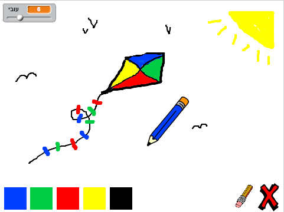

# שלב 1: יצירת עיפרון { .activity }

בוא נתחיל ביצירת עיפרון, שניתן להשתמש בו כדי לצייר על הבמה.

## רשימת פעולות { .check }

+ התחל פרויקט סקראצ' חדש, ומחק את דמות החתול כך שהפרויקט שלך יהיה ריק. אתה יכול למצוא את עורך הסקראצ' און ליין בכתובת <a href="http://jumpto.cc/scratch-new">jumpto.cc/scratch-new</a>.

+ הוסף דמות של עיפרון לפרויקט שלך.

	 

+ לחץ על 'תלבושות', ומחק את התלבושת 'pencil-b'.

	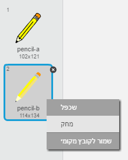 

+ שנה את שם התלבושת שלך ל- 'עיפרון-כחול', והשתמש בכלי 'צבע צורה' כדי לצבוע את העיפרון בכחול.

	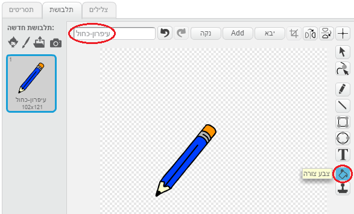 

+ כיוון שאתה תשתמש בעכבר שלך כדי לצייר, אתה תרצה שהעיפרון יעקוב אחרי העכבר `לעולמים` {.blockcontrol}. הוסף את הקוד הזה לדמות העיפרון שלך:

	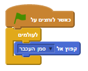

+ בדוק את הקוד הזה על ידי לחיצה על הדגל ולאחר מכן הזז את העכבר על הבמה. האם זה עובד כמו שציפית?

+ האם שמת לב שמרכז העיפרון, ולא הקצה שלו, הוא שעוקב אחר מצביע העכבר?

	

	כדי לסדר את זה, לחץ על התלבושת 'עיפרון-כחול' של דמות העיפרון שלך, ולחץ על 'קביעת מרכז התלבושת'.

	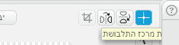

+ שים לב שכעת מופיע סימן פלוס גדול על התלבושת. עכשיו אתה יכול ללחוץ בקצה העיפרון, כדי לקבוע נקודה זו כמרכז התלבושת.

	

+ לחץ על המחיצה 'תסריטים', ולאחר מכן בדוק את בעיפרון שלך שוב - האם הוא עובד טוב יותר מאיך שהוא עבד קודם לכן?

+ הדבר הבא, בוא נגרום לעיפרון שלך לצייר `אם` {.blockcontrol} לחצו על העכבר. הוסף את הקוד הזה לדמות העיפרון שלך:

	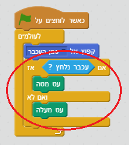	

+ בדוק את הקוד שלך שוב. הפעם, הזז את העיפרון שלך סביב הבמה והחזק את כפתור העכבר לחוץ. האם אתה יכול צייר עם העיפרון שלך?

	

## שמור את הפרויקט שלך { .save }

# שלב 2: עטים צבעוניים { .activity }

בוא נוסיף עטים בצבעים שונים לפרויקט שלך, ונאפשר למשתמש לבחור ביניהם!

## רשימת פעולות { .check }

+ לחץ על דמות העיפרון שלך, לחץ על 'תלבושות' ושכפל את תלבושת ה- 'עיפרון-כחול' שלך.

	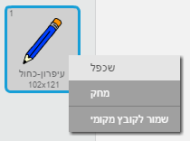

+ שנה את שם התלבושת החדשה שלך ל- 'עיפרון-ירוק', וצבע את העיפרון בירוק.

	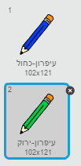

+ צור שתי דמויות חדשות, שישמשו אותך כדי לבחור בעיפרון הכחול או הירוק.

	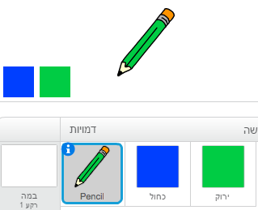

+ כאשר ילחצו על הסמל הבורר הירוק, אתה צריך ל- `שדר מסר` {.blockevents} לדמות העיפרון, שאומר לה לשנות את התלבושת שלה ואת צבע העיפרון שלה.

	על מנת לעשות זאת, תחילה הוסף את הקוד הזה לסמל הבורר הירוק:

	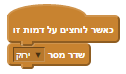

	כדי ליצור את הבלוק `שדר מסר` {.blockevents}, לחץ על החץ למטה ובחר 'מסר חדש...'.

	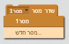

	לאחר מכן אתה יכול להקליד 'ירוק' כדי ליצור את ההודעה החדשה שלך.

	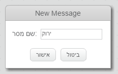

+ עכשיו אתה צריך לומר לדמות העיפרון שלך מה לעשות כאשר היא מקבלת את המסר. הוסף את הקוד הזה לדמות העיפרון שלך:

	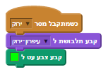

	כדי לקבוע את צבע העיפרון לירוק, לחץ על התיבה הצבועה בבלוק `קבע צבע` {.blockpen}, ולחץ על סמל הבורר הירוק כדי לבחור את הצבע הירוק לעיפרון שלך.

+ עכשיו אתה יכול לעשות אותו הדבר לסמל הבורר הכחול, הוסף את הקוד הזה לדמות הבורר הכחול:

	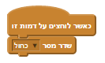

	...והוסף את הקוד הזה לדמות העיפרון:

	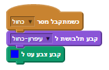

+ לבסוף, אתה צריך לומר לדמות העיפרון שלך איזו תלבושת וצבע עיפרון לבחור, כמו גם לנקות את המסך, כאשר הפרויקט שלך מתחיל. הוסף את הקוד הזה בהתחלה של קטע הקוד `כאשר לוחצים על הדגל` {.blockevents} של העיפרון שלך (לפני לולאת ה- `לעולמים` {.blockcontrol}):

	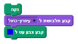

	אם אתה מעדיף, אתה יכול להתחיל עם עיפרון בצבע שונה!

+ בדוק את הפרויקט שלך. האם אתה יכול להחליף בין עטים כחולים לירוקים?

	

## שמור את הפרויקט שלך { .save }

# שלב 3: עושים טעויות { .activity .new-page }

לפעמים טעויות קורות, אז בוא נוסיף כפתור 'נקה' ומחק לפרויקט שלנו!

## רשימת פעולות { .check }

+ בוא נוסיף כפתור כדי לנקות את הבמה. לשם כך, הוסף את דמות האות 'X-block' לבמה, וצבע אותה באדום.

	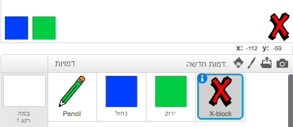

+ הוסף קוד לכפתור הביטול החדש שלך כדי לנקות את הבמה כאשר לוחצים עליו.

	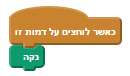

	שים לב שאתה לא צריך לשלוח הודעה כדי לנקות את הבמה, כיון שכל דמות יכולה לעשות את זה!

+ אתה יכול גם ליצור מחק. אם מדריך המועדון שלך נתן לך תיקיית 'משאבים', לחץ 'העלה תלבושת מקובץ' והוסף את התמונה 'eraser.svg'.

	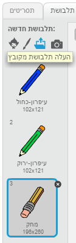
	
	אם אין לך את התמונה eraser.svg, פשוט תיצור עט לבן חדש במקום!

+ אתה צריך גם להוסיף את תמונת המחק כדמות בורר חדשה. ככה הבמה שלך צריכה להיראות:

	

+ לאחר מכן אתה יכול להוסיף קוד לדמות בורר המחק שלך, כדי לומר לעיפרון להחליף למחק.

	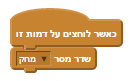

+ כאשר העיפרון מקבל את ההודעה הזו, אתה יכול ליצור מחק על ידי החלפה של תלבושת העיפרון למחק, והחלפת הצבע של העיפרון לצבע של הבמה!

	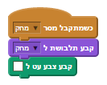

+ בדוק את הפרויקט שלך, כדי לראות אם אתה יכול לנקות ולמחוק על הבמה.

	

+ יש עוד בעיה אחת עם העיפרון - אתה יכול לצייר בכל מקום על הבמה, כולל ליד סמלי הבוררים!

	

	כדי לתקן זאת, אתה צריך לומר לעיפרון לצייר רק אם העכבר לחוץ וגם אם מיקום ה- y של העכבר גדול מ- -110 (`ערך עכבר בציר y`{.blocksensing}`> -120` {.blockoperators}). שנה את משפט ה- `אם` {.blockcontrol} של העיפרון שלך כדי שיראה כך:

	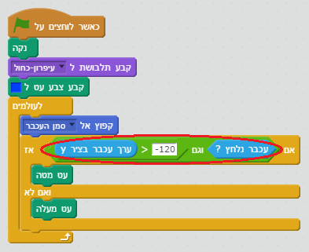

+ בדוק את הפרויקט שלך; כעת אתה לא אמור להיות מסוגל לצייר ליד סמלי הבוררים.

	

## שמור את הפרויקט שלך { .save }

# שלב 4: שינוי עובי העיפרון { .activity .new-page }

בוא נאפשר למשתמש לצייר באמצעות עפרונות במגוון גדלים שונים.

## רשימת פעולות { .check }

+ ראשית, הוסף משתנה חדש בשם 'עובי'. אם אתה לא בטוח איך לעשות את זה, הפרויקט 'בלונים' יכול לעזור לך.

+ הוסף את השורה הזו _בתוך_ לולאת ה- `לעולמים` {.blockcontrol} בקוד של העיפרון שלך:

	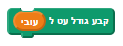

	העובי של העיפרון שלך יקבע כעת שוב ושוב לערך של המשתנה 'עובי' שלך.

+ אתה יכול לשנות את המספר המאוחסן במשתנה זה על ידי לחיצה על המשתנה שלך עם הלחצן הימני (על הבמה) ואז ללחוץ על 'גולל'.

	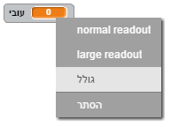

	עכשיו אתה יכול לגרור את המחוון בנמצא מתחת למשתנה שלך כדי לשנות את הערך שלו.

	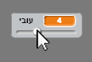

+ בדוק את הפרויקט שלך, ותראה אם אתה יכול לשנות את עובי העיפרון.

	

	אם אתה מעדיף, אתה יכול לקבוע את הערך הנמוך ביותר והערך הגבוה ביותר האפשריים של המשתנה 'עובי'. כדי לעשות זאת, לחץ על המשתנה שלך עם העכבר הימני שוב ולחץ על 'set slider min and max'. קבע את הערך הנמוך ביותר והערך הגבוה ביותר למשתנה שלך למשהו הגיוני יותר, כמו, 1 ו- 20.

	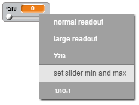

	המשך לבדוק את המשתנה 'עובי' שלך עד שתהיה מרוצה.

## שמור את הפרויקט שלך { .save }

## אתגר: קיצורי דרך { .challenge }
האם אתה יכול ליצור קיצורי מקשים לפקודות שלך? לדוגמה:

+ כ = החלף לעט הכחול
+ י = החלף לעט הירוק
+ מ = החלף למחק
+ נ = נקה מסך

אתה יכול גם לאפשר למשתמש לשנות את עובי העט באמצעות מקשי החצים!

## שמור את הפרויקט שלך { .save }

## אתגר: עטים נוספים { .challenge }
האם אתה יכול להוסיף עטים בצבע אדום, צהוב ושחור לתוכנת הצייר שלך? אתה תמצא את כל התמונות שאתה צריך בתיקיית ה- 'משאבים' שלך. זכור להוסיף קיצורי מקשים לעטים החדשים האלו!

האם אתה יכול להשתמש בעטים שלך כדי לצייר ציור?

