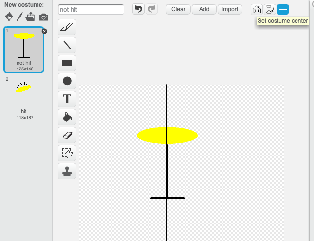

---
title: להקת רוק - דגשים למדריך
language: he-IL
embeds: "*.png"
...

#מבוא
בפרויקט זה ילדים ילמדו איך להשתמש בצלילים ולשנות תלבושות לדמויות

#חומרי הלימוד

כדי לבצע את הפרויקט יש להשתמש בסקראצ' 2 או לעשות גרסה וובית כאן
 [jumpto.cc/scratch-on](http://jumpto.cc/scratch-on)
כדי להתקין תוכנה למחשב ולהשתמש בלי אינטרנט
[jumpto.cc/scratch-off](http://jumpto.cc/scratch-off)

גרסה מלאה של בפרויקט ניתן לראות 
<a href="http://scratch.mit.edu/projects/26741186/#editor">באינטרנט</a>, או בלחיצה הורד חומרי לימוד

+ RockBand.sb2

#תכני לימוד
+ דמויות
+ תלבושות
+ לוגיקה של הפעלת בלוקים של הקוד
+ אירועים
+ צלילים

#אתגרים
+ שדרג את התופים - דרך שינוי תלבושות וצלילים
+ שדרג את הזמרת - דרך הוספת תלבושות
+ תיצור להקה בשלך - השתמש בכל מה שלמדת כדי ליצור להקה משלך

#שאלות נפוצות
+ לעיתים כאשר משנים תלבושות הדמויות קופצות. זה קורה כי התלבושות לא מיושרות
    כדי לטפל בזה יש להגדיר מרכוז של התלבושת בכל הדמויות
	

+ בלינוקס לחיצה ימנית יכולה לא לעבוד. ניתן לפתור זאת בלחיצה שמאלית ושיפט ארוך