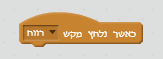
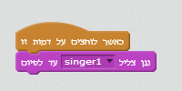

---
title: להקת רוק
level: Scratch 1
language: he-IL
stylesheet: scratch
embeds: "*.png"
materials: ["Club Leader Resources/*"]
...

# מבוא { .intro }

בפרויקט זה תלמדו איך ליצור את כלי נגינה שלכם

  <iframe allowtransparency="true" width="485" height="402" src="http://scratch.mit.edu/projects/embed/26741186/?autostart=false" frameborder="0"></iframe>
  

# שלב 1: דמויות { .activity }

לפני שנתחיל להפעיל אנימציה, בואו נבחר דמות 

## סדר פעולות { .check }

+ קודם כל נפתח סקראצ 
<a href="http://jumpto.cc/scratch-new">jumpto.cc/scratch-new</a>. 
זה נראה ככה

	

+ עכשיו נמחק את החתול : לחיצה ימנית על העכבר – בחירת אפשרות "מחק

	

+ נבחר דמות של כלי גנינה מתוך המאגר

	

+ נמצא את התופים ונלחץ פעמיים על הדמות כדי שהיא תתווסף לפרויקט

	

+ נקטין את הדמות כדי שהיא תתאים למשחק

	

## שמור את הפרויקט { .save }
לא  נשכח לשנות את שם הפרויקט בפינה שמאלית עליונה

הפרויקט נשמר אוטומטית, אך ליתר הבטחון נכנס ל"קובץ" ונבחר שמור עכשיו

# שלב 2: הבמה { .activity }

במה זה איזור בוא אנו רואים את כל הפרויקט, בדיוק כמו במה אמיתית

## סדר פעולות { .check }

+ בהתחלה הבמה עם רקע לבן וזה די משעמם. בואו נבחר רקע חדש 
נלחץ על בחר רקע מהסיפרייה

	

+ נבחר את הרקע בלחיצה כפולה עליו

	

+ עכשיו הבמה שלנו תראה ככה

	

# שלב 3: נפעיל את התופים { .activity }

עכשיו נגרום לתוף להשמיע צליל

## סדר פעולות { .check }

+ נוודא שאנו נמצאים בלשונית תסריטים. שימו לב שכל התסריטים צבועים בצבעים שונים. זה עוזר לנו להתמצא 

	נבחר באירועים ונמצא את הבלוק "כאשר לוחצים על הדמות", נגרור אותו לאיזור אפור בצד ימין ואז נעבור לצלילים (בתסריטים) ונבחר נגן תוף ... למשך... וגם אותו נגרור. חשוב לוודא ששני הבלוקים מחוברים.
	

+ נלחץ על התופים וננסה אותם

+ אפשר גם לשנות את התלבושת של בתוף בלחיצה עליו. לשם כך נעבור לתלבושות

	

+ כדי ליצור תלבושת חדשה – נלחץ כפתור ימני על העכבר – ונבחר "שכפל

	

+ עכשיו נבחר בתלבושת שנוצרה ונצייר עליה קוים

	

+ כדאי גם שנשנה את השמות כדי שיהיה לנו קל לנהל אותם בהמשך

	

+ עכשיו כאשר יש לנו 2 תלבושות, נבחר איזו נציג במצב רגיל ואיזה במצב לחיץ

	
עכשיו נוכל להחליף בין התלבושות. נחזור לתסריטים ונבחר במראה . שם נבחר "קבע תלבושת ל..." ונשים לפני נגן תלובשת אחד ואחרי – תלבושת אחרת. כמו קודם – הכל בגרירה לצד ימין וחיבור בין הבלוקים.

+ נלחץ על התוף ונבוודא שהקוד פועל

## נשמור את הפרויקט { .save }

##אתגר : נשדרג את התופים { .challenge }

+ האם תוכל לשנות את הצליל של התוף בלחיצה עליו

+ האם תוכל להפעיל את התוף בלחיצה על המקלדת באירועים

ניתן לשכפל את הקוד בלחיצה ימנית עליו ואז "שכפל

## נשמור את הפרויקט { .save }

# שלב 4 : זמרת { .activity .new-page }

בואו נוסיף זמרת ללהקה

## סדר פעולות { .check }

+ נוסיף עוד 2 דמויות זמרת ומיקרופון

	

+ לפני שנתחיל לעשות את הזמרת, בואו נוסיף צלילים לדמות. חשוב לוודא שאנו בדמות הנכונה (דמות שמסומנת בפינה שמאלית תחתונה). ואז נלחץ על לשונית צלילים

	

+ נבחר את הצליל מהמאגר ובלחיצה כפולה על העכבר נוסיף לרשימה

	

+ כאשר הצליל התווסף, נפעיל את הקוד. נעבור חזרה לתסריטים. באירועים נבחר “כאשר לוחצים על הדמות זו” ואז בצלילים שבתוך התסריטים נבחר “נגן צליל [] עד שמסתיים

	

+ נלחץ על הזמרת ונוודא שהכל עובד

## נשמור את הפרויקט { .save }

##אתגר: שינוי תלבושת לזמרת { .challenge }

האם תוכל לשנות את המראה של הזמרת כאשר לוחצים עליה 

לא לשכוח לבדוק שהקוד החדש עובד

## נשמור את הפרויקט { .save }

##אתגר: יצירת להקה שלמה { .challenge }

השתמש בכל מה שלמדת כדי ליצור להקה משלך. השתמש בכלי נגינה שיש במאגר או תיצור משלך, תוסיף צלילים

כמה רעיונות בשבילך

צייר חדשים גם

ואף הקליד צלילים משלך אם יש לך מירקופון במחשב

## שמור את הפרויקט { .save }
