---
title: ìä÷ú øå÷
level: Scratch 1
language: he-IL
stylesheet: scratch
embeds: "*.png"
materials: ["Club Leader Resources/*"]
...

# îáåà { .intro }

áôøåé÷è æä úìîãå àéê ìéöåø àú ëìé ðâéðä ùìëí!

<div class="scratch-preview">
  <iframe allowtransparency="true" width="485" height="402" src="http://scratch.mit.edu/projects/embed/26741186/?autostart=false" frameborder="0"></iframe>
  
</div>

# ùìá 1: ãîåéåú { .activity }

ìôðé ùðúçéì ìäôòéì àðéîöéä, áåàå ðáçø ãîåú. 

## ñãø ôòåìåú { .check }

+ ÷åãí ëì ðôúç àåøê ñ÷øàö' <a href="http://jumpto.cc/scratch-new">jumpto.cc/scratch-new</a>. æä ðøàä ëëä:

	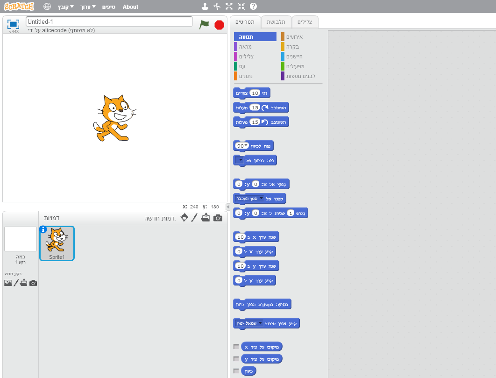

+ òëùéå ðîç÷ àú äçúåì : ìçéöä éîðéú òì äòëáø – áçéøú àôùøåú "îç÷".

	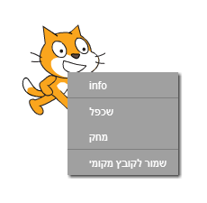

+ òëùéå ðáçø ãîåú ùì ëìé âðéðä îúåê äîàâø.

	

+ ðîöà àú äúåôéí åðìçõ ôòîééí òì äãîåú ëãé ùäéà úúååñó ìôøåé÷è.

	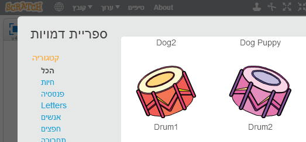

+ ð÷èéï àú äãîåú ëãé ùäéà úúàéí ìîùç÷

	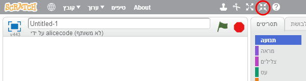

## ùîåø àú äôøåé÷è { .save }
ìà  ðùëç ìùðåú àú ùí äôøåé÷è áôéðä ùîàìéú òìéåðä

äôøåé÷è ðùîø àåèåîèéú, àê ìéúø äáèçåï ðëðñ ì"÷åáõ" åðáçø ùîåø òëùéå

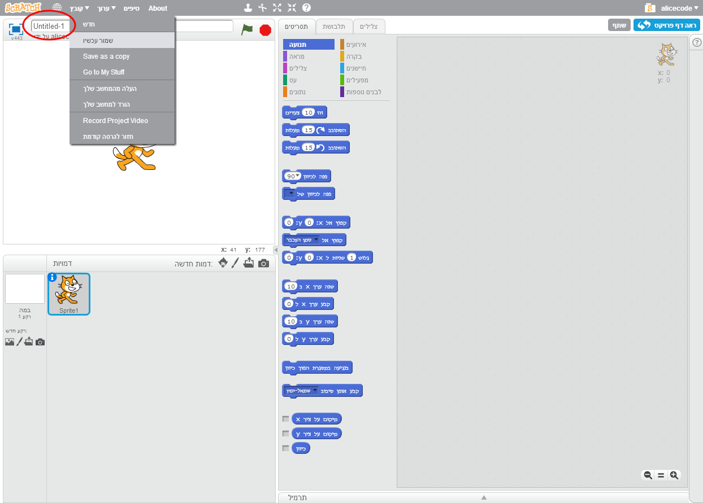

# Step 2: äáîä { .activity }

áîä æä àéæåø áåà àðå øåàéí àú ëì äôøåé÷è, áãéå÷ ëîå áîä àîéúéú.

## ñãø ôòåìåú { .check }

+ áäúçìä äáîä òí ø÷ò ìáï åæä ãé îùòîí. áåàå ðáçø ø÷ò çãù. 
ðìçõ òì áçø ø÷ò îäñéôøééä


	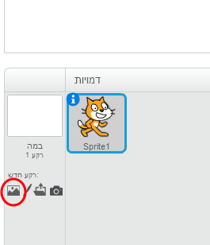

+ ðáçø àú äø÷ò áìçéöä ëôåìä òìéå.

	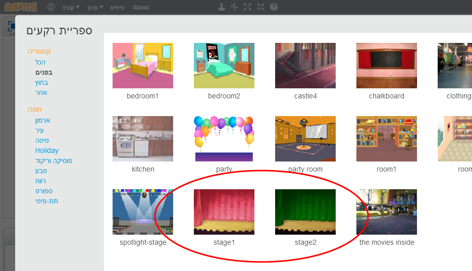

+ òëùéå äáîä ùìðå úøàä ëëä:

	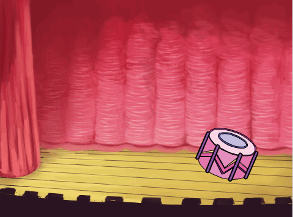

# Step 3: ðôòéì àú äúåôéí { .activity }

òëùéå ðâøåí ìúåó ìäùîéò öìéì.

## ñãø ôòåìåú { .check }

+ ðååãà ùàðå ðîöàéí áìùåðéú úñøéèéí (Scripts). ëì äúñøéèéí öáåòéí áöáòéí ùåðéí. 

	ðáçø áàéøåòéí (Events) åîöà àú äáìå÷ "ëàùø ìåçöéí òì äãîåú" (when this sprite clicked), ðâøåø àåúå ìàéæåø àôåø áöã éîéï  åàæ ðòáåø ìöìéìéí (Sounds) åðáçø ðâï úåó ... (play drum () for () beats) åâí àåúå ðâøåø. çùåá ìååãà ùùðé äáìå÷éí îçåáøéí. 	

	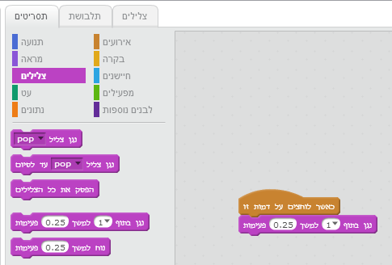

+ ðìçõ òì äúåôéí åððñä àåúí!

+ àôùø âí ìùðåú àú äúìáåùú ùì áúåó áìçéöä òìéå. ìùí ëê ðòáåø ìúìáåùåú.

	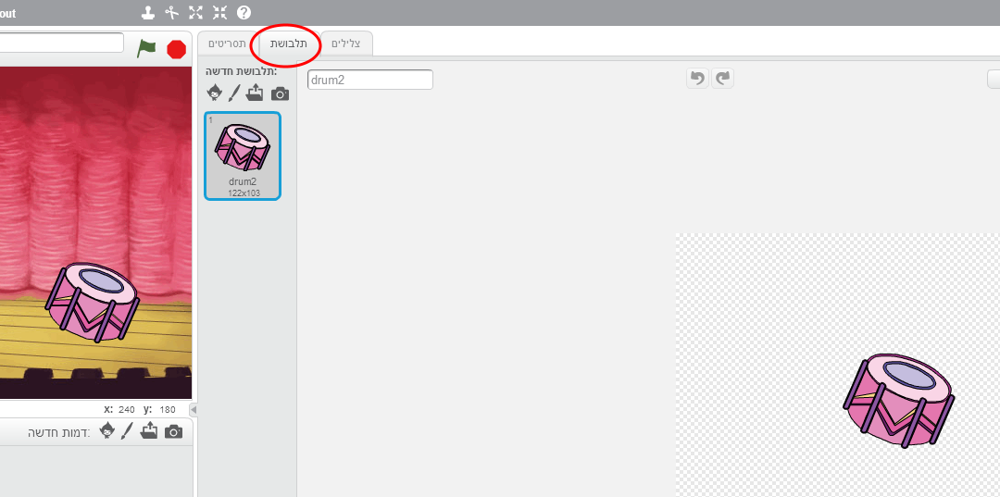

+ ëãé ìéöåø úìáåùú çãùä – ðìçõ ëôúåø éîðé òì äòëáø – åðáçø "äòú÷".

	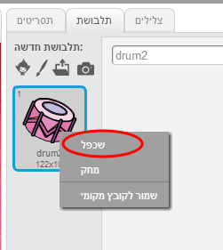

+ ðòëùéå ðáçø áúìáåùú ùðåöøä åðöééø òìéä ÷åéí.

	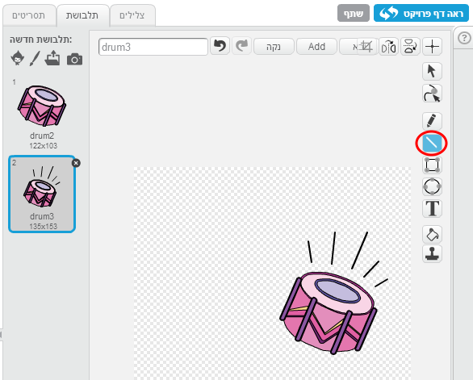

+ ëãàé âí ùðùðä àú äùîåú ëãé ùéäéä ìðå ÷ì ìðäì àåúí áäîùê.

	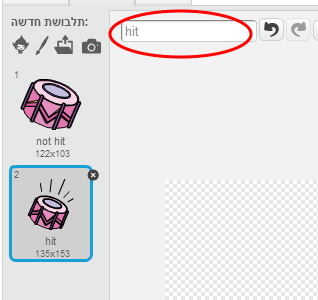

+ òëùéå ëàùø éù ìðå 2 úìáåùåú, ðáçø àéæå ðöéâ áîöá øâéì åàéæä áîöá ìçéõ

	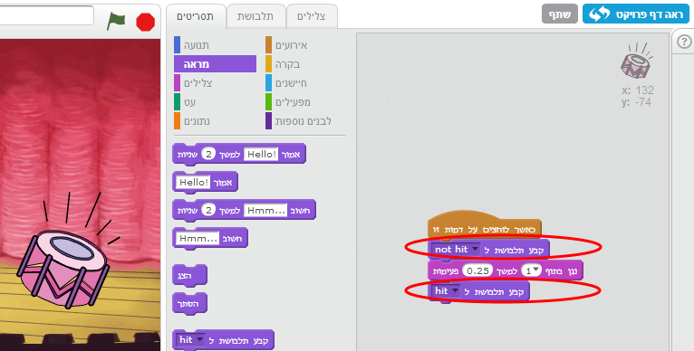
òëùéå ðåëì ìäçìéó áéï äúìáåùåú. ðçæåø ìúñøéèéí (Scripts) åðáçø á {.blocklooks} . ùí ðáçø äçìó úìáåùú ì... åðùéí ìôðé ðâï úìåáùú àçã åàçøé – úìáåùú àçøú. ëîå ÷åãí – äëì áâøéøä ìöã éîéï åçéáåø áéï äáìå÷éí.


+ ðìçõ òì äúåó åðáååãà ùä÷åã ôåòì

## ðùîåø àú äôøåé÷è { .save }

##àúâø : ðùãøâ àú äúåôéí { .challenge }

+ äàí úåëì ìùðåú àú äöìéì ùì äúåó áìçéöä òìéå?

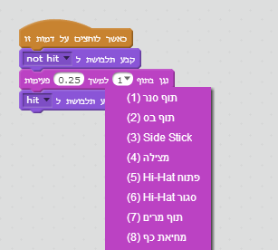

+ äàí úåëì ìäôòéì àú äôåó áìçéöä òì äî÷ìãú {.blockevents} :

```blocks
	when [space v] key pressed
```

ðéúï ìùëôì àú ä÷åã áìçéöä éîðéú òìéå åàæ "äòú÷"

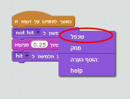

## ðùîåø àú äôøåé÷è { .save }

# ùìá 4 : æîøú { .activity .new-page }

áåàå ðåñéó æîøú ììä÷ä

## ñãø ôòåìåú { .check }

+ ðåñéó òåã 2 ãîåéåú æîøú åîé÷øåôåï.

	

+ ìôðé ùðúçéì ìòùåú àú äæîøú, áåàå ðåñéó öìéìéí ìãîåú. çùåá ìååãà ùàðå áãîåú äðëåðä (ãîåú ùîñåîðú áôéðä ùîàìéú úçúåðä). åàæ ðìçõ òì ìùåðéú öìéìéí (Sounds).

	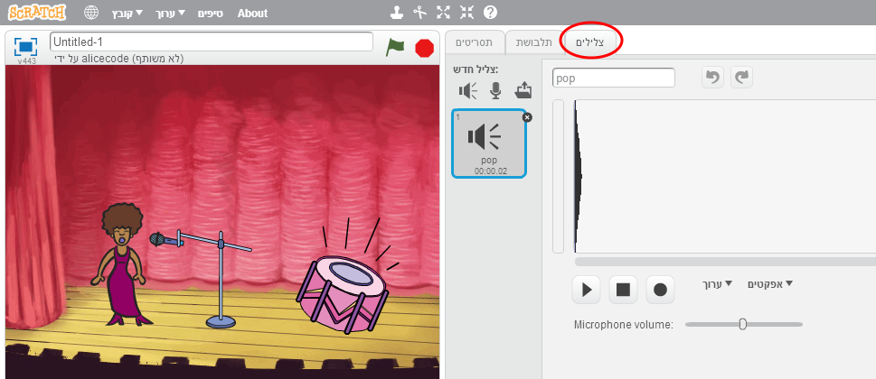

+ ðáçø àú äöìéì îäîàâø åáìçéöä ëôåìä òì äòëáø ðåñéó ìøùéîä.

	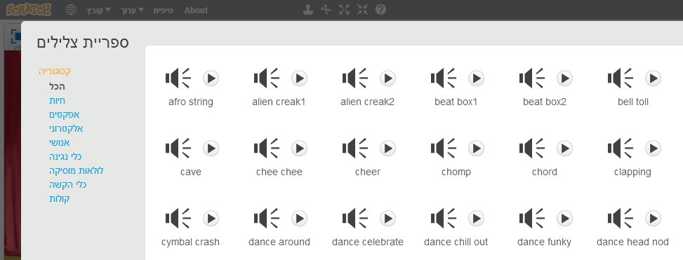

+ ëàùø äöìéì äúååñó, ðôòéì àú ä÷åã. ðòáåø çæøä ìúñøéèéí(Scripts). áàéøåòéí (Events) ðáçø “ëàùø ìåçöéí òì äãîåú” (when this sprite clicked) åàæ áöìéìéí ùáúåê äúñøéèéí ðáçø “ðâï öìéì [] òã ùîñúééí” (play sound [singer1 v] until done). 

	```blocks
		when this sprite clicked
		play sound [singer1 v] until done
	```

+ ðìçõ òì äæîøú åðååãà ùäëì òåáã.

## ðùîåø àú äôøåé÷è { .save }

##àúâø: ùéðåé úìáåùú ìæîøú { .challenge }
äàí úåëì ìùðåú àú äîøàä ùì äæîøú ëàùø ìåçöéí òìéä? 


ìà ìùëåç ìáãå÷ ùä÷åã äçãù òåáã!

## ðùîåø àú äôøåé÷è { .save }

##àúâø: úðñä ìéöåø ìä÷ä ùìîä { .challenge }
äùúîù áëì îä ùìîãú ëãé ìéöåø ìä÷ä îùìê. äùúîù áëìé ðâéðä ùéù áîàâø àå úéöåø îùìê, úåñéó öìéìéí

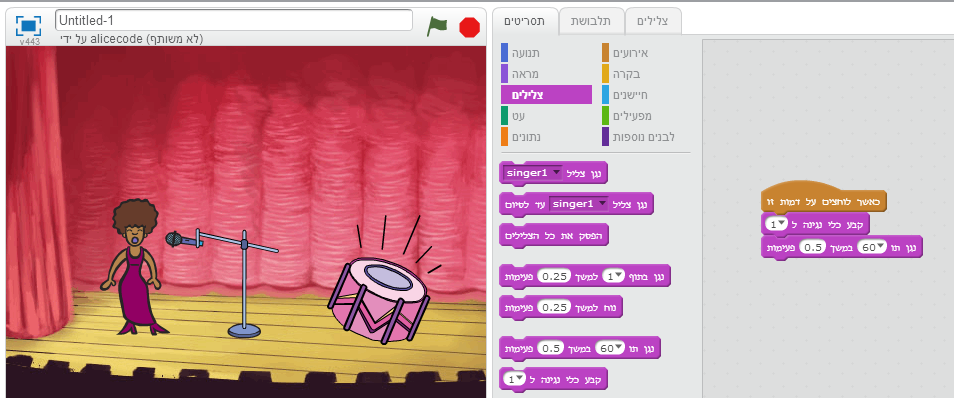

ëîä øòéåðåú áùáéìê


öééø çãùéí âí


åàó ä÷ìéã öìéìéí îùìê àí éù ìê îéø÷åôåï áîçùá

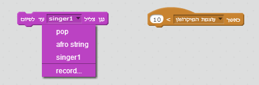

## ùîåø àú äôøåé÷è { .save }
