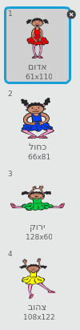
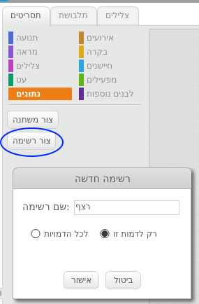
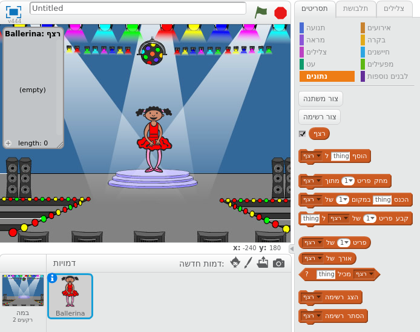
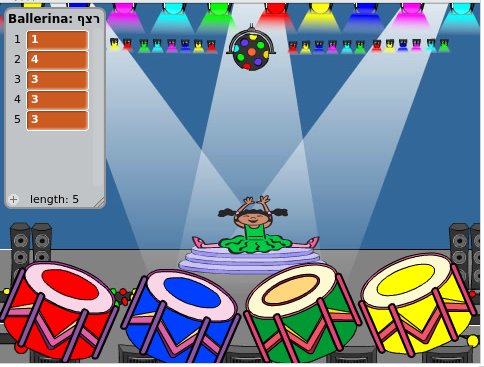
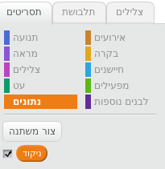
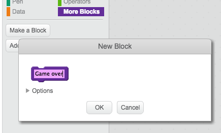

---
title: זיכרון
level: Scratch 2
language: he-IL
stylesheet: scratch
embeds: "*.png"
materials: ["Club Leader Resources/*"]
...
## פרויקט שנתרם על ידי הקהילה. { .challenge .pdf-hidden }
פרויקט זה נתרם על ידי אריק ובתו רות. אם תרצו לתרום פרויקט משלכם, חפשו אותנו ב[גיטהאב](https://github.com/CodeClub)


# מבוא { .intro }


בפרויקט זה תצרו משחק זכרון, בו תצטרכו לחזור על רצף אקראי של צבעים.


<div class="scratch-preview">
  <iframe allowtransparency="true" width="485" height="402" src="http://scratch.mit.edu/projects/embed/34874510/?autostart=false" frameborder="0"></iframe>
  
</div>


# שלב 1: צבעים אקראיים { .activity }
ראשית, נבחר דמות שתשנה את הצבעים שהשחקנים יצטרכו לזכור.


## סדר פעולות { .check }
+ התחילו פרויקט סקראצ חדש, ומחקו את דמות החתול כל שהפרויקט יהיה ריק. תוכלו למצוא עורך סקראצ מקוון ב-<a href="http://jumpto.cc/scratch-new">jumpto.cc/scratch-new</a>
+ בחרו דמות ורקע. הדמות לא חייבת להיות בן-אדם, אבל היא צריכה להיות מסוגלת להציג את הצבעים השונים.


+ במשחק, כל צבע ייוצג על ידי מספר:

	+ 1 = אדום
	+ 2 = כחול
	+ 3 = ירוק
	+ 4 = צהוב

	בחרו לדמות תלבושות בארבעת הצבעים. שימו לב שהתלבושות הצבעוניות יהיו בסדר הנכון.

	

+ כדי ליצור רצף אקראי, תצטרכו ליצור __רשימה__. רשימה היא משתנה שמכיל הרבה מידע __בסדר מסוים__.  צרו רשימה בשם `רצף` {.blockdata}. כיוון שרק הדמות צריכה לראות את הרשימה, אפשר לבחור "רק לדמות זו".





אתם אמורים לראות עכשיו רשימה ריקה בצד השמאלי העליון של הבמה, והרבה הוראות חדשות (בלוקים) שנוספו כדי להשתמש ברשימה.




+ כדי להוסיף חמישה מספרים אקראיים לרשימה ולהציג את התלבושת המתאימה, הוסיפו את הקוד הזה לדמות שלכם:


```blocks
כאשר לוחצים על  ⚑
מחק פריט (הכל v) מתוך [רצף v]
חזור (5) פעמים
   (בחר מספר אקראי בין (1) ל (4)) ל- [רצף v]  הוסף
   קבע תלבושת ל (פריט (אחרון v) של [רצף v])
   חכה (1) שניות
סוף
```


שימו לב שאתם מרוקנים את הרשימה בהתחלה.


## אתגר: הוספת צלילים {.challenge}
בדקו את הפרויקט מספר פעמים. שימו לב שלפעמים אותו מספר נבחר פעמיים (או יותר) ברצף, מה שגורם לכך שקשה יותר לזכור את הרצף. תוכלו להוסיף צליל של תוף בכל פעם שהדמות משנה תלבושת?


תוכלו לבחור צליל תוף שונה בהתאם למספר האקראי שנבחר? זה יהיה _מאוד_ דומה לקוד שמשנה את התלבושת של הדמות.


## שמרו את הפרויקט { .save }


# שלב 2: חזרה על הרצף { .activity }


נוסיף ארבעה כפתורים, כך שהשחקנים יוכלו לחזור על הרצף שהם זוכרים.


## סדר פעולות { .check }


+ הוסיפו ארבע דמויות לפרויקט. דמויות אלה יהיו הכפתורים. ערכו את הדמויות כך שכל אחת מהן תתאים לאחד מארבעת הצבעים.





+ כשלוחצים על התוף האדום, יש לשדר מסר לדמות שהכפתור האדום נלחץ. הוסיפו את הקוד הזה לתוף האדום:


```blocks
כאשר לוחצים על דמות זו
שדר מסר [אדום v]
```


+ כשהדמות מקבלת את המסר הזה, היא תבדוק אם המספר 1 נמצא בראש הרשימה (כלומר שהצבע האדום הוא הצבע הבא ברצף). אם המספר 1 אכן בתחילת הרשימה, אפשר להסיר אותו מהרשימה, כיוון שהשחקנים בחרו את הצבע הנכון. אחרת, המשחק נגמר.

```blocks
כשמתקבל מסר [אדום v]
אם <(פריט (1 v) של [רצף v]) = [1]> אז
   מחק פריט (1 v) מתוך [רצף v]
ואם לא
   אמור [סוף המשחק!] למשך (1) שניות
   עצור [הכל v]
סוף
```


+ כאשר הרשימה ריקה, כדאי להוסיף אורות מהבהבים, כי זה אומר שהשחקנים הצליחו לזכור את כל הרצף. הוסיפו את הקוד הזה בסוף התסריט של הדמות שמתחיל ב`כאשר לוחצים על  ⚑`{.blockevents}.


```blocks
חכה עד ש <(של [רצף v] אורך) = [0]>
שדר מסר [נצחון v] וחכה
```


+ לחצו על הבמה, והוסיפו את הקוד שיגרום לצבעים להשתנות כאשר השחקנים מנצחים.


```blocks
כשמתקבל מסר [נצחון v]
[drum machine v] נגן צליל
חזור (50) פעמים
   שנה אפקט [צבע v] ב (25)
   חכה (0.1) שניות
סוף
נקה אפקטים
```


## אתגר: יצירת ארבעה כפתורים {.challenge}
חזור על הצעדים עבור הכפתור הכחול, הכפתור הירוק והכפתור הצהוב. איזה חלקים מהקוד ישארו ללא שינוי, ואיזה חלקים ישתנו עבור כל כפתור?


אתם יכולים גם להוסיף צליל כאשר לוחצים על הכפתורים.


זכרו לבדוק את הקוד שהוספתם! האם הצלחתם לזכור רצף של חמישה צבעים? האם הרצף שונה בכל פעם?


# שלב 3: מספר שלבים במשחק { .activity .new-page }


עד עכשיו, השחקנים היו צריכים לזכור חמישה צבעים. כעת, נשפר את המשחק, כך שהאורך של הרצף יגדל בכל פעם שהשחקנים מצליחים לזכור את הרצף.


## סדר פעולות { .check }


+ צור משתנה בשם `ניקוד` {.blockdata}.





+ המשתנה `ניקוד` {.blockdata}. יקבע את אורך הרצף שהשחקנים ינסו לזכור. בתחילת המשחק הניקוד והאורך של הרצף יהיה 3. הוסיפו את הקוד הזה בתחילת התסריט של הדמות שמתחיל ב`כאשר לוחצים על  ⚑`{.blockevents}.


```blocks
[ניקוד v] -ל [3] קבע
```


+ במקום ליצור תמיד רצף של 5 צבעים, אנחנו רוצים שהאורך של הרצף ייקבע על ידי `ניקוד` {.blockdata}. שנו את לולאת ה `חזור` {.blockcontrol} של הדמות (הלולאה שיוצרת את הרצף) כך:


```blocks
חזור (ניקוד) פעמים
סוף
```

+ אם השחקנים חזרו בהצלחה אחרי הרצף, נוסיף 1 לניקוד, כדי שהרצף יתארך.


```blocks
שנה ערך [ניקוד v] ב (1)
```


+ לבסוף, נוסיף לולאת `לעולמים` {.blockcontrol} מסביב לקוד שיוצר את הרצף, כך שרצף חדש יווצר בכל שלב. כך צריך להראות הקוד של הדמות:


```blocks
כאשר לוחצים על  ⚑
[ניקוד v] -ל [3] קבע
לעולמים
   מחק פריט (הכל v) מתוך [רצף v]
   חזור (ניקוד) פעמים
      (בחר מספר אקראי בין (1) ל (4)) ל- [רצף v]  הוסף
      קבע תלבושת ל (פריט (אחרון v) של [רצף v])
      חכה (1) שניות
   סוף
   חכה עד ש <(של [רצף v] אורך) = [0]>
   שדר מסר [ניצחון v] וחכה
   שנה ערך [ניקוד v] ב (1)
סוף
```


+ הזמינו חברים לבדוק את המשחק שלכם. זכרו להסתיר את הרשימה `רצף` {.blockdata} לפני שהם מתחילים לשחק!


## שמרו את הפרויקט { .save }


# שלב 4: הניקוד הגבוה ביותר { .activity }


נשמור את הניקוד הגבוה ביותר - כדי שתוכלו להתחרות עם החברים.


## סדר פעולות { .check }


+ הוסיפו שני משתנים לפרויקט: `הניקוד הגבוה`{.blockdata} ו`שם`{.blockdata}.
+ כשמשחק מסתיים (כשלוחצים על כפתור לא נכון) בדקו אם הניקוד של השחקנית גבוה יותר מהניקוד הגבוה ביותר כרגע, ואם כן, שמרו את הניקוד בתור הניקוד הגבוה, ושמרו את שם השחקנית. כך צריך להראות הקוד של הכפתור האדום:


```blocks
כשמתקבל מסר [אדום v]
אם <(פריט (1 v) של [רצף v]) = [1]> אז
   מחק פריט (1 v) מתוך [רצף v]
ואם לא
   אמור [סוף המשחק!] למשך (1) שניות
   אם <(ניקוד) > (הניקוד הגבוה)> אז
      [הניקוד הגבוה v] -ל (ניקוד) קבע
      שאל [הניקוד הגבוה ביותר! מה שמך?] והמתן
      [שם v] -ל (תשובה) קבע
   סוף
   עצור [הכל v]
סוף
```


+ תצטרכו להוסיף את הקוד הזה גם לשלושת הכפתורים האחרים! שמתם לב שהקוד של "סוף המשחק" בכל אחד מהארבעת הכפתורים הוא בדיוק אותו דבר?


+ אם תרצו פעם לבצע שינוי בקוד הזה, כמו למשל להוסיף צליל או לשנות את ההודעה "סוף המשחק!", תאלצו לבצע את השינוי ארבע פעמים. זה עלול להיות מתיש ולבזבז הרבה זמן.


במקום זה, תוכלו להגדיר לבנים משלכם, ולהשתמש בהם מספר פעמים בפרויקט. לחצו על `לבנים נוספות` {.blockmoreblocks} ואז על 'צור לבנה'.  קבעו את שם הלבנה ל"סוף המשחק".





+ הוסיפו את הקוד שאחרי הבלוק `ואם לא` {.blockcontrol} מתוך הקוד של הכפתור האדום אל הבלוק החדש, שיראה כך:


+ יצרתם עכשיו _פונקציה_ שנקראת `סוף המשחק` {.blockmoreblocks}, שתוכלו להשתמש בה כשתרצו. גררו את הבלוק החדש `סוף המשחק` {.blockmoreblocks} אל ארבעת התסריטים של הכפתורים.


+ הוסיפו צליל כאשר נלחץ כפתור שגוי. תצטרכו להוסיף את הקוד _רק פעם אחת_ לבלוק `סוף המשחק` {.blockmoreblocks}, ולא ארבע פעמים!


## אתגר: יצירת בלוקים נוספים {.challenge}


תוכלו למצוא עוד קטעי קוד זהים לכל ארבעת הכפתורים?


האם תוכלו ליצור בלוק נוסף, שישמש כל אחד מהכפתורים?


## שמרו את הפרויקט { .save }


## אתגר: תלבושת נוספת {.challenge}
שמתם לב שהמשחק מתחיל כשהדמות מראה את אחד מהארבעת הצבעים, ולאחר שהרצף מסתיים הצבע האחרון ממשיך להיות מוצג בכל הזמן שבו השחקנים חוזרים על הרצף?


תוכלו להוסיף לדמות תלבושת לבנה שתוצג בתחילת המשחק ובזמן שהשחקנים מנסים לשחזר את הרצף?


## שמרו את הפרויקט { .save }


## אתגר: דרגות קושי {.challenge}
תוכלו לאפשר לשחקנים לבחור בין "דרגת קושי: קל" (יש שימוש רק בתופים האדום והכחול), לבין "דרגת קושי: בינוני" (יש שימוש בכל ארבעת התופים)?


תוכלו גם להוסיף "דרגת קושי:קשה" בה יהיה שימוש בתוף חמישי!


## שמרו את הפרויקט { .save }
