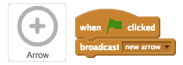
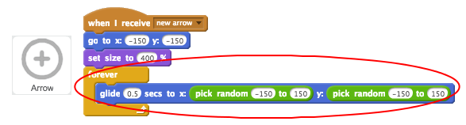

---
title: Archery
level: Scratch +
language: en-GB
stylesheet: scratch
embeds: "*.png"
materials: ["project-resources/*", "volunteer-resources/*"]
...

# Introduction { .intro }

You are going to learn how to create an archery game, in which you have to shoot arrows as close to the bullseye as you can.

  <iframe allowtransparency="true" width="485" height="402" src="https://scratch.mit.edu/projects/embed/114760038/?autostart=false" frameborder="0"></iframe>
  

# Step 1: Aiming arrows { .activity }

Let's start by creating an arrow that moves around the screen.

## Activity Checklist { .check }

+ Open the 'Archery' Scratch project. Your club leader will give you a copy of this project, or you can open it online at <a href="http://jumpto.cc/archery-resources" target="_blank">jumpto.cc/archery-resources</a>.

+ When your game starts, broadcast a message to shoot a new arrow.

	

+ Once this message has been received, set the arrow's position and size.

	

+ Click the green flag to test your game. You should see your arrow get bigger and move to the bottom-left of the stage.

	

+ Add code to your arrow so that it `glide` {.blockmotion}s randomly around the stage `forever` {.blockcontrol}.

	

+ Test your game again, and you should see your arrow move randomly around the stage.

	

## Save your project { .save }

# Step 2: Shooting arrows { .activity }

Let's code your arrow to shoot when the space bar is pressed.

## Activity Checklist { .check }

+ Stop the other script (the one moving the arrow) when the space bar is pressed.

	

+ Test your project again. This time, your arrow should stop moving __when the space bar is pressed__.

+ Animate your arrow, so that it looks like it's moving towards the target.

	

+ Test your game again. This time, when you press the space bar you should see your arrow get smaller, as if it's moving towards the target.

	

+ Once your arrow is at the target, you can tell the player how many points they have scored. For example, they could score 200 points for hitting the yellow.

	

+ You can also play a sound if they hit the yellow.

	

+ Finally, you need to broadcast the `new arrow` {.blockevents} message again to get a new arrow.

	

## Save your project { .save }

##Challenge: Different scores {.challenge}
Can you add code to your game, so that you get a different score for hitting different parts of the target?

## Save your project { .save }