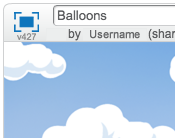

---
title: Balloons — Notes for Club Leaders
language: en-GB
embeds: "*.png"
...

#Introduction:
In this project, children will learn how to use variables to store data in their programs.

#Resources
For this project, Scratch 2 should be used. Scratch 2 can either be used online at [jumpto.cc/scratch-on](http://jumpto.cc/scratch-on) or can be downloaded from [jumpto.cc/scratch-off](http://jumpto.cc/scratch-off) and used offline.

You can find a completed version of this project <a href="http://scratch.mit.edu/projects/26745384/#editor">online</a>, or it can be downloaded by clicking the 'Download Project Materials' link for this project, which contains:

+ Balloons.sb2

#Learning Objectives
+ Variables;
+ Random numbers;
+ Cloning sprites.

#Challenges
+ "More randomness" - using random numbers;
+ "More objects" - applying skills to create another game object.

#Frequently Asked Questions
+ If children find it difficult to pop balloons without dragging them around, they can play the game in fullscreen mode, in which balloons aren't draggable.

