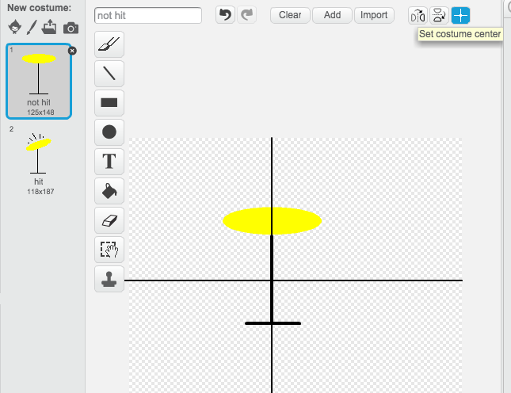

---
title: रॉक बैंड — Club Leaders के लिए नोट्स
language: hi-IN
embeds: "*.png"
...

#परिचय:
इस प्रोजैक्ट में बच्चे सीखेंगे कि कैसे अवाज़ अौर सगींत को जोङा जाय अौर कैसे पोषाक बदली जाय ।

#संसाधन
इस प्रोजैक्ट में Scratch 2 का उपयोग करें । Scratch 2 या तो अॉनलाइन उपयोग कर सकते हैं [jumpto.cc/scratch-on](http://jumpto.cc/scratch-on) या यहां से downloaded कर सकते हैं [jumpto.cc/scratch-off](http://jumpto.cc/scratch-off) अौर अॉफलाइन में उपयोग करें ।

इस प्रोजैक्ट का पूरा संस्करण यहां से लें <a href="http://scratch.mit.edu/projects/26741186/#editor">online</a>, या इसे download करें 'Download Project Materials' क्लिक करके , जिसमे है:

+ RockBand.sb2

#Learning Objectives
+ Sprites;
+ Costumes;
+ Sequential code blocks;
+ Events;
+ Sound and music.

#Challenges
+ "Improving your drum" - Changing sprite sounds and adding events;
+ "Changing your singer's costume" - adding and controlling sprite costumes;
+ "Make your own band" - using the skills learnt to create new instruments.

#Frequently Asked Questions
+ When creating their own sprites, children may find that their sprite 'jumps' when it's clicked, as it changes costume. This is because the two costumes are't centered in the same place.

  To fix this, click 'Set costume center' on _both_ sprites, and make sure they are centered at the same point in both costumes.

  

+ On Linux, right-clicking to delete a sprite may not work. If this is the case, holding shift and left-clicking will bring up the menu to delete a sprite.