---
title: रॉक बैंड
level: Scratch 1
language: hi-IN
stylesheet: scratch
embeds: "*.png"
materials: ["Club Leader Resources/*"]
...

# परिचय { .intro }

इस प्रोजैक्ट मे अाप अपने वाद्ययंत्र को कोड करना सीखेगे !

<div class="scratch-preview">
	<iframe allowtransparency="true" width="485" height="402" src="http://scratch.mit.edu/projects/embed/26741186/?autostart=false" frameborder="0"></iframe>
	
</div>

# चरण १: स्प्राइटस { .activity }

कंप्यूटर कोडिंग शुरु करने से पहले, अापको ‘वस्तु’ कोड में जोड़ना पड़ेगा । इन ‘व
तु’ को ‘__स्प्राइटस__’ कहते हैं ।

## गतिविधि जांच-सूची { .check }

+ पहले Scratch एडीटर खोलिये, अाप Scratch एडीटर ऑनलाइन यहां पा सकते हैं <a href="http://jumpto.cc/scratch-new" target="_blank">jumpto.cc/scratch-new</a>. एडीटर ऎसा दिखता है :

	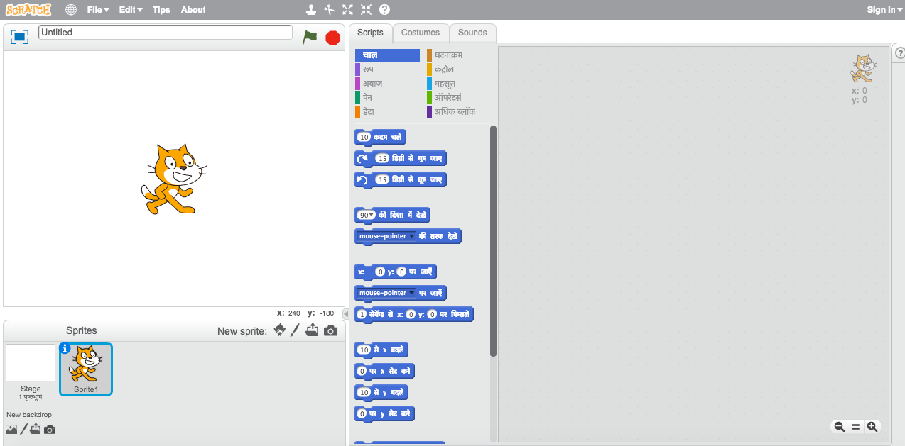

+ राइट Cat जो अाप देख रहे हैं इसे Scratch शुभंकर कहते हैं । अब इसे हटाते हैं, राइट क्लिक करके ‘मिटाना’ क्लिक करिये ।

	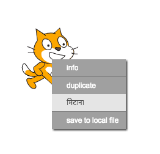

+ अब 'Choose sprite from library' क्लिक करें जिससे सारे स्प्राइटस की सूची खुलेगी ।

	

+ अब नीचे स्क्रॉल करें अौर अापको Drum1 दिखेगा । उसे क्लिक करें अौर 'OK' को क्लिक करें ।

	

+ 'shrink' चिह्न को क्लिक करें अौर फिर drum को क्लिक करके अपने हिसाब से सेट करें उसे छोटा करने के लिए ।

	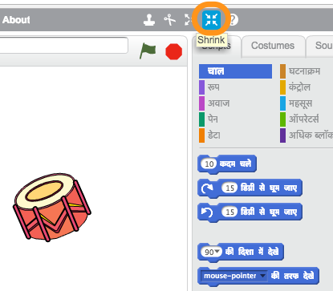

## अपने प्रोजैक्ट को Save करें { .save }

उपर से बाहिने तरफ के पाठ बॉक्स में लिखके अपने प्रोजैक्ट को एक नाम दें ।

उसके बाद 'File' क्लिक करें अौर फिर 'Save now' क्लिक करके अपने प्रोजैक्ट को save करें ।

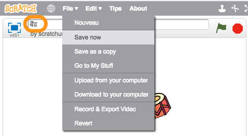

(अगर अापके पास Scratch अकाउंट न हो तो फिर अपने प्रोजैक्ट को save करके 'Download to your computer' क्लिक करें ) ।

# चरण २: मंच { .activity }

__मंच__ एक क्षेत्र अापके बाहिने हाथ में है, जहां अापका प्रोजैक्ट रहेगा । इसे अाप रंगमंच समझे जहां प्रदर्शन किया जाता है !

## गतिविधि जांच-सूची { .check }

+ अभी मंच खाली है अौर काफी उबाऊ है! चलिए पृष्ठभूमि बनाऎं मंच पे अौर क्लिक करें 'Choose backdrop from library' ।

	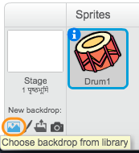

+ अब अपने बाहिने तरफ 'Indoors' को क्लिक करें अौर फिर मंच के पृष्ठभूमि को क्लिक करके 'OK' करें ।

	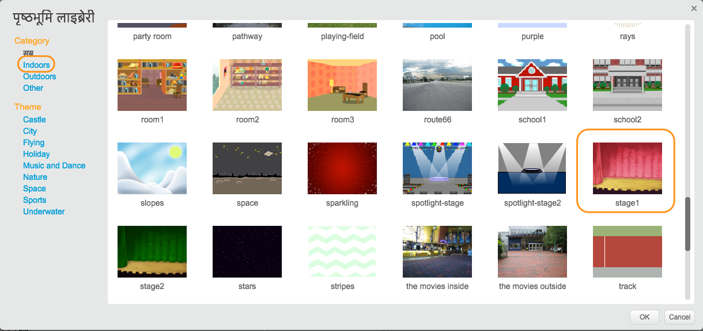

+ अापका मंच कुछ ऎसा दिखेगा:

	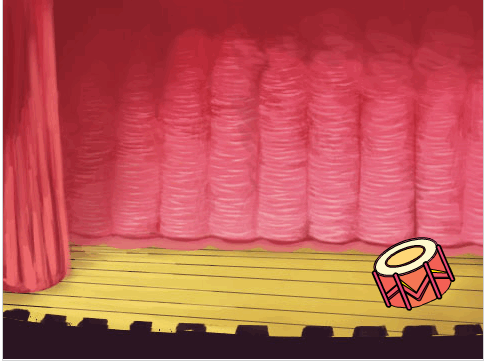

# चरण ३: Drum बनाऎं { .activity }

अब अपने drum को कोड करें जिससे जब क्लिक करें तो अवाज़ अाए ।

## गतिविधि जांच-सूची { .check }

+ अाप कोड ब्लॉकस को 'Scripts' टैब में ढूंढ सकते हैं, वो सब रंग कोडित हैं ।

	Drum स्प्राइट पे क्लिक करें अौर फिर इन २ ब्लॉकस को खींचकर कोड क्षेत्र में अपने दाहिने तरफ लाऎं, ध्यान रखें कि वो दोनो ब्लॉक अापस में जुड़े हुए हों (जैसे लेगो ब्लॉकस):

	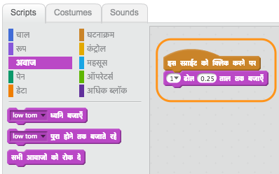

+ Drum को क्लिक करके पक्का कर लें कि अापका Drum बज रहा है !

## अपने प्रोजैक्ट को Save करें { .save }

##चुनौती: अपने drum को सुधारें { .challenge }

+ क्या अाप drum की अवाज़ बदल सकते हैं ?

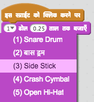

+ क्या अाप drum से अवाज़ स्पेस बार दबाके भी निकाल सकते हैं ? अापको इस ब्लॉक की ज़रुरत पङेगी `event` {.blockevents}:

```blocks
	जब [स्पेस v] बटन दबा हुआ है
```

अाप अपने कोड को कॉपी राइट क्लिक करके 'duplicate' से कर सकते हैं ।

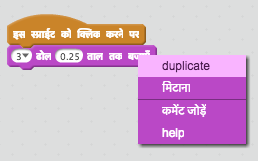

## अपने प्रोजैक्ट को Save करें { .save }

# चरण ४: गायिका बनाऎं { .activity .new-page }

चलिए अब गायिका को अपने बैंड मे जोङे !

## गतिविधि जांच-सूची { .check }

+ २ अौर स्प्राइटस को अपने मंच में जोङें; एक गायिका अौर एक माइक्रोफ़ोन ।

	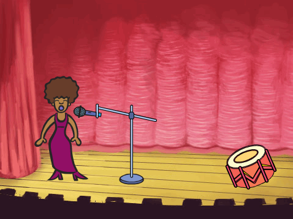

+ अापकी गायिका गाना गाय उससे पहले अापको अवाज़ देनी होगी अपने स्प्राइट में । ध्यान रखें कि अापने गायिका को चयन कर रखा हो फिर 'Sounds टैब क्लिक करिए अौर फिर 'Choose sound from library' क्लिक करें:

	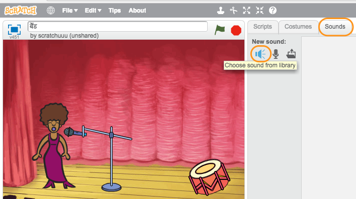

+ अगर अाप 'Vocals' जो अापके बाहिने हाथ मे है क्लिक करते हैं तो अाप अपने स्प्राइट मे सही अवाज़ दे सकते हैं ।

	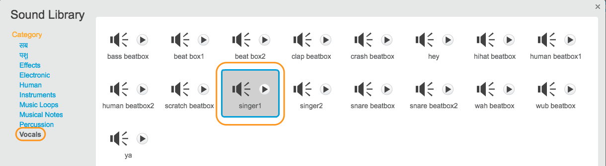

+ अब जबकि अवाज़ कोड मे है अाप गायिका को कोड मे ला सकते हैं:

	```blocks
		इस स्प्राईट को क्लिक करने पर
		[singer1 v] पुरा होने तक बजाते रहे
	```

+ अपनी गायिका को क्लिक करें अौर सुनिश्चित करें कि वो गाना गाय क्लिक करने पर ।

## अपने प्रोजैक्ट को Save करें { .save }

# चरण ५: पोशाक { .activity .new-page }

चलिए अब अपनि गायिका को गाता हुअा दिखाएं !

## गतिविधि जांच-सूची { .check }

+ अाप अपनि गायिका की पोशाक भी बदल सकते है जब उसे क्लिक किया जाय । 'Costumes' टैब को क्लिक करें अौर गायिका कि पोशाक बदलें ।

	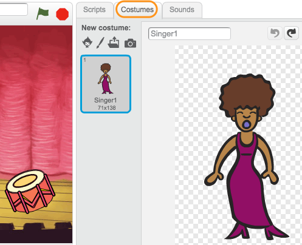

+ पोशाक पे राइट क्लिक कीजिए अौर 'duplicate' पे क्लिक करें ।

	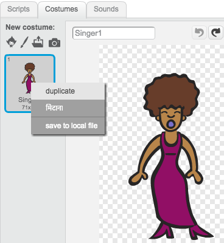

+ नयी पोशाक पे क्लिक करें ('Singer2’) अौर फिर लाइन टूल का चयन करें अौर लाइन बनाए जैसे कि गायिका गा रही हो ।

	

+ गायिका की पोशाक के नाम अभी बदलते हैं जिससे वो जायदा सही लगे, जैसे ‘गा रही है’ अौर ‘नही गा रही है’ ।

	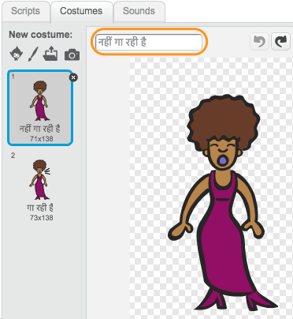

+ अब जबकि गायिका के २ अलग अलग रूप हैं तो हम अब यह सेट कर सकते कि कोनसा रूप कब सामने अाए! इन २ ब्लॉकों को अपने गायिका से जोङे:

	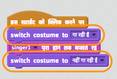

	कोड ब्लॉक पोशाक बदलने के लिए `Looks`खंड मे है {.blocklooks}.

+ अब अपनी गायिका की जांच करें । क्लिक करने पे अब वो गाती हुइ लगनी चाहिए !

##चुनौती: अपने drum का रूप बदले { .challenge }
क्या अाप अपने drum का रूप ऎसा करे जैसे वो बज रहा हो ? अगर अापको मदद चाहिए तो फिर गायिका की पोशाक बगलने से निर्देश ले लीजिए ।

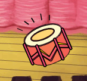

याद रखें कि अापका नया कोड काम कर रहा है !

## अपने प्रोजैक्ट को Save करें { .save }

##चुनौती: अपना खुद का बैंड बनाए { .challenge }
अापने अभी जो सिखा है उसे अपना बैंड बनाने मे उपयोग करे! अाप कोइ भी वाद्ययंत्र बना सकते हैं, लेकिन उपलब्ध वाद्ययंत्र को देखे कुछ बनाने से पहले ।

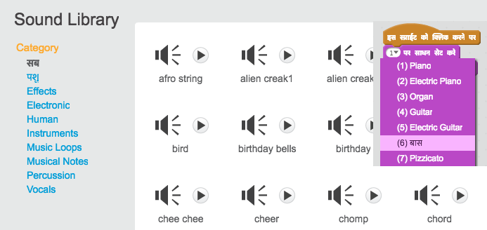

अापके वाद्ययंत्र को बिलकुल सही होने की ज़रुरत नही है । उदाहरण के लिए अाप पियानो तरबूज से भी बना सकते हैं !


मौजूदा स्प्राइटस से अाप कुछ भी बना सकते हैं।


अगर अापके पास माइक्रोफ़ोन है हो फिर अाप अवाज़ रिकॉर्ड भी कर सकते हैं या फिर वेबकैम का उपयोग करके अपने वाद्ययंत्र को बजा भी सकते हैं ।

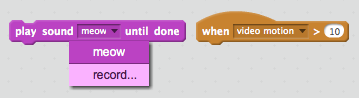

## अपने प्रोजैक्ट को Save करें { .save }

