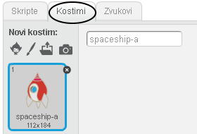
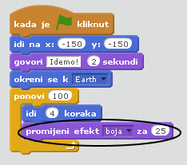
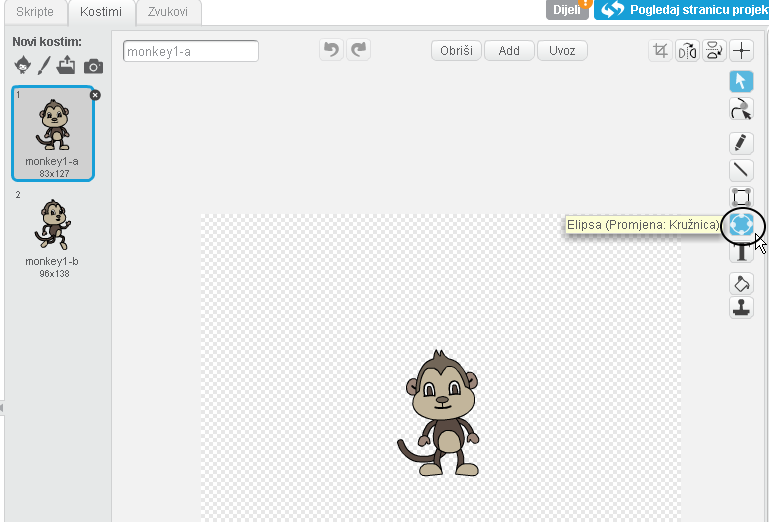
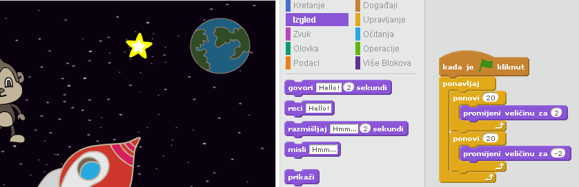

---
title: Izgubljeni u svemiru
level: Scratch 1
language: hr-HR
stylesheet: scratch
embeds: "*.png"
materials: ["Club Leader Resources/*"]
...

# Uvod { .intro }

U ovom projektu naučit ćete programirati svoje animacije!

<div class="scratch-preview">
  <iframe allowtransparency="true" width="485" height="402" src="http://scratch.mit.edu/projects/embed/26818098/?autostart=false" frameborder="0"></iframe>
  
</div>

# Korak 1: Animiranje svemirskog broda { .activity .new-page}

Napravimo da svemirski brod leti prema Zemlji!

## Zadatci { .check }

+ Započni novi Scratch projekt i obriši lik mačke tako da pozornica ostane prazna. 
	
	Online Scratch nalazi se na adresi <a href="http://jumpto.cc/scratch-new">jumpto.cc/scratch-new</a>.

+ Dodaj likove svemirskog broda i Zemlje na pozornicu. Nakon toga dodaj prikladnu pozadinu. Ovako bi sada trebala izgledati pozornica:

	

+ Klikni na lik svemirskog broda, a zatim na karticu 'Kostimi'.

	

+ Za odabir slike koristi strijelicu i klikni na ručicu za kružno okretanje. Okreći sliku dok ne bude na boku.

	

+ Dodaj sljedeće naredbe liku svemirskog broda:

	

	Promijeni brojeve u naredbama, tako da one izgledaju kao na slici iznad.

+ Klikom na blokove s naredbama pokrenut ćeš program. Ako je ispravan, svemirski brod govori, okreće se i kreće prema sredini pozornice.

	

	Pozicija `x:(0) y:(0)` {.blockmotion} je sredina pozornice. Pozicija poput `x:(-150) y:(-150)` {.blockmotion} je u donjem lijevom dijelu pozornice, dok je pozicija poput `x:(150) y:(150)` {.blockmotion} u gornjem desnom dijelu.

	

	Trebamo li znati koordinate određenog mjesta na pozornici, dovoljno je pomaknuti miša na to mjesto. Koordinate se mogu pročitati ispod pozornice.

	

+ Isprobaj animaciju pritiskom na zelenu zastavicu iznad pozornice.

	

## Izazov: Poboljšaj svoju animaciju {.challenge}
Možeš li promijeniti brojeve kôdu animacije, tako da se:
+ Svemirski brod kreće sve dok ne dodirne Zemlju.
+ Svemirski brod sporije kreće prema Zemlji.

Potrebno je promijeniti brojeve u bloku:

```blocks
klizi (1) sekundi do x:(0) y:(0)
```
## Spremi promjene u projektu { .save }

# Korak 2: Animiranje korištenjem petlji { .activity .new-page }

Još jedan način animacije svemirskog broda je pomicanjem na manju udaljenost, više puta.

## Zadatci { .check }

+ Obriši naredbu `klizi` {.blockmotion} iz kôda. To ćeš napraviti tako da klikneš desnom tipkom miša na blok s naredbom i iz izbornika kojeg dobiješ odabereš naredbu 'obriši'. 
	
	
	
	Drugi način brisanja nepotrebnih naredbi je 'odvlačenjem' s područja za naredbe.
		

+ Umjesto obrisane naredbe dodaj sljedeću:

	

	Naredba `ponovi` {.blockcontrol} se koristi da bi se nešto ponovilo više puta. Također je poznata kao  __petlja__.

+ Klikneš li na zastavicu, vidjet ćeš da radi otprilike istu stvar kao i prethodna naredba.

+ U petlji možeš dodati još naredbi i napraviti zanimljive stvari. Dodaj blok `Promijeni efekt boja za 25` {.blocklooks}  u  petlju (nalazi se u dijelu 'Izgled'). Tako će brod, cijelo vrijeme dok se kreće mijenjati boju:

	

+ Pokreni program i provjeri rezultat.

	

+ Jednostavno je napraviti i da se brod smanjuje kako se kreće prema Zemlji.

	

+ Isprobaj svoju animaciju. Što se dogodi kad ponovo pokreneš program? Je li brod prave veličine? 
	Iskoristi sljedeću naredbu za rješenje tog problema:

```scratch
postavi veličinu na (100)%
```

## Spremi promjene u projektu { .save }

# Korak 3: Leteći majmun { .activity .new-page }

Dodajmo u animaciju majmuna koji se izgubio u Svemiru! 

## Zadatci { .check }

+ Na scenu dodaj lik majmuna.

	

+ Klikni na majmuna da ga označiš i odaberi karticu 'Kostimi'. Ovdje ćeš urediti njegov izgled. Odaberi alat 'Elipsa' i nacrtaj bijelu kacigu oko majmunove glave.

	

+ Odaberi karticu 'Skripte' i dodaj liku majmuna sljedeće naredbe kako bi se on zauvijek sporo vrtio u krug:

	```blocks

	kada je ⚑ kliknut
	ponavljaj
   		skreni ↻ (1) stupnjeva
	end
	```

	Naredba `Ponavljaj` {.blockcontrol} je još jedna petlja, ali ona nikada ne završava.

+ Klikni na zelenu zastavicu i provjeri rezultat. Za završetak animacije potrebno je pritisnuti gumb 'Stop' koji se nalazi pored zastavice.

	

# Korak 4: Odbijajući asteroidi { .activity .new-page }

Dodajmo nekoliko plutajućih asteroida u animaciju.

## Zadatci { .check }

+ Dodaj lik kamena na pozornicu.

	

+ Dodaj sljedeće naredbe kako bi se kamen kretao po pozornici:

```scratch

kada je ⚑ kliknut
okreni se k [Earth v]
ponavljaj
   idi (2) koraka
   ako si na rubu, okreni se
   end
   ```


+ Klikni na zastavicu i provjeri rezultat. Kreće li se kamen po pozornici?

# Korak 5: Svjetlucajuće zvijezde { .activity .new-page }

Kombinirajmo petlje da napravimo svjetlucajuću zvijezdu.

## Zadatci { .check }

+ Dodaj zvijezdu na scenu.

	

+ Dodaj zvijezdi sljedeće naredbe:

	

+ Klikni na zastavicu da provjeriš rezultat. 
	
	Što radi ovaj blok naredbi? 
	
	
	Zvijezda se pomalo povećava 20 puta, a onda se pomalo smanjuje 20 puta, natrag na svoju početnu veličinu. Ove dvije petlje nalaze se unutar naredbe `ponavljaj` {.blockcontrol}, tako da se animacija ponavlja sve dok se izvođenje programa ne zaustavi.

## Spremi promjene u projektu { .save }

## Izazov: napravi svoju animaciju {.challenge}
Zaustavi svoju animaciju, pa iz izbornika 'Datoteka' odaberi naredbu 'Novo' i započni novi projekt.

Koristi naučeno u ovom projektu i napravi vlastitu animaciju. Može biti bilo što, ali neka odgovara okruženju. Ovdje su neki primjeri:


## Spremi projekt { .save }
