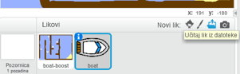
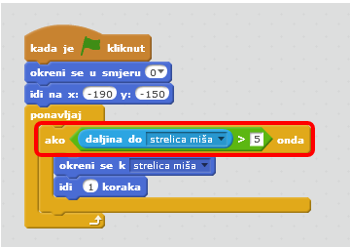
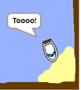
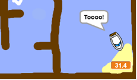
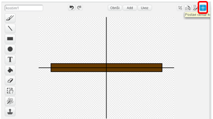
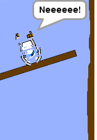

---
naslov: Utrka brodovima
razina: Scratch 1
jezik: hr-HR
stylesheet: scratch
embeds: "*.png"
materijali: ["Club Leader Resources/*","Project Resources/*"]
...

# Uvod { .intro }

U ovom projektu naučit ćeš napraviti igricu u kojoj ćeš mišem dovesti brod do pustog otoka.

<div class="scratch-preview">
  <iframe allowtransparency="true" width="485" height="402" src="http://scratch.mit.edu/projects/embed/63957956/?autostart=false" frameborder="0"></iframe>
  
</div>

# Korak 1: Planiranje igrice { .activity }

## Zadatci { .check }

+ Pokreni novi 'Scratch' projekt, i obriši lik mačke tako da pozornica ostane prazna. Online Scratch nalazi na adresi <a href="http://jumpto.cc/scratch-new">jumpto.cc/scratch-new</a>.

+ Klikni na pozadinu pozornice i isplaniraj svoju razinu. Trebaš dodati:
	+ Drva koja brod treba izbjegavati;
	+ Pusti otok do kojeg brod treba doći.

	Evo kako bi igra trebala izgledati:

	 

# Korak 2: Upravljanje brodom { .activity }

## Zadatci { .check }

+ Ako ti je voditelj radionice dao mapu koja sadrži materijale za ovu radionicu, u dijelu za odabir likova odaberi mogućnost 'Učitaj lik iz datoteke' i dodaj 'boat.png' sliku. Smanji brod i postavi ga na početnu poziciju.

	

	Ako nemaš boat.png sliku, nacrtaj svoj brod!

+ Brodom ćeš upravljati pomoću miša. Dodaj mu sljedeće naredbe:

	```blocks
		kada je ⚑ kliknut
okreni se u smjeru (0 v)
idi na x:(-190) y:(-150)
ponavljaj
   okreni se k [strelica miša v]
   idi (1) koraka
end

	```

+ Testiraj program. Klikni na zelenu zastavicu i pomiči strelicu miša. Plovi li brod prema mišu?

	

+ Što će se dogoditi kada brod dođe do strelice miša?

	Da bi se to izbjeglo potrebno je dodati `ako ... onda` {.blockcontrol} naredbu u program, tako da se brod pomiče samo ako je udaljen više od 5 piksela od pokazivača.

		

+ Ponovno pokreni program i provjeri je li problem riješen.

## Spremi promjene u projektu { .save }

# Korak 3: Sudaranje! { .activity .new-page }

Za sada brod može ploviti kroz drvene prepreke. Popravimo to!

## Zadatci { .check }

+ Bit će ti potrebna dva kostima za brod: jedan normalan i jedan kada se brod sudari. Kloniraj kostim broda i kostime nazovi 'normalan' i 'udaren'.

+ Klikni na kostim 'udaren', i odaberi alat 'Označi'. Sada možeš uhvatiti komadiće broda, premještati ih i rotirti. Složi dijelove broda tako da izgleda kao da se sudario.

	

+ Unutar bloka `ponavljaj` {.blockcontrol} dodaj sljedeće naredbe, tako da se sudari kada dotakne prepreku:

	```blocks
ako <dodiruje boju [#603C15]?> onda
   promijeni kostim u [udaren v]
   govori [Neeeeeeee!] (1) sekundi
   promijeni kostim u [normalan v]
   okreni se u smjeru (0 v)
   idi na x:(-200) y:(-160)
end
```


	Kako se ove naredbe nalaze unutar bloka `ponavljaj` {.blockcontrol}, stalno će se provjeravati je li se brod sudario.

+ Vodi računa o tome da nakon sudara brod vrati na normalan izgled!.

+ Probaš li sada proći kroz drvenu zapreku vidjet ćeš da se brod sudari i vrati na početak.

	

## Spremi promjene u projektu { .save }

## Izazov: Pobjedi! {.challenge}

Možeš li brodu dodati još jednu `ako ... onda` {.blockcontrol} naredbu, tako da igrač pobjedi kada dođe do napuštenog otoka?

Kada brod dođe do žutog napuštenog otoka, trabao bi reći 'Toooo!' i tada igra završava. Koristi naredbe:

```blocks
govori [Toooo!] (1) sekundi
zaustavi [sve v]

```



## Spremi promjene u projektu { .save }

## Izazov: Zvučni efekti {.challenge}

Možeš li dodati zvučne efekte u igru tako da se čuje kada se brod sudari ili kada dođe do otoka? Možeš li dodati glazbu u pozadinu (ako trebaš pomoć, pogledaj projekt 'Rock grupa').

## Spremi promjene u projektu{ .save }

# Korak 4: Vremensko ograničenje { .activity }

Dodajmo vremensko ograničenje u ovu igru tako da igrač treba doći do pustog otoka što je brže moguće.

## Zadatci { .check }

+ Dodaj novu varijablu koja se zove `vrijeme` {.blockdata}. Možeš promijeniti izgled nove varijable. Trebaš li pomoć pogledaj projekt 'Istjerivači duhova'.

	

+ Dodaj sljedeće naredbena __pozornicu__, tako da brojač odbrojava vrijeme dok brod ne stigne do pustog otoka:

	```blocks

kada je ⚑ kliknut
postavi [vrijeme v] na [0]
ponavljaj
   čekaj (0.1) sekundi
   promijeni [vrijeme v] za (0.1)
end
```


+ To je to! Isprobaj svoju igru i vidi koliko brzo možeš doći do pustog otoka!

	

## Spremi promjene u projektu{ .save }

# Korak 5: Prepreke { .activity }

Ova igra je prelagana - dodajmo nešto da bude zanimljivija.

## Zadatci { .check }

+ Najprije dodajmo 'gorivo' svojoj igrici - nešto što će ubrzati brod. Promjeni pozadinu dodajući na nju nekoliko bijelih strelica.

	

+ Sada možeš dodati nekoliko naredbi u blok `ponavljaj` {.blockcontrol}, tako da se brod pomakne za 2 _dodatna_ koraka kada  dotakne bijelu strelicu.

	```blocks
ako <dodiruje boju [#FFFFFF]?> onda
   idi (3) koraka
end
```

+ Možeš dodati i vrata koja se okreću i koja brod treba izbjeći. Dodaj novi lik 'vrata' koji izgleda ovako:

	

	Vodi računa o tome da je boja vrata iste boje kao i drvenih prepreka.

+ Centriraj vrata:

	

+ Dodaj naredbe vratima tako da se ona sporo okreću u petlji `ponavljaj` {.blockcontrol}.

+ Isprobaj igru. Sada bi trebalo izbjegavati i vrata koja se okreću.

	

## Spremi promjene u projektu{ .save }

## Izazov: Više prepreka! {.challenge .new-page}

Možeš li dodati više prepreka u ovu igru? Evo nekoliko ideja:

+ Možeš dodati zeleni mulj u pozadinu, koji će usporiti igrača kada ga dodirne. Za to ćeš trebati naredbu `čekaj` {.blockcontrol}:

```blocks
čekaj (0.01) sekundi
````


+ Možeš dodati i objekt koji se pokreće, kao što je balvan ili morski pas!


Ovi blokovi ti mogu pomoći:

```blocks
idi (1) koraka
ako si na rubu, okreni se
````


Ako tvoj novi objekt nije smeđe boje, morat ćeš dodati novu naredbu:

```blocks
ako <<dodiruje boju [#603C15]?> ili <dodiruje [morski pas v]?>> onda
end
```


## Spremi promjene u projektu{ .save }

## Izazov: Više brodova! {.challenge .new-page}

Možeš li pretvoriti svoju igru u utrku između dva igrača?

+ Kloniraj brod, preimenuj ga u 'Igrač 2' i promijeni mu boju.


+ Promijeni početnu poziciju drugog igrača izmjenom sljedećeg kôda:

```blocks
	go to x: (-190) y: (-150)
```

+ Obriši naredbe koje koriste miša za kretanje broda:

```blocks
	ako <(daljina do [strelica miša v]) > [5]> onda
   okreni se k [strelica miša v]
   idi (1) koraka
end

```

...i zamijeni ga s naredbama kojima će se kretanje broda kontrolirati strelicama.

Ovo su naredbe kojima će se brod kretati naprijed:

```blocks
ako <tipka [strelica gore v] pritisnuta?> onda
   idi (1) koraka
end
```


Također ćeš trebati kod za `okretanje` {.blockmotion} broda kada se pritisne lijeva ili desnu strelica.

## Spremi promjene u projektu { .save }

## Izazov: Više razina! {.challenge .new-page}
Možeš li napraviti dodatne pozadine tako da igrač može birati različite nivoe igre?

```blocks

kada je tipka [razmaknica v] pritisnuta
sljedeća pozadina
```

## Spremi promjene u projektu{ .save }
