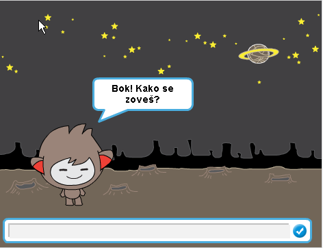
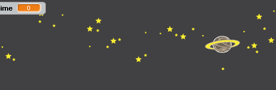

---
title: Robot koji razgovara
level: Scratch 1
language: hr-HR
stylesheet: scratch
embeds: "*.png"
materials: ["Club Leader Resources/*"]
...

# Uvod { .intro }

U ovom projektu naučit ćeš programirati robota koji razgovara s korisnikom!

<div class="scratch-preview">
  <iframe allowtransparency="true" width="485" height="402" src="http://scratch.mit.edu/projects/embed/26762091/?autostart=false" frameborder="0"></iframe>
  
</div>

# Korak 1: Tvoj robot koji razgovara { .activity }

## Zadaci { .check }

+ Prije samog početka moraš donijeti neke odluke vezane uz svog robota:
	+ Kako će se zvati?
	+ Gdje živi?
	+ Hoće li biti sretan? Ozbiljan? Smiješan? Stidljiv? Prijateljski raspoložen?

+ Sada započni novi Scratch projekt. Obriši lik mačke tako da pozornica ostane prazna. 
	
	Online Scratch program nalazi se na adresi: <a href="http://jumpto.cc/scratch-new">jumpto.cc/scratch-new</a>.

+ Odaberi jednog od likova sa slike i dodaj ih u svoj projekt: 

	

+ Izaberi pozadinu koja pristaje osobnosti tvog lika. Ovdje je primjer.

	

 	Naravno, tvoja pozornica ne mora tako izgledati.

## Spremi projekt { .save }

# Korak 2: Robot koji govori { .activity }

Sada kada imamo robota, programirajmo ga da govori.

## Zadatci  { .check }

+ Klikni na robota i dodaj mu sljedeće naredbe:

	```blocks
		kada je lik kliknut
		pitaj [Bok! Kako se zoveš?] i čekaj
		govori [Kakvo lijepo ime!] (2) sekundi
	```

+ Klikni lik robota i testiraj program. Kada te pita kako se zoveš upiši svoje ime u okvir koji se nalazi u donjem dijelu pozornice.

	

+ Tvoj robot svaki put odgovara `Kakvo lijepo ime!`. Možeš prilagoditi njegov odgovor tako da iskoristiš odgovor koji je upisao korisnik. Promjeni kôd, tako da izgleda ovako:

	```blokovi
		kada je lik kliknut
		pitaj [Bok! Kako se zoveš?] i čekaj
		reci  <priključi[Bok] (odgovor)> (2) sekunde
	```

	Za stvaranje zadnjeg bloka potrebno je najprije dovući zeleni blok `spoji` {.blockoperators}, a zatim ga prevući na ljubičasti blok `govori` {.blocklooks}, kao na slici:

	

Sada promijeni tekst `hello` u `Bok` i dovuci svijetlo plavi blok  `odgovor` {.blocksensing} (iz grupe 'Očitanja') na tekst  `world`.

	

+ Testiraj ovaj novi program. Je li potpuno ispravan ili imaš nekih problema? Možeš li popraviti probleme koje vidiš?  (Pomoć: pokušaj negdje dodati razmak!)

+ Bilo bi dobro spremiti upisano ime u varijablu tako da se može koristiti i kasnije tijekom razgovora. Kreiraj novu varijablu koja se zove `ime` {.blockdata}. Želiš li se podsjetiti kako se to radi, pogledaj svoj projekt 'Istjerivači duhova'.

+ Uneseni podatak već je pohranjen u posebnoj varijabli imena `odgovor` {.blocksensing}. Odaberi grupu naredbi Očitanja i klikni na blok odgovor. Pored njega će se pojaviti kvačica, a trenutna vrijednost spremljena u `odgovoru` {.blocksensing} pokazat će se u gornjem lijevom kutu pozornice.

+ Nakon kreiranja nove varijable potrebno je prilagoditi i kôd:

	```blokovi
		kada klikneš na ovaj lik
		pitaj [Bok! Kako se zoveš?] i čekaj
		postavi  [ime v] za (odgovor)
		reci <pridruži [Bok ] (ime)> (2) sekunde
	```

+ Isprobaj program ponovo. Primjetit ćeš kako je tvoj odgovor pohranjen u varijabli `ime` {.blockdata} i prikazan u gornjem lijevom kutu pozornice. Varijabla `Ime` {.blockdata} treba sadržavati istu vrijednost kao i varijabla `odgovor` {.blocksensing}.

	

	Ako ne želiš da se varijable prikazuju na pozornici klikni na kvačicu pored imena varijable u grupi naredbi 'Skripte'.

## Spremi promjene u projektu { .save }

## Izazov: Više pitanja { .challenge }

Programiraj svog robota da postavi neko drugo pitanje. Možeš li pohraniti njegov odgovor u varijablu? 


## Spremi promjene u projektu { .save }

# Korak 3: Donošenje odluka { .activity }

Možeš programirati robota da odluči što će napraviti ovisno o tome koji je odgovor dobio od korisnika.

## Zadatci { .check }

+ Sada ćemo reći robotu da postavi korisniku pitanje na koje on može odgovoriti s `da` ili `ne`. Pogledaj primjer. Ti slobodno koristi neko drugo pitanje: 

	```blokovi
		kad klikneš na lik
		pitaj [Bok! Kako se zoveš?] i čekaj
		namjesti [ime v] na (odgovor)
		reci <pridruži [Bok ] (ime)>  (2) sekunde
		pitaj <pridruži [Jesi li dobro? ] (ime)> i čekaj
		ako  ((odgovor)=[da]) tada
			reci [To je lijepo za čuti!]  (2) sekunde
		kraj
	```

Primjeti, zbog toga što je korisnikovo ime spremljeno u varijablu, možeš ga koristiti kada god ti zatreba.

+ Za pravilno testiranje programa potrebno ga je pokrenuti dva puta. Na postavljeno pitanje prvi puta odgovori s `ne`, a drugi puta upiši odgovor `da`. Robot će ti odgovoriti samo `ako` {.blockcontrol} je tvoj odgovor `da`.

+ Problem s robotom je u tome što ne daje nikakav odgovor kada korisnik upiše `ne`. To se može ispraviti tako da se blok `ako` {.blockcontrol} zamijeni blokom  `ako/inače` {.blockcontrol}. Zamijeni blokove tako da tvoj program sada izgleda ovako:

	```blokovi
		kada klikneš na lik
		pitaj[Bok! Kako se zoveš?] i čekaj
		postavi [ime v] na (odgovr)
		reci <pridruži [Bok] (ime)>  (2) sekunde
		pitaj <pridruži [Jesi li dobro ] (ime)> i čekaj
		ako ((odgovor)=[da]) tada
			reci [To je lijepo za čuti!] (2) sekunde
		inače
			reci [Oh ne!]  (2) sekunde
		kraj
	```

+ Kada provjeriš svoj program vidjet ćeš da ćeš dobiti odgovor i kada odgovoriš  `da` i kada odgovoriš `ne`. Robot će odgovoriti `To je lijepo za čuti!` kada upišeš `da`, ali će odgovoriti `Oh ne!`ako utipkaš bilo što drugo osim `da` (`inače` {.blockcontrol} znači 'u bilo kojem drugom slučaju').

	

+ Unutar blokova `ako je` {.blockcontrol} i `inače` {.blockcontrol} moguće je staviti bilo koju drugu naredbu, ne samo onu za pričanje. Na primjer, možeš promijeniti kostim robota kako bi odgovarao njegovom odgovoru.

	Ako pogledaš kostim svog robota, vidjet ćeš da ih ima nekoliko. (Ako ih nema, možeš ih dodati!)

	

	Možeš koristiti te kostime kao dio robotovog odgovora, dodavajući sljedeće naredbe:

	

+ Provjeri program i vidjet ćeš kako se robotovo lice mijenja ovisno o tvom odgovoru.

	

##Spremi promjene u projektu { .save }

## Izazov: Više odluka { .challenge }

Programiraj robota tako da pita još nekoliko pitanja na koja odgovor može biti `da` ili `ne`. Možeš li programirati robota da odgovori u skladu s upisanim odgovorima?


## Spremi promjene u projektu { .save }

# Korak 4: Premještanje { .activity }

Robota možemo isprogramirati i tako da promjeni mjesto na kojem se nalazi.

## Zadatci { .check }

+ Dodaj još jednu pozadinu na pozornicu, na primjer pozadinu 'mjesec'.

	

+ Sljedećim naredbama promjenit ćemo mjesto robotu:

	```blokovi
		pitaj[Idem na Mjesec. Želiš li poći samnom?] i čekaj
		ako((odgovor) = [da]) tada
			promijeni pozadinu u [mjesec v]
		kraj
	```

+ Da bi na početku razgovora robot uvijek bio na početnoj pozadini porebno je dodati ovu naredbu na početak programa:

	

+ Testiraj program i odgovori `da` kada te robot pita želiš li ići s njim na Mjesec. Vidjet ćeš da se njegova lokacija promijenila.

	

+ Hoće li se lokacija promijeniti i ako  utipkaš  `ne`? Što ako utipkaš `Nisam siguran`?

+ Također možeš dodati sljedeći blok unutar `ako` {.blockcontrol} bloka kako bi robot skočio gore-dolje četiri puta ako mu odgovoriš  `da`:

	```lik
	ponavlja (4)
		promijeni y sa (10)
		čekaj (0.1) sekundu
		promijeni y sa(-10)
		čekaj (0.1) sekundu
	kraj
	```

	

+ Ponovno testiraj program. Skače li robot gore-dolje ako je tvoj odgovor `da`?

## Spremi promjene u projektu { .save }

## Izazov: Napravi svog robota {.challenge}
Iskoristi naučeno za dovršetak svog interaktivnog robota. Ovdje su neke ideje:


Kada zavrišiš svog robota, pozovi svoje prijatelje da razgovaraju s njim. Sviđa li im se tvoj lik? Jesu li uočili kakve probleme?

## Spremi projekt { .save }
